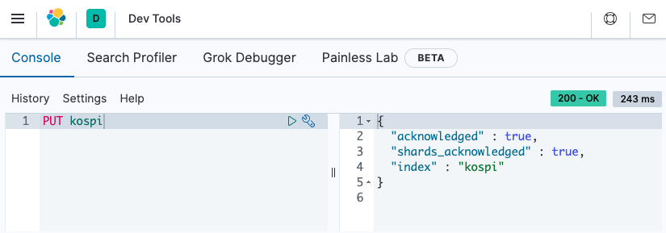
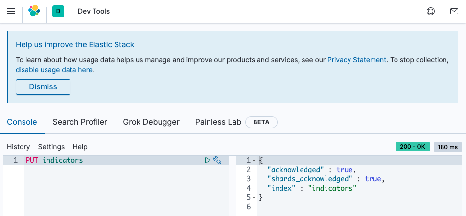
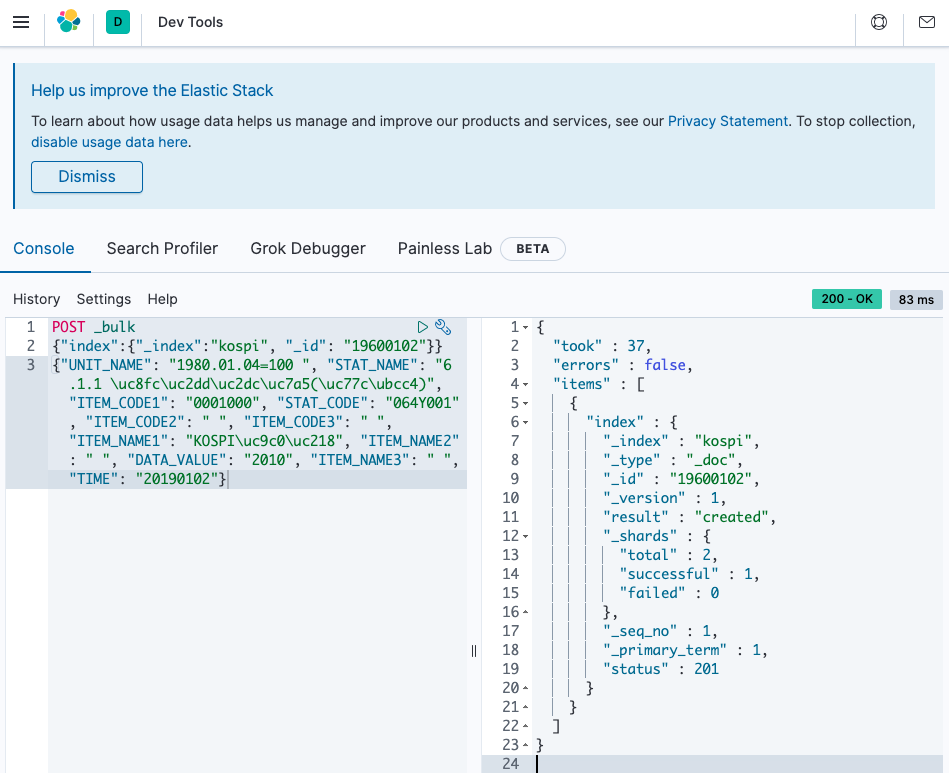
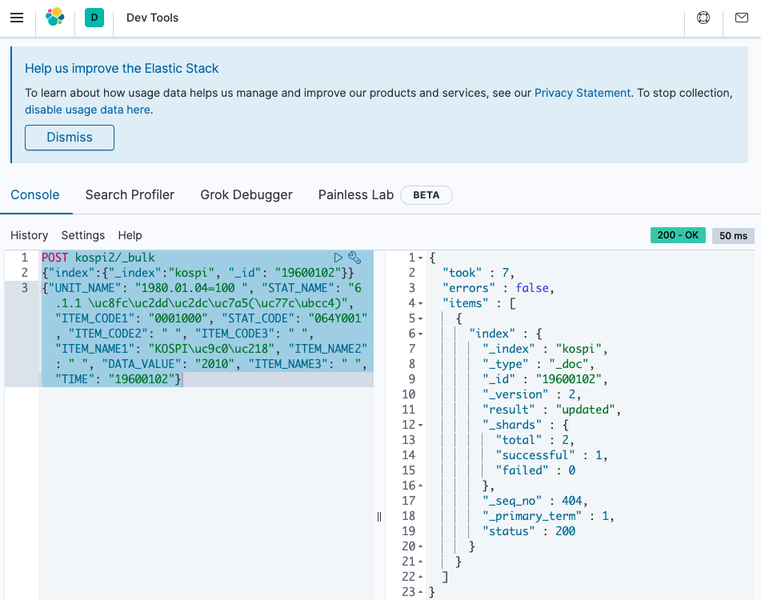
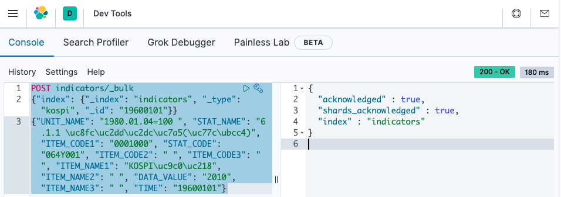

# 예제로 정리하는 ElasticSearch - 코스피 데이터 BULK INSERT

## 참고자료

- Bulk Insert
  - [Elasticsearch : Bulk Inserting Examples](https://queirozf.com/entries/elasticsearch-bulk-inserting-examples)
  - [Elastic 가이드북 - 4.3 벌크 API - _bulk API](https://esbook.kimjmin.net/04-data/4.3-_bulk)


## 준비작업 - ELK 셋업/구동/중지

여기서는 docker-compose 기반의 ELK를 이용할 것이다. 

### ELK 구동

```bash
$ docker-compose up
```


### ELK 중지

```bash
$ docker-compose down -v
```


# 1. KOSPI 인덱스 생성

인덱스를 생성한다는 것은 관계형 DB에 비교해 설명해보면 데이터베이스 스키마를 생성한다는 의미와 같다.

## KOSPI 인덱스 생성

여기서는 인덱스의 생성을 키바나 콘솔에서 수행했다.(귀찮아서)




## Indicators 인덱스 생성

위에서는 kospi 라는 인덱스를 생성했다. 이번에는 Indicators 라는 이름의 인덱스를 생성해보자.  

이 Indicators 라는 인덱스 내에 kospi 라는 type을 생성하고, 데이터(document)들을 insert 할 것이다.  

키바나 콘솔에서 인덱스 Indicators 를 생성하기 위해 아래와 같이 실행했다.




# 2. python으로 json 데이터 파일 생성

데이터를 크롤링해오는 과정이다. 데이터는 http://ecos.bok.or.kr 에서 가져왔다. API키를 발급받아서 오픈 API를 사용가능하다.  

가능한 한도에서 python의 기본 내장(빌트인) 모듈을 사용했다. 다만 REST API 를 사용하는 경우에 한해 urllib3를 사용했다.  

## urllib3 설치

현재 시점에서 urllib3의 최신 버전은 1.25.10 이다. 하지만 최신버전이 불안정한 편이다. 따라서 이 예제에서는 1.25.9 버전의 urllib3 라이브러리를 사용한다.  


### requirements.txt

vim requirements.txt  

```text
urllib3==1.25.9
:wq
```


### 설치

```bash
$ pip install virtualenv
$ virtualenv ecos-crawler
$ source ecos-crawler/bin/activate
$ (ecos-crawler) pip install -r requirements.txt
```


## 코드

자세한 설명은 추후 추가하기로 해보자. 지금은 조금 힘들다 ;;;

```python
import urllib3
import json
import os

COLUMN_LIST = [
        'STAT_NAME',  'STAT_CODE',  'ITEM_CODE1', 'ITEM_CODE2', 'ITEM_CODE3',
        'ITEM_NAME1', 'ITEM_NAME2', 'ITEM_NAME3', 'DATA_VALUE', 'TIME'
    ]

# api_key 는 반드시 직접 발급받아야 한다.
api_key = '--'

if __name__ == '__main__':
    url = "http://ecos.bok.or.kr/api/StatisticSearch/{}/json/kr/1/50000/064Y001/DD/20190101/20201231/0001000" \
        .format(api_key)

    print(" ####### URL #######")
    print(url)

    http = urllib3.PoolManager()
    ret = http.request("GET", url, headers={'Content-Type': 'application/json'})

    str_response = ret.data.decode('utf-8')
    dict_data = json.loads(str_response)

    arr_data = dict_data['StatisticSearch']['row']

    directory = 'json/document/'
    if not os.path.exists(directory):
        os.makedirs(directory)

    # index, id 추가 안할 때의 데이터
    # with open('json/document/test_data.json', 'w+') as f:
    #     for e in arr_data:
    #         stringified_json = json.dumps(e)
    #         stringified_json = stringified_json + "\n"
    #         print(stringified_json)
    #         f.write(stringified_json)

    # index, id 추가 한 후의 데이터
    with open('json/document/test_data.json', 'w+') as f:
        for e in arr_data:
            dict_index = {'index': {'_index': 'kospi', '_id': e['TIME']}}
            str_index_id = json.dumps(dict_index)
            stringified_json = str_index_id + "\n"

            stringified_json = stringified_json + json.dumps(e)
            stringified_json = stringified_json + "\n"
            print(stringified_json)
            f.write(stringified_json)
```


# 3. Bulk Insert #1

>  2.에서 만들어낸 json 파일을 ElasticSearch에 Insert 해보자  
>
> 여기서는 type을 따로 만들지는 않는다. type은 RDBMS와 비교했을 때 테이블과 같은 역할이라고 할 수 있다.   

Bulk Insert는 

- localhost:9200/_bulk
- localhost:9200/[인덱스명]/_bulk
- localhost:9200/[인덱스명]/_bulk 요청시 type 을 지정하여 INSERT 

에 json 형식을 파라미터를 전달하여 Insert 하는 것이 가능하다.  

여기서는 localhost:9200/_bulk 에 insert 요청을 보내는 방식을 다룬다.


## 단건 데이터 INSERT 테스트

데이터를 Bulk Insert 하기 전에 단건의 데이터를 Insert 하면서 데이터가 정합성이 맞는지 확인해보는 절차가 필요하다. 만약 이 절차를 건너뛰면 엄청난 삽질(?)을 하게 된다. 

kibana console을 열어서 아래와 같이 입력하고 Cmt+Enter를 쳐보자~

> ```text
> POST _bulk
> {"index":{"_index":"kospi", "_id": "19600102"}}
> {"UNIT_NAME": "1980.01.04=100 ", "STAT_NAME": "6.1.1 \uc8fc\uc2dd\uc2dc\uc7a5(\uc77c\ubcc4)", "ITEM_CODE1": "0001000", "STAT_CODE": "064Y001", "ITEM_CODE2": " ", "ITEM_CODE3": " ", "ITEM_NAME1": "KOSPI\uc9c0\uc218", "ITEM_NAME2": " ", "DATA_VALUE": "2010", "ITEM_NAME3": " ", "TIME": "20190102"}
> ```


실제 명령어를 수행한 결과는 아래와 같다.




## BULK Insert

Bulk Insert 기능은 아쉽게도 키바나 콘솔에서는 지원이 되지 않는다. 참 안타깝다. 대신 터미널에서 데이터를 직접 Insert 해보면 아래와 같다.

```bash
$ cd docker-elk/dump
$ mv ~/data/kospi/kospi_2018_2020_typeless.json .
$ curl -XPOST http://localhost:9200/_bulk\?pretty -H 'Content-Type: application/json' --data-binary @kospi_2018_2020_typelesss.json
```

정상적으로 Bulk Insert 되고나면 아래와 같은 결과화면이 나타난다.


## Bulk Data Sample #1

이 json 파일은 따로 리포지터리 내에 준비해두었다. 

참고) 

- [bulk data URL - type less](https://github.com/soongujung/study_archives/blob/master/ELK/ELASTICSEARCH_IN_CHARTNOMY/data-json/kospi_2018_2020.json)


# 4. Bulk Insert #2

Bulk Insert는 

- localhost:9200/_bulk
- localhost:9200/[인덱스명]/_bulk
- localhost:9200/[인덱스명]/_bulk 요청시 type 을 지정하여 INSERT 

에 json 형식을 파라미터를 전달하여 Insert 하는 것이 가능하다.  

여기서는 localhost:9200/[인덱스명]/_bulk 에 insert 요청을 보내는 방식을 다룬다.

## 단건 데이터 INSERT

데이터를 Bulk Insert 하기 전에 단건의 데이터를 Insert 하면서 데이터가 정합성이 맞는지 확인해보는 절차가 필요하다. 만약 이 절차를 건너뛰면 엄청난 삽질(?)을 하게 된다. 

kibana console을 열어서 아래와 같이 입력하고 Cmt+Enter를 쳐보자~

> ```text
> POST kospi2/_bulk 
> {"index":{"_index":"kospi", "_id": "19600102"}}
> {"UNIT_NAME": "1980.01.04=100 ", "STAT_NAME": "6.1.1 \uc8fc\uc2dd\uc2dc\uc7a5(\uc77c\ubcc4)", "ITEM_CODE1": "0001000", "STAT_CODE": "064Y001", "ITEM_CODE2": " ", "ITEM_CODE3": " ", "ITEM_NAME1": "KOSPI\uc9c0\uc218", "ITEM_NAME2": " ", "DATA_VALUE": "2010", "ITEM_NAME3": " ", "TIME": "19600102"}
> ```


실제 명령어를 수행한 결과는 아래와 같다.




## BULK Insert

curl 커맨드를 직접 날려보자

```bash
$ cd docker-elk/dump
$ mv ~/data/kospi/kospi_2018_2020_typeless.json .

$ curl -XPOST http://localhost:9200/kospi2/_bulk\?pretty -H 'Content-Type: application/json' --data-binary @kospi_2018_2020_typeless.json
```


정상적으로 Bulk Insert 된 모습


# 5. Bulk Insert #3

## 참고자료

맨위에도 언급한 자료지만, 이 부분을 볼때 더 빠르게 찾을 수 있도록 한 번 더 참고자료를 남겨본다.

> [Elasticsearch : Bulk Inserting Examples](https://queirozf.com/entries/elasticsearch-bulk-inserting-examples)

### 단건 데이터 INSERT

키바나 콘솔에서 TIME을 "19600101"으로 하고 _id 역시  "19600101"으로 하여 데이터를 insert해보자.

```text
POST indicators/_bulk
{"index": {"_index": "indicators", "_type": "kospi", "_id": "19600101"}}
{"UNIT_NAME": "1980.01.04=100 ", "STAT_NAME": "6.1.1 \uc8fc\uc2dd\uc2dc\uc7a5(\uc77c\ubcc4)", "ITEM_CODE1": "0001000", "STAT_CODE": "064Y001", "ITEM_CODE2": " ", "ITEM_CODE3": " ", "ITEM_NAME1": "KOSPI\uc9c0\uc218", "ITEM_NAME2": " ", "DATA_VALUE": "2010", "ITEM_NAME3": " ", "TIME": "19600101"}
```

출력결과




## BULK Insert

type 을 지정해서 insert 해보자. type 을 지정해서 insert하는 것은 관계형 DB와 비교해보면 테이블명을 지정해서 INSERT하는 것을 의미한다.

curl 커맨드를 통해 INSERT해보자~ 인덱스 명은 indicators 이다.

```bash
$ cd docker-elk/dump
$ mv ~/data/kospi/kospi_2018_2020_withtype.json .

$ curl -XPOST http://localhost:9200/indicators/_bulk\?pretty -H 'Content-Type: application/json' --data-binary @kospi_2018_2020_withtype.json
```


## Bulk Data Sample #2

샘플 데이터는 [참고](https://github.com/soongujung/study_archives/blob/master/ELK/ELASTICSEARCH_IN_CHARTNOMY/data-json/kospi_2018_2020_withtype.json)에 올려두었다.


# 6. 데이터 조회

키바나 콘솔에서

> GET indicators/kospi/_search

