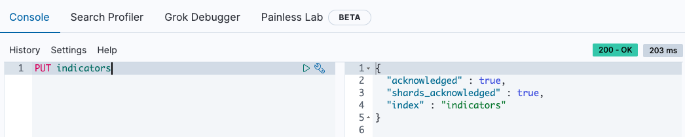

# 예제로 정리하는 ElasticSearch - 코스피 데이터 MAPPING


# 1. 예제 데이터 준비

## 인덱스 "Indicator" 생성




## 타입 "kospi" 생성 & 도큐먼트 BULK Insert

### 데이터 샘플 형식

BULK Insert 할 데이터 json 파일의 일부는 아래와 같이 생겼다.

```json
{"index": 
 {"_index": "indicators", 
  "_type": "kospi", 
  "_id": "19600101"
 }
}
{
  "UNIT_NAME": "1980.01.04=100 ", 
  "STAT_NAME": "6.1.1 \uc8fc\uc2dd\uc2dc\uc7a5(\uc77c\ubcc4)",
  "ITEM_CODE1": "0001000", 
  "STAT_CODE": "064Y001", 
  "ITEM_CODE2": " ", 
  "ITEM_CODE3": " ", 
  "ITEM_NAME1": "KOSPI\uc9c0\uc218", 
  "ITEM_NAME2": " ", 
  "DATA_VALUE": "2010", 
  "ITEM_NAME3": " ", 
  "TIME": "19600101"
}
```

- index 는 "indicators"
- type 은 "kospi"

를 지정한 Bulk Data 이다. 

### BULK Insert

```bash
$ cd docker-elk/dump
$ cp -a ~/data/kospi/kospi_2018_2020_withtype.json .
$ curl -XPOST http://localhost:9200/indicators/_bulk\?pretty -H 'Content-Type: application/json' --data-binary @kospi_2018_2020_withtype.json
```


# 2. 매핑 (MAPPING) 

> 매핑 작업을 한단어로 요약하자면, "타입변환" 작업이라고 하면 될 것 같다. (한국어로 내 멋대로 번역했다...)


## 매핑 파일 작성

data 파일내의 데이터들은 현재 모두 문자열로 되어 있는데, 이것들을 INSERT할 때 타입을 어떤 타입으로 지정해 저장할 지를 매핑하고 있는 json 파일이다. 요약해서 말하면... 각 컬럼에 대해 어떤 데이터타입으로 매핑해줄지 기술해놓은 json 파일이다. RDB 의 DDL SQL Script와 유사한 기능이라고 생각하면 된다.  

```json
{
	"class": {
		"properties": {
			"UNIT_NAME": {
				"type": "text"
			},
			"STAT_NAME": {
				"type": "text"
			},
			"ITEM_CODE1": {
				"type": "text"
			},
			"STAT_CODE": {
				"type": "text"
			},
			"ITEM_CODE2": {
				"type": "text"
			},
			"ITEM_CODE3": {
				"type": "text"
			},
			"ITEM_NAME1": {
				"type": "text"
			},
			"ITEM_NAME2": {
				"type": "text"
			},
			"DATA_VALUE": {
				"type": "double"
			},
			"ITEM_NAME3": {
				"type": "text"
			},
			"TIME": {
				"type": "date",
				"format": "yyyy-MM-dd"
			},
		}
	}
}
```


## 매핑 작업

```bash
$ cd docker-elk/dump
$ curl -H 'Content-Type: application/json' -XPUT 'http://localhost:9200/indicators/kospi/_mapping?include_type_name=true&pretty' -d @mapping_kospi_ecos.json

# 출력결과
{
  "acknowledged" : true
}
```


## 참고자료

> - elasticsearch 7.x 버전에서는 type 들중 string으로 되어 있는 부분들은 text로 지정해주어야 한다.
>
> - elasticsearch 7.x 버전부터는 매핑 지정시 include_type_name을 true 로 설정해주어야 한다. 
>
>   - ```bash
>     curl -H 'Content-Type:application/json' -XPUT 'http://localhost:9200/classes/class/_mapping?include_type_name=true&pretty' -d @classesRating_mapping.json
>     ```
>
> - [Elasticsearch 공식문서, Field data types](https://www.elastic.co/guide/en/elasticsearch/reference/current/mapping-types.html)
>   - 보통 테이블의 컬럼명을 Elasticsearch에서는 Field 명이라고 부른다. 이런 이유로 Field data types라고 부르는 것이 맞다.
> - [Elasticsearch 공식문서, Data Types](https://www.elastic.co/guide/en/elasticsearch/reference/current/sql-data-types.html)

