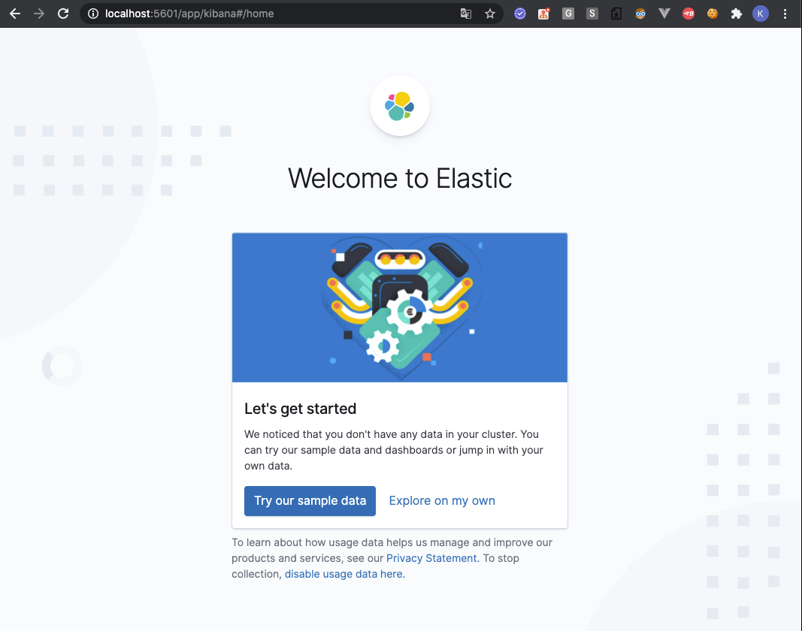

# docker 기반 개발용 Kibana 설치

# 1. docker network 생성/삭제

ES가 다른 네트워크와 통신하기 위해서는 네트워크를 생성해야 편하다고 한다. 자세한 내용은 계속 공부를 해가다 보면 알게 될 것 같다. 같은 네트워크에 연결된 다른 서비스에 연결할 때 유용하게 사용되는 개념이다.  

**참고자료**

- [docker network rm](https://docs.docker.com/engine/reference/commandline/network_rm/)

## 예) docker network 생성

net-es-chartnomy 라는 이름의 docker network를 생성한다.

```bash
$ docker network create net-es-chartnomy
```


## 예) docker network 삭제

생성했던 network인 net-es-chartnomy를 삭제하는 명령이다.

```bash
$ docker network rm net-es-chartnomy
```

아... 이름을 net-elk-chartnomy 로 할껄 그랬다... ㅋㅋ


# 2. docker Kibana 구동

[공식 docker hub repository](https://hub.docker.com/_/elasticsearch) 에서 제공하는 예제는 volume 연동이 없긴 하다. 일단 공식 페이지 지원 스크립트를 응용한 스크립트는 아래와 같다.

```bash
$ docker container run --rm -d \
		--name kibana-chartnomy \
		--link es-chartnomy:elasticsearch \
		--net net-es-chartnomy \
		-p 5601:5601 \
		kibana:7.8.0

# 출력결과
f5aed9672cf62bf63a83167e5a3291085072c39f5211b7fd0575556964b1a8b7
```


- -- rm 옵션
  - container 를 중지 시키면 해당 container를 삭제하는 옵션이다. 
    - 필수 옵션은 아니고, 선택사항이다.
    - 개발용으로 docker를 띄울때 작업이 끝나면 개발 PC에 docker container가 남아있는게 별로 마음에 들지 않아서 설정했다.
- -d 
  - daemon으로 돌리겠다는 의미의 옵션이다. (background로 동작하게 된다.)
- --name
  - 구동할 컨테이너의 이름을 지정해준다.
- --link
  - 이 옵션은 찾아봐야 한다. ㅠㅜ
  - [공식문서](https://www.elastic.co/guide/en/kibana/current/docker.html)의 커맨드를 참고했다. 
- --net
  - 사용할 도커 network를 지정해준다.
  - kibana등을 연동할 때 유용하다고 한다.
  - 같은 네트워크에 연결된 다른 서비스에 연결할 때 유용하다고 한다.
- -p
  - 포트번호를 지정해주는 옵션이다.
- -e
  - 환경변수를 지정해준다.
- kibana:7.8.0
  - kibana 7.8.0 태그가 붙은 이미지를 pull 해온다.


**역슬래시(\\) 제거한 스크립트 (그대로 Copy & Paste)**

```bash
$ docker container run --rm -d --name kibana-chartnomy --link es-chartnomy:elasticsearch --net net-es-chartnomy -p 5601:5601 kibana:7.8.0
```


이제 http:// localhost:5601 로 접속해보면 아래와 같은 화면이 나타난다.

(조금 오래기다려야 한다.)



# 3. kibana container 관리/유지보수 하기

## kibana container shell 접속

```bash
$ docker container exec -it kibana-chartnomy sh

# ...
sh-4.2$
```


## kibana container 존재하는지 조회

```bash
$ docker container ls --filter name=kibana-chartnomy

# ...
CONTAINER ID        IMAGE               COMMAND                  CREATED             STATUS              PORTS                    NAMES
fa6e6cfd1f6f        kibana:7.8.0        "/usr/local/bin/dumb…"   7 minutes ago       Up 7 minutes        0.0.0.0:5601->5601/tcp   kibana-chartnomy
```


## kibana container stop

```bash
$ docker container stop kibana-chartnomy
```

위에서 키바나 컨테이너를 구동할 때 stop 시에 컨테이너를 삭제하도록 옵션을 주었기에 stop을 하고나면 kibana-chartnomy container는 도커 컨테이너 레지스트리 에서 제거된다.  


# 참고자료

- [공식 docker hub repository](https://hub.docker.com/_/kibana)
- [elastic refernece - Install Kibana with Docker](https://www.elastic.co/guide/en/kibana/current/docker.html)

