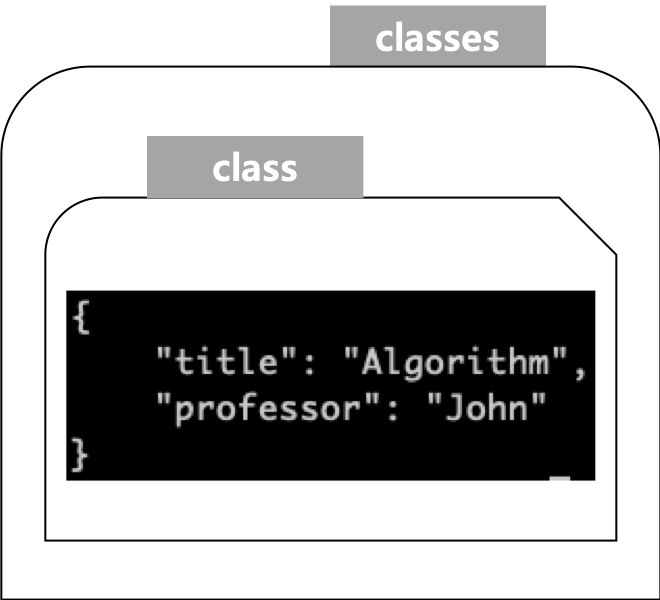

# 1. GET/POST/PUT/DELETE 실습

## GET 

현재 classes라는 이름의 index가 존재하지 않기 때문에 404 에러를 낸다.  

```bash
$ curl -XGET http://localhost:9200/classes
{"error":{"root_cause":[{"type":"index_not_found_exception","reason":"no such index [classes]","resource.type":"index_or_alias","resource.id":"classes","index_uuid":"_na_","index":"classes"}],"type":"index_not_found_exception","reason":"no such index [classes]","resource.type":"index_or_alias","resource.id":"classes","index_uuid":"_na_","index":"classes"},"status":404}%
```


? pretty를 붙여서 포매팅한 데이터를 확인하기

```bash
$ curl -XGET http://localhost:9200/classes?pretty
{
  "error" : {
    "root_cause" : [
      {
        "type" : "index_not_found_exception",
        "reason" : "no such index [classes]",
        "resource.type" : "index_or_alias",
        "resource.id" : "classes",
        "index_uuid" : "_na_",
        "index" : "classes"
      }
    ],
    "type" : "index_not_found_exception",
    "reason" : "no such index [classes]",
    "resource.type" : "index_or_alias",
    "resource.id" : "classes",
    "index_uuid" : "_na_",
    "index" : "classes"
  },
  "status" : 404
}
```


## PUT

인덱스 'classes'를 생성해보자

```bash
$ curl -XPUT http://localhost:9200/classes
# 출력결과
{"acknowledged":true,"shards_acknowledged":true,"index":"classes"}%
```

결과확인

```bash
curl -XGET http://localhost:9200/classes\?pretty
{
  "classes" : {
    "aliases" : { },
    "mappings" : { },
    "settings" : {
      "index" : {
        "creation_date" : "1595070190155",
        "number_of_shards" : "1",
        "number_of_replicas" : "1",
        "uuid" : "Fky_wDQmQt28vahx_WJTcQ",
        "version" : {
          "created" : "7080099"
        },
        "provided_name" : "classes"
      }
    }
  }
}
```


## DELETE

인덱스 'classes' 를 삭제해보자.

```bash
$ curl -XDELETE http://localhost:9200/classes
{"acknowledged":true}%
```


결과 확인 (인덱스 'classes' 가 삭제되었는지 확인)

```bash
$ curl -XGET http://localhost:9200/classes\?pretty
{
  "error" : {
    "root_cause" : [
      {
        "type" : "index_not_found_exception",
        "reason" : "no such index [classes]",
        "resource.type" : "index_or_alias",
        "resource.id" : "classes",
        "index_uuid" : "_na_",
        "index" : "classes"
      }
    ],
    "type" : "index_not_found_exception",
    "reason" : "no such index [classes]",
    "resource.type" : "index_or_alias",
    "resource.id" : "classes",
    "index_uuid" : "_na_",
    "index" : "classes"
  },
  "status" : 404
}
```


## POST

document 를 생성해보자. document는 

- 인덱스가 있을 때 만들어도 되고, 
- 인덱스가 없을 때는 인덱스 명과 타입명을 지정해주면 바로 다큐먼트 생성이 가능하다.

> 형식)  
>
> curl -XPOST http://localhost:9200/[인덱스명]/[타입명]/아이디/ -d {...}

```bash
$ curl -XPOST http://localhost:9200/classes/class/1/ \ 
		-H'Content-Type: application/json' \ 
		-d '{"title": "Algorithm", "professor": "John"}'
		
# 결과화면
{"_index":"classes","_type":"class","_id":"1","_version":1,"result":"created","_shards":{"total":2,"successful":1,"failed":0},"_seq_no":0,"_primary_term":1}%
```

역슬래시(\\) 제거한 명령어

```bash
$ curl -XPOST http://localhost:9200/classes/class/1/ -H 'Content-Type: application/json' -d '{"title": "Algorithm", "professor": "John"}'
```


이렇게 해서 생성된 document 의 구조는 아래와 같다.



classes 는 인덱스 명이다. class는 타입 명이다. 여기서 타입명이라는 것은 JSON의 Object 단위를 이야기하는 것으로 보인다. 보통 Java에서도 보통 Class를 타입명이라고 부르고, IDE나 이런곳의 단축키를 찾다보면 Find Type 이렇게 표시하는 것을 떠올리면 이해가 될 듯 하다.  

  

### 참고 ) Content-Type application/x-www-form-urlencoded is not supported

에러 문구로 Content-Type application/x-www-form-urlencoded is not supported 라는 문구가 나타날 수 있다. 이 경우 아래와 같이 옵션을 추가해주면 된다.

```bash
-H 'Content-Type: application/json'
```


# 2. document 를 파일로 저장하여 파일 기반으로 document 생성하기

샘플 다큐먼트 (testclass.json)

```json
{
    "title": "Business Intelligence",
    "Professor": "JiGi",
    "major": "Computer Science",
    "semester": ["spring", "fall"],
    "student_count": 100,
    "unit": 3,
    "rating": 5
}
```


```bash
$ curl -XPOST http://localhost:9200/classes/class/1 -H 'Content-Type: application/json' -d @testclass.json

# 결과화면 
{"_index":"classes","_type":"class","_id":"1","_version":2,"result":"updated","_shards":{"total":2,"successful":1,"failed":0},"_seq_no":1,"_primary_term":1}%
```


## 결과 확인

```bash
$ curl -XGET http://localhost:9200/classes/class/1\?pretty
{
  "_index" : "classes",
  "_type" : "class",
  "_id" : "1",
  "_version" : 2,
  "_seq_no" : 1,
  "_primary_term" : 1,
  "found" : true,
  "_source" : {
    "title" : "Business Intelligence",
    "Professor" : "JiGi",
    "major" : "Computer Science",
    "semester" : [
      "spring",
      "fall"
    ],
    "student_count" : 100,
    "unit" : 3,
    "rating" : 5
  }
}
```


# 3. UPDATE 실습

## 실습 데이터 INSERT&확인

실습 데이터 (oneclass.json)

```json
{
    "title": "Algorithm",
    "professor": "John"
}
```

실습 데이터를 insert 하자.

```bash
$ curl -XPOST http://localhost:9200/classes/class/1 -H 'Content-Type: application/json' -d @oneclass.json

# 출력결과
{"_index":"classes","_type":"class","_id":"1","_version":3,"result":"updated","_shards":{"total":2,"successful":1,"failed":0},"_seq_no":2,"_primary_term":1}%
```


## Update 예제 1)

{unit : 1} 데이터를 Update 해보자.

```bash
$ curl -XPOST http://localhost:9200/classes/class/1/_update -H 'Content-Type: application/json' -d '{"doc": {"unit":1}}'

# 출력결과
{"_index":"classes","_type":"class","_id":"1","_version":4,"result":"updated","_shards":{"total":2,"successful":1,"failed":0},"_seq_no":3,"_primary_term":1}
```


실제 Update된 데이터를 확인해보자.

```bash
$curl -XGET http://localhost:9200/classes/class/1\?pretty
...

# 출력결과
{
  "_index" : "classes",
  "_type" : "class",
  "_id" : "1",
  "_version" : 4,
  "_seq_no" : 3,
  "_primary_term" : 1,
  "found" : true,
  "_source" : {
    "title" : "Algorithm",
    "professor" : "John",
    "unit" : 1
  }
}
```


## Update 예제 2)

이제 다시 unit 프로퍼티를 2로 수정해보자. 즉, {unit: 2} 로 수정한다.

```bash
$ curl -XPOST http://localhost:9200/classes/class/1/_update\?pretty -H 'Content-Type: application/json' -d '{"doc": {"unit":2}}'
{
  "_index" : "classes",
  "_type" : "class",
  "_id" : "1",
  "_version" : 5,
  "result" : "updated",
  "_shards" : {
    "total" : 2,
    "successful" : 1,
    "failed" : 0
  },
  "_seq_no" : 4,
  "_primary_term" : 1
}
```

  

Update된 결과를 확인해보자.

```bash
$ curl -XGET http://localhost:9200/classes/class/1\?pretty
{
  "_index" : "classes",
  "_type" : "class",
  "_id" : "1",
  "_version" : 5,
  "_seq_no" : 4,
  "_primary_term" : 1,
  "found" : true,
  "_source" : {
    "title" : "Algorithm",
    "professor" : "John",
    "unit" : 2
  }
}
```


## Update 예제 3)

이제 unit 프로퍼티의 값을 +5 시켜서 저장해보자.

```bash
$ curl -XGET http://localhost:9200/classes/class/1\?pretty
{
  "_index" : "classes",
  "_type" : "class",
  "_id" : "1",
  "_version" : 6,
  "_seq_no" : 5,
  "_primary_term" : 1,
  "found" : true,
  "_source" : {
    "title" : "Algorithm",
    "professor" : "John",
    "unit" : 7
  }
}
```

unit에 원래 값인 2에서 +5가 된 7이 저장되어있는 것을 확인할 수 있다.


# 참고할만한 자료들

- [docker hub - elasticsearch](https://hub.docker.com/_/elasticsearch)
- [elasticsearch 공식문서](https://www.elastic.co/guide/en/elasticsearch/reference/current/docker.html)
  - volume 마운트 관련해서 찾아보다가 공식문서를 접했다...
  - docker hub 내의 명령어들은 자세하지 않다. 기본적인 명령어들만 구비되어 있다. elasticsearch 공식문서를 참고하자.
- [ElasticSearch on Kubernetes](https://sematext.com/blog/kubernetes-elasticsearch/)
- [docker network rm](https://docs.docker.com/engine/reference/commandline/network_rm/)
- [허민석 교수님  github](https://github.com/minsuk-heo/BigData)
- [ElasticSearch REST 요청시 application/x-www-form-urlencoded is not supported 에러가 날때 해결법](https://abc2080.tistory.com/entry/%EC%97%90%EB%9F%AC-ContentType-header-applicationxwwwformurlencoded-is-not-supported)