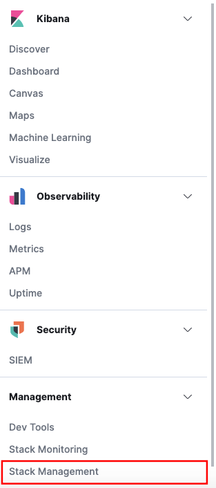
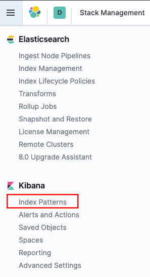
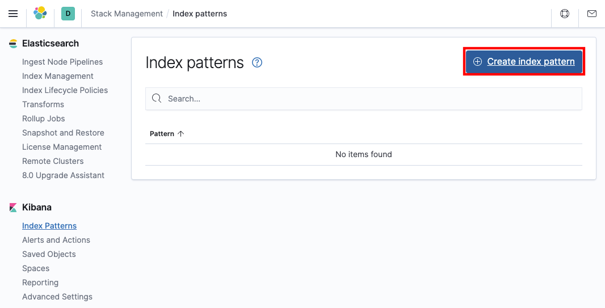
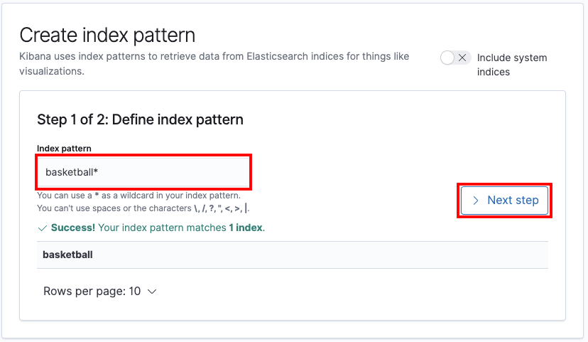
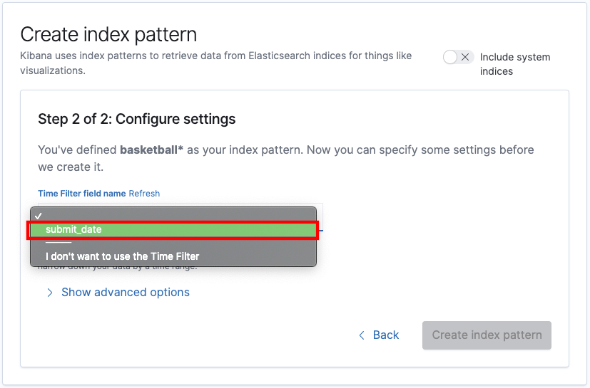
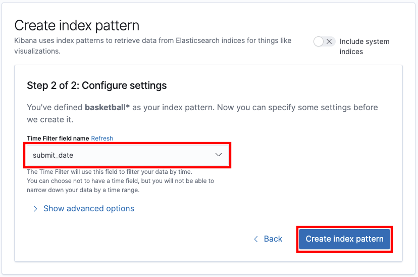

# Kibana Management

키바나를 제일 먼저 설치한 후에는 인덱스 패턴을 지정하여 kibana에서 해당 인덱스를 불러올수 있도록 해주어야 한다. 또한 해당 index 내에서 filter 할 필드를 설정해줄수도 있는데, 이러한 작업들을 할 수 있도록 해주는 메뉴는 

- KIBANA 네비게이션 > MANAGEMENT > Stack Management > Index Patterns 

이다.  

# 1. 예제 인덱스/매핑 생성

이전까지 사용했던 basketball 인덱스가 있다면 지우고 새로 다운로드 받아서 생성하자.

## 예제 매핑 파일

예제 mapping 파일은 [허교수님 github](https://github.com/minsuk-heo/BigData/blob/master/ch05/basketball_mapping.json)에서 다운로드 가능하다. 다운로드 받은 mapping 파일 내의 string type 들을 모두 vi의 치환기능으로 text 로 변환해주었다. (7.8.x 버전에서는 string 타입이 인식되지 않는다.) 

```json
{
	"record" : {
		"properties" : {
			"team" : {
				"type" : "text",
				"fielddata" : true
			},
			"name" : {
				"type" : "text",
				"fielddata" : true
			},
			"points" : {
				"type" : "long"
			},
			"rebounds" : {
				"type" : "long"
			},
			"assists" : {
				"type" : "long"
			},
			"blocks" : {
				"type" : "long"
			},
			"submit_date" : {
				"type" : "date",
				"format" : "yyyy-MM-dd"
			}
		}
	}
}
```


## 예제 bulk 데이터

예제 데이터는 [허교수님 github](https://github.com/minsuk-heo/BigData/blob/master/ch05/bulk_basketball.json) 에서 다운로드 할 수 있다.

```json
{ "index" : { "_index" : "basketball", "_type" : "record", "_id" : "1" } }
{"team" : "Golden States Warriors","name" : "Stephen Curry", "points" : 30,"rebounds" : 3,"assists" : 4, "blocks" : 5, "submit_date" : "2016-10-11"}
{ "index" : { "_index" : "basketball", "_type" : "record", "_id" : "2" } }
{"team" : "Golden States Warriors","name" : "Stephen Curry","points" : 32,"rebound" : 5,"assist" : 8, "blocks" : 5, "submit_date" : "2016-10-13"}
{ "index" : { "_index" : "basketball", "_type" : "record", "_id" : "3" } }
{"team" : "Golden States Warriors","name" : "Stephen Curry","points" : 28,"rebound" : 2,"assist" : 3, "blocks" : 1, "submit_date" : "2016-10-17"}
{ "index" : { "_index" : "basketball", "_type" : "record", "_id" : "4" } }
{"team" : "Golden States Warriors","name" : "Stephen Curry","points" : 36,"rebound" : 1,"assist" : 2, "blocks" : 1, "submit_date" : "2016-11-20"}
{ "index" : { "_index" : "basketball", "_type" : "record", "_id" : "5" } }
{"team" : "Golden States Warriors","name" : "Stephen Curry","points" : 36,"rebound" : 1,"assist" : 2, "blocks" : 1, "submit_date" : "2016-11-25"}
{ "index" : { "_index" : "basketball", "_type" : "record", "_id" : "6" } }
{"team" : "Golden States Warriors","name" : "Stephen Curry","points" : 32,"rebound" : 1,"assist" : 4, "blocks" : 1, "submit_date" : "2016-11-28"}
{ "index" : { "_index" : "basketball", "_type" : "record", "_id" : "7" } }
{"team" : "Utah Jazz","name" : "Rudy Gobert", "points" : 3,"rebounds" : 11,"assists" : 4, "blocks" : 7, "submit_date" : "2016-10-12"}
{ "index" : { "_index" : "basketball", "_type" : "record", "_id" : "8" } }
{"team" : "Utah Jazz","name" : "Rudy Gobert","points" : 4,"rebound" : 13,"assist" : 8, "blocks" : 5, "submit_date" : "2016-10-14"}
{ "index" : { "_index" : "basketball", "_type" : "record", "_id" : "9" } }
{"team" : "Utah Jazz","name" : "Rudy Gobert","points" : 8,"rebound" : 10,"assist" : 3, "blocks" : 6, "submit_date" : "2016-10-18"}
{ "index" : { "_index" : "basketball", "_type" : "record", "_id" : "10" } }
{"team" : "Utah Jazz","name" : "Rudy Gobert","points" : 12,"rebound" : 9,"assist" : 2, "blocks" : 6, "submit_date" : "2016-11-10"}
{ "index" : { "_index" : "basketball", "_type" : "record", "_id" : "11" } }
{"team" : "Utah Jazz","name" : "Rudy Gobert","points" : 12,"rebound" : 14,"assist" : 2, "blocks" : 7, "submit_date" : "2016-11-22"}
{ "index" : { "_index" : "basketball", "_type" : "record", "_id" : "12" } }
{"team" : "Utah Jazz","name" : "Rudy Gobert","points" : 8,"rebound" : 10,"assist" : 4, "blocks" : 5, "submit_date" : "2016-11-27"}
{ "index" : { "_index" : "basketball", "_type" : "record", "_id" : "13" } }
{"team" : "Washington Wizards","name" : "John Wall","points" : 8,"rebound" : 1,"assist" : 13, "blocks" : 2, "submit_date" : "2016-10-18"}
{ "index" : { "_index" : "basketball", "_type" : "record", "_id" : "14" } }
{"team" : "Washington Wizards","name" : "John Wall","points" : 13,"rebound" : 2,"assist" : 12, "blocks" : 3, "submit_date" : "2016-11-10"}
{ "index" : { "_index" : "basketball", "_type" : "record", "_id" : "15" } }
{"team" : "Washington Wizards","name" : "John Wall","points" : 15,"rebound" : 3,"assist" : 12, "blocks" : 3, "submit_date" : "2016-11-22"}
{ "index" : { "_index" : "basketball", "_type" : "record", "_id" : "16" } }
{"team" : "Washington Wizards","name" : "John Wall","points" : 22,"rebound" : 4,"assist" : 14, "blocks" : 3, "submit_date" : "2016-11-27"}
```


## 매핑 생성

### basketball 인덱스 삭제

```bash
$ curl -XDELETE http://localhost:9200/basketball
```


### basketball 인덱스 생성

```bash
$ curl -XPUT http://localhost:9200/basketball
# 출력결과 
{"acknowledged":true,"shards_acknowledged":true,"index":"basketball"}%
```


### basketball 매핑 생성

```bash
$ curl -XPUT http://localhost:9200/basketball/record/_mapping\?include_type_name=true\&pretty -H 'Content-Type: application/json' -d @kibana_basketball_mapping.json
```


### basketball bulk 데이터 추가

```bash
$ curl -XPOST http://localhost:9200/_bulk\?pretty -H 'Content-Type: application/json' --data-binary @bulk_basketball.json

# 출력결과
{
  "took" : 90,
  "errors" : false,
  "items" : [
    {
      "index" : {
        "_index" : "basketball",
        "_type" : "record",
        "_id" : "1",
        "_version" : 1,
        "result" : "created",
        "_shards" : {
          "total" : 2,
          "successful" : 1,
          "failed" : 0
        },
        "_seq_no" : 0,
        "_primary_term" : 1,
        "status" : 201
      }
    },
    # ... (중략) ... 
    {
      "index" : {
        "_index" : "basketball",
        "_type" : "record",
        "_id" : "16",
        "_version" : 1,
        "result" : "created",
        "_shards" : {
          "total" : 2,
          "successful" : 1,
          "failed" : 0
        },
        "_seq_no" : 15,
        "_primary_term" : 1,
        "status" : 201
      }
    }
  ]
}
```


# 2. kibana MANAGEMENT

## kibana 접속

브라우저에서 [http://localhost:5601](http://localhost:5601) 에 접속하면 kibana 화면을 확인 가능하다.

네비게이션 > Management > Stack Management 를 클릭하여 Management 화면으로 이동하자.




Kibana > Index Patterns 클릭



Create Index pattern 클릭




index pattern 에는  basketball 을 입력해주고 Next step 버튼을 클릭하자.



Time Filter 로는 submit_date 를 선택해주자.



Create Index Pattern 버튼 클릭



