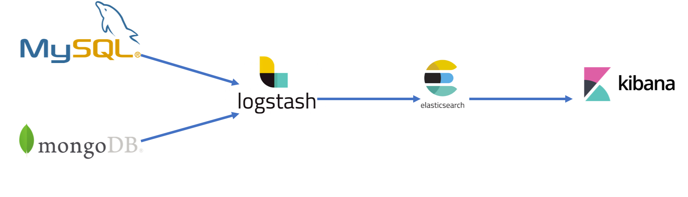

# 1. LOGSTASH란?

ELK 스택에서 LOGSTASH 는 INPUT을 담당한다.

LOGSTASH로 받은 INPUT은 변환되어 elasticsearch로 들어가고, Kibana는 elasticsearch의 데이터를 조회해서 시각화한다.

# 2. INPUT

세상에 존재하는 굉장히 다양한 포맷의 데이터가 존재하는데 logstash는 이 다양한 input을 받아들여서 흡수할 수 있다.

# 3. FILTER

INPUT으로 읽어들인 다양한 포맷의 데이터를 원하는 형태의 데이터의 형태로 변경해줄 수 있다. 예를 들면 텍스트 데이터를 숫자로 변환시킬 수 있다.

# 4. OUTPUTS

Logstash 는 굉장히 다양한 output을 가진다. 이렇게 변환된 데이터를 elasticsearch 에 들어간다.

