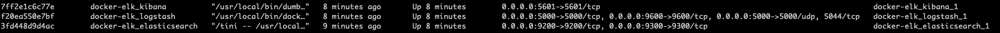

# docker compose 기반 ELK 설정

운영환경이 아닌 개발환경에서 docker container를 띄우는 방법에 대해 정리해보자. (TMI이긴 하지만... 운영환경에서는 aws의 kubernetes 기능을 활용해 배포할 예정이다.).    

개발환경에서 docker container 를 

- Elasticsearch
- Kibana
- Logstash

각각에 대해 새로운 container를 띄우는 것은 아무래도 관리면에서도 불편하고, 메모리도 많이 잡아먹는다. docker compose를 통해 오케스트레이션을 할 수 있는 방법이 있다. 이와 관련해서 docker-compose를 통해 자주 쓰이는 설정 들을 공통화 및 취향에 따라 optimization 이 가능하도록 작성된 github의 오픈소스 프로젝트가 있다. 여기서는 그에 관련된 내용들을 정리한다.   

주요 내용은 대부분 [https://github.com/deviantony/docker-elk](https://github.com/deviantony/docker-elk) 의 내용을 필요한 내용을 취향에 따라 골라서 정리했다. 굳이 번역까지 할 필요 없는 내용들은 영어 원문을 그대로 발췌했다.

# 1. docker-elk

이미 자주 쓰이는 주요 설정에 대해 공통화한 오픈 소스가 존재한다. 

- github URL
  - [https://github.com/deviantony/docker-elk.git](https://github.com/deviantony/docker-elk.git)

```bash
$ git clone https://github.com/deviantony/docker-elk.git
```


## version

현재 docker-elk의 master 브랜치는 7.x 버전을 사용하고 있다. (항상 최신 버전을 따른다고 한다. 현재 최신버전은 7. x) [참고](https://github.com/deviantony/docker-elk#version-selection)  

다른 버전을 설치하려면 아래의 브랜치를 clone 하면 된다.

- release-6.x
  - [https://github.com/deviantony/docker-elk/tree/release-6.x](https://github.com/deviantony/docker-elk/tree/release-6.x)
  - 6.x 버전
- release-5.x
  - https://github.com/deviantony/docker-elk/tree/release-5.x
  - 5.x 버전


# 2. Startup & Cleanup

## Startup

```bash
$ docker-compose up
```


## Cleanup

persist data volume 등 여러가지 데이터들을 깔끔하게 지우려면 아래의 명령을 실행하면 된다. (-v 옵션을 사용)

```bash
$ docker-compose down -v
```


## docker container 확인

```bash
$ docker container ls
```





# 3. 초기 세팅

[https://github.com/deviantony/docker-elk#initial-setup](https://github.com/deviantony/docker-elk#initial-setup)  


> ℹ️ Learn more about the security of the Elastic stack at [Tutorial: Getting started with security](https://www.elastic.co/guide/en/elasticsearch/reference/current/security-getting-started.html).  

## 초기 비밀번호

- user
  - elastic
- password
  - changeme

## 비밀번호 변경

기본으로 제공되는 사용자(built-in users) 계정 6개에 대한 password가 랜덤으로 세팅되고, 터미널에 출력된다.

```bash
$ docker-compose exec -T elasticsearch bin/elasticsearch-setup-passwords auto --batch
```

출력된 비밀번호를 적당한 곳에 받아적어두어야 한다.

## bootstrap password 해제

ELASTIC_PASSWORD 라는 환경변수를 elasticsearch 내에서 제거하는 과정이다. 

## Configuration File 내의 username/password 수정

설치 후 재기동 없이 초기 설치시부터 비밀번호 변경해서 적용하기 위해서 사용하는 설정인듯 하다. 

- kibana/config/kibana.yml
  - user명 : kibana_system
  - user명 : kibana (< kibana release 7.8.0)
- logstash/config/logstash.yml
  - user명 : logstash_system

Use the `kibana_system` user (`kibana` for releases <7.8.0) inside the Kibana configuration file (`kibana/config/kibana.yml`) and the `logstash_system` user inside the Logstash configuration file (`logstash/config/logstash.yml`) in place of the existing `elastic` user.

Replace the password for the `elastic` user inside the Logstash pipeline file (`logstash/pipeline/logstash.conf`).

> ℹ️ Do not use the `logstash_system` user inside the Logstash *pipeline* file, it does not have sufficient permissions to create indices. Follow the instructions at [Configuring Security in Logstash](https://www.elastic.co/guide/en/logstash/current/ls-security.html) to create a user with suitable roles.

See also the [Configuration](https://github.com/deviantony/docker-elk#configuration) section below.

## 재기동

```bash
$ docker-compose restart kibana logstash
```


# 4. 설정(Configuration)

> ℹ️ Configuration is not dynamically reloaded, you will need to restart individual components after any configuration change. 

참고 : 

- [Install Elasticsearch with Docker](https://www.elastic.co/guide/en/elasticsearch/reference/current/docker.html) (다른 자료에 비해 굉장히 자세하다)
- Learn how to [configure Elasticsearch](https://www.elastic.co/guide/en/elasticsearch/reference/current/settings.html).
- Configure [important Elasticsearch settings](https://www.elastic.co/guide/en/elasticsearch/reference/current/important-settings.html).
- Configure [important system settings](https://www.elastic.co/guide/en/elasticsearch/reference/current/system-config.html).
- 이전에 정리한 docker elasticsearch 스크립트 주소 여기에 추가

## ElasticSearch

> docker-elk/elasticsearch/config/elasticsearch.yml

```yaml
elasticsearch:

  environment:
    network.host: _non_loopback_
    cluster.name: my-cluster
```

### 추가 설정

공식 제공 문서에는 설정들이 별로 없다. 필수적인 설정들만을 세팅하고 있다. 커스터마이징 해야 하는 옵션들을 정리해보자.

- X-PACK 설정 OFF 하기
  - xpack.security.enabled: true
  - xpack.monitoring.collection.enabled: true

### 참고자료

- [2.3.2 elasticsearch.yml - Elastic 가이드북](https://esbook.kimjmin.net/02-install/2.3-elasticsearch/2.3.2-elasticsearch.yml)
- [ES-ETC #1 elasticsearch.yml 에서 설정하는 것들 - velog](https://velog.io/@jakeseo_me/ES-ETC-1-elasticsearch.yml%EC%97%90%EC%84%9C-%EC%84%A4%EC%A0%95%ED%95%98%EB%8A%94-%EA%B2%83%EB%93%A4)
- [ELK 셋팅부터 알람까지 - 우아한형제들](https://woowabros.github.io/experience/2020/01/16/set-elk-with-alarm.html)

## Kibana

> docker-elk/kibana/config/kibana.yml  

config directory 를 매핑하는 대신 모두 개별 파일들을 연결해서 사용가능하다.

참고 : 

- [Running Kibana on Docker](https://www.elastic.co/guide/en/kibana/current/docker.html).
- 이전에 정리한 docker kibana 스크립트 주소 여기에 추가


## logstash

> docker-elk/logstash/config/logstash.yml  

config directory 를 매핑하는 대신 모두 개별 파일들을 연결해서 사용가능하다.  

however you must be aware that Logstash will be expecting a [`log4j2.properties`](https://github.com/elastic/logstash/tree/7.6/docker/data/logstash/config) file for its own logging.  

참고 :

- [Configuring Logstash for Docker](https://www.elastic.co/guide/en/logstash/current/docker-config.html).
- 이전에 정리한 docker logstash 스크립트 주소 여기에 추가


# 5. 유료 기능(X-Pack) 비활성화 --- 수정 필요

> [https://github.com/deviantony/docker-elk#how-to-disable-paid-features](https://github.com/deviantony/docker-elk#how-to-disable-paid-features)

XPACK의 경우 유료서비스이다. 이미 license를 구매를 했을때와 해당 license를 사용하지 않을 경우에 대한 값을 지정해줄 수 있다. 해당 설정 변수는 `xpack.license.self_generated.type`  이다. 

- xpack.license.self_generated.type = trial
  - 30일 활성화 후에 나중에 downgrade 하는 등의 작업을 통해 cluster를 활성화 하거나 비활성화 할 수 있다.
- xpack.license.self_generated.type = basic
  - X-Pack 의 기능을 활성화한다.

공식 문서의 링크는 [License management](https://www.elastic.co/guide/en/kibana/7.8/managing-licenses.html) 을 확인하자.


# 6. Extensibility

> [https://github.com/deviantony/docker-elk#extensibility](https://github.com/deviantony/docker-elk#extensibility)   
>
>   
>
> 예를 들면, Dockerfile 내에 아래와 같이 RUN 커맨드로 플러그인 설치를 미리 하도록 정의해둘 수 있다.
>
> ```bash
> RUN logstash-plugin install logstash-filter-json
> ```


# 7. JVM tuning


# 참고자료

- docker-elk
  - [https://github.com/deviantony/docker-elk](https://github.com/deviantony/docker-elk)
- ELK 셋팅부터 알람까지 - 우아한형제들
  - [https://woowabros.github.io/experience/2020/01/16/set-elk-with-alarm.html](https://woowabros.github.io/experience/2020/01/16/set-elk-with-alarm.html)
- https://medium.com/chequer/elkr-elasticsearch-logstash-kibana-redis-%EB%A5%BC-%EC%9D%B4%EC%9A%A9%ED%95%9C-%EB%A1%9C%EA%B7%B8%EB%B6%84%EC%84%9D-%ED%99%98%EA%B2%BD-%EA%B5%AC%EC%B6%95%ED%95%98%EA%B8%B0-f3dd9dfae622
- https://1226choi.tistory.com/20
- https://wedul.site/484?category=680504

  

- [2.3.2 elasticsearch.yml - Elastic 가이드북](https://esbook.kimjmin.net/02-install/2.3-elasticsearch/2.3.2-elasticsearch.yml)
- [ES-ETC #1 elasticsearch.yml 에서 설정하는 것들 - velog](https://velog.io/@jakeseo_me/ES-ETC-1-elasticsearch.yml%EC%97%90%EC%84%9C-%EC%84%A4%EC%A0%95%ED%95%98%EB%8A%94-%EA%B2%83%EB%93%A4)
- [ELK 셋팅부터 알람까지 - 우아한형제들](https://woowabros.github.io/experience/2020/01/16/set-elk-with-alarm.html)

