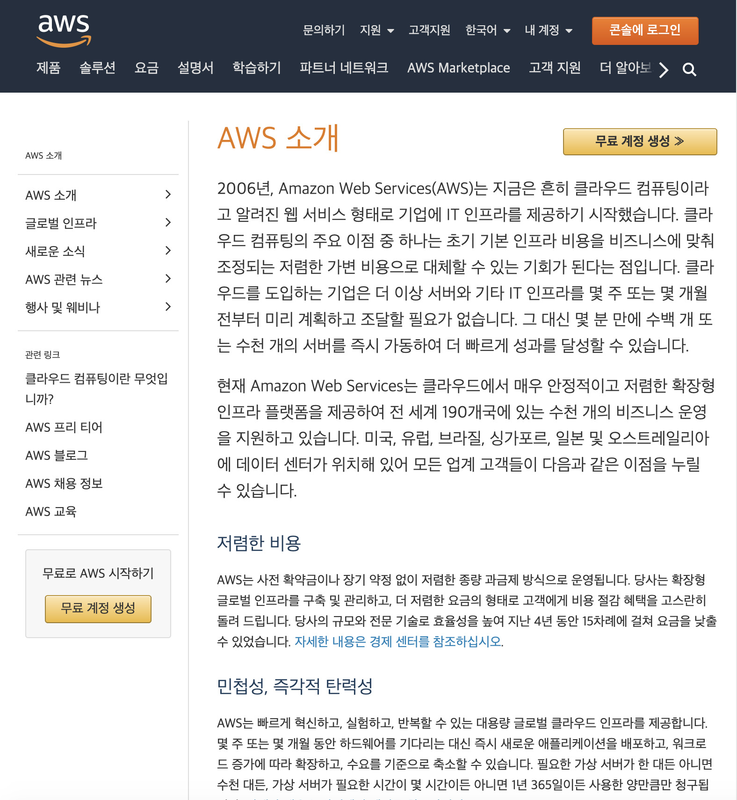
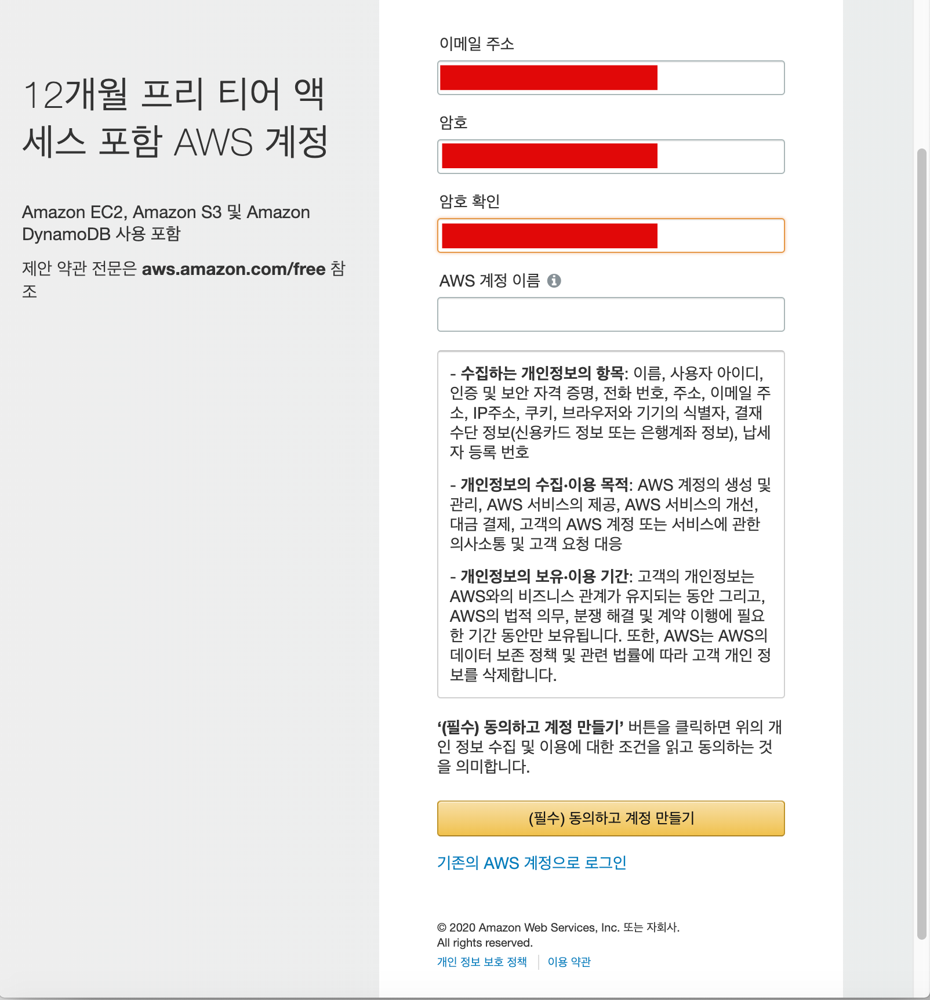
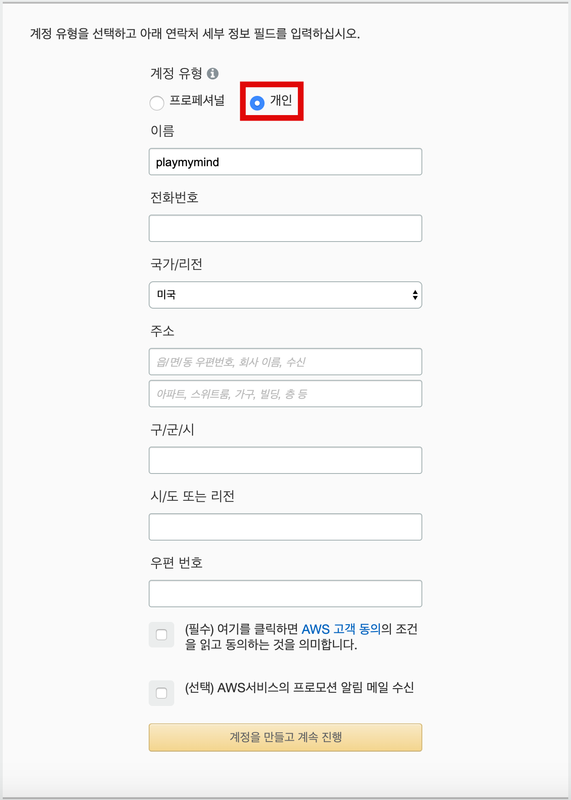
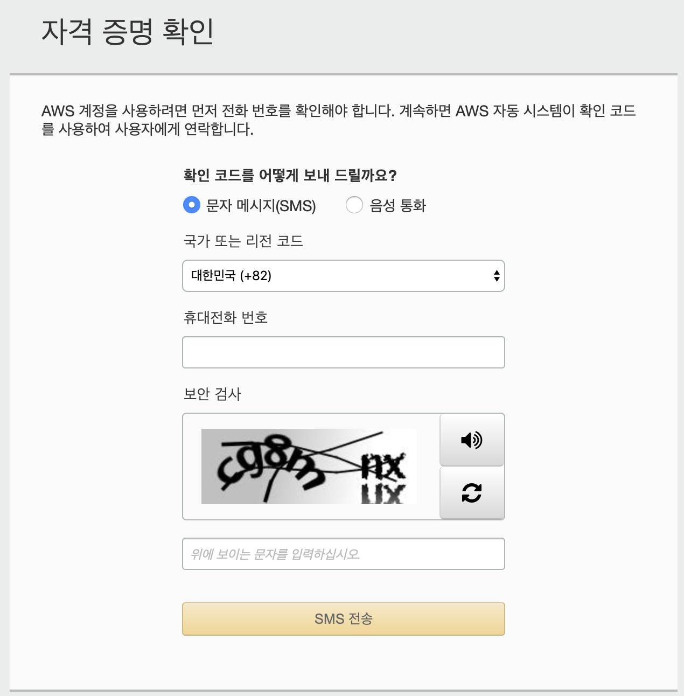
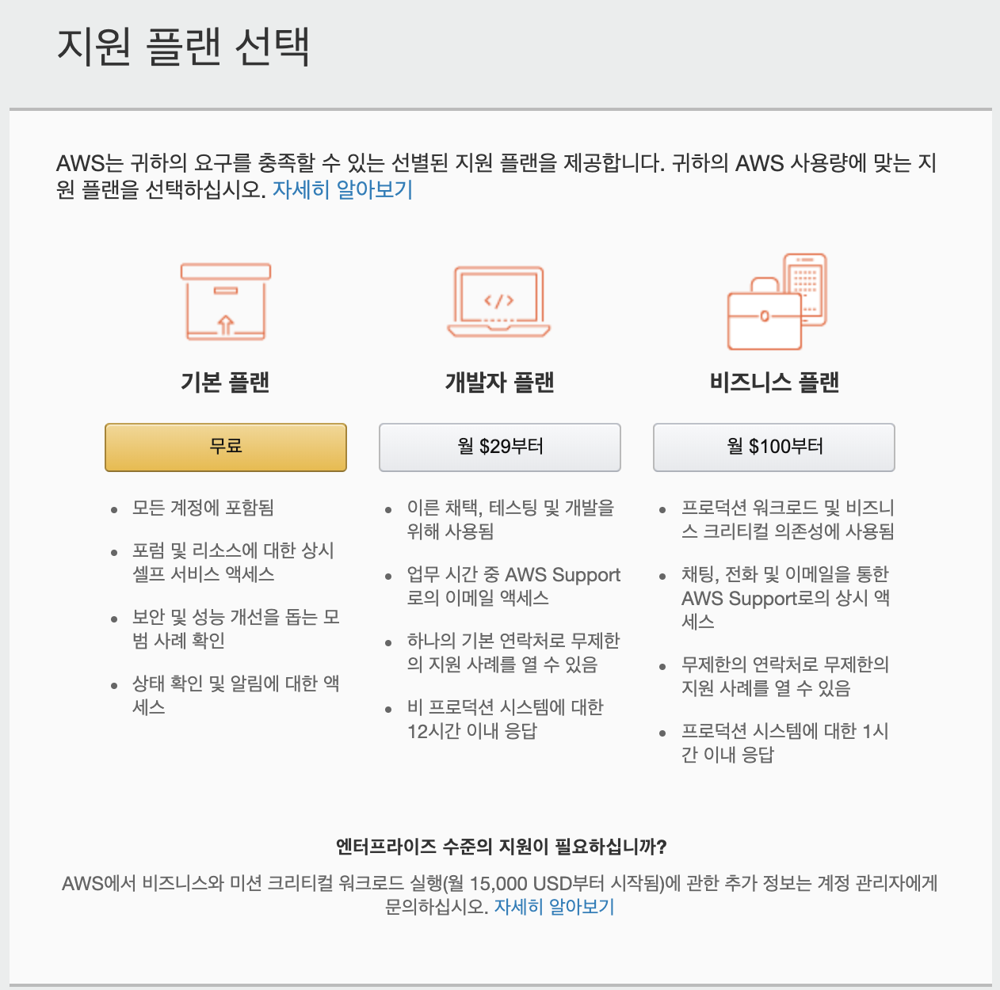

# AWS EC2 세팅 가이드문서 - AWS 프리티어 무료계정 (1년) 생성

AWS EC2는 대학생때부터 계정을 생성했다가 또 지우고 새로 다른 메일로 가입하고 반복해왔다. 잘못 사용해서 비용이 과금된적도 많았다. 졸업작품을 하다가 과금이 된 적도 많았다. 매번 EC2 프리티어 인스턴스를 생성할 때마다 헷갈리는 부분을 검색으로 해결하다보니 시간적으로 공수가 많이 들더라.  

항상 어느 정도는 문서화를 해놓아야 다시 접할때 시간이 비약적으로 줄어드는 같다.

# AWS 프리티어 무료계정(1년) 생성

무료 계정을 만드는 곳은 [https://aws.amazon.com/ko/about-aws/](https://aws.amazon.com/ko/about-aws/) 이다.

 

  

AWS 계정 정보 입력 > 정보들 입력 > (필수) 동의하고 계정만들기 클릭

이제 계정유형 선택 및 기타 연락처 및 주소를 입력해주자.

- 계정 유형 
  - '개인'으로 지정해주어야 한다. 꼭!!!
- 주소
  - 주소를 영문명으로 변환해주는 사이트는 아래와 같다.
  - [https://search.naver.com/search.naver?sm=top_hty&fbm=0&ie=utf8&query=%EC%98%81%EB%AC%B8%EC%A3%BC%EC%86%8C](https://search.naver.com/search.naver?sm=top_hty&fbm=0&ie=utf8&query=%EC%98%81%EB%AC%B8%EC%A3%BC%EC%86%8C)

체크/신용 카드 정보 입력 후 아래의 화면이 나타난다.  

정보를 입력하자.

이제 이외의 나머지 과정들을 모두 진행하고 나면 [지원 플랜 선택]이 나타난다. 기본플랜을 선택하자.

[콘솔에 로그인] 클릭

