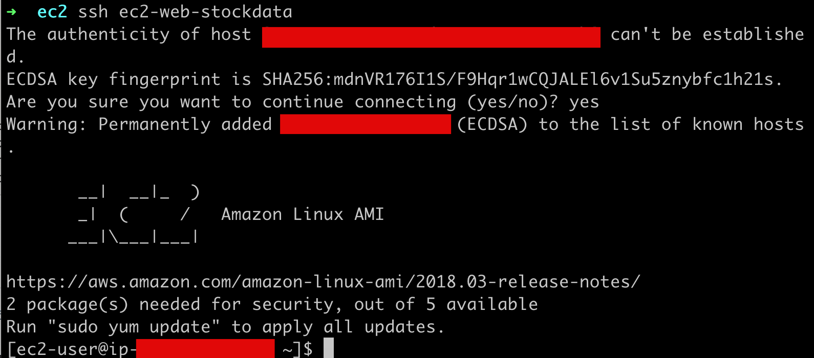

# 2020-3.AWS SSH 접속하기

AWS에 SSH 접속할 때 매번 아래와 같은 긴 명령어를 입력해야 한다.

```bash
$ ssh -i [pem 키의 위치] [EC2 인스턴스 탄력적 IP 주소]
```

이 과정은 굉장히 번거롭다. 따라서 쉽게 ssh 접속을 할 수 있도록 설정하자. 

조금 전에 받은 키페어 pem 파일을 ~/.ssh 디렉터리 아래에 복사한다.

- ~/.ssh 디렉터리 아래에 pem 파일을 옮겨 놓고
- 별도의 설정을 하고 나면
- ssh 실행시 pem 키 파일을 자동으로 읽어 접속을 진행한다.

  

# 1. pem 키 복사

개발 PC 내에서 pem 키를 ~/.ssh 디렉터리 아래로 복사한다.

```bash
# pem 키를 ~/.ssh 디렉터리 아래로 복사
➜ cp ec2-web-stockdata.pem ~/.ssh/

# ~/.ssh 디렉터리 확인
➜ ll ~/.ssh/
total 16
-rw-r--r--@ 1 kyle.sgjung  staff   1.7K  2  9 15:55 ec2-web-stockdata.pem
-rw-r--r--  1 kyle.sgjung  staff   1.4K  1 29 15:24 known_hosts

# 복사한 pem 파일의 권한을 600으로 변경 (rw,-,-)
➜ chmod 600 ~/.ssh/ec2-web-stockdata.pem

# ~/.ssh 디렉터리 아래에 config 라는 이름의 파일 생성
➜ vim ~/.ssh/config
```


# 2. SSH 설정파일 (~/.ssh/config) 수정

~/.ssh/config 에는 아래의 내용을 입력하고 저장한다.

```bash
# ec2-web-stockdata
# Host 의 바로 옆은 원하는 서비스의 이름이다.
# 추후 ssh [원하는 서비스명] 과 같은 단축 명령어로 바로 실행될 수 있게 된다.
Host ec2-web-stockdata 
    HostName [탄력적 IP를 적어준다]
    User ec2-user
    IdentityFile ~/.ssh/ec2-web-stockdata.pem
```


config 파일의 권한 수정 (사용자에게 실행 권한까지 추가)

```bash
➜ chmod 700 ~/.ssh/config
```


# 3. 접속해보기

```bash
➜ ssh ec2-web-stockdata
The authenticity of host ---------- can't be established.
ECDSA key fingerprint is SHA256:mdnVR176I1S/F9Hqr1wCQJALEl6v1Su5znybfc1h21s.
Are you sure you want to continue connecting (yes/no)? yes
Warning: Permanently added ‘-----------' (ECDSA) to the list of known hosts.


       __|  __|_  )
       _|  (     /   Amazon Linux AMI
      ___|\___|___|


https://aws.amazon.com/amazon-linux-ami/2018.03-release-notes/
2 package(s) needed for security, out of 5 available
Run "sudo yum update" to apply all updates.
[ec2-user@ip--------- ~]$
```

  

스크린샷



