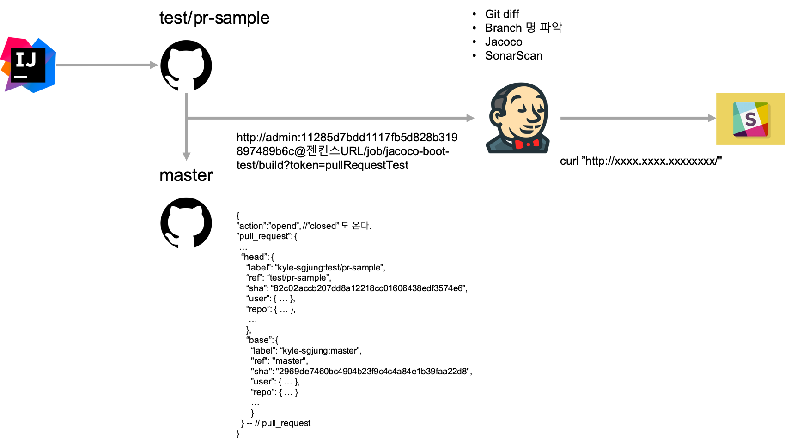
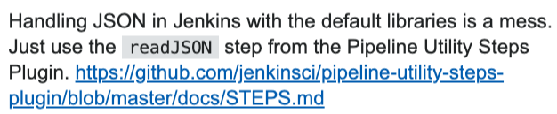
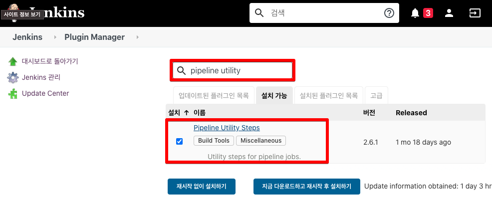
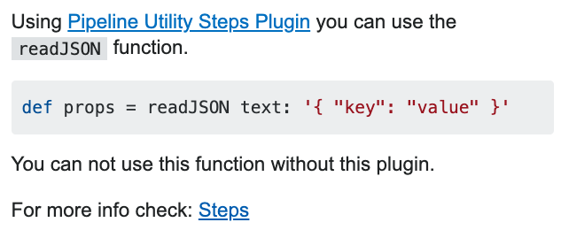

# Groovy in Jenkins) Scripted Pipeline 에서 JSON 파싱 및 HTTP Call 하기

Github와 Jenkins 를 연동할 때 보통 github의 webhook 기능을 이용해 빌드를 유발시키는 편이다. github의 webhook과 Jenkins를 연동하는 방식은 추후 정리할 예정이다. 현재 회사에서 빌드의 파이프라인을 Scripted Pipeline으로 구축하는 일을 맡았다. 

Scripted Pipeline 으로 파이프라인을 구축하던 중 

- github 리포지터리에서 풀리퀘스트가 발생했을 때
- github webhook 기능은 젠킨스 Job URL로 Http 요청을(hook) 한다.
- github에서 보내주는 정보는 payload라는 파라미터로 전달된다.
- 젠킨스는 이 요청을 받고나면 github에서 보내준 payload 로 전달된 json 문자열을 프로그램에서 해석할 수 있도록 파싱한다.
- 이렇게 파싱된 데이터를 기반으로 메시지를 보낸다.(slack, 카톡 등)

## 전체 흐름도

계획을 그림으로 요약해보면 아래와 같다.



## 초반에 했던 시행착오들

초반에 잘할려는 욕심때문이었을까, 아니면 python 하나는 자신있게 쓸수 있다는 생각 때문일까, 아니면 python을 어떻게든 갖다 붙여보고 싶은 생각이었나? 하는 생각들 때문인지 python으로 github webhook 페이로드를 파싱하려고 했다.  

하지만, 젠킨스의 스크립티드 파이프라인 내에서 python은 쓰지 못할녀석이라는 것을 일주일만에 깨달았다. 물론 phantomjs, selenium 등을 활용해 화면을 테스트 하는 등의 역할을 할때 python을 사용할 수도 있다.  

만약 스크립티드 파이프라인 내에서 python으로 스크립트를 작성할 생각이 있다면 

- virtualenv를 도입하려고 한다면 docker 기반의 스크립티드 파이프라인을 사용하는 것을 추천하고
  - [참고자료](https://www.jenkins.io/doc/pipeline/tour/hello-world/)
- json 을 파라미터로 받아서 해석하려고 하지 말자.
  - 왜냐하면 명령행으로 넘어오는 것들이 "" 또는 '' 을 모두 제거해서 넘겨준다. 
  - 이런 이유로 json 파라미터 해석에는 문제가 조금 있다.


# 1. Jenkins Groovy 에서 json 응답값/문자열 파싱

## 시행착오

보통 Groovy 에서 Json을 읽어들이는 방식에 대해 검색을 해보면 JsonSlurper를 이용하라는 내용들이 많은데, 젠킨스 Pipeline에서는 Groovy의 JsonSlurper가 지원되지 않는다. 이외에도 젠킨스 Pipeline에서는 지원되지 않는 기능들이 많다. 따라서 JsonSlurper를 이용하는 방식은 피해야 한다.  


## Pipeline Utility Steps Plugin?

- 젠킨스 플러그인으로 제공되는 Pipeline Utility Steps Plugin 이라는 젠킨스 플러그인을 설치한다
- 이 플러그인은 JSON 문자열을 파싱하는 함수인 readJSON()을 제공한다.
- 이것을 이용하면 JSON 문자열을 프로그램 내의 유의미한 값으로 읽어들이는 작업, 즉 파싱 작업이 가능해진다.

젠킨스 내에서 JsonSlurper를 사용하다가 굉장히 애를 먹었는데 아래의 자료를 보고 젠킨스 플러그인내에 존재하는 readJSON 함수를 이용하는 방식을 선택하게 되었고, 정상적으로 실행됐다.  

- 참고자료 
  - [Jenkinsfile - JsonSlurper returning a string instead of a map](https://stackoverflow.com/questions/45350738/jenkinsfile-jsonslurper-returning-a-string-instead-of-a-map) 
  - 여기서는 이렇게 언급하고 있다.
    - 


## Pipeline Utility Steps Plugin 설치

젠킨스 설치 > 플러그인 관리 > 설치가능 

- pipeline utility 검색




## Scripted Pipeline 작성

### 참고자료

- [java.lang.NoSuchMethodError: No such DSL method 'readJSON'](https://stackoverflow.com/questions/46841877/java-lang-nosuchmethoderror-no-such-dsl-method-readjson)
  - 

- 젠킨스 CI 팀 공식 Github 문서
  - 각 항목에 대해 [help](https://github.com/jenkinsci/pipeline-utility-steps-plugin/blob/master/src/main/resources/org/jenkinsci/plugins/pipeline/utility/steps/fs/TouchStep/help.html) 와 같은 링크를 클릭해 문법을 확인할 수 있다. 
  - 파이프라인 작성시 Groovy로 Step 을 적용할 때 참고할 만한 내용들을 찾을 수 있도록 목차로 분류해놓은 사이트이다.
  - [젠킨스 CI 팀 공식  Github 문서 페이지](https://github.com/jenkinsci/pipeline-utility-steps-plugin/blob/master/src/main/resources/org/jenkinsci/plugins/pipeline/utility/steps/json/ReadJSONStep/help.html)
  - 
- readJSON 예제
  - [젠킨스 CI 팀 제공 공식 Github 예제 페이지](https://github.com/jenkinsci/pipeline-utility-steps-plugin/blob/master/src/main/resources/org/jenkinsci/plugins/pipeline/utility/steps/json/ReadJSONStep/help.html)
  - 


## 예제

깃헙... 웹훅 개설

젠킨스 AWS에 설치 ㄱㄱ 싱


```groovy
node {
    stage('clone'){
        git branch: 'test/pr-sample', credentialsId: 'kyle', url: 'https://github.kakaocorp.com/kyle-sgjung/jacoco-boot-mvn.git'
    }
    stage('PR notification'){
        def props = readJSON text: "${payload}"
        print(props['action'])
        print(props.number)

        def req_user = props['pull_request']['head']['user']['login']
        def src = props['pull_request']['head']['ref']
        def target = props['pull_request']['base']['ref']
        def requestUrl = "http://api.noti.daumkakao.io/send/personal/kakaotalk?to=kyle.sgjung&msg=%s created a Pull Request. \n(%s -> %s) \n"
                .format(req_user, src, target)

        def msg = String
                .format(
                        "새로운 PR 요청(%s -> %s)이 있습니다. 테스트 코드 커버리지 측정이 끝날때까지 잠시 기다려주세요.",
                        src, target
                )

        def to = "kyle.sgjung"
        def to_dkt = "8583"
        def watchcenter = "http://api.noti.daumkakao.io/send/personal/kakaotalk"
        def dkt_watchcenter = "http://api.noti.daumkakao.io/send/group/kakaotalk"

        def msg_format = String.format("msg=%s", msg)
        def msg_format_test = String.format("msg=%s", ".엉엉")
        def to_format = String.format("to=%s",to)
//        def to_format = String.format("to=%s",to_dkt)

//        def param = msg_format + "&" + to_format


        def command = String.format("curl --data-urlencode '%s' --data-urlencode '%s' %s",
                msg_format, to_format, watchcenter)
        print(command)
        // sh "curl -X -GET --data-urlencode %s %s".format(param, watchcenter)
        // sh command
        sh String.format("curl --data-urlencode '%s' --data-urlencode '%s' %s",
                msg_format, to_format, watchcenter)

        sh String.format("curl --data-urlencode '%s' --data-urlencode '%s' %s",
                msg_format_test, to_format, watchcenter)
    }
}

```


# 백업

fake API Call

- https://jsonplaceholder.typicode.com/comments?postId=1

