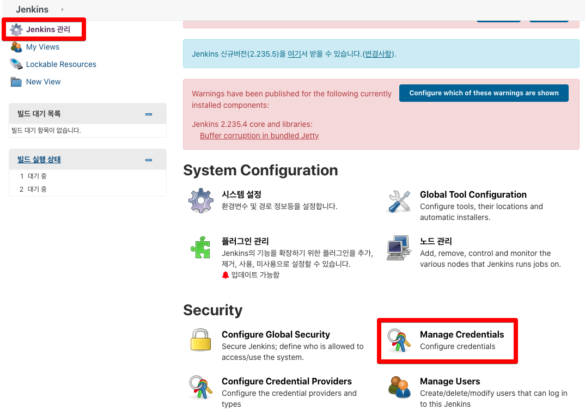
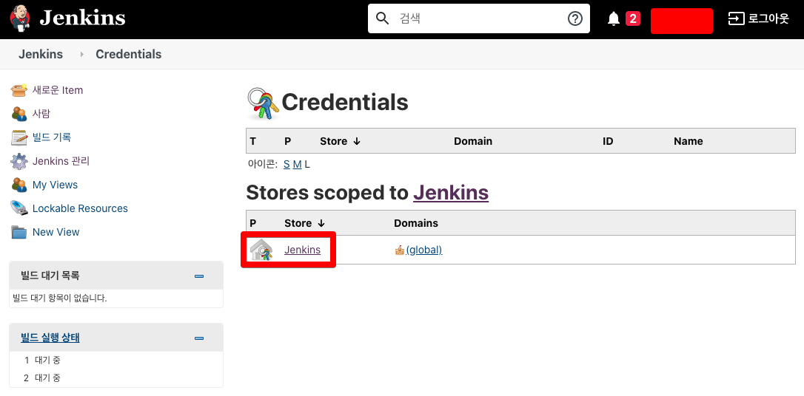
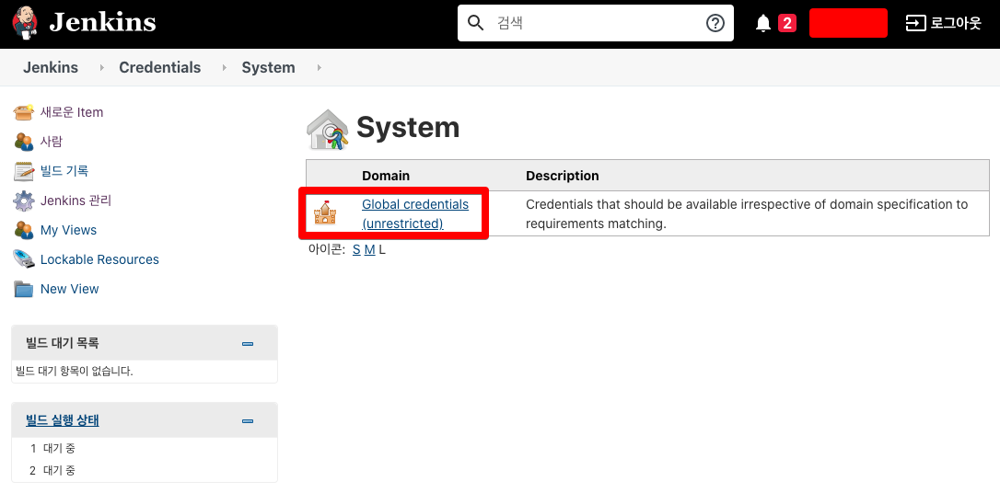
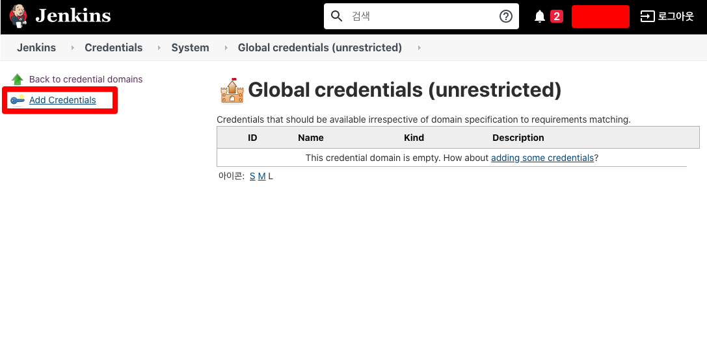
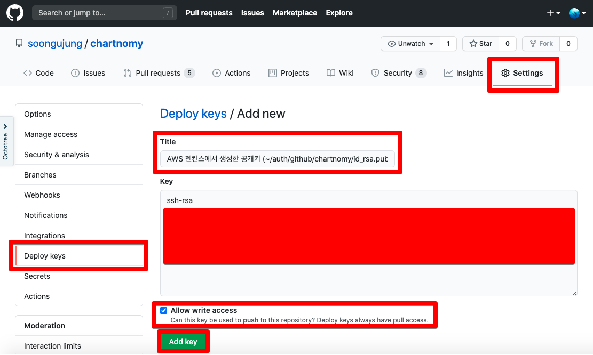
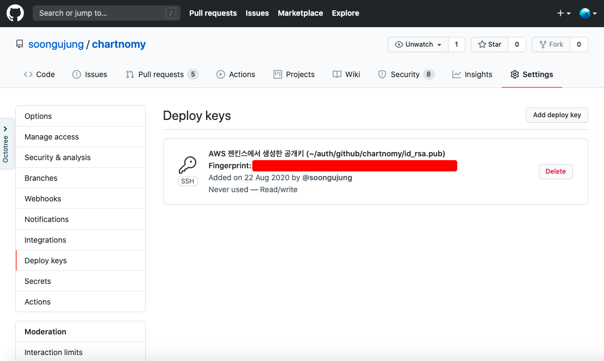

# Jenkins/Github/Slack연동 - 인증키 연결

> 사실, AWS의 다른 S3, EBS 등 여러가지 기능을 활용한 설치는 아니다.  AWS에 특화된 설치과정도 아니다. 리눅스 기반의 서버 인스턴스라면 모두 통용되는 설치과정이다. 그럼에도 제목에 (AWS) 를 붙인 이유는 검색시 AWS *** 설치 등으로 검색하는 경우가 많아서 그냥 달아두었다^^;

  

젠킨스서버와 Github 리포지터리와 서로 인증의 쌍을 맞추어 젠킨스 서버에서 Github 리포지터리에 접근할 수 있도록 하는 과정이다. (깃헙 리포지터리 내에서 젠킨스 서버의 공개키를 기억해두고 등록해주셨으니 허용합니다. 하는 과정)  

이 문서에서 연동을 할 대상은 아래와 같다.

- Jenkins
- Github

  

# 1. 젠킨스 서버 인스턴스 내에서 인증키 생성

인증키를 생성하는 과정이다. id_rsa 라는 이름으로 인증키를 생성한다. id_rsa 외에도 id_rsa.pub이라는 파일이 하나 더 생긴다.

```bash
[ec2-user@ec2-web-chartnomy ~]$ mkdir -p ~/auth/github/chartnomy
[ec2-user@ec2-web-chartnomy ~]$
[ec2-user@ec2-web-chartnomy ~]$ ls
auth  env
...
[ec2-user@ec2-web-chartnomy ~]$ cd ~/auth/github/chartnomy/
[ec2-user@ec2-web-chartnomy chartnomy]$ ssh-keygen -t rsa -f id_rsa
...
[ec2-user@ec2-web-chartnomy chartnomy]$ ls
id_rsa  id_rsa.pub

```


id_rsa, id_rsa.pub 파일을 만들었다. 이 id_rsa, id_rsa.pub 파일의 용도는 아래와 같다.

- id_rsa
  - 젠킨스 내에서 Credential 로 등록
- id_rsa.pub
  - 공개키
  - Github 리포지터리 내에 Deploy keys 로 추가한다.


# 2. 젠킨스 서버에 id_rsa를 Credential로 등록

> 위에서 생성한 id_rsa는 보통 젠킨스 내에 Credential 로 추가한다. id_rsa_pub 파일은 Github 리포지터리 내에 Deploy keys 로 추가한다.


위에서 id_rsa, id_rsa.pub 파일을 만들었다. 이 id_rsa, id_rsa.pub 파일의 용도는 아래와 같다.

- id_rsa
  - 젠킨스 내에서 Credential 로 등록
- id_rsa.pub
  - 공개키
  - Github 리포지터리 내에 Deploy keys 로 추가한다.


Jenkins > Jenkins 관리 > Manage Credentials



Stores scoped to Jenkins > Jenkins 클릭



Global credentials (unrestricted)  클릭

- 더 커스텀한 설정을 할 수도 있을 것 같다. 하지만 여기서는 Global credentials로 !!! 정리



Add credentials 클릭



Jenkins > Credentials > System > Global credentials

- Kind 
  - SSH Username with private key 선택
- Scope
  - Global (Jenkins, ondes, items, all child items, etc)
- Private Key
  - 방금 전 생성한 id_rsa 파일 내의 내용을 그대로 붙여넣기 
  - 첫줄, 마지막 줄 까지 모두 복사해야 한다.


# 3. Github에 공개키(id_rsa.pub) 추가

예제로 사용할 github 리포지터리는 [https://github.com/soongujung/chartnomy](https://github.com/soongujung/chartnomy) 이다.  

Repository 접속 > Settings 탭 클릭 > Deploy keys 클릭 > Add deploy key 클릭

- Title
  - 나중에 알아볼 수 있는 이름을 부여해줬다.
  - 서버내의 어느 디렉터리에 있는지를 명시해줌으로써, 나중에 관리가 쉽도록 해주었다.
- Key
  - id_rsa.pub 파일 내부의 내용을 COPY&PASTE
    - 전부 다 싹다 복사해서 붙여넣어줘야 한다.
- Allow write access
  - 체크해준다.




공개키가 추가된 후의 모습



