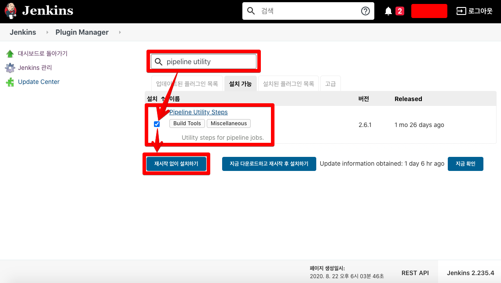
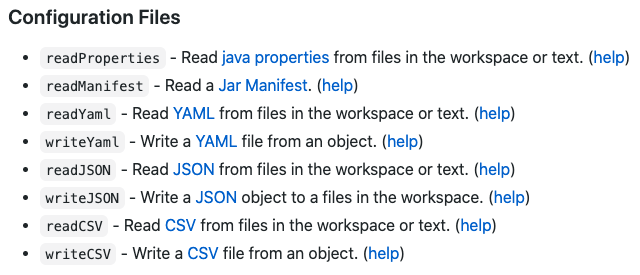
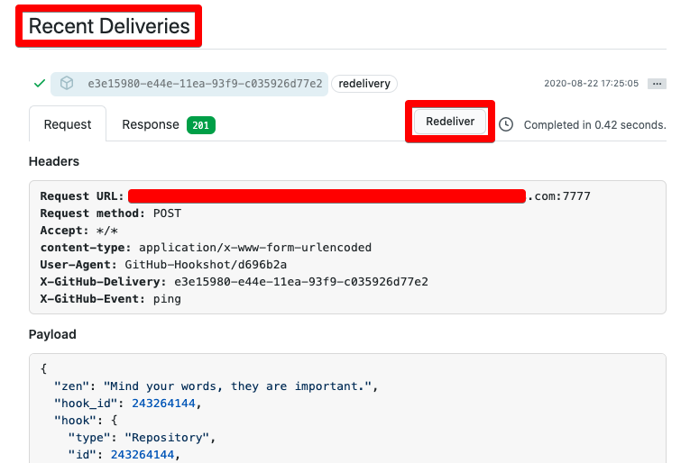
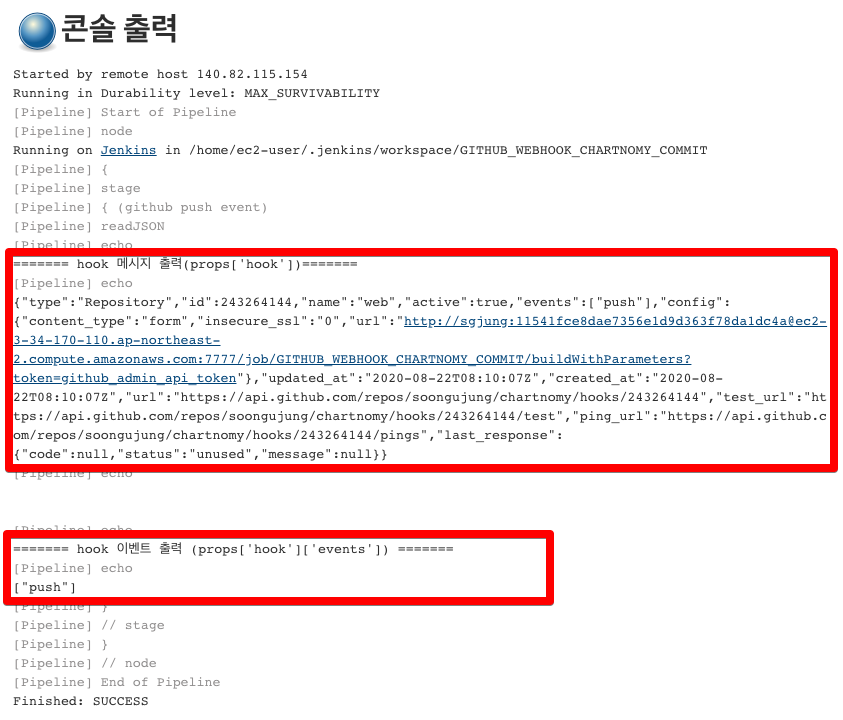
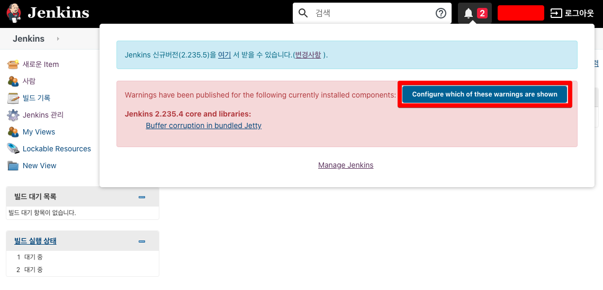
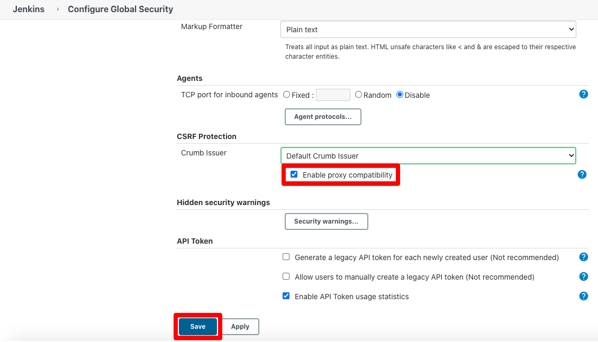

# Jenkins/Github/Slack연동 - Github 메시지 처리 스크립트 구현

> 제목/파일명 을
>
> - Jenkins_Github_Slack연동(AWS)(3)-Github_메시지처리스크립트_구현 
>   - 에서
> - Jenkins_Github_Slack연동(AWS)(3)-Github\_JSON메시지\_처리스크립트\_구현
>
> 으로 바꾸는것을 검토해보자.

# 1. Jeknis Groovy 확장 플러그인 설치

Jenkins를 초기에 설치하고 나면 Groovy가 자동으로 지원된다. 하지만 Pipeline Script 구현시 JSON을 읽어들이거나 할때 추가로 설치해줘야 하는 플러그인이 있다. 바로 **Pipeline Utility Steps** 라는 플러그인이다.  

  

젠킨스 관리 > 플러그인 관리 > 설치 가능 탭 클릭




# 2. Groovy Script작성(정리 필요!!!)

> 요약 (정리 필요!!!)

앞에서 확인했던 github 리포지터리에서 보내준 json 기반의 payload는 문자열로 변환되어 젠킨스로 전달된 것이다. 이렇게 문자열로 변환된 json을 프로그램에서 인식할 수 있도록 파싱하는 절차가 필요하다.  

## 이렇게 json 문자열을 파악하는 이유

(정리 필요!!!)

## 예제

JENKINS > 빌드 아이템(GITHUB_WEBHOOK_CHARTNOMY_COMMIT) 선택 > 구성

- Pipeline > Script 에 아래의 내용 작성

```groovy
node {
    stage('github push event'){
        def props = readJSON text:"${payload}"
        print("======= hook 메시지 출력(props['hook'])=======")
        print(props['hook'])
        print("\n")
        print("======= hook 이벤트 출력 (props['hook']['events']) =======")
        print(props['hook']['events'])
    }
}
```


## 참고자료

- [젠킨스 CI 공식 자료](https://www.jenkins.io/doc/pipeline/steps/pipeline-utility-steps/)
- [stackoverflow](https://stackoverflow.com/questions/46841877/java-lang-nosuchmethoderror-no-such-dsl-method-readjson)
  - 감사하게도 이 자료가 도움이 되었다. 
  - 젠킨스 내의 Pipeline Utility Steps Plugin 을 설치하면 readJSON 함수를 사용할 수 있다고 이야기 해주고 있다.
  - 
- [젠킨스 CI 팀 공식 Github 문서 - Steps](https://github.com/jenkinsci/pipeline-utility-steps-plugin/blob/master/docs/STEPS.md)
  - 파이프라인 작성시 STEP을 적용할 때 참고할만한 내용들을 찾을 수 있도록 목차로 분류해놓은 사이트.
  - 각 항목에 대해 [help](https://github.com/jenkinsci/pipeline-utility-steps-plugin/blob/master/src/main/resources/org/jenkinsci/plugins/pipeline/utility/steps/json/ReadJSONStep/help.html) 와 같은 링크를 제공해주어 필요한 것만 찾아서 읽을수 있도록 잘 되어 있다.
  - 읽어들일 수 있는 형식은 아래와 같다.
    - properties
    - jar manifest
    - yaml
    - json
    - csv  
  - 
- [readJSON에 대한 예제 링크](https://github.com/jenkinsci/pipeline-utility-steps-plugin/blob/master/src/main/resources/org/jenkinsci/plugins/pipeline/utility/steps/json/ReadJSONStep/help.html)
  - 


# 3. 테스트

github repository > webhooks > Recent Deliveries  

- Redeliver 버튼 클릭




출력결과  

정상적으로 잘 읽혔음을 확인가능하다.  




# 트러블 슈팅

Pipeline Utility Script 설치 중에 에러가 발생할 수도 있다.  

원인은 CSRF 설정이 잘못되어서 나타나는 에러였다.  



실제 화면으로 들어가보면 아래와 같다.  

Jenkins > Configure Global Security > CSRF Protection  

- Crumb Issuer
  - Default Crumb Issuer 를 선택해준다.
  - Enable proxy compability 항목을 체크해준다.



