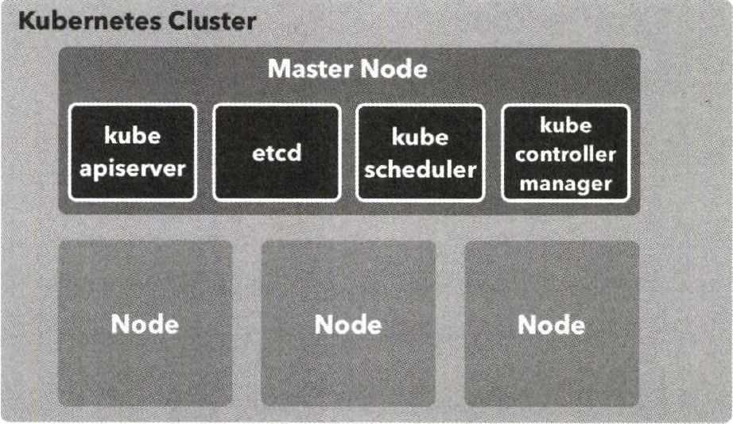
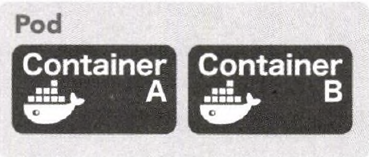
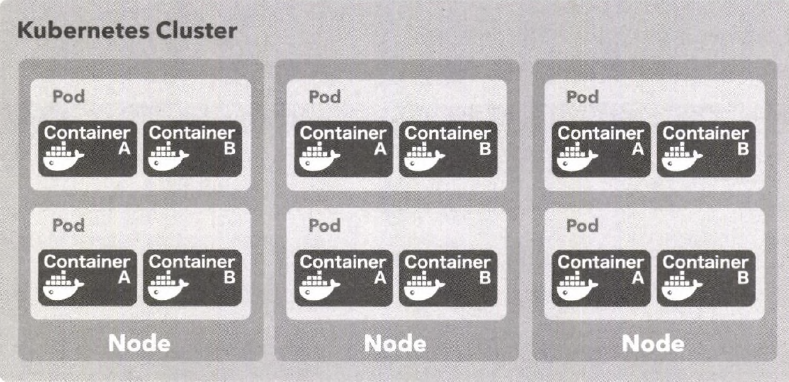
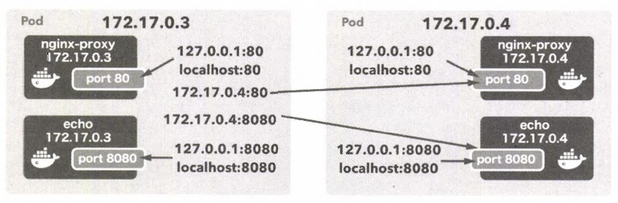

# 쿠버네티스 개념


## 쿠버네티스 클러스터 & 노드

- 쿠버네티스 클러스터
  - 쿠버네티스의 여러 리소스를 관리하기 위한 집합체
- 노드
  - 쿠버네티스 리소스 중에서 가장 큰 개념
  - 클러스터의 관리 대상으로 등록된 도커 호스트
  - 컨테이너가 배치되는 대상
  - 마스터와 노드의 그룹으로 구성된다
  - 마스터는 쿠버네티스 클러스터 전체를 관리하는 서버이다.




```bash
$ kubectl get nodes
....
```


## 네임 스페이스

- 클러스터 안에 가상 클러스터를 또 다시 만들 수 있다.

- 클러스터 안의 가상 클러스터를 네임스페이스(namespace)라고 한다.

- 클러스터를 처음 구축하면

  - default
  - docker
  - kube-public
  - kube-system

  이렇게 4개의 네임스페이스가 만들어져 있다.

```bash
$ kubectl get namespace
...
```


## 파드, 팟, Pod




- 컨테이너가 모인 집합체의 단위이다. 

- 적어도 하나 이상의 컨테이너로 이루어진다.

- 쿠버네티스를 도커와 함께 사용할 때 파드는 컨테이너 하나 또는 컨테이너의 집합체가 된다.

- 예)

  - 하나 이상의 컨테이너로 애플리케이션을 구축할때 

    - Nginx 컨테이너
    - Go 애플리케이션 컨테이너

    를 하나로 묶어서 강한 결합을 유지하는 경우를 예로 들 수 있다.

  - 컨테이너 두개 간의 결합이 높을 때 컨테이너들을 파드로 묶어서 일괄 배포한다.

  - 컨테이너가 하나인 경우에도 파드로 배포한다.

  

## 클러스터 내에서의 노드와 파드의 배치

파드는 아래에서 보듯이 노드에 배치한다.



  

같은 파드를 여러 노드에 배치할 수도 있다. 하나의 노드에 여러가지의 파드를 배치할 수도 있다. 하지만 파드가 여러 노드에 걸쳐서 배치될 수는 없다.  


> 아래 부분 아리까리 하다.... 역시 세상에 공짜로 해주는 설명은 없다. 다시 이해해보고 정리 고고!!
>
> 
>
> 종종 고민되는 경우로 '파드의 적절한 크기는 어느정도 까지인가?'가 있을 수 있다.
>
> 파드 전체가 한 노드에 배치되야 한다는 제약을 뒤집어보면 이해하기 쉽다.
>
> 
>
> 예)
>
> 리버스 프록시 역할을 할 Nginx와 그 뒤에 위치할 애플리케이션 컨테이너를 함께 파드로 묶는 구성이 일반적이다.
>
> 또한 함께 배포해야 정합성을 유지할 수 있는 컨테이너 등에도 해당 컨테이너를 같은 파드로 묶어두는 전략이 유용하다.
>
> 
>
> 도커 스웜에서는 매니저 노드가 스웜 클러스터 전체를 제어하는 역할을 했다.
>
> 쿠버네티스에서는 관리용 서버인 마스터가 그 역할을 담당한다.
>
> 마스터 노드는 관리용 컴포넌트가 담긴 파드만 배포된 노드다. 애플리케이션에 사용되는 파드는 배포할 수 없다.


# 파드 생성 및 배포하기 

파드를 생성해 배포하는 방법은 

- kubectl
- yaml 이용

하는 방식 두가지가 있다. 쿠버네티스의 여러가지 리소스를 정의하는 파일을 매니페스트 파일이라고 부른다. 


## 매니페스트 yaml 작성 (pod-helloworld.yaml)

아래 예제(pod-helloworld.yaml)는 두개의 container를 구성한 메니페스트 파일이다.

```yaml
apiVersion: v1
kind: Pod
metadata:
    name: pod-helloworld-sgjung
spec:
    containers:
    - name: nginx
      image: gihyodocker/nginx:latest
      env:
      - name: BACKEND_HOST
        value: localhost:8080
      ports:
      - containerPort: 80
    - name: echo
      image: gihyodocker/echo:latest
      ports:
      - containerPort: 8080

```


- kind
  - 쿠버네티스 리소스의 유형을 지정
  - kind 속성의 값(pod, node 등등)에 따라 spec 아래의 스키마가 변화한다.
- metadata
  - 리소스에 부여되는 메타데이터
  - metadata.name 속성의 값이 이 리소스의 이름이 된다.
- spec
  - 리소스를 정의하기 위한 속성
  - 파드의 경우 파드를 구성하는 컨테이너를 containers 아래에 정의한다.
- containers 내에 정의하는 속성들
  - name
    - 컨테이너 이름
  - image
    - 도커 허브에 저장된 이미지 태그값
    - 도커허브에 저장된 이미지를 지정할 수도 있고, 로컬에서 빌드한 이미지를 지정할 수도 있다.
  - ports
    - 컨테이너가 노출시킬 포트 지정
  - env
    - env 속성에 환경변수를 열거할 수 있다.
    - 위의 예제에서 nginx의 경우 요청의 프록싱 대상이 될 BACKEND_HOST 값이 필요하므로 이 값이 설정되어 있다.


## 쿠버네티스 클러스터에 배포

위에서 yaml(pod-helloworld.yaml)로 생성한 파드를 클러스터에 배포해보자. 매니페스트 파일의 내용을 그대로 반영하려면 -f 옵션으로 매니페스트 파일에 대한 경로를 지정하고, apply 명령을 사용한다.

```bash
$ kubectl apply -f pod-helloworld.yaml
pod/pod-helloworld-sgjung created
```

이제 파드가 동작하기는 하지만, 아직은 접근할 수 없다. 파드에 접근하는 방법은 

- '서비스' 

에 대해 정리하면서 다룰 예정이다.


# kubectl로 파드 다루기

kubectl을 활용한 다양한 CLI를 정리한다.  

## 생성한 파드들 보기

```bash
$ kubectl get pod
NAME                             READY   STATUS             RESTARTS   AGE
pod-helloworld-sgjung            2/2     Running            0          2m58s
```

  

## 컨테이너 내부 접속

컨테이너 내부를 셸로 접근해보자.  

컨테이너가 여러개인 경우 -c옵션으로 컨테이너 명을 지정한다.  

```bash
$ kubectl exec -it pod-helloworld-sgjung sh -c nginx
#
#
# exit
```

  

## 컨테이너의 표준 출력을 화면에 출력하기  

-c 옵션으로 컨테이너 명을 지정한다.

```bash
$ kubectl logs -f pod-helloworld-sgjung -c echo
```

  

## 파드 지우기  

파드를 삭제하려면 kubectl delete pod 명령을 사용한다. kubectl delete 명령은 파드 외의 다른 종류의 리소스를 지울때에도 사용가능하다.

삭제하는 방식은 

- 단순 파드 명 지정
  - 사용이 끝난 리소스를 삭제할 때 이 명령을 사용한다.
- 매니페스트 파일로 파드 삭제
  - 이 방식을 사용하면 매니페스트에 작성된 리소스 전체가 삭제된다.

이 있다.  

```bash
$ kubectl delete pod pod-helloworld-sgjung
pod "pod-helloworld-sgjung" deleted
```

또는 매니페스트 파일 (pod-helloworld.yaml)로 파드를 삭제할 수 있다. 이 방법을 사용할 경우 매니페스트에 작성한 리소스 전체가 삭제된다.

또는

```bash
$ kubectl delete -f pod-helloworld.yaml
pod "pod-helloworld-sgjung" deleted
```


## 파드와 컨테이너의 IP주소

여러개의 컨테이너를 가진 파드는 결론적으로 비유를 하자면, 여러 개의 컨테이너들을 담고있는 가상머신과 같은 역할을 한다.  



파드는 각각 고유의 가상 IP 주소를 할당받는다. 파드를 묶어놓은 개념일 뿐인데 IP를 가지고 있는다는 것이 이상해보일 수 있기는 하다. 같은 파드 내의 컨테이너들은 localhost로 포트를 지정해 통신이 가능하다.  

그리고 하나의 파드내의 컨테이너가 다른 파드 내의 컨테이너와 통신하는 것 역시 가능하다. 위에서 작성했던 pod-helloworld.yaml에서 

```yaml
...
spec:
    containers:
    - name: nginx
      image: gihyodocker/nginx:latest
      env:
      - name: BACKEND_HOST
        value: localhost:8080
      ports:
      - containerPort: 80
...
```

BACKEND_HOST를 localhost:8080으로 지정했다. 

파드가 속한 컨테이너의 IP 주소 : 컨테이너의 포트로 지정한 의미가 된다.

이 의미는

- localhost:8080

  으로도 접속이 가능하고

- 파드의 IP 주소:8080 

  으로도 접속이 가능하다

는 의미가 된다. 


# 레플리카 세트(ReplicaSet)

단어 중 'Replication' 이라는 단어가 있다. '복제'라는 의미이다. 단어의 모양만 놓고 보면, 레플리카 세트는 Replication이라는 단어와 Set이 합쳐진 단어처럼 보인다. 무슨 뜻일까? 의미를 알아보자!!!  

매니패스트 파일에 pod를 생성할때 매니페스트 파일로는 파드를 하나 밖에 생성할 수 밖에 없었다. 하지만, 규모가 어느 정도 되는 애플리케이션을 구축하면, 같은 파드를 여러 개 실행해서 가용성을 확보해야 하는 경우가 생긴다.  

이런 경우 사용하는 것이 레플리카세트(ReplicaSet)다. 레플리카세트는 똑같은 파드를 여러 개 생성하고 관리하기 위한 리소스다. 파드를 정의하는 구문 역시 그대로 사용하면서 몇몇 속성 값들만 바꿔서 매니페스트 파일을 정의하면 여러개의 복제된 파드를 운영가능하다.  

## 매니페스트 파일

```yaml
apiVersion: apps/v1
kind: ReplicaSet
metadata:
    name: echo
    labels:
        app: echo
spec:
    replicas: 3 # 레플리카세트에서 만들 파드의 복제본의 수
    selector:
        matchLabels:
            app: echo
    template: # template 아래는 파드의 리소스 정의와 같다
        metadata:
            labels:
                app: echo
        spec:
            containers:
            - name: nginx
              image: gihyodocker/nginx:latest
              env:
              - name: BACKEND_HOST
                value: localhost:8080
              ports:
              - containerPort: 80
            - name: echo
              image: gihyodocker/echo:latest
              ports:
              - containerPort: 8080
```

- replicas
  - 레프리카 세트에서 만들 파드의 복제본 수를 의미
- template
  - template 속성의 내부는 파드의 정의와 같다.


## 레플리카 세트 생성

```bash
$ kubectl apply -f replicaset-helloworld.yaml
replicaset.apps/echo created
```


레플리카 세트는 이 정의를 따라 replicas 속성에 지정한 수만큼 파드 정의 및 파드 복제를 모두 수행한다.  

이 레플리카 세트를 배포하면 파드가 3개 만들어진 것을 확인 가능하다. 같은 파드가 여러개 복제된 것이므로 파드 명에 echo-6nvww 와 같은 무작위로 생성된 접미사가 붙는다.    

```bash
$ kubectl get pod
NAME                             READY   STATUS             RESTARTS   AGE
echo-6nvww                       2/2     Running            0          5m31s
echo-swp42                       2/2     Running            0          5m31s
echo-w472p                       2/2     Running            0          5m31s
```

  

레플리카세트를 조작해 파드의 수를 줄이면 줄인 개수 만큼 파드가 삭제된다. 삭제된 파드는 복원불가능하다. 웹 어플리케이션 같은 무상태(stateless) 파드에 사용되기도 한다.  

## 레플리카 삭제

생성한 레플리카 세트는 매니페스트 파일로 아래와 같이 삭제한다.

```bash
$ kubectl delete -f replicaset-helloworld.yaml
replicaset.apps "echo" deleted
```


