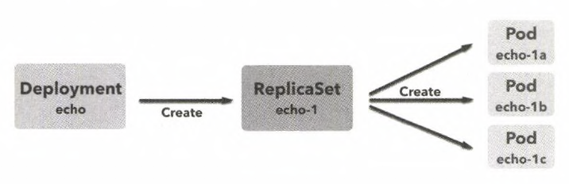

# 디플로이먼트(deployment)

디플로이먼트(deployment)는 레플리카세트보다 상위 계층에 해당하는 리소스다. 디플로이먼트는 애플리케이션 배포(deploy)의 기본 단위가 되는 리소스다. 디플로이먼트는 레플리카세트를 관리하고 다루는 역할을 한다. 레플리카세트의 리비전 관리 역시 할수 있다. 파드, 레플리카세트, 디플로이먼트의 관계를 보면 아래와 같다.  



## 디플로이먼트 생성하기

디플로이먼트와 레플리카세트의 정의는 크게 다르지 않다.

다른 점이 있다면, 

> 레플리카세트의 리버전 관리를 할수 있다는 점

이다.  

### deployment-helloworld.yaml

```yaml
apiVersion: apps/v1
kind: Deployment
metadata:
    name: echo
    labels:
        app: echo
spec:
    replicas: 3
    selector:
        matchLabels:
            app: echo
    template: # template 아래는 파드의 리소스 정의와 같음
        metadata:
            labels:
                app: echo
        spec:
            containers:
            - name: nginx
              image: gihyodocker/nginx:latest
              env:
              - name: BACKEND_HOST
                value: localhost:8080
              ports:
              - containerPort: 80
            - name: echo
              image: gihyodocker/echo:latest
              ports:
              - containerPort: 8080

```


### 디플로이먼트 생성

```bash
$ kubectl apply -f deployment-helloworld.yaml --record
deployment.apps/echo created
```


### 디플로이먼트, 파드, 레플리카셋 확인

```bash
$ kubectl get pod,replicaset,deployment --selector app=echo
NAME                        READY   STATUS    RESTARTS   AGE
pod/echo-68896f77d7-fvj7j   2/2     Running   0          26s
pod/echo-68896f77d7-l4gsb   2/2     Running   0          26s
pod/echo-68896f77d7-z58j9   2/2     Running   0          26s

NAME                                    DESIRED   CURRENT   READY   AGE
replicaset.extensions/echo-68896f77d7   3         3         3       27s

NAME                         READY   UP-TO-DATE   AVAILABLE   AGE
deployment.extensions/echo   3/3     3            3           27s
```


### 디플로이먼트의 리비전 확인

디플로이먼트의 리비전을 확인할 때는 

> ```bash
> $ kubectl rollout history deployment [앱 이름]
> ```

으로 확인 가능하다.  

직접 "echo"앱의 리비전을 확인해보자.

```bash
$ kubectl rollout history deployment echo
deployment.extensions/echo
REVISION  CHANGE-CAUSE
1         kubectl apply --filename=deployment-helloworld.yaml --record=true
```

결과를 확인해보니 revision이 1이다.  

## 레플리카세트의 생애주기

쿠버네티스는 디플로이먼트를 단위로 애플리케이션을 배포한다. 실제 운영시에는 레플리카세트를 직접 다루기보다 디플로이먼트 매니패스트 파일로 다루는 경우가 많다.  

디플로이먼트가 관리하는 레플리카 세트는 

- 지정된 갯수만큼 파드를 확보하거나
- 파드를 새로운 버전으로 교체하거나
- 이전 버전으로 롤백하는 등

의 동작을 하게 된다.  

애플리케이션 배포를 바르게 운영하려면 디플로이먼트 안의 레플리카세트의 동작을 이해해야 한다.  

디플로이먼트를 수정하면 레플리카세트가 새로 생성되고 기존 레플리카 세트와 교체되는데, 레플리카 세트가 생성되는 사례를 아래에서 살펴본다.


### 파드 갯수 수정

파드 갯수만 수정한다고 해서 레플리카 세트가 새로 생성되지는 않는다. 예를 들기 위해 방금 작성한 deployment-helloworld.yaml에서 replicas 속성을 3에서 4로 변경해주자.

> ```yaml
> apiVersion: apps/v1
> kind: Deployment
> metadata:
>     name: echo
>     labels:
>         app: echo
> spec:
>     replicas: 4 # 이 부분을 3에서 4로 변경해주었다.
> ...
> ...
> ```


그리고 kubectl 명령어로 apply 해보자

> ```bash
> $ kubectl apply -f deployment-helloworld.yaml --record
> deployment.apps/echo configured
> ```


파드를 확인해보자.

> ```bash
> $ kubectl get pod
> NAME                             READY   STATUS              RESTARTS   AGE
> echo-68896f77d7-fvj7j            2/2     Running             0          43m
> echo-68896f77d7-l4gsb            2/2     Running             0          43m
> echo-68896f77d7-z58j9            2/2     Running             0          43m
> echo-68896f77d7-zp6lr            0/2     ContainerCreating   0          5s
> python-sample-57754bbf47-vwmxd   0/1     CrashLoopBackOff    1077       3d19h
> ```

원래 있던 파드는 그대로 이고, 컨테이너가 하나 새로 생성되었다. (status가 ContainerCreating이다.)

이제 디플로이먼트 내에서의 레플리카 세트의 리비전 번호를 확인해보자.

> ```bash
> $ kubectl rollout history deployment echo
> deployment.extensions/echo
> REVISION  CHANGE-CAUSE
> 1         kubectl apply --filename=deployment-helloworld.yaml --record=true
> ```

파드의 갯수를 수정해 새로운 파드를 띄웠고, 매니페스트를 바꿨음에도 리비전은 변경되지 않았다. 

>  즉, replicas 값만 변경하는 것만으로는 레플리카세트의 교체가 일어나지 않는다는 것을 알 수 있다.

### 컨테이너 정의 수정

컨테이너 이미지가 수정된 경우를 확인해보자. deployment-helloworld.yaml 내의 echo 컨테이너의 이미지를 gihyodocker/echo:patched 로 수정하자.

> ```yaml
> apiVersion: apps/v1
> kind: Deployment
> ...
> ...
> spec:
>     replicas: 4
> ...
> ...
>     template: # template 아래는 파드의 리소스 정의와 같음
> ...
> ...
>         spec:
>             containers:
> ...
> ...
>             - name: echo
>             	# gihyodocker/echo:latest 에서 
>             	# gihyodocker/echo:patched 로 바꿔주었다.
>               image: gihyodocker/echo:patched
>               ports:
>               - containerPort: 8080
> ```

  

이제 deployment-helloworld.yaml 으로 실행시켜보자

```bash
$ kubectl apply -f deployment-helloworld.yaml --record
deployment.apps/echo configured
```


pod의 상태를 kubectl로 확인해보자~

```bash
kubectl get pod --selector app=echo
NAME                    READY   STATUS             RESTARTS   AGE
echo-646677887f-2cckd   1/2     ImagePullBackOff   0          30s
echo-646677887f-s6hpt   1/2     ImagePullBackOff   0          30s
echo-68896f77d7-fvj7j   2/2     Running            0          68m
echo-68896f77d7-l4gsb   2/2     Running            0          68m
echo-68896f77d7-z58j9   2/2     Running            0          68m
echo-68896f77d7-zp6lr   2/2     Terminating        0          25m
```

기존 pod는 Terminating되고, 새로운 파드가 생성된 것을 확인 가능하다.


리비전 번호를 확인해볼까...

```bash
$ kubectl rollout history deployment echo
deployment.extensions/echo
REVISION  CHANGE-CAUSE
1         kubectl apply --filename=deployment-helloworld.yaml --record=true
2         kubectl apply --filename=deployment-helloworld.yaml --record=true
```

리비전 번호 2(REVISION=2)가 생성된 것을 확인 가능하다. 

> 즉,kubectl apply를 실행했을 때 디플로이먼트의 내용이 변경된 경우 새로운 리비전이 생성되는 것을 알 수 있따.


### 롤백 실행하기

롤백 기능을 활용하면

- 최신 디플로이먼트에 문제가 있을 경우 곧바로 이전 버전으로 돌아갈 수 있으며, 
- 애플리케이션의 이전 버전의 동작을 확인하려는 경우에도 활용할 수 있다.

롤백 명령은 

> $ kubectl rollout undo deployment [앱 이름]

으로 수행한다.(undo 옵션을 추가한다)  

디플로이먼트는 리비전 번호가 기록되므로 특정 리비전의 내용을 확인할 수 있는 점을 활용해 이전 버전의 디플로이먼트를 확인해보자.  

--revision 옵션을 통해 확인 가능하다.

```bash
$ kubectl rollout history deployment echo --revision=1
deployment.extensions/echo with revision #1
Pod Template:
  Labels:	app=echo
	pod-template-hash=68896f77d7
  Annotations:	kubernetes.io/change-cause: kubectl apply --filename=deployment-helloworld.yaml --record=true
  Containers:
   nginx:
    Image:	gihyodocker/nginx:latest
    Port:	80/TCP
    Host Port:	0/TCP
    Environment:
      BACKEND_HOST:	localhost:8080
    Mounts:	<none>
   echo:
    Image:	gihyodocker/echo:latest
    Port:	8080/TCP
    Host Port:	0/TCP
    Environment:	<none>
    Mounts:	<none>
  Volumes:	<none>
```

undo를 실행하면 디플로이먼트가 바로 직전 리비전으로 롤백된다.

```bash
$ kubectl rollout undo deployment echo
deployment.extensions/echo rolled back
```

이러한 롤백 기능으로 디플로이먼트에 문제가 있을 경우 곧바로 이전버전으로 돌아갈 수 있고, 이전버전의 동작역시 확인 가능하다. 

디플로이먼트역시 매니페스트 파일로 삭제할 수 있따. 디플로이먼트 및 관련 레플리카셋, 파드가 삭제된다.

```bash
$ kubectl delete -f deployment-helloworld.yaml
deployment.apps "echo" deleted
```


