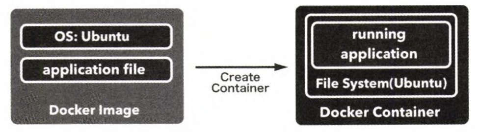

# 기본 개념

- 도커 이미지란 ?
  - 컨테이너를 생성하는 템플릿 역할을 하는 존재
  - 도커 컨테이너를 구성하는 파일 시스템 + 실행할 애플리케이션 설정 
- 도커 컨테이너
  - 도커 이미지를 기반으로 생성된다.



# Dockerfile 문법

## .dockerignore 파일

- docker 이미지 빌드시 무시할 파일들을 입력한다.


## FROM

- 도커 이미지의 바탕이 될 이미지를 지정 (ex. 알파인 리눅스, busybox 리눅스 등등)
- Dockerfile로 이미지 빌드시 항상 가장 처음에 FROM 인스트럭션에 지정한 이미지를 내려받는다.
- FROM 에서 받아오는 도커 이미지는 
  - 이미지가 로컬에 있을 경우 로컬의 파일을 적용하고 
  - 이미지가 로컬에 없을 경우 도커허브에 공개된 이미지를 받아온다.
- FROM 은 여러개 지정가능하다.

## RUN

- 도커 실행시 컨테이너 안에서 실행할 명령을 정의하는 도커 명령어이다.
- 게스트 OS에 맞는 CLI를 수행하도록 입력하면 된다.

ex)

```
RUN cd /usr/local/src
```

## COPY

- 호스트의 파일/디렉터리를 도커 컨테이너 안으로 복사해주는 명령어

ex)

```
COPY ./jdk-10 /usr/local/src/jdk-10
```

## CMD 

- 도커 컨테이너 실행시 컨테이너 안에서 실행할 프로세스 지정
- Dockerfile 내에서 한번만 사용할 수 있다
  참고할 만한 자료 : https://bluese05.tistory.com/77

ex)

```
CMD touch /home/ec2-user/oauth-list.txt
```

## ENTRYPOINT

- CMD와 마찬가지로 이미지가 컨테이너로 실행될때 실행된다. (docker run, start 시)
- Dockerfile에서 한번만 사용가능하다.
- 실행 형식은 CMD와 동일하다.
- ENTRYPOINT와 CMD가 동시에 사용되는 경우 CMD는 ENTRYPOINT에 매개변수만을 전달하는 역할을 한다.

## ENV

- 도커 컨테이너 안에서 사용할 수 있는 환경변수를 지정한다.


## EXPOSE

- 노출시킬 port를 설정
- docker run 명령어의 --export 옵션과 동일하다.
- 한꺼번에 작성 가능하기도 하고, 여러줄 작성도 가능핟.

ex)

```
EXPOSE 80 EXPOSE 443 EXPOSE 21
```

또는

```
EXPORT 80 443 21
```


# 도커 이미지 빌드

## docker image build

docker image build는 Dockerfile에 기술한 스크립트에 따라 도커 이미지를 생성하는 명령어이다


명령어 형식

- docker image build
  ex)

  `$ docker image build "이미지명":"태그명" "Dockerfile 경로"`

  

- Dockerfile 이 현재 작업 디렉터리에 있다면 

  `$ docker image build -t example/echo:latest .`

  


## 도커 이미지 빌드 명령어 옵션

- -t 옵션

  - 이미지명, 태그명을 붙이는 옵션
  - 실제 사용에서 거의 필수적으로 쓰인다.

- -f 옵션

  - docker image build 명령은 기본 설정으로 Dockerfile이라는 이름의 파일을 찾도록 되어 있다.

  - Dockerfile이라는 이름외의 다른 파일을 이미지 파일로 사용하려 할때 -f 옵션을 사용한다.

  - ex)

    - 

      `docker image build -f Dockerfile-test -t example/echo:latest`

      

- --pull 옵션

  - 명령어를 입력할 때마다 베이스 이미지를 강제로 새로 받아온다.

  - ex)

    - 

      `docker image build --pull=true -t example/echo:latest .`

      


# 도커 컨테이너 명령어

## 컨테이너 실행

- docker container run "name"
- docker container run -d "name"
- 포트포워딩 (명시적지정 - 강제지정)
- 포트포워딩 (암시적 지정 - 축약형)


ex) 포어그라운드에서 실행시키는 단순 명령

```
$ docker container run example/echo:latest
```


ex) 데몬으로 실행(백그라운드로 실행)

```
$ docker container run -d example/echo:latest
```

- -d 옵션
  - 컨테이너 실행시 -d 옵션을 붙이면 표준 출력이 해시값처럼 보이는 문자열일 출력된다.
  - 이 문자열이 도커 컨테이너의 ID 이다.
  - 컨테이너 ID는 컨테이너를 실행할때 부여되는 유일한 식별자 이다.

ex) 포트포워딩 (포워딩할 포트 명시적 지정)

```
$ docker container run -d -p 9000:8000 example/echo:latest
```


ex) 포워딩할 포트 자동 지정 (내부 지정)

```
$ docker conatiner run -d -p 8080 example/echo:latest $ docker conatiner ls
```


## 컨테이너 종료, 재시작, 삭제 (stop,restart,rm)

### 종료

포트 포워딩을 사용하기 전에 앞서 실행한 컨테이너를 정지시키려면 아래와 같은 명령어를 사용한다.

ex)

```
$ docker container stop $(docker conatiner ls --filter "ancester=example/echo" -q)
```

### 재시작

ex)

```
$ docker container restart echo 
```

###  삭제

ex)

```
$ docker container rm f66f6f2013da
```


## 컨테이너 리스팅 (ls)

ex) 

```
$ docker container ls
```


ex) 특정 조건으로 필터링하기

```
$ docker container ls -filter "name=echo01" # 컨테이너를 생성한 이미지를 기준으로 하려면 ancestor 필터를 사용하자 $ docker container ls -filter "ancestor=example/echo"
```


## 컨테이너에 호스트OS의 로컬 파일 복사

ex)

```
$ docker cp deploy-0.0.1-SNAPSHOT.jar nginx-boot:/tmp
```


## 컨테이너 내부 접속해 터미널 명렁어 수행

ex)

```
$ docker exec -it nginx-boot bash
```


# 참고자료

컨테이너 명령에서 자주 사용되는 옵션

CLI환경에서 도커를 자주 사용한다. CLI 환경에서 docker container run 명령 실행시 자주 쓰는 옵션은

- -i
- -t
- --rm
- -v

가 있다.

## -i 옵션

- 컨테이너를 실행할 때 컨테이너 쪽 표준 입력(stdin) 과의 연결을 그대로 유지한다. 
  (따라서 컨테이너 쪽 쉘에 들어가서 명령을 실행할 수 있다.)
- 실제 사용에서는 -t 옵션과 함께 사용하는 경우가 많다.

## -t 옵션

- 유사 터미널 기능을 활성화하는 옵션
- -i 옵션(stdin)을 사용하지 않으면 유사 터미널을 실행해도 여기에 입력할수가 없으므로 -i와 -t 옵션을 같이 사용하거나, 이들 옵션을 합쳐 축약한 -it 옵션을 사용하는 편이다.

## -rm 옵션

- 컨테이너를 종료할 때 컨테이너를 파기하도록 하는 옵션이다.
- 한 번 실행후 더 이상 관리할 필요가 없는 컨테이너 생성/실행시 유용하다.

## -v 옵션

- 호스트 ↔ 컨테이너간의 디렉터리/파일 공유하기위해 사용하는 옵션