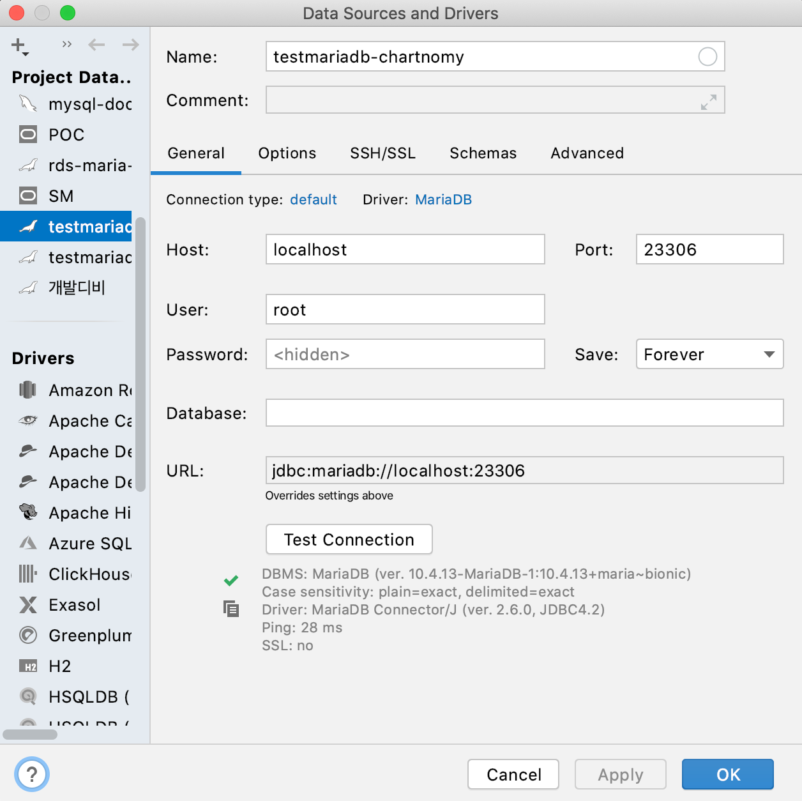
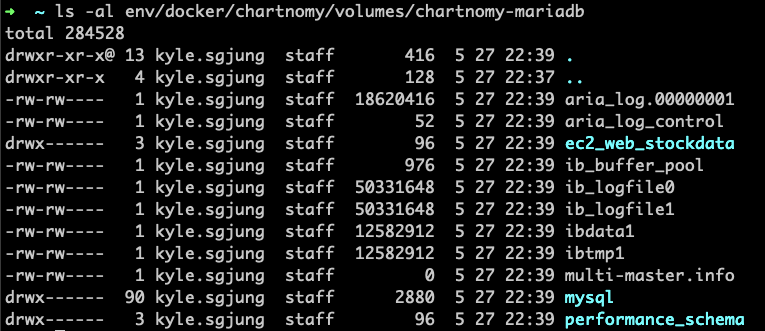

# 테스트 용도의 docker mysql/mariadb Container 구동하기

테스트 실행시 테스트가 종료된 후에도 데이터를 확인해보고자 하는 경우가 있을 수 있다.   

또는 mysql/mariadb 에서 사용되는 Function(ex. IF(...))이 h2 데이터베이스에서는 지원되지 않는 함수 일 뿐만 아니라, h2 내장 Function과 겹치는 문제로 사용하지 못하는 경우가 있다. (Mybatis의 경우 RAW SQL 을 작성하는데 이 경우 특정 DB에 특화된 함수를 사용하는 경우가 있기 때문)  

이 경우 로컬에서 직접 mysql 서버를 구동시키면 된다.  

그런데, mysql 서버를 돌릴 경우 사소한 이슈가 하나 있다. schema 생성시 인덱스를 생성할 때 보통 IF NOT EXISTS 등을 사용하는데, mysql은 index 생성시 IF NOT EXISTS 에 대한 문법을 지원하지 않는다. 이런 문제로 이번 예제에서는 테스트 용도로 사용할 mariadb 서버를 도커 컨테이너로 구동시키려 한다. 이와 관련된 이슈는 아래(**참고) index 생성시 create or replace**)에서 정리해 놓으려 한다.  

# 1. 요약

기본적인 사항만을 요약해보자.

- mariadb 이라는 이름의 이미지의 최신버전을 docker 리포지터리에서 pull 해오기
- 받아온 이미지를 container 기반으로 run 시킨다.
- 로컬에서 도커 기반으로 생성된 컨테이너로의 접속시 접속하는 포트 번호는 23306 으로 지정했다.
- 도커 컨테이너 내부에서는 3306 포트가 열려있다.

## 참고자료

- [https://hub.docker.com/_/mysql](https://hub.docker.com/_/mysql)
- [https://hub.docker.com/_/mariadb](https://hub.docker.com/_/mariadb)
- [https://spin.atomicobject.com/2018/10/04/docker-command-line/](https://spin.atomicobject.com/2018/10/04/docker-command-line/)

# 2. 도커 명령어 Cheet Sheet

## mysql 컨테이너 실행

```bash
$ docker container run --rm -d -p 13306:3306 --name chartnomy-mysql -e MYSQL_ROOT_PASSWORD=1111 -e MYSQL_DATABASE=chartnomy-mysql -d mysql:latest
```

## mysql container 조회

```bash
$ docker container ls --filter name=chartnomy-mysql
```

## mysql container에 bash 접속

``` bash
$ docker container exec -it chartnomy-mysql sh
```

## mysql container stop

```bash
$ docker container stop chartnomy-mysql
```

## mysql container rm

```bash
$ docker container rm chartnomy-mysql
```


# 3. Script 로 만들기

## docker-mysql-start.sh (mysql 삭제 & 구동)

```bash
#!/bin/zsh

name_chartnomy_mysql='chartnomy-mysql'
cnt_chartnomy_mysql=`docker container ls --filter name=chartnomy-mysql | wc -l`
cnt_chartnomy_mysql=$(($cnt_chartnomy_mysql -1))

if [ $cnt_chartnomy_mysql -eq 0 ]
then
    echo "'$name_chartnomy_mysql' 컨테이너를 구동시킵니다."
    docker container run --rm -d -p 23306:3306 --name chartnomy-mysql \
                -v ~/env/docker/chartnomy/volumes/chartnomy-mariadb:/var/lib/mysql \
                -e MYSQL_ROOT_PASSWORD=1111 \
                -e MYSQL_DATABASE=ec2_web_stockdata \
                -e MYSQL_USER=testuser \
                -e MYSQL_PASSWORD=1111 \
                -d mariadb:latest \
                --character-set-server=utf8mb4 --collation-server=utf8mb4_unicode_ci

else
    echo "'$name_chartnomy_mysql' 컨테이너가 존재합니다. 기존 컨테이너를 중지하고 삭제합니다."
    docker container stop chartnomy-mysql
    rm -rf ~/env/docker/chartnomy/volumes/chartnomy-mariadb/*
    echo "\n'$name_chartnomy_mysql' 컨테이너 삭제를 완료했습니다.\n"

    echo "'$name_chartnomy_mysql' 컨테이너를 구동시킵니다."
    docker container run --rm -d -p 23306:3306 --name chartnomy-mariadb \
                -v ~/env/docker/chartnomy/volumes/chartnomy-mariadb:/var/lib/mysql \
                -e MYSQL_ROOT_PASSWORD=1111 \
                -e MYSQL_DATABASE=ec2_web_stockdata \
                -e MYSQL_USER=testuser \
                -e MYSQL_PASSWORD=1111 \
                -d mariadb:latest \
                --character-set-server=utf8mb4 --collation-server=utf8mb4_unicode_ci
fi
```


## docker-mysql-stop.sh (mysql 정지 & 삭제)

```bash
#!/bin/zsh

name_chartnomy_mysql='chartnomy-mysql'

cnt_chartnomy_mysql=`docker container ls --filter name=chartnomy-mysql | wc -l`
cnt_chartnomy_mysql=$(($cnt_chartnomy_mysql -1))

if [ $cnt_chartnomy_mysql -eq 0 ]
then
    echo "'$name_chartnomy_mysql' 컨테이너가 없습니다. 삭제를 진행하지 않습니다."

else
    echo "'$name_chartnomy_mysql' 컨테이너가 존재합니다. 기존 컨테이너를 중지하고 삭제합니다."
    docker container stop chartnomy-mysql
    rm -rf ~/env/docker/chartnomy/volumes/chartnomy-mariadb/*
    echo "\n'$name_chartnomy_mysql' 컨테이너 삭제를 완료했습니다.\n"
fi
```


## docker-mysql-repl.sh (mysql 쉘 접속)

```bash
#!/bin/zsh

name_chartnomy_mysql='chartnomy-mysql'

cnt_chartnomy_mysql=`docker container ls --filter name=chartnomy-mysql | wc -l`
cnt_chartnomy_mysql=$(($cnt_chartnomy_mysql -1))

if [ $cnt_chartnomy_mysql -eq 0 ]
then
    echo "'$name_chartnomy_mysql' 컨테이너가 없습니다. 컨테이너를 구동해주세요."

else
    echo "'$name_chartnomy_mysql' 컨테이너의 BASH 쉘 접속을 시작합니다."
    docker container exec -it chartnomy-mysql sh
fi
```


# 4. Workbench/DataGrip 에서의 접속




# 참고) mysql/mariadb 컨테이너와 로컬 개발환경의 파일시스템 연동

- 참고 URL :
  - https://hub.docker.com/_/mysql
    - 위 링크의 Caveats - Where to Store Data 절 참고

  

공식 문서에서 권장하는 방식은 두 가지 이다.

- DB 데이터 스토리지를 도커가 관리하는 방식

  - Docker Container가 자체적으로 내부의 볼륨 관리 기능을 사용하여 database file들을 쓰게끔 해서 Docker가 직접 database 데이터의 스토리지를 관리하도록 하는 방식

  - 단점은 컨테이너 외부에서 직접 실행되는 툴이나 애플리케이션에서 도커 컨테이너 내부의 파일을 찾기 힘들다는 점이다.

      

- DB 데이터 스토리지를 도커 외부에 두는 방식 (호스트 시스템에 데이터 스토리지를 두는 방식)

  - 데이터를 위한 디렉터리를 호스트 시스템(ex.로컬 개발 PC 물리 디렉터리)에 생성한다
  - 생성한 디렉터리를 컨테이너 내부에서 마운트 한다.
  - database file 을 호스트 시스템(ex. 로컬 개발 PC 개발환경)의 특정 위치(known location, 물리 디렉터리)에 두는 방식이다.
  - 호스트 시스템(ex. 로컬 개발 PC 개발환경)의 툴이나 애플리케이션이 database file 들에 접근가능하다는 점이 장점이다.
  - 단점은 도커 컨테이너를 사용하는 사용자가 디렉터리가 존재하는지, 호스트 시스템 디렉터리(ex. 로컬 PC 개발환경의 물리 디렉터리)의 사용자 그룹/권한 및 보안 룰을 알고 있어야 한다는 점이다.
  - 주관적인 의견으로는 그리 크게 단점으로 다가오지 않는다.
  - 참고할만한 자료
    - https://docs.docker.com/storage/volumes/

## 예제

여기서는 두번째 방식을 채택해 간단히 호스트 시스템의 디렉터리를 연결하는 예를 든다. 

### 디렉터리 생성

로컬에 저장될 데이터를 보관할 디렉터리인 

- ~/env/docker/melon/volumes/melon-mysql-volume 디렉터리  

를 생성한다.

```bash
$ mkdir -p ~/env/docker/chartnomy/volumes/chartnomy-mariadb
```

~/env/docker/melon/volumes/melon-mysql-volume 을 mysql 컨테이너 내부의 /var/lib/mysql 디렉터리로 연결해준다.

```bash
$ docker container run --rm -d -p 23306:3306 --name chartnomy-mariadb \
    -v ~/env/docker/chartnomy/volumes/chartnomy-mariadb:/var/lib/mysql \
    -e MYSQL_ROOT_PASSWORD=1111 \
    -e MYSQL_DATABASE=ec2_web_stockdata \
    -e MYSQL_USER=testuser \
    -e MYSQL_PASSWORD=1111 \
    -d mariadb:latest \
    --character-set-server=utf8mb4 --collation-server=utf8mb4_unicode_ci
```

mysql docker 컨테이너 구동 후 볼륨 디렉터리 확인 결과




# 참고) mysql docker 이미지의 환경변수들

참고 URL

- [https://hub.docker.com/_/mysql](https://hub.docker.com/_/mysql)
- [https://hub.docker.com/_/mariadb](https://hub.docker.com/_/mariadb)  


환경변수들은 -e 옵션을 주어 하나씩 추가해주면 된다. (mariadb 컨테이너에서는 mysql 컨테이너에서 사용한 환경변수를 동일하게 적용가능하다.)

## Environment Variables

When you start the `mysql` image, you can adjust the configuration of the MySQL instance by passing one or more environment variables on the `docker run` command line. Do note that none of the variables below will have any effect if you start the container with a data directory that already contains a database: any pre-existing database will always be left untouched on container startup.

See also https://dev.mysql.com/doc/refman/5.7/en/environment-variables.html for documentation of environment variables which MySQL itself respects (especially variables like `MYSQL_HOST`, which is known to cause issues when used with this image).

### `MYSQL_ROOT_PASSWORD`

This variable is mandatory and specifies the password that will be set for the MySQL `root` superuser account. In the above example, it was set to `my-secret-pw`.

### `MYSQL_DATABASE`

This variable is optional and allows you to specify the name of a database to be created on image startup. If a user/password was supplied (see below) then that user will be granted superuser access ([corresponding to `GRANT ALL`](http://dev.mysql.com/doc/en/adding-users.html)) to this database.

### `MYSQL_USER`, `MYSQL_PASSWORD`

These variables are optional, used in conjunction to create a new user and to set that user's password. This user will be granted superuser permissions (see above) for the database specified by the `MYSQL_DATABASE` variable. Both variables are required for a user to be created.

Do note that there is no need to use this mechanism to create the root superuser, that user gets created by default with the password specified by the `MYSQL_ROOT_PASSWORD` variable.

### `MYSQL_ALLOW_EMPTY_PASSWORD`

This is an optional variable. Set to `yes` to allow the container to be started with a blank password for the root user. *NOTE*: Setting this variable to `yes` is not recommended unless you really know what you are doing, since this will leave your MySQL instance completely unprotected, allowing anyone to gain complete superuser access.

### `MYSQL_RANDOM_ROOT_PASSWORD`

This is an optional variable. Set to `yes` to generate a random initial password for the root user (using `pwgen`). The generated root password will be printed to stdout (`GENERATED ROOT PASSWORD: .....`).

### `MYSQL_ONETIME_PASSWORD`

Sets root (*not* the user specified in `MYSQL_USER`!) user as expired once init is complete, forcing a password change on first login. *NOTE*: This feature is supported on MySQL 5.6+ only. Using this option on MySQL 5.5 will throw an appropriate error during initialization.


# 참고) index 생성시 create or replace

현존 mysql 버전은 더 이상 업그레이드 되지 않고 있다. mysql 배포판의 이름 자체가 바뀌어 mariadb 로 상위버전이 배포되고 있다. mysql 컨테이너를 사용할 경우에는 굉장히 오래된 버전의 mysql버전의 문법을 사용해야 하는데 이 경우 create if not exists index if_뭐시기 같은 문법에서 에러를 내게 된다. mysql 5.x 버전 대에서는 인식하지 못하는 것으로 인한 문제이다.


테스트 돌리는 데에 굳이 최신버전의 DB를 뭐하러 쓰지? 하는 생각으로 mysql 컨테이너를 사용했었지만, 위의 문제로 인해 mariadb:latest 버전의 컨테이너 기반으로 환경을 변경했다. mariadb 내에서는 해당 문법이 지원된다. 


참고자료

- [https://mariadb.com/kb/en/create-index/](https://mariadb.com/kb/en/create-index/)

