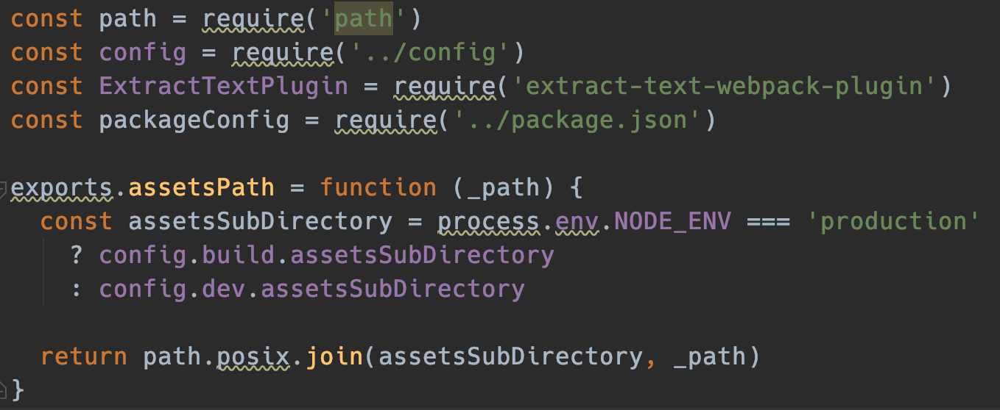

# exports, module.exports 개념


# 참고자료

- [https://www.sitepoint.com/understanding-module-exports-exports-node-js/](https://www.sitepoint.com/understanding-module-exports-exports-node-js/)


# Node의 모듈 포맷들

Node에서 제공하는 모듈의 종류는 아래와 같다.

- CommonJS
  - require, module.exports 라는 키워드를 이용해 의존성과 모듈을 정의한다.
  - npm 생태계(ecosystem)은 CommonJS 기반으로 되어 있다.
- ES Module (ESM)
  - ES6(ES2015) 부터 Javascript 는 Native Module 을 지원한다.
  - ESM은 'export' 키워드를 사용해 모듈의 public API를 export 하고
  - 'import' 키워드를 사용해 public API를 import 한다.
- System.register
  - ES5 내에서 ES6 모듈들을 지원하기 위해 고안된 포맷이다.
- AMD ( Asynchronous Module Definition )
  - 브라우저에서 쓰이는 형식이다.
  - define function을 이용해여 모듈을 정의한다.
- UMD ( Universal Module Definition )
  - 브라우저와 Node.js 모두에서 쓰일 수 있는 포맷이다. 
  - 굉장히 다양한 module loader 들에 의해 import 되어야 할때 유용한 포맷이다.


# require 란?

내장 모듈 또는 설치한 모듈들을 코드 내에서 불러와 사용하고자 할때 보통 require 키워드를 사용한다.

예제) fs 모듈(파일 시스템 접근 모듈)을 활용한 디렉터리 읽어들이기

```javascript
const fs = require('fs');
const folderPath = '/home/jim/Desktop/';
 
fs.readdir(folderPath, (err, files) => {
  files.forEach(file => {
    console.log(file);
  });
});
```


require 선언시 주의할 점으로 아래의 내용들이 있다.

- require 선언문에서는 로컬 모듈을 가져와 사용하고자 할때 보통 './'으로 접두사를 붙여서 사용한다.
- 파일시스템의 확장자(ex - js, .exe 등등...) 을 js 파일 내에서 생략해도 된다.


# exports 란?

Webpack 빌드 스크립트들을 보다보면 exports라는 키워드를 접할때가 많다. 예를 들면 아래와 같은 경우이다.   




## 사용하는 경우

모듈을 생성해 외부에 노출되도록 (export) 할때 exports 키워드를 사용한다.


## 단순사용 예제

ex) user.js  

user.js에서는 getName이라는 함수를 exports하고 있다.

```javascript
const getName = () => {
  return 'Jim';
};
 
exports.getName = getName;
```

  

ex) index.js  

user.js에서 exports한 함수를 사용할 때 require 키워드를 사용한다.

```javascript
const user = require('./user');
console.log(`User: ${user.getName()}`);
```


ex) 실행하기

```javascript
$ node index.js

User: Jim
```


정리해보면,

- 우리는 user.js 내에 getName() 이라는 이름의 함수를 정의했다.
- 그리고 user.js 내에서 exports 키워드를 사용하여 어느 곳에서든 import 가 가능해도록 해주었다.
- index.js 파일에서 이 getName() 함수를 import 하고 실행시켰다.
- require 선언문에서는 로컬 모듈을 가져와 사용하고자 할때 보통 './'으로 접두사를 붙여서 사용한다. 
- 파일 시스템의 확장자 (ex. .js, .exe 등등...) 을 js 파일 내에서 생략해도 된다.


## 복합사용 예제 1

위에서 살펴본 것을 응용하면 여러 개의 메서드들과 변수 또는 값들을 export 할 수 있다.

예) sample.js  

```javascript
const getName = () => {
  return 'Jim';
};
 
const getLocation = () => {
  return 'Munich';
};
 
const dateOfBirth = '12.01.1982';
 
exports.getName = getName;
exports.getLocation = getLocation;
exports.dob = dateOfBirth;
```

  

예) index.js  

sample.js 에서 선언한 모듈들을 사용해보자  

```javascript
const user = require('./user');
console.log(
  `${user.getName()} lives in ${user.getLocation()} and was born on ${user.dob}.`
);
```

  

예) 터미널에서 실행해보자

```javascript
$ node index.js
 
Jim lives in Munich and was born on 12.01.1982.
```


## 복합사용 예제 2 - 구조분해 할당(비구조화 할당) 사용하기

비구조화 할당 (destructuring assignment) 에 대한 설명은 [ES6 기본 개념](https://github.com/soongujung/study_archives/blob/master/frontend/ES6_%EA%B8%B0%EB%B3%B8%EA%B0%9C%EB%85%90.md) 에 정리해두었다.  

예) user.js  

exports 하기

```javascript
exports.getName = () => {
  return 'Jim';
};
 
exports.getLocation = () => {
  return 'Munich';
};
 
exports.dob = '12.01.1982';
```

  

예) index.js  

위에서 선언한 getName, dob 만을 추려서 import 한 후 프로그램을 실행합니다.  

```javascript
const { getName, dob } = require('./user');
console.log(
  `${getName()} was born on ${dob}.`
);
```


예) 실행해보기  

```javascript
$ node index.js
 
 
Jim was born on 12.01.1982.
```


# module.exports 란?

위에서는 단순 export를 사용했다. 이 export 는 모든 앱에 걸쳐서 사용하고자 할때 helper function으로 사용할 때 사용하는 편이다.  

module.exports는 하나의 객체나 클래스 안에 필요한 기능을 묶어서 밖으로 추출(export)하고자 할 때 사용하는 편이다.  

실질적으로 따져보면 exports 와 module.exports는 문법상으로 차이가 없다. 둘중 어느것을 사용하는지는 그리 중요한 문제가 아니다.  

exports 에 프로퍼티를 할당하는 것은 module.exports에 프로퍼티를 할당하는 것과 같은 의미이다. exports 는 module.exports를 가리킨다.  


## 클래스 export 예제

예) User 라는 이름의 클래스를 export 하기

```javascript
class User {
  constructor(name, age, email) {
    this.name = name;
    this.age = age;
    this.email = email;
  }
 
  getUserStats() {
    return `
      Name: ${this.name}
      Age: ${this.age}
      Email: ${this.email}
    `;
  }
}
 
module.exports = User;
```

  

이제 위의 코드를 index.js 에서 사용해보자

```javascript
const User = require('./user');
const jim = new User('Jim', 37, 'jim@example.com');
 
console.log(jim.getUserStats());
```

  

실행해보면 결과는 아래와 같다.

```bash
$ node index.js
 
 
Name: Jim
Age: 37
Email: jim@example.com
```


## 객체 export 예제

가끔 웹에서 이것 저것 검색하다보면 아래와 같은 코드를 심심찮게 접하게 된다.  

예) 모듈 선언하기  

```javascript
module.exports = {
    getName: () => {
        return 'Jim';
    },
 
    getLocation: () => {
        return 'Munich';
    },
 
    dob: '12.01.1982',
};
```


예) index.js  

선언한 모듈 내에서 getName(), 속성 dob 을 index.js 에 import 하기  

```javascript
const { getName, dob } = require('./user');
console.log(
  `${getName()} was born on ${dob}.`
);
```

  

```bash
$ node index.js
 
 
Jim was born on 12.01.1982.
```


# module.exports 와 exports 의 차이점

module.exports를 직접 콘솔에 찍어보면 아래와 같은 모양이다.  

module 은 exports 라는 이름의 속성을 가지고 있다.  

```javascript
Module {
  id: '.',
  exports: {},
  parent: null,
  filename: '/home/jim/Desktop/index.js',
  loaded: false,
  children: [],
  paths:
   [ '/home/jim/Desktop/node_modules',
     '/home/jim/node_modules',
     '/home/node_modules',
     '/node_modules' ] }
```

  

module.exports 와 exports 모두 같은 객체를 가리키기 때문에, 둘중 어떤 것을 쓰는지는 그리 중요하지 않다.  

  

아래와 같이 exports.foo 에 특정 값을 입력한 후 module 객체를 출력해보면 module.exports 내에 해당 key/value 가 추가되어 있는 것을 확인가능하다.

  

**index.js**

```javascript
exports.foo = 'foo';
console.log(module);
```

  

**실행결과**

```bash
$ node index.js
 
 
Module {
  id: '.',
  exports: { foo: 'foo' },
  ...
```


