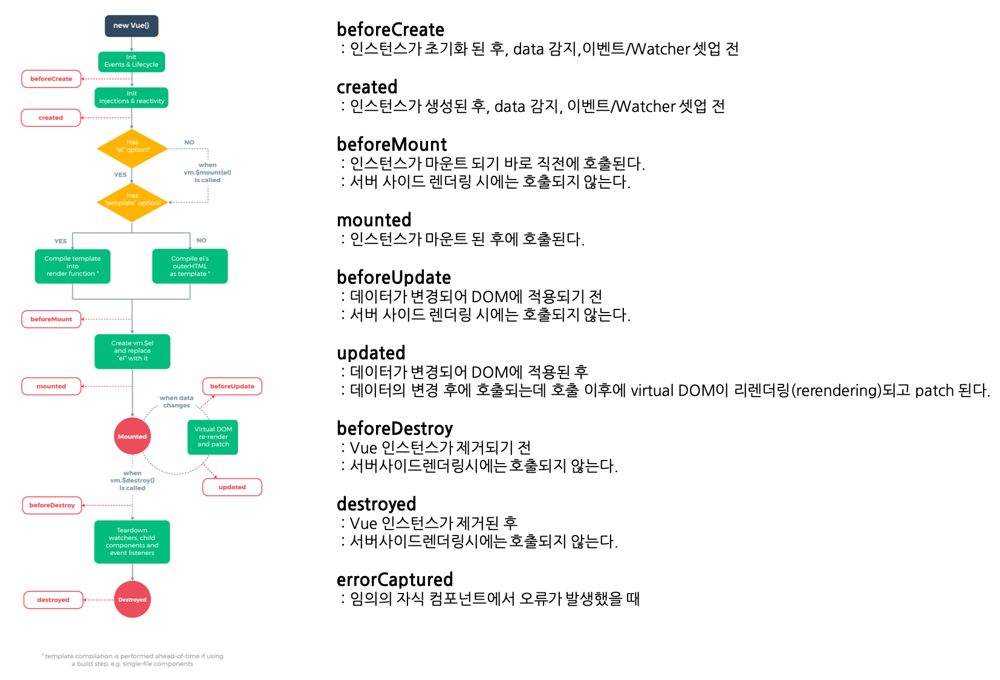

# Vue Life Cycle

Vue 의 라이프 사이클을 이해하려면 먼저 Vue 인스턴스를 구성하는 기본요소를 먼저 이해해야 한다. 라이프 사이클의 각 요소들 또한 각각에 대해 정리해보자.

- 참고자료 

  - Vue.js 공식 가이드 문서 (한국어 버전)

    - [Vuejs.org- 한국어](https://kr.vuejs.org/v2/guide/instance.html)

  - Vue.js 영문 (원문)
    - [https://vuejs.org/v2/api/#Options-Lifecycle-Hooks](https://vuejs.org/v2/api/#Options-Lifecycle-Hooks)


# 1. Vue 인스턴스

Vue 의 라이프 사이클을 이해하려면 먼저 Vue 인스턴스를 구성하는 기본요소를 먼저 이해해야 한다.

## Vue 인스턴스를 구성하는 대표 속성들

- el
- data
- computed
- methods

### el (마운트할 요소)

```javascript
new Vue({
	el: '#app'
})
```

### data (데이터)

```javascript
new Vue({
	el: '#app',
	data: {
		message: 'Hello'
	}
})
```

### computed 

data() 로 지정되는 것을 함수를 적용하여 함수로 계산되는 데이터라고 이해하면 수월하다.

```javascript
new Vue({
  el: '#app',
  computed: {
    computedMessage: function(){
      return this.message + '!'
    }
  }
})
```

### methods

컴포넌트 내에서 사용할 메서드들을 정의해두는 곳

```javascript
new Vue({
  el: '#app',
  methods: {
    hello: function(){
      console.log('hello~')
    }
  }
})
```


## Vue 인스턴스의 생성

Vue 앱은 보통 Vue 함수로 Vue 인스턴스를 새로 만드는 것으로 시작된다.

```javascript
var vm = new Vue({
	// 옵션
})
```

- vm 변수의 의미
  - 엄격하게는 MVVM패턴과 관련이 없다. 하지만 Vue 의 디자인은 부분적으로 MVVM에서 영감을 얻어 고안된 것이라고 한다.
  - 코딩 컨벤션으로 Vue 인스턴스를 참조할 때 변수명 **vm (View Model 의 약자)** 를 사용하는 편이다.

- Vue 의 옵션
  - Vue 인스턴스를 생성할 때에는 데이터, 템플릿, 마운트할 엘리먼트, 메서드, 라이프사이클 콜백 등의 옵션을 포함하는 options 객체를 전달해야 한다. 전체 옵션 목록은 [API Reference](https://kr.vuejs.org/v2/api/) 에서 찾을 수 있다.
- 컴포넌트 생성자
  - Vue 생성자는 미리 정의된 옵션으로 재사용 가능한 컴포넌트 생성자를 생성하도록 확장될 수 있다.
  - 즉, Vue 생성자에 특정 옵션들을 추가하여 컴포넌트를 생성할 수 있다.
  - Vue 인스턴스는 중첩시킬 수 있다. 그리고 재사용 가능하도록 구성할 수도 있다. 재사용 가능한 컴포넌트 트리로 구성할 수도 있다.
  - 컴포넌트에 대한 자세한 설명은 [참고자료](https://kr.vuejs.org/v2/guide/components.html) 에서 확인 가능하다.


## 예제) Vue 컴포넌트를 중첩해 구성하는 예 

Vuejs 제공 Todo 앱 의 컴포넌트 트리

```vue
Root Instance
└─ TodoList
   ├─ TodoItem
   │  ├─ DeleteTodoButton
   │  └─ EditTodoButton
   └─ TodoListFooter
      ├─ ClearTodosButton
      └─ TodoListStatistics
```

  

## 예제) Vue 컴포넌트 생성예제

Vue 인스턴스 생성자인 new Vue({...}) 구문에 컴포넌트를 생성하는 예) 

```vue
<template>
	<div id="app">
    <app-header :memoCount="memoCount"/>
    <memo-app @change="updateCount"/>
  </div>
</template>
<script>
  import AppHeader from './components/AppHeader';
  // ...
  
  export default {
    name: 'app',
    components:{
      AppHeader,
      MemoApp
    },
    data(){
      return {
        memoCount: 0,
      };
    },
    methods: {
      updateCount(count){
        this.memoCount = count;
      },
    }
  }
</script>
<style>
@import "./styles/reset.css";

#app{
  width: 560px;
  margin: 0 auto;
}
</style>
```


# 2. 라이프 사이클

참고자료

- [VueJs 공식 문서](https://kr.vuejs.org/images/lifecycle.png)

  

Vue 는 컴포넌트 기반으로 구성되어 있다. 각 컴포넌트에는 컴포넌트가 생성되는 시점, 제거되는 시점(ex. 페이지를 벗어나는 시점, 컴포넌트 제거 시점)마다 세부적인 여러가지 이벤트가 존재한다. 그리고 이 이벤트 들에 대한 핸들러를 사용자가 직접 구현하면 Vue.js가 Vue.js 엔진 내부의 리스너에서 해당 이벤트에 해당하는 시점에 이 핸들러를 실행해준다.  

각 이벤트 핸들러들은 라이프 사이클 훅이라고 부른다. 훅이라는 표현을 핸들러라는 표현보다 자주 사용하므로 기억해두어야 한다.  

## vue.js 라이프 사이클 Overview




## 라이프 사이클 크게 보기


  


## 주요 라이프사이클 훅들

자주 사용되는 라이프 사이클 훅 들이다. 

참고자료 : [Vue.js 공식문서(en)](https://vuejs.org/v2/api/#Options-Lifecycle-Hooks)


### beforeCreate

- 인스턴스가 초기화 된 후, data 감지(data observation), 이벤트/Watcher 의 셋업 전  

  동기적(synchronously)으로 발생한다.

- 원문

  - Called synchronously immediately after the instance has been initialized, before data observation and event/watcher setup.

### created

- 인스턴스가 생성된 후, data 감지(data observation), 이벤트/Watcher 셋업 전의 시점
- 인스턴스가 생성된 후 동기적으로 호출 되는데
- 이 시점에 인스턴스는 data observation, 이벤트/Watcher 의 callback 함수들, computed 속성, method 속성을 setup 작업을 마친 직후이다.
- 주의할 점은 아직 mounting 단계는 아직 시작하지 못한 단계이다.
- 원문
  - Called synchronously after the instance is created. At this stage, the  instance has finished processing the options which means the following  have been set up: data observation, computed properties, methods,  watch/event callbacks. However, the mounting phase has not been started, and the `$el` property will not be available yet.

### beforeMount

- 인스턴스가 마운트 되기 바로 직전에 호출된다.

- 이때 render 함수가 이제 막 최초로 호출되려 하는 시점이다.

- beforeMount 훅은 server-side rendering 시에는 호출되지 않는다.

- 원문

  - Called right before the mounting begins: the `render` function is about to be called for the first time.

    **This hook is not called during server-side rendering.**

### mounted

- 인스턴스가 마운트된 후에 호출된다.

- el 태그가 새로 생성된 vm.$el 태그로 교체된다.

- 루트 인스턴스가 다큐먼트 내부 엘리먼트로 마운트될때, vm.$el 역시 mounted 훅 발생시점에 다큐먼트 내부 앨리먼트가 된다.

- mounted는 자식 컴포넌트들이 마운트되었는지를 보장하지 않는다. 자식 컴포넌트등 의 모든 view 들이 render 되기 전까지 기다리려고 한다면, vm.$nextTick을 mounted 내에 작성하면 된다.

- 원문

  - Called after the instance has been mounted, where `el` is replaced by the newly created `vm.$el`. If the root instance is mounted to an in-document element, `vm.$el` will also be in-document when `mounted` is called.

    Note that `mounted` does **not** guarantee  that all child components have also been mounted. If you want to wait  until the entire view has been rendered, you can use [vm.$nextTick](https://vuejs.org/v2/api/#vm-nextTick) inside of `mounted`:

- 예제)

  - ```vue
    mounted: function () {
      this.$nextTick(function () {
        // Code that will run only after the
        // entire view has been rendered
      })
    }
    ```

  

### beforeUpdate

- 데이터가 변경되어 DOM에 적용되기 전의 시점

- server side rendering 에서는 호출되지 않는 훅이다. 

- 원문

  - Called when data changes, before the DOM is patched. This is a good  place to access the existing DOM before an update, e.g. to remove  manually added event listeners.

    **This hook is not called during server-side rendering, because only the initial render is performed server-side.**

### updated

- 데이터가 변경되어 DOM에 적용된 후의 시점

- 데이터의 변경 후에 호출되는데, 호출 이후에 virtual DOM이 리렌더링(re-render)되고 patch 된다.

- 자식 컴포넌트 들이 re-render 되었는지를 보장하지 않는다. 자식 컴포넌트 등의 모든 view 들이 render 되기 전까지 기다려야 한다면, vm.$nextTick을 mounted 내에 작성하면 된다.

- 원문

  - Called after a data change causes the virtual DOM to be re-rendered and patched.

    The component’s DOM will have been updated when this hook is called,  so you can perform DOM-dependent operations here. However, in most cases you should avoid changing state inside the hook. To react to state  changes, it’s usually better to use a [computed property](https://vuejs.org/v2/api/#computed) or [watcher](https://vuejs.org/v2/api/#watch) instead.

    Note that `updated` does **not** guarantee  that all child components have also been re-rendered. If you want to  wait until the entire view has been re-rendered, you can use [vm.$nextTick](https://vuejs.org/v2/api/#vm-nextTick) inside of `updated`:

- 예제)

  - ```vue
    updated: function () {
      this.$nextTick(function () {
        // Code that will run only after the
        // entire view has been re-rendered
      })
    }
    ```

  

### beforeDestroy

- Vue 인스턴스가 제거되기 전의 시점

- 서버사이드 렌더링시에 beforeDestory 훅은 호출되지 않는다.

- 원문)

  - Called right before a Vue instance is destroyed. At this stage the instance is still fully functional.

    **This hook is not called during server-side rendering.**

  

### destroyed

- Vue 인스턴스가 제거된 후의 시점
- destroyed 훅은 서버사이드렌더링시에 호출되지 않는다.

  

### errorCaptured

- 임의의 자식 컴포넌트에서 오류가 발생했을 때 발생

글로 이해하는 것보다는 라이프 사이클을 그림으로 이해하는 것이 훨씬 이해가 빠르다. 위에서 정리한 라이프 사이클 다이어그램을 참고하자.  