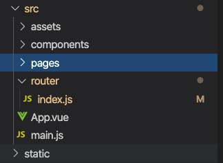
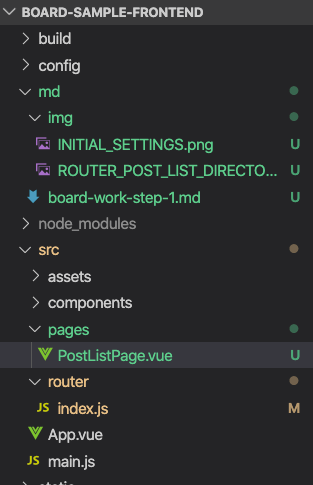

# 작업내역 정리
# 세팅
- 주의할 점으로는 여기서는 router를 사용하도록 프로젝트를 구성했다는 점이다.. 유의하자.
  

# Vue Router
src/router/index.js로 이동하여 모든 내용을 지우고 아래의 내용으로 덮어쓰자

```javascript
import Vue from 'vue'
import Router from 'vue-router'
// Vue CLI로 프로젝트 생성시 자동으로 생성된 컴포넌트 지워도 된다.
// import HelloWorld from '@/components/HelloWorld'

Vue.use(Router)

export default new Router({
  routes: [
    {
      path: '/',
      name: 'PostListPage',
      component: null
    },
    // Vue CLI 가 생성해준 예제 라우트 삭제
    // {
    //   path: '/',
    //   name: 'HelloWorld',
    //   component: HelloWorld
    // }
  ]
})
```
아직은 component에 컴포넌트를 등록하지 않았기 때문에 http://localhost:8080 으로 접속해도 빈 페이지만 나타난다.  

# 라우터 코딩 (1)::포스트 리스팅 페이지 컴포넌트 연결
## 디렉터리 구조 잡기 (게시판 페이징 기능 디렉터리 생성)
src 디렉터리 밑에 pages 디렉터리를 생성하자.


## 게시판 컴포넌트 생성
생성된 src/pages 디렉터리 밑에 PostListPage.vue 라는 이름의 파일을 생성하자.


## 게시판 컴포넌트 작성
```html
<template>
    <div class="post-list-page">
        <h1>포스트 게시글</h1>
        <div>
            <table>
                <colgroup>
                    <col style="width: 10%;"/>
                    <col style="width: 60%;"/>
                    <col style="width: 10%;"/>
                    <col style="width: 20%;"/>
                </colgroup>
                <thead>
                    <tr>
                        <th scope="col">번호</th>
                        <th scope="col">제목</th>
                        <th scope="col">작성자</th>
                        <th scope="col">작성일</th>
                    </tr>
                </thead>
                <tbody>
                    <tr>
                        <td scope="col">1</td>
                        <td scope="col">게시글의 제목이 노출됩니다.[2]</td>
                        <td scope="col">홍길동</td>
                        <td scope="col">2020-04-16 10:58</td>
                    </tr>
                </tbody>
            </table>
        </div>
    </div>
</template>

<script>
export default {
    name: 'PostListPage',
}
</script>
```

## 게시판 컴포넌트를 라우터에 연결
