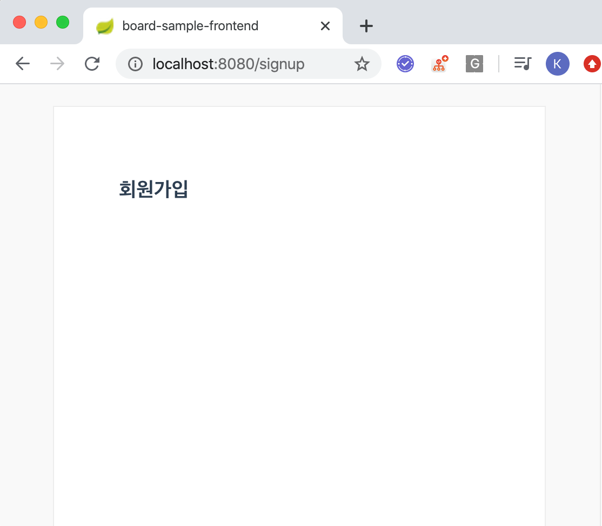
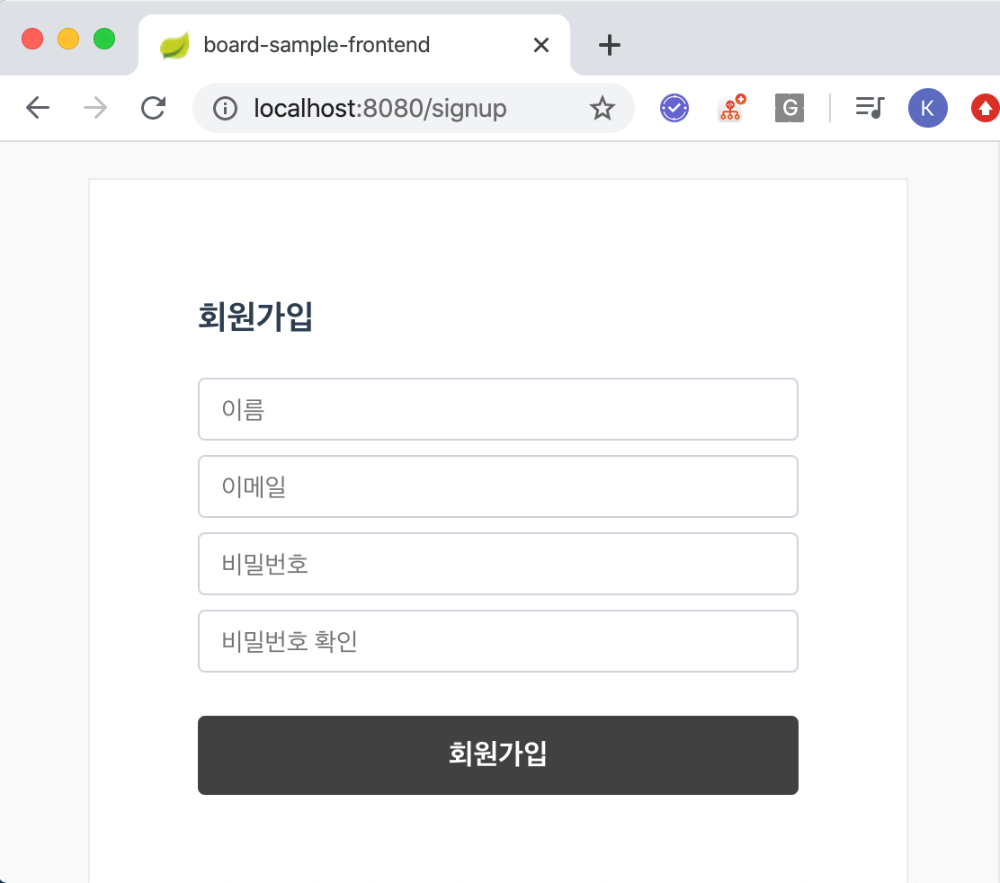

# 작업과정 정리 (회원가입, 로그인,인증(JWT))
# 샘플 REST API 서버 설치
여기서는 Vue.js Front End 앱에서 
- 회원가입
- 로그인,인증 (JWT)
만을 정리하려고 한다.  
  
작업 내용을 따라하기에 앞서 예제 REST API 서버를 세팅하자. 서버 로직도 여기서 정리하기에는 장황하다. 미리 준비된 API 서버를 활용하자.
  
> 주의할 점은 nodejs 8.x 버전이 설치되어 있어야 한다. 현재 시점으로 nodejs 의 최신 버전은 12.x이다.  
> .pkg 나 .exe .msi를 활용해서 설치하는 방식 말고 .tar.gz, zip 파일로 특정 디렉터리에 해당 패키지를 위치시키고 [노드디렉터리]/bin을 운영체제의 환경변수로 등록하는 방식으로 설치하자.  
> 이렇게 해야 원할때마다 개발 PC OS의 node 버전을 바꿔가며 테스트를 할 수 있기 때문이다.
> 이렇게 커스텀환경설정 과정은 여기서는 정리하지 않는다.  
  
참고)  
- nodejs previos version download
    - [Node.js Previous Releases](https://nodejs.org/en/download/releases/)

```bash
$ git clone https://github.com/CanDoVueJS/RESTful-api-server.git

$ cd RESTful-api-server

$ npm install

# Sequelize CLI를 전역으로 설치
$ npm install -g sequelize-cli

$ npm run dev
```

# 회원가입 페이지 구현
## Signup 컴포넌트
### Signup 컴포넌트 작성
src/pages 밑에 Signup.vue 컴포넌트를 작성한다.  
**src/pages/Signup.vue**  
```html
<template>
    <div class="sign-up-page">
        <h3>회원가입</h3>
    </div>
</template>
<script>
export default {
    name: 'Signup',
}
</script>
```
### 라우터 연동
src/router/index.js 파일 내에 "/signup" 라우트, Path에 Signup 컴포넌트를 등록한다.  
**src/router/index.js**  
```javascript
import Vue from 'vue'
import Router from 'vue-router'

// ...

// Signup 컴포넌트 import
import Signup from '@/pages/Signup';

export default new Router({
    mode: 'history',
    routes: [
        // ...
        {
            path: '/signup',
            name: 'Signup',
            component: Signup,
        }
    ]
})
```
http://localhost:8080/signup 으로 접속해보자


## SignupForm 컴포넌트
SignupForm 컴포넌트는 Signup 컴포넌트의 자식 컴포넌트이다.  
### SignupForm 컴포넌트 작성
```html
<template>
    <form novalidate>
        <fieldset>
            <input type="text" v-model="name" placeholder="이름"/>
            <input type="email" v-model="email" placeholder="이메일"/>
            <input type="password" v-model="password" placeholder="비밀번호"/>
            <input type="password" v-model="passwordConfirm" placeholder="비밀번호 확인"/>
            <button type="submit"> 회원가입 </button>
        </fieldset>
    </form>
</template>

<script>
export default {
    name: 'SignupForm',
    data(){
        return {
            name: '',
            email: '',
            password: '',
            passwordConfirm: ''
        }
    }
}
</script>
```
### Signup 컴포넌트 내에 연동
이제 SignupForm 컴포넌트를 Signup 컴포넌트 내에 연동해보자.  
```html
<template>
    <div class="sign-up-page">
        <h3>회원가입</h3>
        <signup-form/>
    </div>
</template>
<script>
import SignupForm from '@/components/SignupForm'

export default {
    name: 'Signup',
    components:{
        SignupForm
    }
}
</script>
```
**결과화면**  
  

### submit 이벤트 연결
#### 참고) axios 커스텀 설정
> **참고)**  
> axios 관련 설정은 setting-axios-simple.md 를 확인하고 설정하자.  


