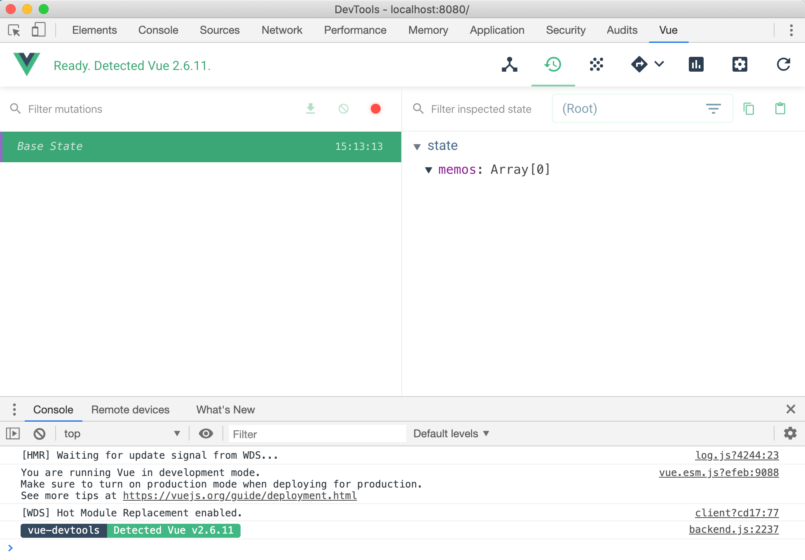

# 작업과정 정리 ... (vuex, axios 커스터마이징)

# 1. vuex 설치 및 초기 설정
## vuex (npm 패키지) 설치
```bash
$ npm install vuex --save
```

## store 컴포넌트 생성
store를 컴포넌트라고 해야 할지 모르겠지만, 일단은 컴포넌트라고 지칭하고 해보자...  
작업 순서를 글로 정리해보면 아래와 같다.
- src/ 밑에 'store'디렉터리를 생성한다.
- src/store 디렉터리 밑에 
    - actions.js
    - getters.js
    - index.js
    - mutations.js
    - states.js
를 생성한다.  

## index.js 
src/store/index.js 파일 내에는 아래의 코드를 입력하자. index.js 는 store 라는 디렉터리의 진입점이다.
### index.js  
**src/store/index.js**  
```javascript
// vue, vuex import 
import Vue from 'vue';
import Vuex from 'vuex';

/**
 * 우리가 생성한 store 디렉터리내의 
 * - state.js
 * - getters.js
 * - mutations.js
 * - actions.js
 * 들을 import 하고 있다. 
 * 
 * 각각 .js를 붙이는 것이 보기 싫다면 해당 이름으로 디렉터리를 만들고
 * 디렉터리명/index.js를 만들면 된다... 
 * 연습용 예제에 이렇게 까지 복잡하게 초반에 할 필요는 없으므로... skip
 */
import state from './state.js';
import getters from './getters.js';
import mutations from './mutations.js';
import actions from './actions.js';

Vue.use(Vuex); // Vue 가 Vuex를 사용하도록 선언한다. 

// Vuex.Store({...}) 찾아보자 ㅠㅜ
export default new Vuex.Store({
    state,
    getters,
    mutations,
    actions
});
```
### 코딩 컨벤션
**참고) index.js (코딩컨벤션)**  
예를 들어 src/main.js 안에서 위와 같이 
```javascript
// ...
import store from './store';
// ...
```
와 같이 선언하면 이것은 ./store 디렉터리의 index.js 를 기반으로 모듈을 store라는 이름으로 import 하겠다는 의미이다. 쉽게 설명하면, './store' 까지만 적어주면 ./store 디렉터리의 index.js 파일을 찾아서 import 한다.  

## vue 개발자 도구 확인
  

# 2. vuex에 데이터 저장 & 데이터 표현

## 상태 정의 - src/store/states.js
스토어의 상태로 memos 라는 이름의 배열을 등록한다. redux는 상태(state)관리 도구다. 잊지 말자. 아래의 코드를 추가함으로써 우리가 관리해야 하는 상태는 memos 라는 객체 타입의 베열이다.  

### states.js
```javascript
export default{
    memos: []
}
```
### Vue.js 개발자 도구 확인


## 액션 정의 - src/store/actions.js
states.js 내에서 memos 라는 배열을 상태로 지정했다. 즉, 데이터를 저장하고 있을 스토어가 생성되었다. 상태를 정의했으므로 이제 액션을 정의해보자.  
  
데이터를 가져온 후 가져온 데이터에 대해서 commit을 해야한다. commit을 한다는 것은 mutation에 커밋을 한다는 것이다. 아래 예제를 보자.

### actions.js
```javascript
export function fetchMemos ({commit}){
    // 아래 부분은 추후 axios 사용 로직으로 정리할 예정. 일단은 localStorage로 고고싱...
    const memos = localStorage.memos ? JSON.parse(localStorage.memos) : [];
    commit('FETCH_MEMOS', memos);
}

export default{
    fetchMemos
}
```
예제에서는 
```javascript
export function fetchMemos({commit}){
    // ...
    commit('FETCH_MEMOS', memos);
}
```
와 같이 'FETCH_MEMOS'라는 이름으로 Mutation 에 커밋을 하고 있다.  
이제 Mutation에 FETCH_MEMOS 에 대응하는 함수를 만들어보자.

## Mutation(변이) 정의 - src/store/mutations.js
위에서 작성한 actions.js 에서 
> commit('FETCH_MEMOS', memos);
로 커밋한 'FETCH_MEMOS'에 대응하는 함수를 작성한다.  
정리하자면  
- actions.js 에서는
    - "이벤트명" 으로 커밋(commit)을 한다.
- mutations.js 에서는
    - "이벤트명" 에 대응하는 함수를 정의한다.
    - state에서 잡고있는(바인딩하고 있는) 변수에 접근한다.
    
- 이 "이벤트명"은 변이(Mutation)에 대해 이름을 지은것이다.
- 즉, "이벤트명"이라고 하기보다는 "변이명"이라고 하는게 맞는데, 여기서는 처음부터 다시 공부하는 경우 "변이명" 이런식으로 정리하면 어렵게 다가올 것 같아 그냥 "이벤트명"이라고 이름지었다. 
- 아래에서부터는 "Mutation 명" 또는 "Mutation 의 이름"이라고 부를 예정이다. 
  
```javascript
const FETCH_MEMOS = 'FETCH_MEMOS';

export default {
    [FETCH_MEMOS] (state, payload){
        state.memos = payload;
    },
}
```

> **참고)**  
> 위에서 Mutation의 이름을 'FETCH_MEMOS' 라고 이름을 지었다. 이 'FETCH_MEMOS'를 상수로 선언 후에 사용했는데, 이렇게 사용하는 것은 Flux 패턴에서 Mutation 명 (변이의 이름)을 상수로 선언하는 것이 일반적인 방법(코딩 컨벤션)이기 때문이다.

## 액션으로 변이를 일으켜보자 (1)::MemoApp 에서 fetchMemos 액션 호출
MemoApp 컴포넌트 내의 첫 로딩시 memos 라고 이름을 지은 배열 형태의 데이터를 불러와야 한다. 여기서는 fetchMemos 액션으로 컴포넌트가 사용할 초기 데이터를 세팅하는 역할을 작성한다.  
### MemoApp.vue 전체 코드
```javascript
// ...
import {mapActions, mapState} from 'vuex';

export default {
    name: 'MemoApp',
    components:{
        MemoForm,
        Memo,
    },
    /** 
    data(){
        return {
            memos: [],
        };
    },
    */
    created(){
        this.fetchMemos();
    },
    computed: {
        ...mapState([
            'memos'
        ])
    },
    methods: {
        ...mapActions([
            'fetchMemos'
        ]),
        // ...
    }
}
```
  
### 1) actions 에 정의한 액션 함수를 MemoApp 컴포넌트(MemoApp.vue)에 등록
먼저 actions.js 내에 등록한 fetchMemos()를 MemoApp 컴포넌트(MemoApp.vue)안으로 가져와야 하는데 이와 같은 역할을 하는 구문은 아래와 같다. 이 코드가 없으면 fetchMemos 함수를 찾을 수 없다는 에러를 낸다.  
  
> 참고) 에러 문구  
> TypeError: this.fetchMemos is not a function  
  
```javascript
import {mapActions} 'vuex';
// ...
export default {
    // ...
    methods: {
        ...mapActions([
            'fetchMemos'
        ]),
        // ...
    }
}
```
mapActions는 헬퍼함수이다. actions 내의 fetchMemos 함수를 **매핑**해주는 역할을 한다. 즉, mapActions()로 fetchMemos () 함수를 methods 내에 꼭 등록해주어야 한다.  

### 2) MemoApp 컴포넌트 초기화 시 데이터 로딩 액션 트리거
MemoApp 컴포넌트가 생성되는 시점에 fetchMemos() 함수를 호출해 'FETCH_MEMOS'라는 이름의 Mutation(변이)를 일으켜야 한다.  
  
```javascript
export default {
    // ...
    created(){
        this.fetchMemos();
    }
}
```
주의할 점은 **"1) actions 에 정의한 액션 함수를 MemoApp 컴포넌트(MemoApp.vue)에 등록"** 에서 언급했듯이, mapActions를 이용해 fetchMemos() 액션 함수를 매핑해서 MemoApp 컴포넌트 안에 메서드로 등록해주어야 한다.
  
### 3) MemoApp 컴포넌트의 memos 데이터 교체
MemoApp 컴포넌트의 memos 데이터를 교체하는 과정이다.  
- 기존의 data(){...} 영역을 지우고  
- computed : {...mapState(['memos'])} 를 추가해준다.  
  
설명은 나중에 정리...  
```javascript
import {mapActions, mapState} from 'vuex';

export default {
    name: 'MemoApp',
    components:{
        MemoForm,
        Memo,
    },
    // ...
    /** 
    data(){
        return {
            memos: [],
        };
    },
    */
    computed: {
        ...mapState([
            'memos'
        ])
    }
}
```
  
### 액션 호출 구문 (나중에 정리...)
```javascript
// ...
import {mapActions, mapState} from 'vuex';

export default {
    name: 'MemoApp',
    components:{
        MemoForm,
        Memo,
    },
    // ... 
    // 컴포넌트 생성시 fetchMemos 함수를 호출한다.
    created(){
        this.fetchMemos();
    },
    // ...
    // mapActions 헬퍼 함수에 actions 내의 fetchMemos 함수를 주입한다.
    // mapActions는 actions 내의 fetchMemos 함수를 매핑해주는 역할을 한다.
    // 이 코드가 없으면
    methods: {
        ...mapActions([
            'fetchMemos'
        ]),
        // ...
    }
}
```

## 액션으로 변이를 일으켜보자 (2)::메모 데이터 생성 기능
