# 인스턴스 생성

# 참고자료‌

Amazon Elasticsearch Service 대시보드

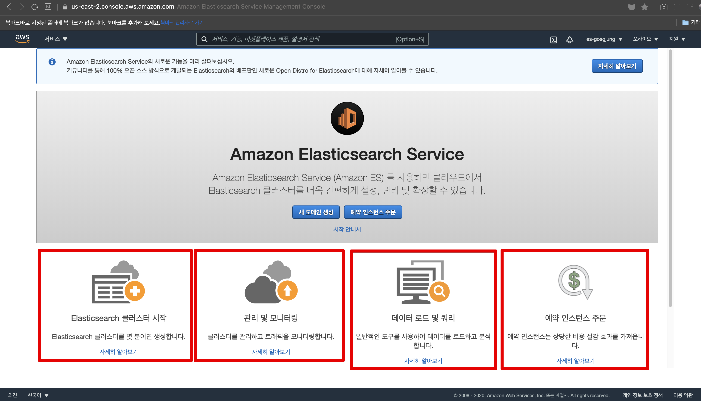‌

  

- Elasticsearch 클러스터 시작
  - https://docs.aws.amazon.com/elasticsearch-service/latest/developerguide/es-createupdatedomains.html
- 관리 및 모니터링
  - https://docs.aws.amazon.com/elasticsearch-service/latest/developerguide/es-createupdatedomains.html
- 데이터 로드 및 쿼리
  - https://docs.aws.amazon.com/elasticsearch-service/latest/developerguide/what-is-amazon-elasticsearch-service.html
- 예약 인스턴스 주문
  - https://docs.aws.amazon.com/elasticsearch-service/latest/developerguide/aes-ri.html

# 도메인 생성

> 지정된 용량을 넘어서게 되어 비용이 지불되는 것을 초반에 겪고 싶지는 않아서 예약 인스턴스 형태로 시작하고 싶었으나... 새 도메인 생성 에서만 프리티어인 t3.small.elasticsearch 를 사용가능했다. 유료 버전 급인 t3.medium 급부터 예약인스턴스 생성 기능이 지원되는 듯 해보였다.  

AWS Management Console 접속 > Elasticsearch Service 검색  

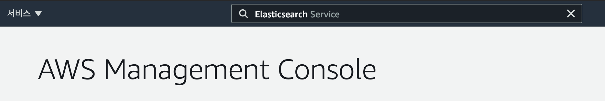

## 새 도메인 생성 

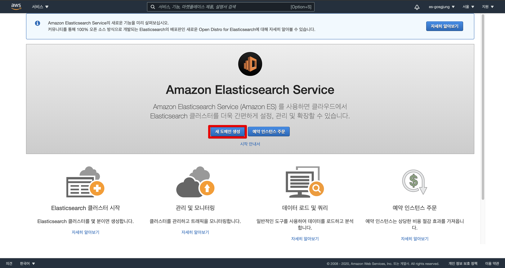

‌

## 참고 1) 예약 인스턴스 주문 ‌

비용을 줄일 수 있을 것 같아 t3.small.elasticsearch 를 예약인스턴스로 시작하려고 했는데, 예약 인스턴스 주문에서는 t3.medium.elasticsearch 만을 선택할 수 있다. 이런 이유로 예약 인스턴스 주문 기능을 사용하지 않고 그냥 새 도메인 생성 버튼을 눌러서 ES 인스턴스를 생성했다.  

   

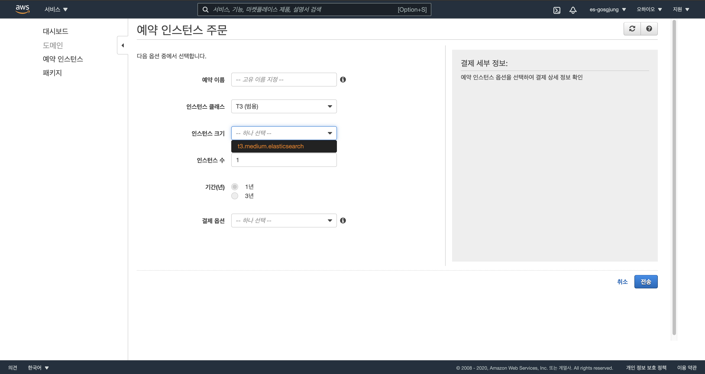

‌

## 참고 2) 각 인스턴스 클래스의 의미

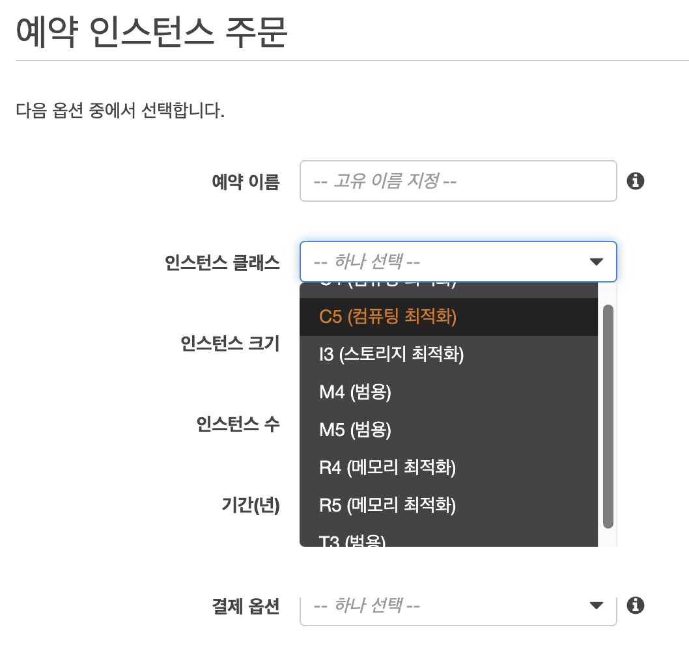

## Step 1: 배포유형 선택

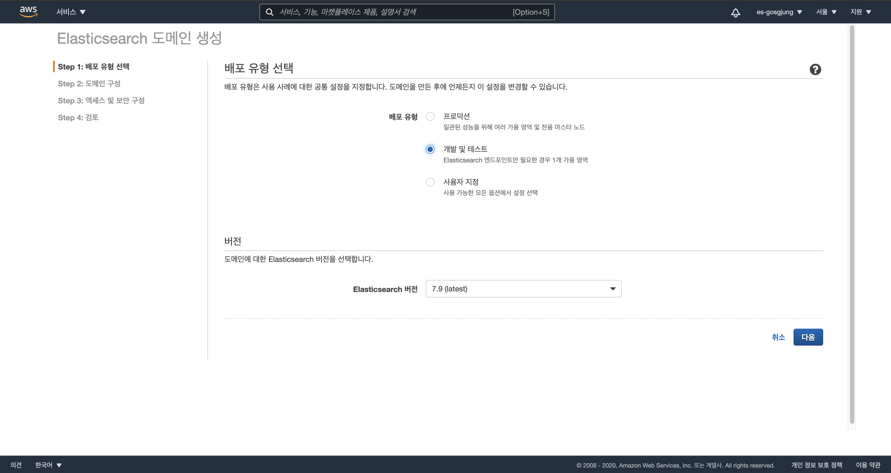

## Step 2: 도메인 구성‌

- Elasticsearch 도메인 이름
  - public 으로 열어놓을 예정이기에 es-lognomy-pub 으로 이름지어주었다.
  - private 인터넷으로 두어 ALB를 통해서만 요청을 받도록 해줄 수도 있는데... 나중에 한번 이렇게 구성하는 과정을 정리해볼 예정이다.
- 데이터 노드
  - 인스턴스 유형으로 t3.small.elasticsearch 를 선택했다.
  - 현재 시점으로 선택할 수 있는 프리티어 규격은 t3.small.elasticsearch 이다.

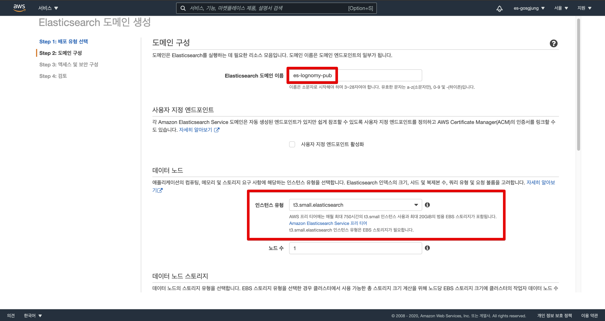

  

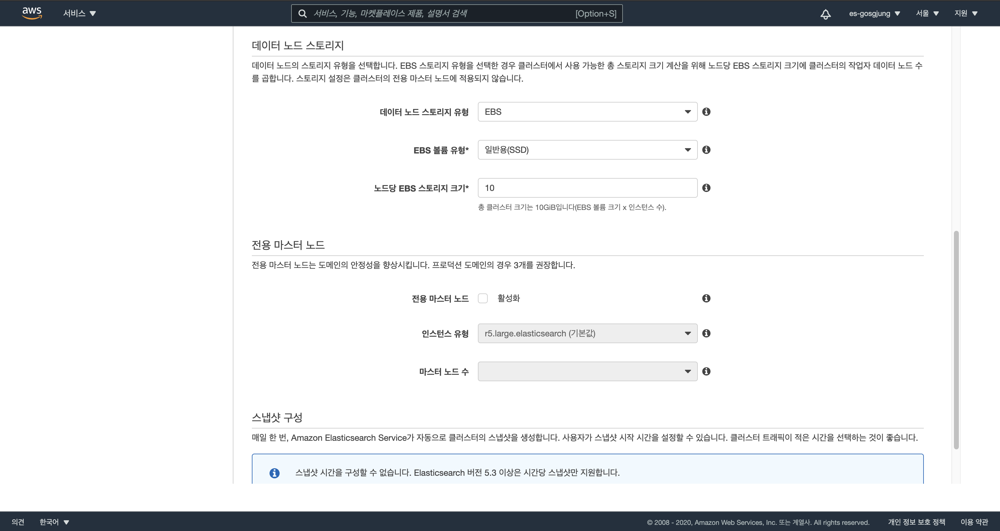

  

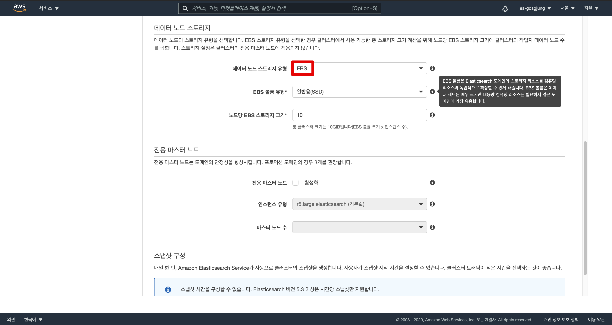

‌

스냅샷 구성 항목이 있는데, 5.3 이상 버전부터는 사용할 수 없다는 이야기. 다음 버튼 클릭.

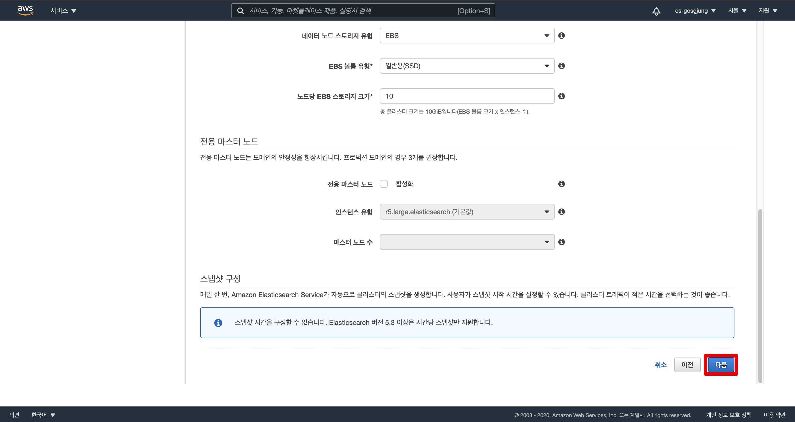

  ‌

## Step 3: 엑세스 및 보안 구성

> VPC, Subnet 구성 화면이다. 

네트워크 액세스는 아래의 두가지 방식으로 지정가능한데, 오늘 정리하는 문서에서는 아래의 두가지 방식 중에서 **퍼블릭 액세스 방식**을 선택했다.  

- VPC 액세스 (권장)  
  - 추후 적용 예정이다.  
  - (네트워크 구성도와 Available Zone 등을 직접 설정하고 Private IP 대역등을 Subnet 등을 통해 지정하는 등의 작업등이 필요하다. 직접 그림을 그려서 문서로 남겨놓아야 하는데, 지금 당장은 약식으로 인스턴스를 만드는 작업만을 수행할 예정이다.)  
- **퍼블릭 액세스**
  - 퍼블릭 액세스로 열어놓고 어디서든 접속할 수 있도록 하는 설정이다.  

네트워크 구성 > 퍼블릭 액세스 선택 

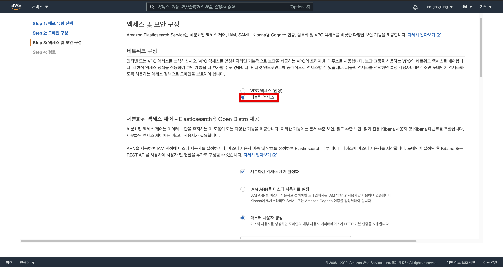

세분화된 액세스 제어  

마스터 사용자 계정을 추가하는 것으로 세분화된 액세스 제어를 약식으로 해결하였다. (IAM 그룹을 생성해서 Elastic Search 내에서 공용으로 쓰일 수 있도록 특별한 설정을 추가할 수도 있기는 하다. 초반부터 너무 많이 설정하느라 이것저것 고민하기 귀찮아서 일단은 마스터 사용자로 추가해두었다.)  

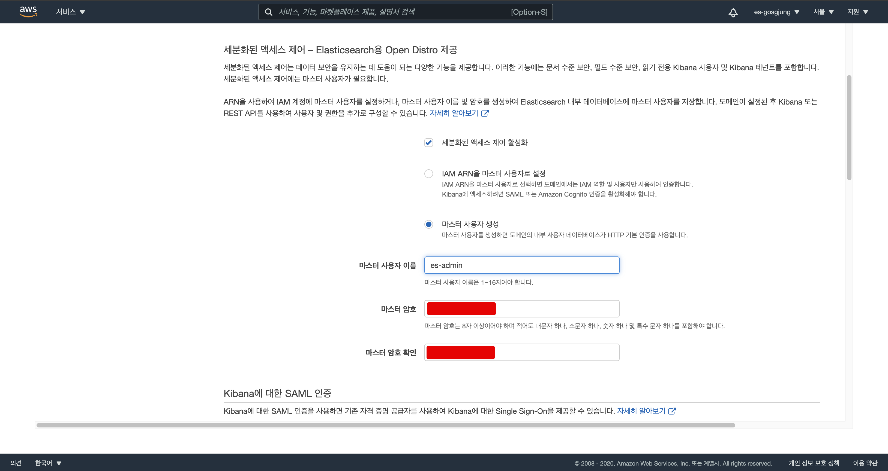

  ‌

- Kibana 에 대한 SAML 인증
  - 아직은 Kibana 에 대해 SAML 인증을 열어두는게 뭔지 모른다. IAM 사용자 그룹을 사용할 경우에 지정하는 것으로 보이긴 하는데... 그냥 무시하고 넘어갔다.
- 액세스 정책 
  - 여기서는 그냥 **도메인에 대한 개방 엑세스 허용** 을 선택했다.
  - 관리 페이지에서 정책을 추가하자.
  - 사용자가 지정한 도메인만 허용하도록 설정할 수도 있고, JSON 기반으로 도메인 액세스 정책을 지정할 수도 있다. 10개 이상의 목록이 있다면 JSON 정의 액세스 정책을 사용해보는 것도 나을 듯하다.
  - 참고 : JSON 기반 도메인 액세스 정책 
    - [IAM JSON 정책 언어의 문법 - docs.aws.amazon.com](https://docs.aws.amazon.com/ko_kr/IAM/latest/UserGuide/reference_policies_grammar.html)  

  

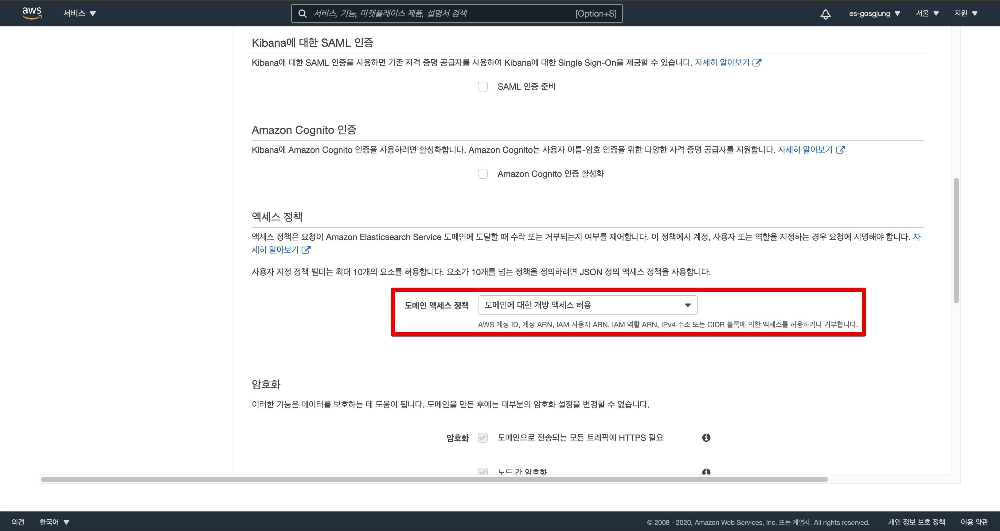

‌

다음 버튼 클릭

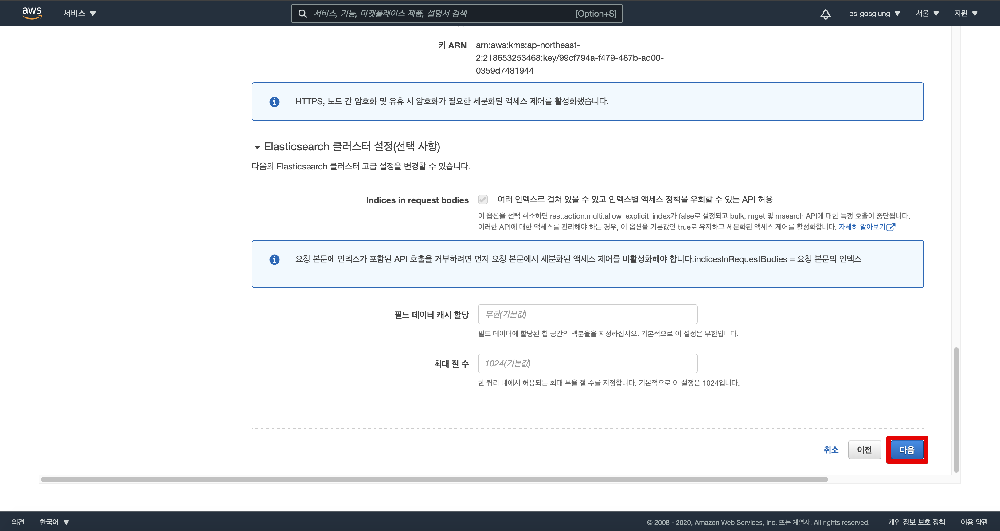

‌

## Step 4: 검토‌

제대로 추가된 것인지 검토를 해보고 확인 버튼을 눌러 인스턴스 생성과정을 마무리 짓자.

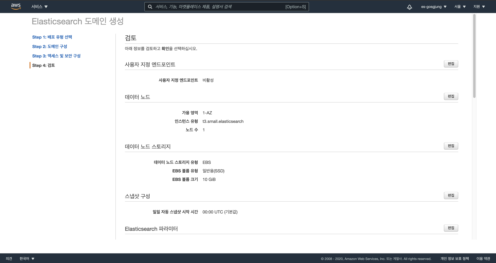

‌

설치 중인 모습

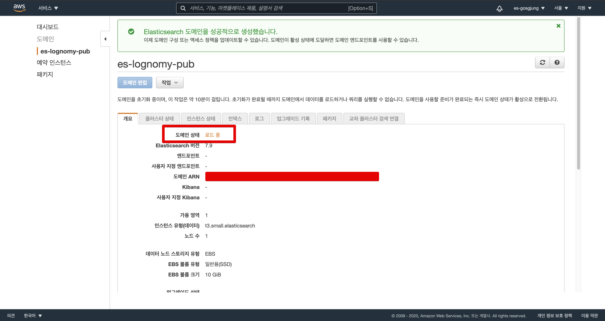

‌

Amazon Elasticsearch Service 대시보드

Enter a caption for this image (optional)