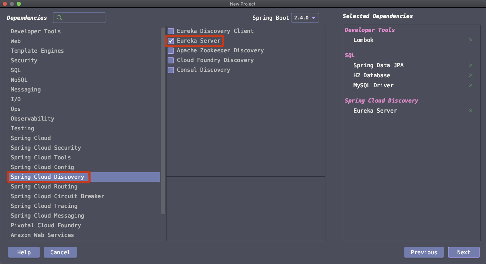
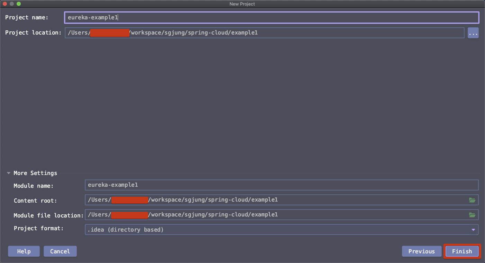
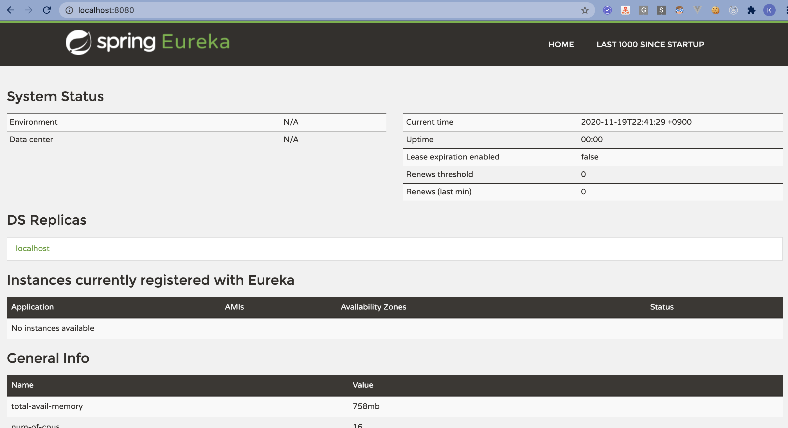

# 서비스 레지스트리

> Feign, CircuitBreaker 등에 관련된 설정을 할 때 netflix ribbon, eureka 관련된 용어를 애플리케이션 로그에서 자주 확인했었다. resilience4j 기반의 설정을 하는데 왜 netflix가? 하면서 무슨 뜻인지 모르고 잘 동작하게끔 다른 방식으로 설정했었다. 오늘인 이 eureka 에 대해서 정리하려 한다.

스프링 넷플릭스는 스프링 클라우드 내에 존재하는 프로젝트 중의 하나이다. 스프링 넷플릭스는 다수의 컴포넌트를 제공하는데... 오늘 정리할 내용은 유레카이다.


유레카의 개념을 처음 접했을 때 든 느낌은 인공위성이었다. 인공위성을 10대 쏘아올렸다고 해보면, 그중 한기가 고장나면 다른 기기 중 하나를 찾아서 통신을 하고 또 다른 한기가 고장나면 나머지 기기중의 하나로 통신을 하고... 그런 과정이 있을 것이다. 그런 과정들이 떠올랐던 것 같다.  


# 유레카의 개념

## 유레카 란?

마이크로 서비스가 서로를 찾을 때 사용되는 서비스 레지스트리이다. <u>유레카</u>는 마이크로 서비스 애플리케이션내의 모든 서비스의 중앙 집중 레지스트리로 작동한다.  ‌

유레카 자체도 마이크로 서비스로 간주될 수 있다. 조금 더 큰 애플리케이션에서 서로 다른 서비스들이 서로를 찾을 때 도움을 주는 역할을 한다. 각각의 다른 서비스들이 서로를 찾으려면 유레카 서비스 레지스트리에 각각 자기자신의 서비스를 등록해야 한다. 다른 서비스가 유레카 서비스 레지스트리를 조회해서 인스턴스를 찾아서 사용할 수 있다.  


other service 가 some service 를 찾아야 하는 경우가 있다. 이 경우 some service 의 호스트 이름, 포트 정보를 other-service 내에 하드코딩으로 지정해서 찾는 것이 아니라 Eureka (유레카)를 조회해서 찾아낸다.  

  

## 로드밸런싱, 리본(Ribbon)

> Netflix Ribbon 은 클라이언트 측에서 로드밸런싱 적용시 사용하는 라이브러리이다.

이때 some service가 인스턴스 하나로만 돌아가는 것이 아니라 다중화가 되어 있다면 other service가 레지스트리 조회시 같은 인스턴스만 선택하지 않도록 하기 위해 로드밸런싱 정책을 사용하게 된다. 이때 사용되는 것이 스프링 넷플릭스 프로젝트의 ribbon 이다.  

리본은 other-service 를 대신해 some-service 인스턴스를 선택하는 클라이언트 측의 로드밸런서이다. other-service는 리본이 선택해준 인스턴스에 필요한 요청을 하면 된다.  

  

# 클라이언트 측의 로드밸런서란?

추후 정리할 예정이다. 요점 정리가 잘 되지 않아서... 다음주에 정리하기로 계획을 미뤘다.

  

# 유레카 서버 생성하기

## 의존성 추가 (프로젝트 생성시)

> 초기 프로젝트 추가시 의존성을 설정하는 방식에 대해 정리했다. 쓰잘데 없어서 지울까도 고민했지만, 일단 추가해두었다. 

  

**Spring Initializr 선택 > Next 버튼 클릭**


  

- Group : io.study
- Artifact: eureka-example1
- Next


  

**spring-cloud 검색 > Eureka Server 선택** ‌ 


또는 아래와 같이 찾아서 추가하는 것 역시 가능하다.  

**Spring Cloud Discovery > Eureka Server**




이 외에도 몇 가지 잡동사니 의존성들을 추가해줬는데, 그 의존성 들은 아래와 같다.

- Lombok
- Spring Data JPA
- H2 Database
- MySQL Driver


프로젝트 명 지정




## 의존성 추가 (유지보수시)

> 프로젝트 추가화면이 아닌, 기존 프로젝트에 의존성을 추가하는 경우에 대해 정리했다. Gradle 기반으로 추가하는 것 역시 가능하다. 전반적인 Spring Cloud  의존성 설정에 대한 내용들은 https://spring.io/projects/spring-cloud#overview 에서 확인가능하다.

Spring Cloud 는 Spring Boot 와는 버전명이 다르기 때문에 Spring Cloud 버전을 어디서 찾아서 하는지 굉장히 난감할 때가 있을 수 있다. 나의 경우는 처음부터 고생해서 삽질하는 것 보다는 처음부터 스프링 부트 스타터로 샘플을 만들어보고 만들어진 의존성을 보고나서 기록으로 남겨놓는 것이 낫겠다고 판단해서 기록중이다.   

(왜냐하면... 스프링 부트 패키지들은 대부분 스프링 개발팀이 당사 제품에 대한 내부 개발 문서를 보고 어느 정도는 의존성 버전 들을 옵티멀하게 맞춰놓은 면이 있겠다는 추측이 들어서이다.)  

**참고**

- Spring Cloud - Overview
  - https://spring.io/projects/spring-cloud#overview
- Spring Cloud - LEARN
  - https://spring.io/projects/spring-cloud#learn
- Spring Cloud - SAMPLES
  - https://spring.io/projects/spring-cloud#samples

**개발환경 : Spring Boot 2.4.0**

- 실무에서는 Spring Framework 기반으로 설정을 하는 경우가 많다.(이미 운영되고 있는 프레임워크가 Spring Framework 기반인 경우가 많기 때문에)
- 순수 Spring 계열 의존성으로만 세팅하는 것도 나중에 따로 정리해 볼 계획이다.

**Spring-Cloud 버전** 

- 2020.0.0-SNAPSHOT
- 버전명은 https://spring.io/projects/spring-cloud#learn 에서 확인 가능하다.
- 책에서는 HoxtonSR3 를 사용하고 있고, 현재시점의 GA 버전은 Hoxton 계열의 Hoxton.SR9, Greenwich 계열의 Greenwich.SR6 이다. 어떤 것을 사용하든 자유이다.


```xml
<project>

  <!-- spring-cloud.version 
  <properties>
    <java.version>1.8</java.version>
    <spring-cloud.version>2020.0.0-SNAPSHOT</spring-cloud.version>
  </properties>

  <!-- 스프링 부트 기반 설정이다. --> 
  <parent>
    <groupId>org.springframework.boot</groupId>
    <artifactId>spring-boot-starter-parent</artifactId>
    <version>2.4.0</version>
    <relativePath/> <!-- lookup parent from repository -->
  </parent>
  
  <!-- TODO::SPRING-BOOT -->
  <dependencies>
    <!-- Spring Cloud Starter Netflix Eureka 설정 -->
    <dependency>
      <groupId>org.springframework.cloud</groupId>
      <artifactId>spring-cloud-starter-netflix-eureka-server</artifactId>
    </dependency>
  </dependencies>
  
  <!-- TODO::SPRING-BOOT -->
  <dependencyManagement>
    <dependencies>
      <dependency>
        <groupId>org.springframework.cloud</groupId>
        <artifactId>spring-cloud-dependencies</artifactId>
        <version>${spring-cloud.version}</version>
        <type>pom</type>
        <scope>import</scope>
      </dependency>
    </dependencies>
  </dependencyManagement>
  
  <repositories>
    <repository>
      <id>spring-snapshots</id>
      <name>Spring Snapshots</name>
      <url>https://repo.spring.io/snapshot</url>
      <snapshots>
        <enabled>true</enabled>
      </snapshots>
    </repository>
    <repository>
      <id>spring-milestones</id>
      <name>Spring Milestones</name>
      <url>https://repo.spring.io/milestone</url>
    </repository>
  </repository>
</project>
```


위의 xml 코드는 최대한 줄여놓은 것이긴 하지만 더 줄여서 spring-cloud 버전 뭐 이런거 이미 다 알고 있다는 가정 하에 진짜 필요한 의존성 부분만 기록해보면 아래와 같다.

- dependency 추가
- dependencyManagement.dependencies 내에 dependency 추가

```xml
<project>
  <!-- ... -->
  
  <!-- TODO::SPRING-BOOT -->
  <dependencies>
    <!-- Spring Cloud Starter Netflix Eureka 설정 -->
    <dependency>
      <groupId>org.springframework.cloud</groupId>
      <artifactId>spring-cloud-starter-netflix-eureka-server</artifactId>
    </dependency>
  </dependencies>
  
  <!-- TODO::SPRING-BOOT -->
  <dependencyManagement>
    <!-- ... -->
    <dependencies>
      <dependency>
        <groupId>org.springframework.cloud</groupId>
        <artifactId>spring-cloud-dependencies</artifactId>
        <version>${spring-cloud.version}</version>
        <type>pom</type>
        <scope>import</scope>
      </dependency>
    </dependencies>
  </dependencyManagement>
</project>
```


# 첫번째 유레카 서버 애플리케이션

> 애플리케이션에 @EnableEurekaServer 를 추가해서 동작을 확인해보자🙋🏾‍♂️

```java
package io.study.eurekaexample1;

import org.springframework.boot.SpringApplication;
import org.springframework.boot.autoconfigure.SpringBootApplication;
import org.springframework.cloud.netflix.eureka.server.EnableEurekaServer;

@SpringBootApplication
@EnableEurekaServer			// <-- 추가해준 부분이다.
public class EurekaApplication {

	public static void main(String[] args) {
		SpringApplication.run(EurekaApplication.class, args);
	}

}
```

EurekaApplication을 구동시키고, localhost:8080 으로 접속해보면 아래와 같은 화면이 나타난다.



그런데 지금 설정은 완벽한 것이 아니다. 30초에 한번씩 에러를 내게 되어있다. Eureka 서버는 아래의 두가지 버전으로 설정이 가능하다.‌

- 개발환경 구동용도
- 프로덕션 구동용도

다음 글에서는 이 설정 들을 개발환경/프로덕션 프로파일로 구동해보면서 설정을 일부 수정할 예정이다.


30초에 한번씩 위와 같은 에러를 내게 된다.

