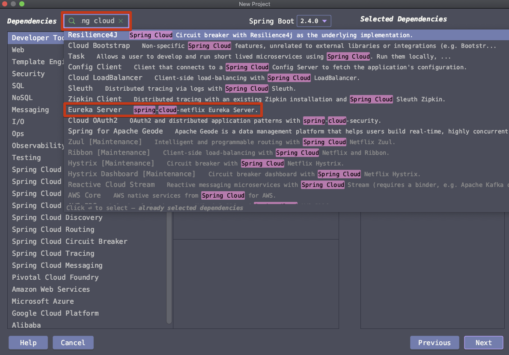
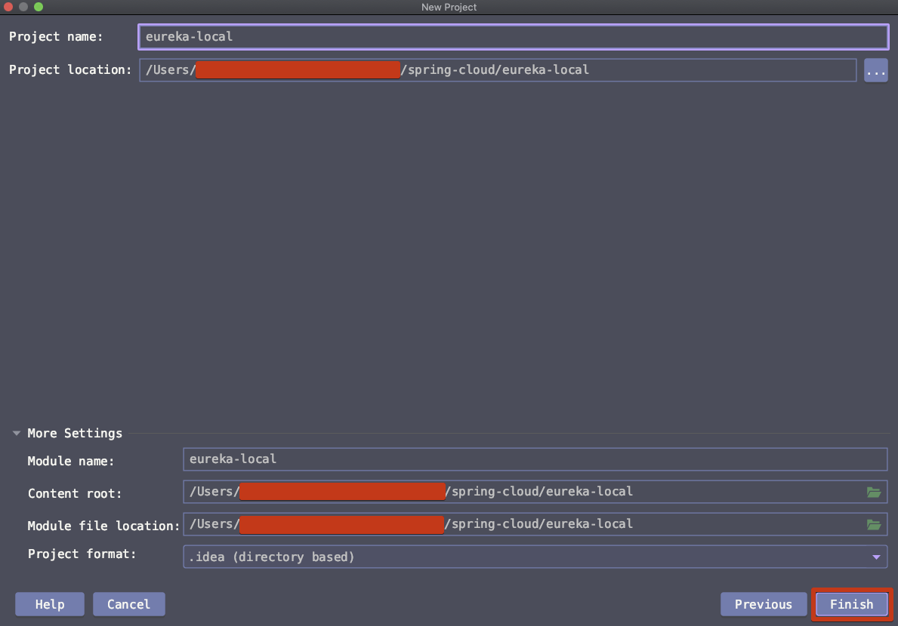
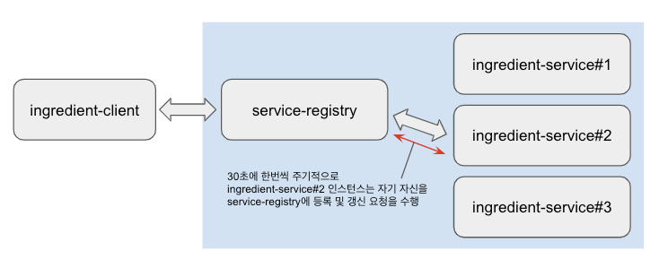

# 개발버전 서비스 레지스트리

# 참고자료

[Spring In Action - JPUB](http://www.yes24.com/Product/Goods/92436123?OzSrank=2)

  

# 유레카 클러스터 (서비스 레지스트리 서버)

유레카는 하나로만 동작하기보다는 여러 대의 유레카 서버가 함께 동작하는 것이 안전하다. 유레카 서버들이 클러스터로 동작하는 것이 좋다. 이렇게 하면 여러 개의 유레카 서버 인스턴스 들 중 하나가 장애가 발생하더라도 해당 인스턴스 하나에 대한  장애인 Single Point Of Failure (단일 장애점)이 발생하지 않기 때문이다.  

  

# 개발버전 서비스 레지스트리

개발 환경에서는 개발 환경의 PC가 서버 PC 만큼 성능이 좋지는 않다. 이런 이유로 두 개 이상의 유레카 서버가 구동되기 보다는 몇몇 옵션들을 disable 해서 하나의 유레카 서버 만을 띄워서 동작하는지 확인해보려 한다.

‌

# 샘플 프로젝트 생성 or 의존성 추가‌

## 프로젝트 생성 (spring initializr)‌

File > New Project > Spring Initializr 선택


  

aritifactId, groupId 입력, Next


  

의존성 항목 들 중 spring cloud 를 검색하고 나타나는 추천 의존성 목록 들 중에서 'Eureka Server' 선택



  

또는 아래와 같이 메뉴를 이동해서 Eureka Srping Cloud 의존성을 추가하는 것 역시 가능하다.  ‌

Spring Cloud Discovery >> Eureka Server  선택  


  

이 외에도 꼭 필요한 라이브러리들은 아니지만 몇몇 라이브러리들을 추가해주었다. ‌

- Spring Boot DevTools
- Lombok
- Spring Configuration Processor
- Spring Data JPA
- H2 Database
- MySQL Driver
- Eureka Server


  

경로 선택 후 Finish



  

## 의존성 추가

Spring Initializr 를 이용해서 프로젝트를 생성하지 않고, 기본 베이스의 spring 프로젝트에서 의존성을 추가하는 과정을 정리해보려 한다. 빌드 플러그인은 메이븐을 선택했다.‌

- Spring Boot Version
  - 2.4.0
- spring-cloud version
  - 2020.0.0-SNAPSHOT


**spring-cloud 의존성**

```xml
<dependency>
  <groupId>org.springframework.cloud</groupId>
  <artifactId>spring-cloud-starter-netflix-eureka-server</artifactId>
</dependency>
```

  

**dependencyManagement**

```xml
  <dependencyManagement>
    <dependencies>
      <dependency>
        <groupId>org.springframework.cloud</groupId>
        <artifactId>spring-cloud-dependencies</artifactId>
        <version>${spring-cloud.version}</version>
        <type>pom</type>
        <scope>import</scope>
      </dependency>
    </dependencies>
  </dependencyManagement>
```

  

**repositories**

```xml
  <repositories>
    <repository>
      <id>spring-snapshots</id>
      <name>Spring Snapshots</name>
      <url>https://repo.spring.io/snapshot</url>
      <snapshots>
        <enabled>true</enabled>
      </snapshots>
    </repository>
    <repository>
      <id>spring-milestones</id>
      <name>Spring Milestones</name>
      <url>https://repo.spring.io/milestone</url>
    </repository>
  </repositories>
```


# application.yml

```yaml
server:
  port: 8761
eureka:
  instance:
    hostname: localhost
  client:
    fetch-registry: false
    register-with-eureka: false
    service-url:
      defaultZone: http://${eureka.instance.hostname}:${server.port}/eureka
  server:
    enable-self-preservation: false
```

- server.port
  - 8761

- eureka.instance.hostname 
  - localhost 로 세팅

- eureka.client.fetch-registry
  - false 로 세팅
  - 디폴트 값 : true
  - 또는 eureka.client.fetchRegistry = false 로 세팅 (스프링 버전마다 상이)

- eureka.client.register-with-eureka
  - false 로 세팅 
  - 디폴트 값 : true
  - 또는 eureka.client.registerWithEureka = false 로 세팅 (스프링 버전마다 상이)

- eureka.client.service-url.defaultZone
  - http://${eureka.instance.hostname}:${server.port}/eureka   


### eureka.client.fetch-registry, eureka.client.register-with-eureka

유레카(서비스 레지스트리)와 상호작용하는 방법을 정의한다. 현재 작성중인 유레카 서버 프로젝트 역시 마이크로서비스이고 다른 유레카서버(서비스 레지스트리 서버)와 통신해야 하므로 위의 속성들에 대해 값을 지정하거나, 기본값인 true 로 세팅하면 된다. 개발 버전에서의 사용이기 때문에 두 속성을 모두 false 로 세팅했다. 자세한 설명은 아래에 정리해두었다.

- eureka.client.fetch-registry
  - 다른 유레카 서버로부터 레지스트리 정보를 가져올지 여부를 세팅한다.
  - 현재 프로젝트는 클러스터 없이 단일 1기의 개발용도의 인스턴스로 구성할 것이므로 false 로 세팅했다.
  - 유레카(레지스트리 서버)용도 외의 다른 마이크로 서비스에서도 이것을 세팅하는 것이 가능하다.

- eureka.client.register-with-eureka
  - 다른 유레카 서버에 현재 생성한 프로젝트의 유레카 인스턴스를 등록할지를 세팅한다.
  - 현재 다른 유레카 서버는  없기도 하고, 1기의 인스턴스만 운영할 것이기 때문에 false로 세팅했다.
  - 유레카(레지스트리 서버) 용도 외의 다른 마이크로 서비스에서도 이것을 세팅하는 것이 가능하다.


### 유레카 서버 포트 지정

잘 알려진 서비스 포트인 8080 포트 보다는 8761 과 같은 특수한 포트를 사용하는 것이 좋다. 다른 서비스와 포트가 충돌할 여지가 있기 때문이다.

```yaml
server:
  port: 8761
```


### 자체-보존 모드 비활성화

```yaml
server:
  port: 8761
  # ...
eureka:
  # ....
  server:
    enable-self-preservation: false
```


eureka 서버 설정 중 하나 더 고려해야 하는 사항으로는 `eureka.server.enableSelfPreservation` 이 있다. 유레카 서버 관점에서의 설정이다.

-  `ingredient-service#1`  
-  `ingredient-service#2`  
-  `ingredient-service#3` 

위에 나열한 ingredient-service#i 각각을 서비스 인스턴스라고 부른다. 이 서비스 인스턴스들이 유레카 서버(서비스 레지스트리 서버)에 등록이 되어 있어야 클라이언트의 요청시에 적절한 서비스 인스턴스를 클라이언트 측의 리본이 선택할 수 있다.



레지스트리 서버인 유레카 서버에 등록된 서비스 인스턴스 `ingredient-service#2` 인스턴스는 service-registry 서버의 인스턴스와 주기적으로 30초에 한번씩 자기 자신을 등록 및 갱신 요청을 수행한다. 그리고 일반적으로 세번의 갱신 기간동안 서비스 인스턴스인 `ingredient-service#2` 로부터 등록갱신 요청을 받지 못하면, `ingredient-service#2` 의 등록을 취소하게 된다.(레지스트리에서 삭제)  ‌

그리고 이렇게 레지스트리에서 삭제되어서 중단된 서비스들의 수가 일정 임곗값 (threshold)을 넘어서게 되면 유레카 서버는 네트워크 문제로 간주해 레지스트리 내의 나머지 서비스 인스턴스 정보들을 보존하기 위해 `자체 보존 모드(self preservation)` 로 전환된다. 자체보존 모드로 전환되면 서비스 인스턴스들이 레지스트리에서 삭제되는 작업이 방지(preservation)된다.  

  

### 개발환경에서의 자체 보존 모드

개발 환경에서는 가급적이면 이 자체 보존 모드를 off 시켜놓고 개발하는 것이 권장되는 편이다.  ‌

개발환경 내에서는 서비스 인스턴스들을 켜놓았다고 하더라도 자주 껏다가 다시 키고, 디버깅모드로 돌리기도 한다. 이렇게 되면 서비스 인스턴스들이 3번 이상 30초 이내에 응답하지 못하는 현상이 자주 발생하게 된다.  

이런 현상이 발생하면, 로컬에서 띄운 유레카 서버는 아무것도 한게 없는데 갑자기 자체 보존 모드에 진입해서 문제를 파악하기도 어렵고, 업무를 진행하기도 어렵게 된다. 이밖에도 여러가지 요인들이 있을 수 있는데, 개발 환경내에서는 가급적이면 자체 보존 모드를 off 시켜놓고 개발하는 것이 권장된다.  

# 요약‌

프로젝트 세팅과정을 제외하고, 스프링 설정상에서 개발환경의 유레카 서버에 적용해야 할 4가지 정도의 옵션을 yaml 파일 전체 코드를 남겨놓는 것으로 대체해보려 한다.

```yaml
server:
  port: 8761
eureka:
  instance:
    hostname: localhost
  client:
    fetch-registry: false
    register-with-eureka: false
    service-url:
      defaultZone: http://${eureka.instance.hostname}:${server.port}/eureka
  server:
    enable-self-preservation: false
```

