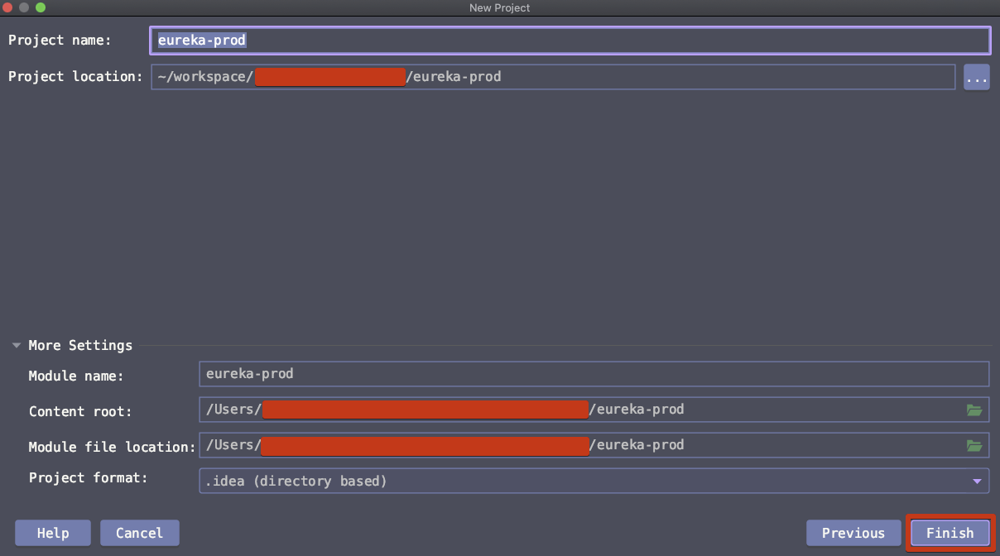

# 운영버전 서비스 레지스트리

# 참고자료

[Spring In Action - JPUB](http://www.yes24.com/Product/Goods/92436123?OzSrank=2)


# 유레카 클러스터 (서비스 레지스트리 서버)

유레카는 하나로만 동작하기보다는 여러 대의 유레카 서버가 함께 동작하는 것이 안전하다. 유레카 서버들이 클러스터로 동작하는 것이 좋다. 이렇게 하면 여러 개의 유레카 서버 인스턴스 들 중 하나가 장애가 발생하더라도 해당 인스턴스 하나에 대한  장애인 Single Point Of Failure (단일 장애점)이 발생하지 않기 때문이다.

‌

# 운영버전 서비스 레지스트리

> 이전 글에서 생성한 개발버전 서비스 레지스트리에서 application.yml 만을 수정해서 사용하면된다. profile 을 여러개 두어 설정하면 두 가지 설정을 비교할 수 있어 편리하지만, git 에 코드를 올려놔야 해서 그냥 프로젝트를 하나 더 만들어서 정리를 시작하게 되었다.

이전 글에서 정리했던 개발 버전 서비스 레지스트리에서는 몇몇 옵션들을 false 로 두어 disable 했었다. 하지만 운영(production) 환경에서는 가급적 필요한 옵션들을 true 로 해놓아야 한다. 이전 문서를 참고해서 프로젝트를 생성했었다면 지금 바로 application.yml 파일에 대해 정리한 부분만 확인하면 되고, 이전 문서를 참고하지 않았다면 프로젝트 생성과정부터 살펴보자. 

# 샘플 프로젝트 생성 or 의존성 추가‌

## 프로젝트 생성 (spring initializr)

File > New Project > Spring Initializr 선택


artifactId, groupId 입력, Next


  

의존성 항목 들 중 spring cloud 를 검색하고 나타나는 의존성 목록 들 중에서 'Eureka Server' 선택  


  

또는 아래와 같이 메뉴를 이동해서 Eureka Srping Cloud 의존성을 추가하는 것 역시 가능하다.

Spring Cloud Discovery >> Eureka Server  선택


  

이 외에도 꼭 필요한 라이브러리들은 아니지만 몇몇 라이브러리들을 추가해주었다. ‌

- Spring Boot DevTools
- Lombok
- Spring Configuration Processor
- Spring Data JPA
- H2 Database
- MySQL Driver
- Eureka Server


경로 선택 후 Finish




## 의존성 추가

Spring Initializr 를 이용해서 프로젝트를 생성하지 않고, 기본 베이스의 spring 프로젝트에서 의존성을 추가하는 과정을 정리해보려 한다. 빌드 플러그인은 메이븐을 선택했다.

- Spring Boot Version
  - 2.4.0
- spring-cloud version
  - 2020.0.0-SNAPSHOT

### spring-cloud

```xml
<dependency>
  <groupId>org.springframework.cloud</groupId>
  <artifactId>spring-cloud-starter-netflix-eureka-server</artifactId>
</dependency>
```


### dependencyManagement

```xml
  <dependencyManagement>
    <dependencies>
      <dependency>
        <groupId>org.springframework.cloud</groupId>
        <artifactId>spring-cloud-dependencies</artifactId>
        <version>${spring-cloud.version}</version>
        <type>pom</type>
        <scope>import</scope>
      </dependency>
    </dependencies>
  </dependencyManagement>
```


### repositories

```xml
  <repositories>
    <repository>
      <id>spring-snapshots</id>
      <name>Spring Snapshots</name>
      <url>https://repo.spring.io/snapshot</url>
      <snapshots>
        <enabled>true</enabled>
      </snapshots>
    </repository>
    <repository>
      <id>spring-milestones</id>
      <name>Spring Milestones</name>
      <url>https://repo.spring.io/milestone</url>
    </repository>
  </repositories>
```


# application.yml

```yaml
server:
  port: 8761
eureka:
  instance:
    hostname: localhost
  client:
    fetch-registry: true
    register-with-eureka: true
    service-url:
      defaultZone: http://${eureka.instance.hostname}:${server.port}/eureka
  server:
    enable-self-preservation: true
```


- server.port
  - 8761

- eureka.instance.hostname 
  - localhost 로 세팅

- eureka.client.fetch-registry
  - false 로 세팅
  - 디폴트 값 : true
  - 또는 eureka.client.fetchRegistry = false 로 세팅 (스프링 버전마다 상이)

- eureka.client.register-with-eureka
  - false 로 세팅 
  - 디폴트 값 : true
  - 또는 eureka.client.registerWithEureka = false 로 세팅 (스프링 버전마다 상이)

- eureka.client.service-url.defaultZone
  - http://${eureka.instance.hostname}:${server.port}/eureka


## eureka.client.[fetch-registry | register-with-eureka]

현재 구동되고 있는 유레카 서버 인스턴스가 이미 구동되어 있는 다른 유레카 서버 인스턴스와 상호작용하는 방법을 정의한다. 다른 유레카 서버 인스턴스 입장에서는 현재 유레카 서버 인스턴스를 클라이언트로 간주하게 된다.  ‌

다른 유레카 서버 인스턴스에게서 레지스트리 정보를 가져올지, 현재 인스턴스를 다른 유레카 레지스트리 서버에 등록할지를 결정하는 값들을 application.yml 내에 특정 환경변수로 입력하는 과정이다.  

- eureka.client.fetch-registry
  - 다른 유레카 서버로부터 레지스트리 정보를 가져올지 여부를 세팅한다.
  - 상용으로 사용할 것이기 때문에 true 로 세팅했다.
  - 유레카(레지스트리 서버)용도 외의 다른 마이크로 서비스에서도 이것을 세팅하는 것이 가능하다.
- eureka.client.register-with-eureka
  - 다른 유레카 서버에 현재 생성한 프로젝트의 유레카 인스턴스를 등록할지를 세팅한다.
  - 상용으로 사용할 것이기 때문에 true 로 세팅했다.
  - 유레카(레지스트리 서버) 용도 외의 다른 마이크로 서비스에서도 이것을 세팅하는 것이 가능하다.


## 유레카 서버 포트 지정

잘 알려진 서비스 포트인 8080 포트 보다는 8761 과 같은 특수한 포트를 사용하는 것이 좋다. 다른 서비스와 포트가 충돌할 여지가 있기 때문이다.

```yaml
server:
  port: 8761
```


## 자체-보존 모드 활성화

별다른 설정을 해두지 않으면 자체 보존 모드 는 기본 값으로 true로 세팅되게 된다.  ‌

개발 버전 서비스 레지스트리의 내용을 여기에 정리. 조금 중복될 수도 있지만... 그대로 적는게 훨씬 낫다는 생각이 들었다.  

