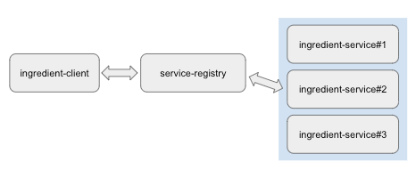
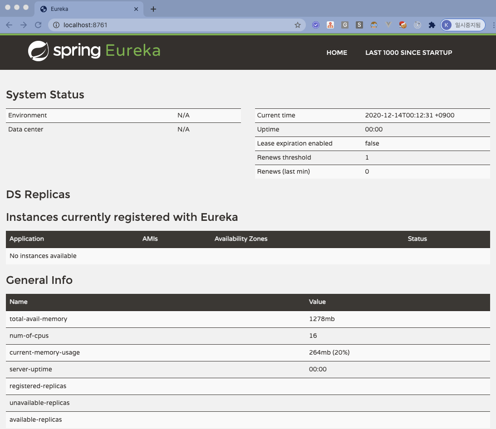
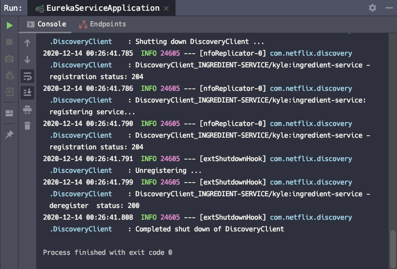
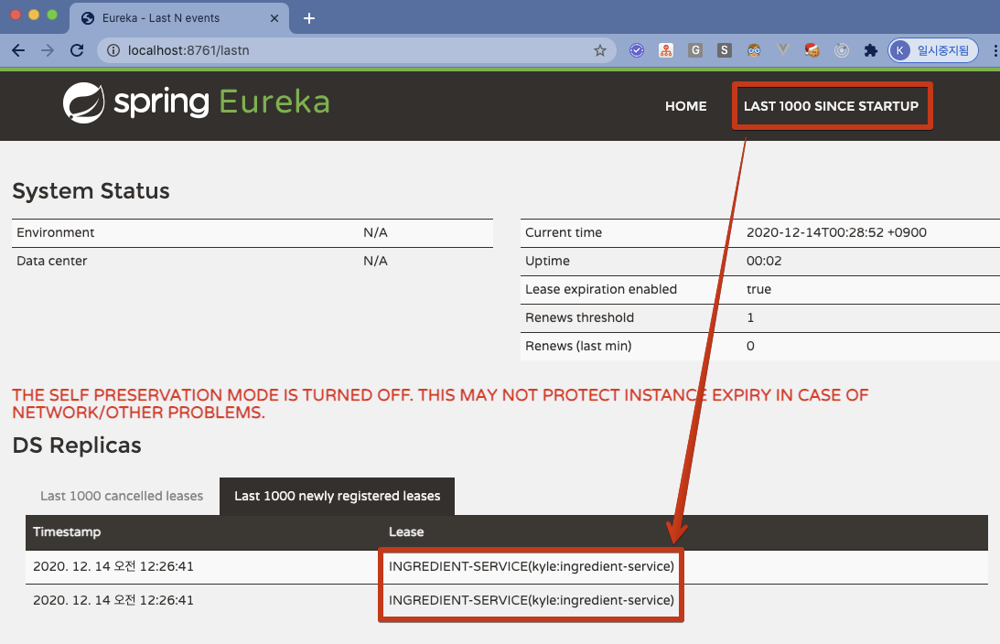
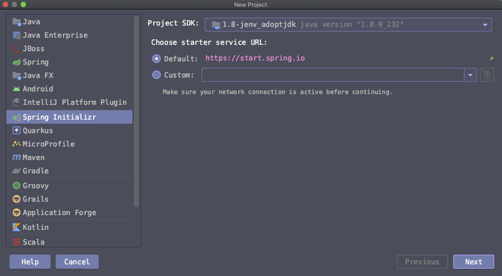
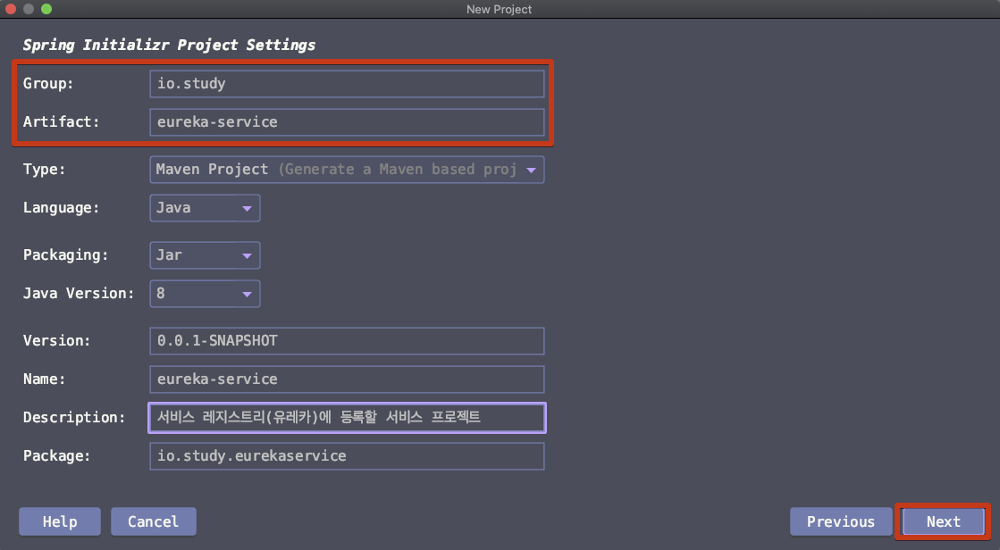
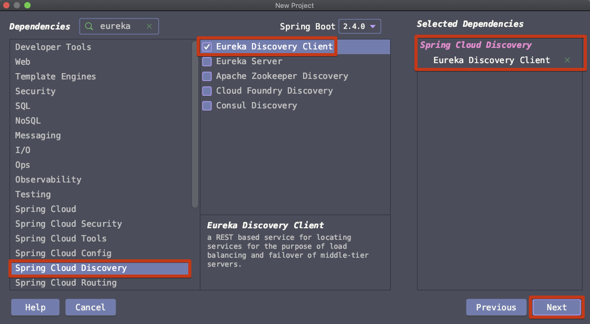
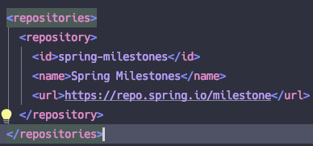

# Eureka 서비스 애플리케이션

> 유레카 레지스트리 서버에서 관리하게 될 각 서비스 애플리케이션에 대한 설정이다. 유레카 레지스트리 서버에서 우리가 오늘 작성한 프로그램이 유레카 서비스 애플리케이션임을 알수있게 해주는 절차가 필요하다.


# 참고자료

- [Spring In Action - JPUB](http://www.yes24.com/Product/Goods/92436123?OzSrank=2)‌

- [JPUB 제공 Spring In Action 예제 리포지터리(github)](https://github.com/Jpub/SpringInAction5/tree/master/Ch14/ingredient-service)


# 버전 (환경)

Spring Boot 2.4.0

spring-cloud-starter-netflix-eureka-client 

- 2.2.6.RELEASE

spring-cloud-dependencies

- 2020.0.0-M6
- repoistory
  - spring-milestones
  - url : http://repo.spring.io/milestone


# 서비스 레지스트리 (유레카) 서버에 서비스 등록하기



오늘 작성할 애플리케이션은 위에 첨부한 그림에서 하늘색 배경으로 표시해둔 영역의 애플리케이션들이다. 서비스 레지스트리 서버에 각 서비스 애플리케이션들이 자기 자신을 등록하는데, 이렇게 등록한 정보는 유레카 클라이언트가 유레카 레지스트리 서버를 조회해서 얻어낼 수 있다.  ‌

조금 특이하다고 느꼈던 점으로, service 애플리케이션 역시 Eureka 계열 라이브러리에서는 client 로 간주되는 것 같다는 느낌을 받았다. Eureka Discovery 계열의 라이브러리 의존성을 부여할 때 `spring-cloud-starter-netflix-eureka-client` 를 사용했기 때문이다. 자세한 내용은 더 공부를 해보거나, 예제를 이것 저것 더 만들어보면 알게 될 것 같다.  

## 요약 

여기서 작성하는 유레카 서비스 애플리케이션을 시작시키면  

- 유레카 서비스 애플리케이션(ingredient-service)은 8761 포트에서 돌아가고 있는 유레카 레지스트리 서버(개발버전은 localhost)에 연결하고, 
- UNKNOWN 이라는 이름으로 유레카 레지스트리 서버에 자기 자신(유레카 서비스 애플리케이션)을 등록한다.  

이 때 서비스 애플리케이션에 대해 유레카 레지스트리 서버에 등록될 이름을 지정하고 싶을 경우 `spring.application.name` 속성에 이름을 부여해주면 된다. 아래에 정리하는 예제에서는 `spring.application.name` 속성에 대한 이름으로 ingredient-service 라는 이름을 부여했다.  

**유레카 서비스 애플리케이션 자신의 포트 지정, 설정**   

포트를 무작위로 남아있는 포트 들중 하나를 선택해서 부여하고 싶다면 application.yml의 `server.port` 속성을 0으로 지정해주면, 남아있는 포트 중 하나를 선택한다. 그리고 유레카 서비스가 유레카 레지스트리 서버에 접속하면 해당 내용은 대시보드에 포트와 application.name 들이 디스플레이 되게 된다.  ‌

**유레카 레지스트리 서버의 host/port**  

기본적으로 유레카 클라이언트는 유레카 서버가 localhost 의 8761 포트에서 리스닝 하고 있다고 간주한다. (디폴트 설정)  

운영시에는 유레카 레지스트리 서버의 위치가 localhost가 아닌 다른 네트워크 인스턴스에 있는 경우 역시 있다. 이런 이유로 서버 인스턴스의 네트워크 주소를 명확하게 지정해주어야 한다. 이런 경우에 대해 `eureka.client.service-url.defaultZone` 에 도메인 명을 포함한 포트, 그리고 URI를 지정해주어야 한다. `eureka.client.service-url.defaultZone` 을 작성하는 예제를 아래에 정리해 두었다.  

## 의존성 추가‌

- spring-cloud-starter-netflix-eureka-client
- spring-cloud-dependencies

`spring-cloud-starter-netflix-eureka-client` 의존성에는 서비스를 찾는데 필요한 모든것이 자동으로 추가된다. (ex. 유레카 클라이언트 라이브러리, 리본 로드밸런서, etc)  

### Eureka-Client 의존성 추가

> 의존성 : `spring-cloud-starter-netflix-eureka-client` 

Spring Initializr 를 이용해서 프로젝트를 생성하자. 이때 아래의 [의존성(spring-cloud-starter-netflix-eureka-client)](https://mvnrepository.com/artifact/org.springframework.cloud/spring-cloud-starter-netflix-eureka-client/2.2.6.RELEASE)을 추가해주자. (버전을 꼭 지정해주어야 하는 것 같다. spring boot 버전과 spring-cloud-starter-netflix-eureka-client 의 버전이 서로 잘 안맞는 것 같다.)

```xml
<dependency>
    <groupId>org.springframework.cloud</groupId>
    <artifactId>spring-cloud-starter-netflix-eureka-client</artifactId>
    <version>2.2.6.RELEASE</version>
</dependency>
```

### Dependency Management

> 의존성 명 : `spring-cloud-dependencies` 

```xml
  <dependencyManagement>
    <dependencies>
      <dependency>
        <groupId>org.springframework.cloud</groupId>
        <artifactId>spring-cloud-dependencies</artifactId>
        <version>${spring-cloud.version}</version>
        <type>pom</type>
        <scope>import</scope>
      </dependency>
    </dependencies>
  </dependencyManagement>
```

### Repositories

```xml
  <repositories>
    <repository>
      <id>spring-milestones</id>
      <name>Spring Milestones</name>
      <url>https://repo.spring.io/milestone</url>
    </repository>
  </repositories>
```


# 포트 지정‌

## 유레카 서비스 애플리케이션 구동 포트

## 유레카 레지스트리 서버의 host/port 

기본적으로 유레카 클라이언트는 유레카 서버가 localhost 의 8761 포트에서 리스닝 하고 있다고 간주한다. (디폴트 설정)   ‌

운영시에는 유레카 레지스트리 서버의 위치가 localhost가 아닌 다른 네트워크 인스턴스에 있는 경우 역시 있다. 이런 이유로 서버 인스턴스의 네트워크 주소를 명확하게 지정해주어야 한다. 이런 경우에 대해 `eureka.client.service-url.defaultZone` 에 도메인 명을 포함한 포트, 그리고 URI를 지정해주어야 한다. `eureka.client.service-url.defaultZone` 을 작성하는 예제를 아래에 정리해 두었다.  

### 예제1) 유레카 레지스트리 서버가 하나일 때 

```yaml
spring:
  application:
    name: ingredient-service
    # ...
eureka:
  instance:
    hostname: localhost
  client:
    service-url:
      defaultZone: http://${eureka.instance.hostname}:8761/eureka
```


### 예제2) 유레카 레지스트리 서버가 두개 이상일 때 ‌

이렇게 할 경우 동작 시나리오는 아래와 같다.  ‌

- 8761 유레카 레지스트리 서버에 등록을 시도한다.  
- 어떤 장애가 발생해서인지 등록에 실패하게 되면 두번째 피어(peer)로 등록된 레지스트리 서버인 8762 에 등록을 시도하게 된다.  
- 그리고 이후에 등록에 실패했던 유레카 서버가 다시 온라인 상태가 되면, 해당 서비스의 등록정보가 포함된 피어 서버 레지스트리가 복제된다.  

```yaml
spring:
  application:
    name: ingredient-service
    # ... 
eureka:
  instance:
    hostname: localhost
  client:
    service-url:
      defaultZone: http://${eureka.instance.hostname}:8761/eureka, 
                   http://${eureka.instance.hostname}:8762/eureka
```


# 대시보드 확인 ‌

## 유레카 레지스트리 서버 구동 ‌

[유레카 레지스트리 서버(개발버전)](https://gosgjung.gitbook.io/lognomy/spring-in-action/spring-cloud/overview/undefined-1) 에서 작성한 개발 버전의 유레카 레지스트리 서버 애플리케이션을 구동시키자.  

구동시키고 나서 웹 브라우저에 [localhost:8761](http://localhost:8761/) 에 접속하자.  




## 유레카 클라이언트 기반 서비스 애플리케이션 구동

오늘 작성한 이 글에서 지금까지 설명한 애플리케이션은 유레카 클라이언트 기반으로 동작하는 서비스 애플리케이션이다. 이 애플리케이션을 구동시켜보자. 




> TODO 
>
> - 결과를 보면 정상적으로 동작은 되는데 지속적으로 running 상태는 아니다.계속 런닝 되도록 하는 방식이나 이런 것에 대해서는 조금 더 스터디를 한 후에 정리를 해봐야 할 것 같다.

‌

## 레지스트리 서버에 등록되었는지 확인해보기

> - 우측 상단 메뉴 > LAST 1000 SINCE STARTUP 클릭
> - DS Replicas > Last 1000 newly registered leases 에 나타난 목록을 보면 레지스트리에 등록된 서비스를 확인 가능하다. (유의할 점은 접속 기록이 아니다. 서비스 등록 기록이다. 글을 정리하는 나 조차도 처음 배우는 개념이라 접속기록이라고 쓸뻔한 적이 여러번 있었다.)




## 서비스 등록... 그 다음은

서비스 등록 이후에는 이제 클라이언트 프로그램을 통해서 서비스에 Http Request 를 요청해야 한다. 이 때 클라이언트 측에서 로드밸런싱을 사용하는데 이게 리본 로드밸런서이다. 그리고, 클라이언트는 서비스에 직접 접근하지 못하고 레지스트리 서버에 문의를 하고 레지스트리 서버가 돌려주는 접속정보를 통해서 해당 API에 접근하게 된다. 클라이언트 프로그램 작성은 다음 글에서 작성할 예정이다.  


# 프로젝트 생성과정‌

인텔리제이로 프로젝트를 생성하는 과정을 굳이 남겨야 할까? 하다가 그냥 기록으로 남겨고 싶어서 프로젝트 생성과정을 기록으로 남겨보려고 한다. 사실 그냥 프로젝트를 먼저 생성하고 의존성을 추가해도 된다. 하지만 초반에 리포지터리 서버, 의존성 버전 등을 모른다면 Spring Initializr 로 프로젝트를 먼저 생성하고 의존성을 뜯어보는 것도 좋은 과정인 것 같다.  ‌


Spring Initializr 선택 > Next



  

groupId, artifactId 정보 입력  

이 외에 필요한 다른 정보들을 모두 입력해주고 Next  



  

Spring Cloud Discovery > Eureka Discovery Client  선택 > Next



  

Project name, Project location 등을 입력  


현재 스프링 부트 버전 2.4.0 버전에서 스프링 팀이 미리 정해놓은 spring-cloud 버전은 아래와 같다.

- spring-cloud version
  - 2020.0.0-M6
- Repository
  - id : spring-milestones
  - name : Spring Milestones
  - url : http://repo.spring.io/milestone




## pom.xml 전체 내용

```xml
<?xml version="1.0" encoding="UTF-8"?>
<project xmlns="http://maven.apache.org/POM/4.0.0"
  xmlns:xsi="http://www.w3.org/2001/XMLSchema-instance"
  xsi:schemaLocation="http://maven.apache.org/POM/4.0.0 https://maven.apache.org/xsd/maven-4.0.0.xsd">
  <modelVersion>4.0.0</modelVersion>
  <parent>
    <groupId>org.springframework.boot</groupId>
    <artifactId>spring-boot-starter-parent</artifactId>
    <version>2.4.0</version>
    <relativePath/> <!-- lookup parent from repository -->
  </parent>
  <groupId>io.study</groupId>
  <artifactId>eureka-service</artifactId>
  <version>0.0.1-SNAPSHOT</version>
  <name>eureka-service</name>
  <description>서비스 레지스트리(유레카)에 등록할 서비스 프로젝트</description>

  <properties>
    <java.version>1.8</java.version>
    <spring-cloud.version>2020.0.0-M6</spring-cloud.version>
  </properties>

  <dependencies>
    <dependency>
      <groupId>org.springframework.cloud</groupId>
      <artifactId>spring-cloud-starter-netflix-eureka-client</artifactId>
    </dependency>

    <dependency>
      <groupId>org.springframework.boot</groupId>
      <artifactId>spring-boot-starter-test</artifactId>
      <scope>test</scope>
    </dependency>
  </dependencies>

  <dependencyManagement>
    <dependencies>
      <dependency>
        <groupId>org.springframework.cloud</groupId>
        <artifactId>spring-cloud-dependencies</artifactId>
        <version>${spring-cloud.version}</version>
        <type>pom</type>
        <scope>import</scope>
      </dependency>
    </dependencies>
  </dependencyManagement>

  <build>
    <plugins>
      <plugin>
        <groupId>org.springframework.boot</groupId>
        <artifactId>spring-boot-maven-plugin</artifactId>
      </plugin>
    </plugins>
  </build>

  <repositories>
    <repository>
      <id>spring-milestones</id>
      <name>Spring Milestones</name>
      <url>https://repo.spring.io/milestone</url>
    </repository>
  </repositories>

</project>
```

