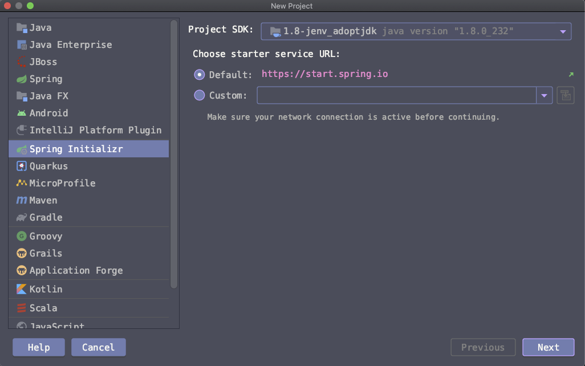
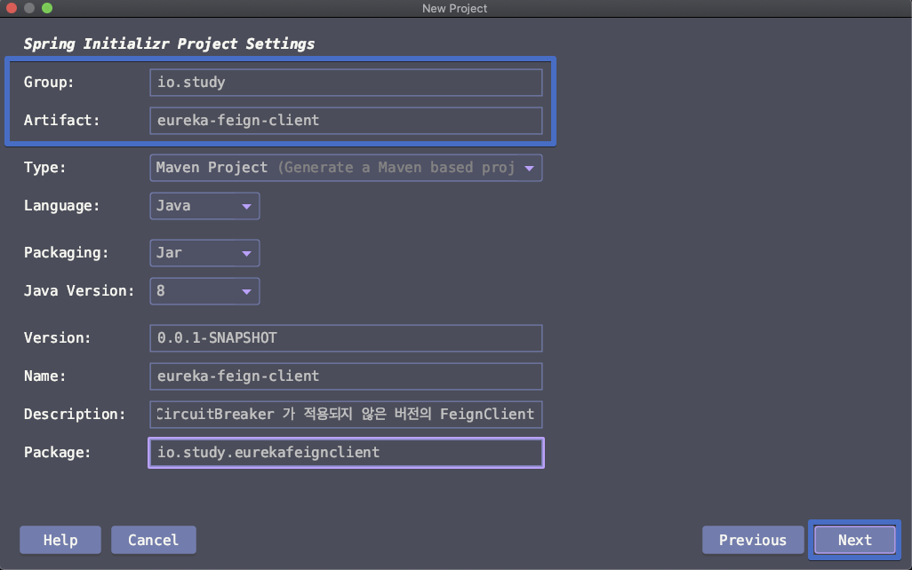
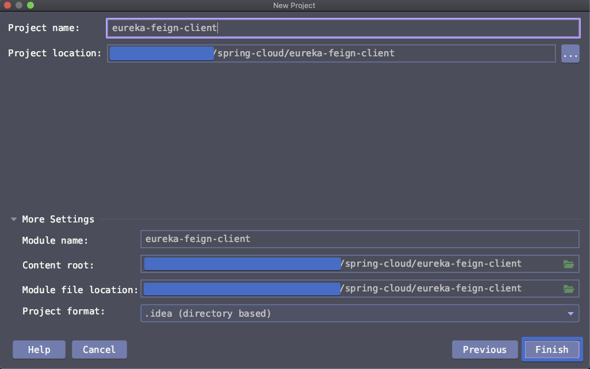
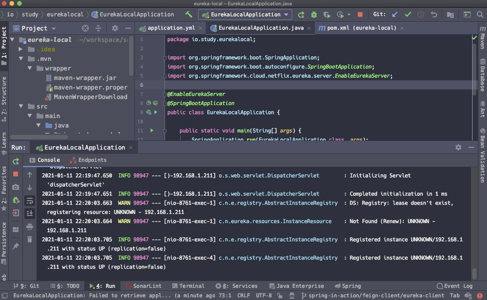
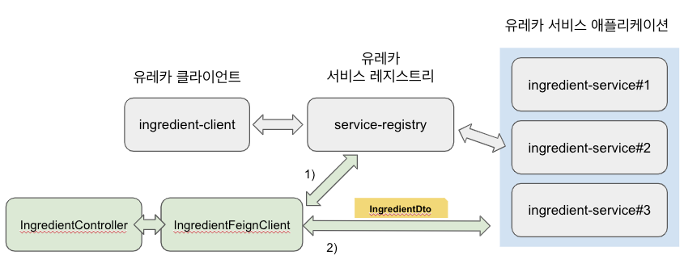
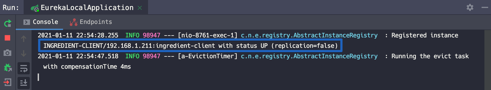

# Feign Client(Eureka)

오늘은 Eureka 기반의 라이브러리로 Feign Client 단순 예제를 정리할 예정이다. [Eureka 서비스 레지스트리 서버](https://gosgjung.gitbook.io/lognomy/spring-in-action/spring-cloud/eureka-registry-server) , [Eureka 서비스 애플리케이션](https://gosgjung.gitbook.io/lognomy/spring-in-action/spring-cloud/undefined) 과 연동하기 위해 기본 샘플로 일단 만들기는 했다. Feign Client 의 사용법이 처음에는 굉장히 생소해서 헤매게 되는 경우가 굉장히 많다. 그리고 다른일 하다가 나중에 정말 오래되었을때 다시 Feign Client 관련 기능을 추가해야한다면? 굉장히 버벅거리게 된다.  

  ‌

이런 작업을 외우고 한다거나 외우고 있는 것은 말이 되지 않는다. 그래서 기록으로 남겨두는 것이 나름의 의미가 있을것 같다는 생각에 너무나 고된 문서작업에 의미를 크게(??) 두기로 했다.😎  


# 목차

- [Feign Client(Eureka)](#feign-client-eureka-)
- [**프로젝트 생성**](#-----------)
- [의존성](#---)
- [dependencyManagement](#dependencymanagement)
- [Repository](#repository)
- [pom.xml](#pomxml)
- [application.yml](#applicationyml)
  * [Eureka 레지스트리 서버/Eureka 서비스 구동](#eureka----------eureka-------)
- [OpenFeignConfiguration](#openfeignconfiguration)
- [FeignClient, DTO](#feignclient--dto)
  * [FeignClient](#feignclient)
  * [DTO](#dto)
- [Controller](#controller)
- [call flow](#call-flow)
- [동작 확인해보기](#--------)
  * [Eureka 레지스트리 서버 구동](#eureka------------)
- [Eureka 서비스 구동](#eureka-------)
- [‌Eureka Client 구동](#-eureka-client---)

<small><i><a href='http://ecotrust-canada.github.io/markdown-toc/'>Table of contents generated with markdown-toc</a></i></small>


# **프로젝트 생성** 

‌

Create New Project > Spring Initializr 선택 > Next 버튼 클릭



‌

group, artifactid 입력 > 기타 정보들 모두 입력 > Next 클릭



‌

선택한 의존성들

‌

- Spring Web
- Spring Cloud Discovery > Eureka Discovery Client
- Spring Cloud Routing > OpenFeign

‌

이 과정을 거치지 않고 메이븐으로 의존성을 추가해주어도 된다. 하지만 처음 사용하는 라이브러리라면 spring initializr 를 이용해 프로젝트를 생성해서 스프링 팀에서 현재 버전에서 권장하는 라이브러리의/Repository 의 조합을 확인해보는 것도 좋은 생각인것 같다.


‌

프로젝트 경로 지정, 프로젝트 명 지정 > Finish 버튼 클릭 




# 의존성

spring initializr 를 통해 생성했으므로 따로 의존성 추가작업은 필요없다. 하지만 유지보수 업무를 하게 되는 경우도 있다. maven 또는 gradle 빌드스크립트 내에 의존성을 추가해주어야 하는 경우가 있다. 오픈소스를 사용하는 입장이기 때문에 어떤 버전의 어떤 라이브러리를 써야 충돌이 나지 않는 그런 귀찮음이 있기 때문에 정리를 해두어야 할것 같다.  

‌  

나중에 스프링 프레임워크가 더 발전해서 spring-cloud 계열의 라이브러리 사용시 충돌을 걱정하지 않아도 될 정도가 되었으면 하는 바람이 있다.  

‌  

- org.springframework.boot:spring-boot-starter-web
- org.springframework.cloud
  - spring-cloud-starter-netflix-eureka-client
    - org.springframework.cloud:spring-cloud-starter-netflix-eureka-client
  - spring-cloud-starter-openfeign
    - org.springframework.cloud:spring-cloud-starter-openfeign

# dependencyManagement

depeendencyManagement로는 아래의 내용을 명시해주었다.  

- org.springframework.cloud:spring-cloud-dependencies:2020.0.0  

  

# Repository

- spring-milestones 
- https://repo.spring.io/milestone

‌  

# pom.xml

```xml
<?xml version="1.0" encoding="UTF-8"?>
<project xmlns="http://maven.apache.org/POM/4.0.0"
  xmlns:xsi="http://www.w3.org/2001/XMLSchema-instance"
  xsi:schemaLocation="http://maven.apache.org/POM/4.0.0 https://maven.apache.org/xsd/maven-4.0.0.xsd">
  <modelVersion>4.0.0</modelVersion>
  <parent>
    <groupId>org.springframework.boot</groupId>
    <artifactId>spring-boot-starter-parent</artifactId>
    <version>2.4.1</version>
    <relativePath/> <!-- lookup parent from repository -->
  </parent>
  <groupId>io.study</groupId>
  <artifactId>eureka-feign-client</artifactId>
  <version>0.0.1-SNAPSHOT</version>
  <name>eureka-feign-client</name>
  <description>CircuitBreaker 가 적용되지 않은 버전의 FeignClient</description>

  <properties>
    <java.version>1.8</java.version>
    <spring-cloud.version>2020.0.0</spring-cloud.version>
  </properties>

  <dependencies>
    <dependency>
      <groupId>org.springframework.boot</groupId>
      <artifactId>spring-boot-starter-web</artifactId>
    </dependency>
    <dependency>
      <groupId>org.springframework.cloud</groupId>
      <artifactId>spring-cloud-starter-netflix-eureka-client</artifactId>
    </dependency>
    <dependency>
      <groupId>org.springframework.cloud</groupId>
      <artifactId>spring-cloud-starter-openfeign</artifactId>
    </dependency>

    <dependency>
      <groupId>org.projectlombok</groupId>
      <artifactId>lombok</artifactId>
    </dependency>

    <dependency>
      <groupId>org.springframework.boot</groupId>
      <artifactId>spring-boot-starter-test</artifactId>
      <scope>test</scope>
    </dependency>
  </dependencies>

  <dependencyManagement>
    <dependencies>
      <dependency>
        <groupId>org.springframework.cloud</groupId>
        <artifactId>spring-cloud-dependencies</artifactId>
        <version>${spring-cloud.version}</version>
        <type>pom</type>
        <scope>import</scope>
      </dependency>
    </dependencies>
  </dependencyManagement>

  <build>
    <plugins>
      <plugin>
        <groupId>org.springframework.boot</groupId>
        <artifactId>spring-boot-maven-plugin</artifactId>
      </plugin>
    </plugins>
  </build>

  <repositories>
    <repository>
      <id>spring-milestones</id>
      <name>Spring Milestones</name>
      <url>https://repo.spring.io/milestone</url>
    </repository>
  </repositories>

</project>
```


# application.yml

```yaml
spring:
  application:
    name: ingredient-client

eureka:
  client:
    service-url:
      defaultZone: http://${eureka.instance.hostname}:8761/eureka/
  instance:
    hostname: localhost
```

  

## Eureka 레지스트리 서버/Eureka 서비스 구동

이전에 만들었던 서버인 [Eureka 레지스트리 서버](https://gosgjung.gitbook.io/lognomy/spring-in-action/spring-cloud/eureka-registry-server/service-registry-develop)를 구동시키자.  



  

구동이 끝났다면 Eureka 서비스를 구동하자.

스샷은 내일 추가 ㅠㅜ

# OpenFeignConfiguration

@EnableFeignClients 를 통해 FeignClient 설정을 활성화시킨다.  

```java
package io.study.eurekafeignclient.config;

import org.springframework.cloud.openfeign.EnableFeignClients;
import org.springframework.context.annotation.Configuration;

@Configuration
@EnableFeignClients
public class OpenFeignConfiguration {
}
```


# FeignClient, DTO

FeignClient 는 Rest API를 선언형으로 사용할 수 있는 spring-cloud 에서 제공하는 라이브러리이다. 인터넷에서 찾아보면 이래 저래 설명도 많고, 종류도 다양해져버린 그런 라이브러리이다. 오늘은 일단 이 FeignClient에 대한 설명은 하지 않을 생각이다. 글이 너무길어져서이다. 다른 인터넷 자료를 찾아보는 것만으로도 FeignClient관련된 히스토리는 확인할 수 있을 것 같다.

‌

## FeignClient

> **IngredientFeignClient.java** 

```java
package io.study.eurekafeignclient.config;

import io.study.eurekafeignclient.employee.EmployeeDto;
import io.study.eurekafeignclient.ingredient.IngredientDto;
import java.util.List;
import org.springframework.cloud.openfeign.FeignClient;
import org.springframework.context.annotation.Configuration;
import org.springframework.web.bind.annotation.GetMapping;
import org.springframework.web.bind.annotation.PathVariable;

@Configuration
@FeignClient(name="ingredient-service")	// ingredient-service 는 유레카 레지스트리에 등록되어 있는 서비스 명 (유레카 서비스의 application.name 으로 입력한 값이 서비스명으로 등록된다.)
public interface IngredientFeignClient {

	@GetMapping("/ingredients")
	List<IngredientDto> getIngredientsAll();

	@GetMapping("/ingredients/{id}")
	IngredientDto getIngredient (@PathVariable("id") Long id);

	@GetMapping("/employees")
	EmployeeDto getEmployeeAll();

	@GetMapping("/employees/{id}")
	EmployeeDto getEmployee (@PathVariable("id") Long id);
}
```


소스를 보면 @FeignClient(name="ingredient-service") 로 어노테이션을 선언했는데 이 의미는 아래와 같다.  

> IngredientFeignClient 라는 이름의 인터페이스인 FeignClient 는 유레카 레지스트리 서버에 ingredient-service 라는 이름으로 등록된 서비스에 대한 HTTP 동작을 선언한 FeignClient 인스턴스입니다.  

ingredient-service 라는 이름의 서비스는 유레카 서비스 애플리케이션의 application.yml 에 아래와 같이 명시한 항목이다. (spring.application.name)  


```yaml
server:
  port: 0

spring:
  application:
    name: ingredient-service
eureka:
  client:
    service-url:
      defaultZone: http://${eureka.instance.hostname}:8761/eureka
  instance:
    hostname: localhost
```


## DTO

> **IngredientDto.java**

```java
package io.study.eurekafeignclient.ingredient;

import com.fasterxml.jackson.annotation.JsonProperty;
import lombok.Data;
import lombok.RequiredArgsConstructor;

@Data
@RequiredArgsConstructor
public class IngredientDto {

	@JsonProperty("name")
	private String name;

	@JsonProperty("type")
	private Type type;

	public static enum Type {
		WRAP, PROTEIN, VEGGIES, CHEESE, SAUCE
	}
}
```

  

# Controller

Feign Client 를 테스트할 만한 Controller가 필요하다. Controller 코드는 아래와 같다. 별내용 없다.

> **IngredientController.java**

```java
package io.study.eurekafeignclient.ingredient;

import io.study.eurekafeignclient.config.IngredientFeignClient;
import java.util.List;
import org.springframework.web.bind.annotation.GetMapping;
import org.springframework.web.bind.annotation.PathVariable;
import org.springframework.web.bind.annotation.RequestMapping;
import org.springframework.web.bind.annotation.RestController;

@RestController
@RequestMapping("/ingredients")
public class IngredientController {

	private final IngredientFeignClient ingredientFeignClient;

	public IngredientController(IngredientFeignClient ingredientFeignClient){
		this.ingredientFeignClient = ingredientFeignClient;
	}

	@GetMapping
	public List<IngredientDto> getIngredientAll(){
		return ingredientFeignClient.getIngredientsAll();
	}

	@GetMapping("/{id}")
	public IngredientDto getIngredient(@PathVariable Long id){
		return ingredientFeignClient.getIngredient(id);
	}
}
```

  

# call flow

지금 까지 작성한 코드의 전체 흐름을 그림으로 그려보면 아래와 같다. 그림을 못그려서 나중에 다시 수정해야 할 것 같기도 하다.  



- 1) ingredient-client 는 service-registry 에 조회를 해서 현재 사용가능한 ingredient-service 의 네트워크 정보 등등을 얻어오게 된다.
- 2) ingredient-client 내의 @FeignClient 내에는 클라이언트 측의 로드밸런서가 있다. 이 클라이언트의 로드밸런서를 통해서 어떤 ingredient-service 에 접속할지 결정한다. 그리고 해당 서버로 질의를 날려서 결과값을 IngredientDto로 받아오게 된다.


# 동작 확인해보기

## Eureka 레지스트리 서버 구동

이전에 만들었던 서버인 [Eureka 레지스트리 서버](https://gosgjung.gitbook.io/lognomy/spring-in-action/spring-cloud/eureka-registry-server/service-registry-develop)를 구동시키자.


# Eureka 서비스 구동


# ‌Eureka Client 구동

ingredient-client 를 구동시키고 나서 유레카 레지스트리 서버의 콘솔을 확인해보면 eureka-client 의 status가 UP 되었다는 문구가 나타난다.

