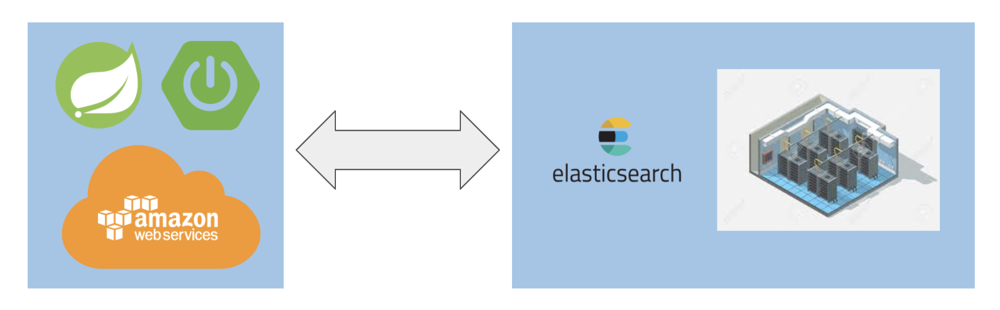
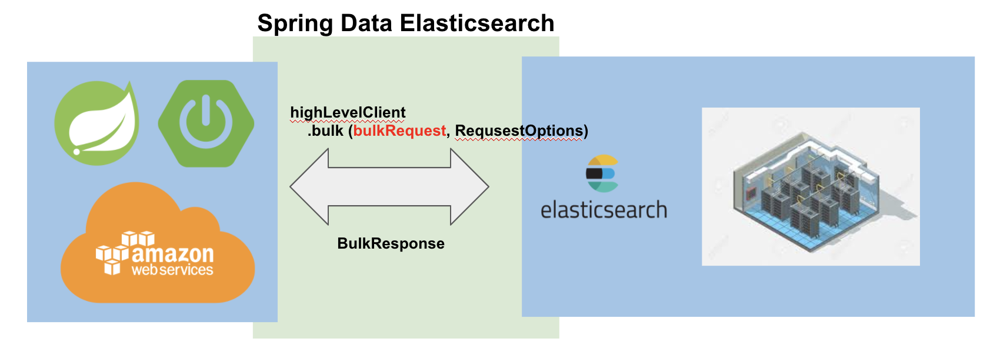
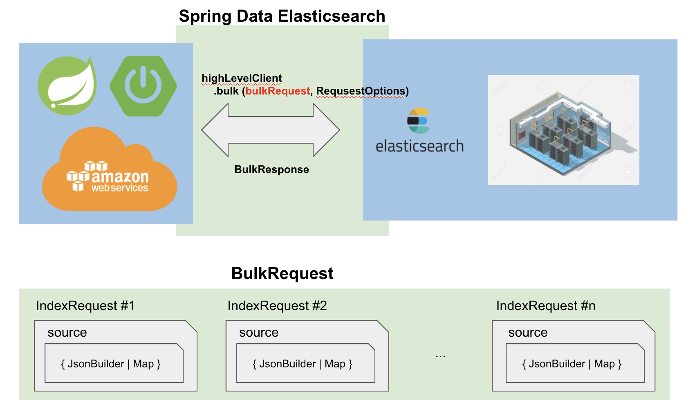
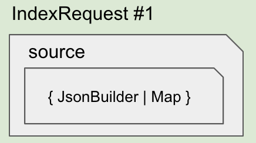
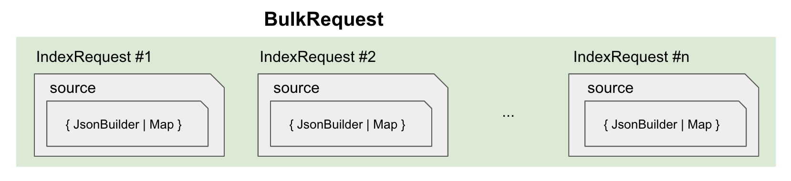

# High Level Client - Bulk Insert

> 기준금리(한국) 데이터를 샘플로 Bulk Insert 해보자


엘라스틱 서치 서버에 데이터를 BULK API 처리하는 경우 CURL 커맨드로도 수행 가능하다. 대표적으로 젠킨스에서 사용가능하다. 하지만 원하는 시점에 원하는 로직을 특정한 조건값을 주어서 실행시키고 싶을 때가 있다. 이럴 경우 프로그래밍 언어로 애플리케이션을 작성해서 변수에 의해 동작하는 동적인 프로그램을 작성할 수 있다.  ‌

Java/Kotlin 기반의 스프링 프레임워크 환경에서는 Elastic Search 팀에서 제공하는 라이브러리인 'Spring Data Elasticsearch' 에서 제공하는 High Level Client API 로 데이터를 벌크 INSERT 할 수 있다.  


# 참고할 만한 자료 ‌

- [Bulk API - Elastic Cloud 공식문서](https://www.elastic.co/guide/en/elasticsearch/client/java-rest/7.9/java-rest-high-document-bulk.html)
- [Index API - Elastic Cloud 공식문서](https://www.elastic.co/guide/en/elasticsearch/client/java-rest/7.9/java-rest-high-document-index.html) 
  - index request 를 생성하는 방식에 대해서 찾아봤다.
  - index request 생성시 timeout 등을 어떻게 설정하는 지 등에 대해 설명해주고 있다.
- [단술님 블로그 - Bulk Api 를 활용하여 Elasticsearch에 대량 데이터 인덱스하기](https://triest.tistory.com/45)
  - 이 자료를 보고 어느정도의 힌트를 얻어서 공식문서를 참고하게 되었다. 


# 환경설정, 의존성 추가

환경설정 및 의존성추가, Elastic Search 데이터 소스를 스프링 부트에 연동하는 과정은 아래의 자료에 정리해두었다.

[Spring과 ElasticSearch 7.x 연동하기](https://gosgjung.gitbook.io/lognomy/lognomy/spring-data-elasticsearch/high-level-client-api/data-jpa)

‌

# Spring 과 ElasticSearch 간의 커뮤니케이션



ElasticSearch 서버와 Spring/Spring Boot 사이에서 서로 통신을 해야 하는데 이때 Java 클라이언트에서 사용하는 것이 Spring Data ElasticSearch의 High Level Client API 이다.



Bulk INSERT API 를 사용시에는 데이터를 특정 단위로 묶어서 아래 그림처럼 묶음 단위로 Elastic Search 서버에 Request를 보내야 한다. 이때 사용하는 것이 Bulk Request 이다.

‌

Spring Data Elasticsearch와 데이터를 주고받기 위한 하나의 요청단위 DTO 를 생성할 때 BulkRequest 타입으로 생성한다. BulkRequest는 여러개의 IndexRequest 들을 리스트 자료구조 처럼 가지고 있는다. 그리고, IndexRequest 내에는 source 프로퍼티에 JsonBuilder 또는 Map 타입의 데이터 교환을 위한 DTO 를 가지고 있는다.


# 단위 데이터 형식 (JsonBuilder, Map)

소제목을 어떻게 지을지를 몰라서 '단위 데이터 형식' 이라고 짓기는 했다. 아무리 생각해도 제목이 너무 어색하긴 하다. 나중에 적당한 용어가 생각나면 수정해야지.  



‌

위의 그림에서 IndexRequest의 source 프로퍼티 내부에 포함되는 `{ JsonBuilder | Map }` 형식의 개념을 정리해보자.  

단위 데이터 형식(JsonBuilder, Map)을 구성하는 과정을 사람이 이해할 수 있는 단어로 요약해보면 이렇다.  

> 단위 데이터의 묶음을 IndexRequest에 담고, IndexRequest를 BulkRequest 에 담는다. 이때 단위 데이터의 형식은 JsonBuilder가 될수도 있고, Map 형식이 될수도 있다.  
>
> 단위 데이터의 묶음은 IndexRequest의 source 프로퍼티에 지정되고, IndexRequest는 Bulk Request 내에 리스트 형식으로 차곡 차곡 하나씩 쌓이고, 최종적으로 bulk 메서드를 호출할때 request를 Elasticsearch에 전달하게 된다.  

이렇게 하는 이유는 Elastic Search에서 받아들이는 데이터의 형식, 타입이 Spring/Spring Boot, Java/Kotlin 과는 다르기 때문인 것 같다.  

## 1) JsonBuilder

아직은 나 역시 초심자라 JsonBuilder에 대해서 명확하게 설명하지 못할것 같다. JsonBuilder 형식으로 데이터 교환형식 객체(DTO)를 만드는 부분을 단편적으로 예제로 정리해보면 아래와 같다.  

```kotlin
// ...
@SpringBootTest
class BulkKospiTest {
    // ...
    @Test
    @DisplayName("Bulk KOSPI TEST")
    fun testBulkInsert() : Unit {
        // ...
        val bulkRequest : BulkRequest = BulkRequest()
        bulkRequest.timeout("2m")
        bulkRequest.setRefreshPolicy(WriteRequest.RefreshPolicy.WAIT_UNTIL)

        dataList.forEach {
            // --1) builder 를 사용한 bulk 데이터 주입
            val builder: XContentBuilder = XContentFactory.jsonBuilder();
            builder.startObject();
            {
                builder.field("DATA_VALUE", it.dataValue)
                builder.field("STAT_NAME", it.statDesc)
                builder.field("ITEM_CODE1", it.midCategory)
                builder.field("STAT_CODE", it.topCategory)
                builder.field("ITEM_NAME1", it.dataName)
                builder.field("TIME", it.dateTime)
            }
            builder.endObject();
            val indexRequest = IndexRequest("kospi")
                    .id("time")
                    .source(builder)

            bulkRequest.add(indexRequest)

        }

        val bulkResponse = highLevelClient.bulk(bulkRequest, RequestOptions.DEFAULT)
        println(bulkResponse)
    }
}
```

`dataList.forEach { ... }` 내에서 데이터의 형식을 지정해주는 구문, IndexRequest 인스턴스를 생성하는 구문, BulkRequest에 IndexRequest 인스턴스를 추가해주는 작업을 한다. 데이터의 묶음을 IndexRequest에 담고, IndexRequest를 BulkRequest 에 담는 부분적인 로직을 살펴보자.

```kotlin
dataList.forEach {
    // --1) builder 를 사용한 bulk 데이터 주입
    val builder: XContentBuilder = XContentFactory.jsonBuilder();
    builder.startObject();
    {
        builder.field("DATA_VALUE", it.dataValue)
        builder.field("STAT_NAME", it.statDesc)
        builder.field("ITEM_CODE1", it.midCategory)
        builder.field("STAT_CODE", it.topCategory)
        builder.field("ITEM_NAME1", it.dataName)
        builder.field("TIME", it.dateTime)
    }
    builder.endObject();
    val indexRequest = IndexRequest("kospi")
            .id("time")
            .source(builder)

    bulkRequest.add(indexRequest)
}
```

- XContentFactory 클래스의 jsonBuilder() 메서드를 통해 생성한 Builder 인스턴스를 얻어낸다.
- Builder 인스턴스로 startObject() 를 하고, endObject(); 구문을 호출하기 전의 블록까지 INSERT 할 데이터의 묶음을 세팅해주는 작업을 한다.
- 그리고 이렇게 생성한 builder 인스턴스는 IndexRequest의 Source로 지정해서 BulkRequest에 add 해준다.

‌

## 2) Map 형식

```kotlin

@SpringBootTest
class BulkKospiTest {
    // ...
    @Test
    @DisplayName("Bulk KOSPI TEST")
    fun testBulkInsert() : Unit {
        // ...
        val bulkRequest : BulkRequest = BulkRequest()
        bulkRequest.timeout("2m")
        bulkRequest.setRefreshPolicy(WriteRequest.RefreshPolicy.WAIT_UNTIL)

        dataList.forEach {
            // --2) Map 을 활용한 bulk 데이터 주입
            val jsonMap = HashMap<String, Any>()
            jsonMap.put("DATA_VALUE", it.dataValue)
            jsonMap.put("STAT_NAME", it.statDesc)
            jsonMap.put("ITEM_CODE1", it.midCategory)
            jsonMap.put("STAT_CODE", it.topCategory)
            jsonMap.put("ITEM_NAME1", it.dataName)
            it.dateTime?.let { it1 -> jsonMap.put("TIME", it1) }

            val indexRequest = IndexRequest("kospi")
                    .id("time")
                    .source(jsonMap)

            bulkRequest.add(indexRequest)
        }

        val bulkResponse = highLevelClient.bulk(bulkRequest, RequestOptions.DEFAULT)
        println(bulkResponse)
    }
}
```

`dataList.forEach { ... }` 내에서 데이터의 형식을 지정해주는 구문, IndexRequest 인스턴스를 생성하는 구문, BulkRequest에 IndexRequest 인스턴스를 추가해주는 작업을 한다. 데이터의 묶음을 IndexRequest에 담고, IndexRequest를 BulkRequest 에 담는 부분적인 로직을 살펴보자.

‌

# Request 형식 (BulkRequest, IndexRequest)

Bulk Request는 인덱스에 색인(insert)될 도큐먼트 들에 대한 IndexRequest 들의 정보들을 토대로 Bulk 연산의 형태를 나타낸다. 그리고 HighLevelClient 클래스의 bulk 메서드 호출 시에  인자값으로 BulkRequest 를 전달된다. 그리고 이렇게 함으로써 HighLevelClient 의 bulk 메서드는 ElasticSearch 서버 인스턴스에 통신을 하게 된다.



BulkRequest 인스턴스는 여러개의 IndexRequest 를 가지고 있을 수 있는데 이 여러개의 IndexRequest를 모아두었다가 `highLevelClient.bulk(bulkRequest, RequestOption)` 구문을 호출함으로써 한꺼번에 수행하는 bulk 연산을 수행하게 된다.  

소스에서 Bulk Request를 보내는 부분만을 발췌해서 아래와 같이 정리해봤다.  


```kotlin
val bulkRequest : BulkRequest = BulkRequest()
bulkRequest.timeout("2m")
bulkRequest.setRefreshPolicy(WriteRequest.RefreshPolicy.WAIT_UNTIL)

dataList.forEach {
    // --2) Map 을 활용한 bulk 데이터 주입
    val jsonMap = HashMap<String, Any>()
    jsonMap.put("DATA_VALUE", it.dataValue)
    // ... 이것 저것 데이터 INSERT 작업 ... 

    val indexRequest = IndexRequest("kospi")
            .id("time")
            .source(jsonMap)

    bulkRequest.add(indexRequest)
}

val bulkResponse = highLevelClient.bulk(bulkRequest, RequestOptions.DEFAULT)
println(bulkResponse)
```

예로 든 예제의 동작을 간단히 요약해봤다.(사람이 이해할 수 있는 언어로)

- BulkRequest 인스턴스를 생성한다. BulkRequest 인스턴스에는 timeout, refreshPolicy 등 http 연산에 필요한 옵션들을 지정해둔다.
- dataList 라는 리스트를 순회한다. 이 dataList 는 bulk insert 하려는 데이터들의 리스트 이다.
- dataList 내의 각 데이터를 ElasticSearch 도큐먼트의 필드에 맞도록 Map 형태로 가공한다.
- 가공한 Map 형태의 데이터는 IndexRequest 내의  source 프로퍼티에 세팅해준다.
- 이렇게 각각의 IndexRequest는 미리 생성해둔 BulkRequest 인스턴스 내에 순서대로 차곡차곡 쌓아둔다.
- 마지막으로 High Level Client 인스턴스를 이용해서 bulk 함수를 호출해서 bulk 연산을 수행한다. 이때 미리 생성해둔 Bulk Request를 인자값으로 전달해준다. Bulk Request는 조금 전에 IndexRequest들을 차곡 차곡 쌓아둔 상태이다.

‌

# 테스트 코드‌

## 1) builder 를 사용한 Bulk 데이터 주입

```kotlin
package io.chart.lognomy.trending.korbank

import io.chart.lognomy.external.korbank.KorbankSearchService
import org.elasticsearch.action.bulk.BulkRequest
import org.elasticsearch.action.index.IndexRequest
import org.elasticsearch.action.support.WriteRequest
import org.elasticsearch.client.RequestOptions
import org.elasticsearch.client.RestHighLevelClient
import org.elasticsearch.common.xcontent.XContentBuilder
import org.elasticsearch.common.xcontent.XContentFactory
import org.junit.jupiter.api.DisplayName
import org.junit.jupiter.api.Test
import org.springframework.beans.factory.annotation.Autowired
import org.springframework.beans.factory.annotation.Qualifier
import org.springframework.boot.test.context.SpringBootTest

@SpringBootTest
class BulkKospiTest {

    @Qualifier("elasticsearchClient")
    @Autowired
    lateinit var highLevelClient: RestHighLevelClient

    @Autowired
    lateinit var korbankSearchService: KorbankSearchService

    @Test
    @DisplayName("Bulk KOSPI TEST")
    fun testBulkInsert() : Unit {

        val dailyData = korbankSearchService.selectDailyKospi(
                startDate = "20180101", endDate = "20180105"
        )

        val (list_total_count, dataList) = dailyData.statisticSearch

        val bulkRequest : BulkRequest = BulkRequest()
        bulkRequest.timeout("2m")
        bulkRequest.setRefreshPolicy(WriteRequest.RefreshPolicy.WAIT_UNTIL)

        dataList.forEach {
            // --1) builder 를 사용한 bulk 데이터 주입
            val builder: XContentBuilder = XContentFactory.jsonBuilder();
            builder.startObject();
            {
                builder.field("DATA_VALUE", it.dataValue)
                builder.field("STAT_NAME", it.statDesc)
                builder.field("ITEM_CODE1", it.midCategory)
                builder.field("STAT_CODE", it.topCategory)
                builder.field("ITEM_NAME1", it.dataName)
                builder.field("TIME", it.dateTime)
            }
            builder.endObject();
            val indexRequest = IndexRequest("kospi")
                    .id("time")
                    .source(builder)

            bulkRequest.add(indexRequest)

        }

        val bulkResponse = highLevelClient.bulk(bulkRequest, RequestOptions.DEFAULT)
        println(bulkResponse)
    }
}
```


## 2) JsonMap 을 활용한 Bulk 데이터 주입 

```kotlin
package io.chart.lognomy.trending.korbank

import io.chart.lognomy.external.korbank.KorbankSearchService
import org.elasticsearch.action.bulk.BulkRequest
import org.elasticsearch.action.index.IndexRequest
import org.elasticsearch.action.support.WriteRequest
import org.elasticsearch.client.RequestOptions
import org.elasticsearch.client.RestHighLevelClient
import org.elasticsearch.common.xcontent.XContentBuilder
import org.elasticsearch.common.xcontent.XContentFactory
import org.junit.jupiter.api.DisplayName
import org.junit.jupiter.api.Test
import org.springframework.beans.factory.annotation.Autowired
import org.springframework.beans.factory.annotation.Qualifier
import org.springframework.boot.test.context.SpringBootTest

@SpringBootTest
class BulkKospiTest {

    @Qualifier("elasticsearchClient")
    @Autowired
    lateinit var highLevelClient: RestHighLevelClient

    @Autowired
    lateinit var korbankSearchService: KorbankSearchService

    @Test
    @DisplayName("Bulk KOSPI TEST")
    fun testBulkInsert() : Unit {

        val dailyData = korbankSearchService.selectDailyKospi(
                startDate = "20180101", endDate = "20180105"
        )

        val (list_total_count, dataList) = dailyData.statisticSearch

        val bulkRequest : BulkRequest = BulkRequest()
        bulkRequest.timeout("2m")
        bulkRequest.setRefreshPolicy(WriteRequest.RefreshPolicy.WAIT_UNTIL)
//        bulkRequest.setRefreshPolicy("wait_for")

        dataList.forEach {
            // --2) Map 을 활용한 bulk 데이터 주입
            val jsonMap = HashMap<String, Any>()
            jsonMap.put("DATA_VALUE", it.dataValue)
            jsonMap.put("STAT_NAME", it.statDesc)
            jsonMap.put("ITEM_CODE1", it.midCategory)
            jsonMap.put("STAT_CODE", it.topCategory)
            jsonMap.put("ITEM_NAME1", it.dataName)
            it.dateTime?.let { it1 -> jsonMap.put("TIME", it1) }

            val indexRequest = IndexRequest("kospi")
                    .id("time")
                    .source(jsonMap)

            bulkRequest.add(indexRequest)
        }

        val bulkResponse = highLevelClient.bulk(bulkRequest, RequestOptions.DEFAULT)
        println(bulkResponse)
    }
}
```

