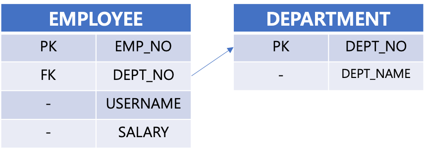
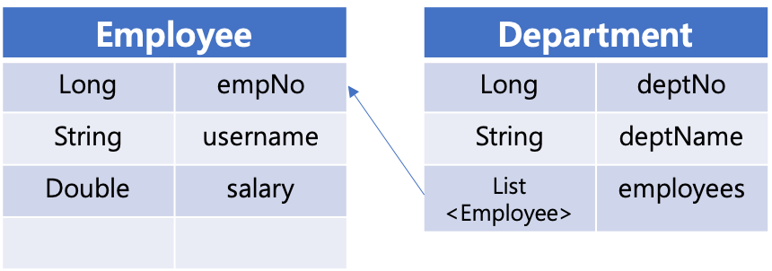
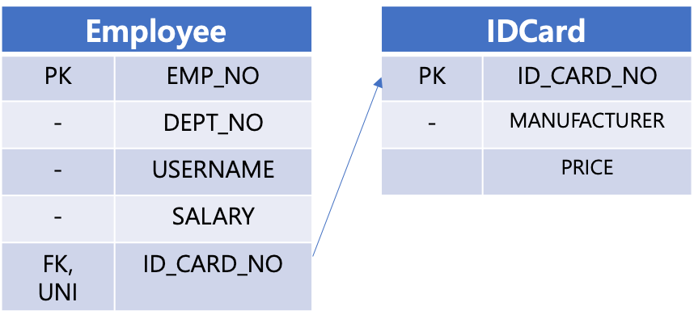

# 엔티티매핑 4종류

JPA에서 엔티티 매핑을 하는 방식은 아래와 같이 크게 네 가지의 관계로 나뉘어 진다.

- 1:N 관계
- N:1 관계
- 1:1 관계
- N:M 관계


# 1. 연관관계 매핑시 고려사항

엔티티의 연관관계를 매핑할 때 주요하게 고민하는 사항들은 아래와 같이 크게 3가지이다.

- 매핑관계
  - @ManyToOne
  - @OneToMany
  - @OneToOne
  - @ManyToMany (거의 쓰이지 않는 편)
- 단방향 vs 양방향
- 연관관계의 주인을 어디에 둘 것인지


# 2. 단방향 ? 양방향?

## 테이블의 관점

- FK로 양쪽 테이블을 조인 가능하다.
- 방향 개념이 없다. (논리적인 의미의 방향 개념을 둘 필요가 없다)

  

## 객체 지향식 관점

- 참조용 필드가 있는 쪽으로만 참조 가능
- 단방향 참조, 양방향 참조 두 가지 중 한가지 방식으로 참조 관계를 지정한다.
- 주 테이블은 보통 상대편 테이블의 PK를 FK로 가진다.

  

# 3. 연관관계의 주인

- 서로 다른 두 테이블을 조인 할 때 FK로 두 테이블이 연관관계를 맺는다.
- 객체 양방향 관계는 A->B, B->A로 각각 관계를 맺는 방식 (따라서 참조점이 2군데)
- 두 테이블 중 FK를 관리할 테이블을 지정해주어야 한다. 
- **연관관계의 주인** 
  - **대상(Target)테이블의 PK를 FK로 가지고 있는 참조**
  - 객체 매핑시에 연관관계의 주인을 정해주어야 한다. (단순 쿼리시에는 이러한 것이 별 필요가 없긴 하다.)
  - **@JoinColumn 이 있는 클래스가 연관관계의 주인**이다.
- **주인의 반대편**
  - 외래 키에 영향을 주지 않는다.
  - 단순 조회만 가능하다.
  - **@XtoX(mappedBy= "") 을 두는 곳이 주인의 상대편**이다.
    - 매핑당하는 입장이고 읽기 전용 필드이다.


# 4. 다대일 ? 일대다? 두개를 어떻게 구분해?

- 1:N 관계
  - @OneToMany 인 곳에서 @JoinColumn을 통해 관계를 맺는다.
- N:1 관계
  - @ManyToOne 인 곳에서 @JoinColumn을 통해 관계를 맺는다.
- 1:1 관계
  - 추후 정리 예정 !TODO
- N:M 관계
  - 추후 정리 예정 !TODO


# 5. 1:N 관계 (Employee, Department)

## 테이블 

Employee, Department 테이블이 있다고 해보자. 관계는 아래와 같다.


## 객체 관계 표현

> 1:N 관계는 항상 항상 N (다)쪽에 외래키가 있다.  
>
> 객체와 테이블의 차이 때문에 반대편 테이블의 외래 키를 관리하는 특이한 구조를 가지고 있다.
>
> **@OneToMany 인 쪽에서 @JoinColumn을 통해 관계를 맺는다.**

### 단방향

- 권장되는 방식은 아니다.  
  - 1:N(일대다) 단방향 매핑보다는 N:1 (다대일) 단방향을 사용하다가 필요시에 양방향으로 추가해주는 방식으로 하는 것이 더 권장된다.

- **@JoinColumn** 을 사용해 자기 자신의 테이블내에서 상대 테이블이 조인할 컬럼을 지정해준다. (이 컬럼으로 조인하세요. 라는 의미)   
- @JoinColumn 을 사용하지 않으면 중간에 매핑테이블이 하나 더 생긴다. (JoinTable 방식을 사용하게 된다. JPA가 테이블을 하나 더 추가해주는 것)

- Department 안에는 List \<Employee> employees 가 있다. 하지만, Employee 에서는 Department 를 신경쓰고 싶지 않을 경우 사용(아래 코드에서 보다시피 Employee 내부에는 어떠한 mappedBy 등의 코드가 없다.)  
- 단점으로는 insert 하고나서 update 쿼리도 나간다는 점이다. 운영상에서도 성능상에 이슈를 낼 수 있다는 점이 단점이다. 또한 실무에서 관리하게 되는 테이블의 갯수만 해도 엄청나게 많기 때문에 이런 경우는 관리가 힘들어진다.
- 분명 나는 Department에 손을 댔는데, 왜 Employee 테이블에 update쿼리가 나가지? 하는 의문점이 생기기 쉽다. 


#### Employee.java

```java
@Builder
@Getter @Setter
@Entity(name = "EMPLOYEE")
public class Employee {

	@Id @GeneratedValue
	@Column(name = "EMP_NO")
	private Long id;

	@Column(name = "USERNAME")
	private String username;

	@Column(name = "SALARY")
	private Double salary;

}
```


#### Departmemt.java

```java
@Builder
@Getter @Setter
@Entity(name = "DEPARTMENT")
public class Department {

	@Id @GeneratedValue
	@Column(name = "DEPT_NO")
	private Long deptNo;

	@Column(name = "DEPT_NAME")
	private String deptName;

	@OneToMany
	@JoinColumn(name = "DEPT_NO")
	private List<Employee> employees = new ArrayList<>();

}
```


#### 테스트 코드

```java
@SpringBootTest
@Transactional
@Commit
public class MappingTest {

	@Autowired
	private EntityManager em;

	@Test
	void testInsertEmployees(){
		System.out.println("======= Employee 객체 생성 =======");
		Employee e1 = Employee.builder()
			.username("경찰관#1")
			.salary(1000D)
			.build();

		System.out.println("======= em.persist(e1) =======");
		em.persist(e1);

		System.out.println("======= Department 객체 생성 =======");

		Department d1 = Department.builder()
			.deptName("소하1동경찰서")
			.employees(new ArrayList<>())
			.build();							// DEPARTMENT 테이블에 INSERT 하면 되는 내용이다.

		System.out.println("======= Department.employees.add(e1) =======");
		d1.getEmployees().add(e1);				// DEPARTMENT 테이블에 INSERT 될수 있는 내용은 아니다.
												// DEPARTMENT 테이블이 아니라 EMPLOYEE 테이블을 UPDATE 하게 된다.

		System.out.println("======= em.persist(d1) =======");
		em.persist(d1);
	}

	@AfterEach
	void close(){
		em.close();
	}
}
```


#### 출력결과

```
... 중략 ...
======= Employee 객체 생성 =======
======= em.persist(e1) =======
2020-09-05 15:28:23.684 DEBUG 26212 --- [           main] org.hibernate.SQL                        : 
    insert 
    into
        employee
        (salary, username) 
    values
        (?, ?)
======= Department 객체 생성 =======
======= Department.employees.add(e1) =======
======= em.persist(d1) =======
2020-09-05 15:28:23.704 DEBUG 26212 --- [           main] org.hibernate.SQL                        : 
    insert 
    into
        department
        (dept_name) 
    values
        (?)
2020-09-05 15:28:23.723 DEBUG 26212 --- [           main] org.hibernate.SQL                        : 
    update
        employee 
    set
        dept_no=? 
    where
        emp_no=?
... 중략
```


> 참고)  
>
> 위의 테스트 코드에서 @Commit 을 붙이지 않거나 em.commit() 을 명시적으로 호출해주지 않으면 update 쿼리는 나가지 않는다.


### 양방향

- 공식적으로 지원하는 바식은 아니다.
- @JoinColumn(name="DEPT_NO", insertable=false, updatable=false)  
  private Department dept;  
  을 Employee 클래스 내의 department 매핑에 추가해준다.
- 읽기 전용 필드로 만들어서 양방향인 것 처럼 사용하는 방식이다.
- 1:N 단방향/양방향 보다는 N:1 양방향이 권장된다.


#### Employee.java

```java
@Builder
@Getter @Setter
@Entity(name = "EMPLOYEE")
public class Employee {

	@Id
	@GeneratedValue
	@Column(name = "EMP_NO")
	private Long id;

	@Column(name = "USERNAME")
	private String username;

	@Column(name = "SALARY")
	private Double salary;

	@ManyToOne
	@JoinColumn(name = "DEPT_NO", insertable = false, updatable = false)
	private Department department;
}
```


#### Department.java

```java
@Builder
@Getter @Setter
@Entity(name = "DEPARTMENT")
public class Department {

	@Id
	@GeneratedValue
	@Column(name = "DEPT_NO")
	private Long deptNo;

	@Column(name = "DEPT_NAME")
	private String deptName;

	@OneToMany
	@JoinColumn(name = "DEPT_NO")
	private List<Employee> employees = new ArrayList<>();

}
```


#### 테스트 코드

```java
package io.study.erd_example.onetomany.entity;

import java.util.ArrayList;
import javax.persistence.EntityManager;
import org.junit.jupiter.api.AfterEach;
import org.junit.jupiter.api.Test;
import org.springframework.beans.factory.annotation.Autowired;
import org.springframework.boot.test.context.SpringBootTest;
import org.springframework.test.annotation.Commit;
import org.springframework.transaction.annotation.Transactional;

@SpringBootTest
@Transactional
@Commit
public class MappingTest {

	@Autowired
	private EntityManager em;

	@Test
	void testMapping(){
		System.out.println("======= Employee 객체 생성 =======");
		Employee e1 = Employee.builder()
			.username("경찰관#1")
			.salary(1000D)
			.build();

		System.out.println("======= em.persist(e1) =======");
		em.persist(e1);

		System.out.println("======= Department 객체 생성 =======");

		Department d1 = Department.builder()
			.deptName("소하1동경찰서")
			.employees(new ArrayList<>())
			.build();							// DEPARTMENT 테이블에 INSERT 하면 되는 내용이다.

		System.out.println("======= Department.employees.add(e1) =======");
		d1.getEmployees().add(e1);				// DEPARTMENT 테이블에 INSERT 될수 있는 내용은 아니다.
												// DEPARTMENT 테이블이 아니라 EMPLOYEE 테이블을 UPDATE 하게 된다.

		System.out.println("======= em.persist(d1) =======");
		em.persist(d1);
	}

	@AfterEach
	void close(){
		em.close();
	}
}
```


#### 출력결과

```
... 중략 ...
======= Employee 객체 생성 =======
======= em.persist(e1) =======
2020-09-05 16:47:57.226 DEBUG 28127 --- [           main] org.hibernate.SQL                        : 
    insert 
    into
        employee
        (salary, username) 
    values
        (?, ?)
======= Department 객체 생성 =======
======= Department.employees.add(e1) =======
======= em.persist(d1) =======
2020-09-05 16:47:57.249 DEBUG 28127 --- [           main] org.hibernate.SQL                        : 
    insert 
    into
        department
        (dept_name) 
    values
        (?)
2020-09-05 16:47:57.270 DEBUG 28127 --- [           main] org.hibernate.SQL                        : 
    update
        employee 
    set
        dept_no=? 
    where
        emp_no=?
... 중략 ...
```


# 6. N:1 관계 (Employee, Department)

## 테이블




## 객체관계

> **Many 에 해당하는 쪽인 Employee 에서 @JoinColumn을 통해 관계를 맺는다.**

### 단방향

> @JoinColumn 을 @ManyToOne으로 지정한 엔티티 Employee 에 두었다.  
>
> 상대편인 Department에서는 아무 작업도 하지 않는다.  


  


#### Employee.java

```java
@Builder
@Getter @Setter
@Entity(name = "EMPLOYEE")
public class Employee {

	@Id
	@GeneratedValue
	@Column(name = "EMP_NO")
	private Long id;

	@Column(name = "USERNAME")
	private String username;

	@Column(name = "SALARY")
	private Double salary;

	@ManyToOne
	@JoinColumn(name = "DEPT_NO")
	private Department department;
}
```


#### Department.java

```java
@Builder
@Getter @Setter
@Entity(name = "DEPARTMENT")
public class Department {

	@Id
	@GeneratedValue
	@Column(name = "DEPT_NO")
	private Long deptNo;

	@Column(name = "DEPT_NAME")
	private String deptName;

}
```


#### 테스트 코드

```java
@SpringBootTest
@Transactional
@Commit
public class MappingTest {

	@Autowired
	private EntityManager em;

	@Test
	@DisplayName("N:1(다대일) 단방향 매핑 테스트 >>> ")
	void testMapping(){
		System.out.println("======= Department 객체 생성 =======");
		Department d1 = Department.builder()
			.deptName("소방서#1")
			.build();

		System.out.println("======= em.persist(department) =======");
		em.persist(d1);

		System.out.println("======= Employee 객체 생성 =======");
		Employee e1 = Employee.builder()
			.salary(2000D)
			.username("소방관#1")
			.department(d1)
			.build();

		System.out.println("======= em.persist(employee) =======");
		em.persist(e1);
	}

}
```


#### 출력결과

```
======= Department 객체 생성 =======
======= em.persist(department) =======
2020-09-05 20:07:53.573 DEBUG 30135 --- [           main] org.hibernate.SQL                        : 
    insert 
    into
        department
        (dept_name) 
    values
        (?)
======= Employee 객체 생성 =======
======= em.persist(employee) =======
2020-09-05 20:07:53.588 DEBUG 30135 --- [           main] org.hibernate.SQL                        : 
    insert 
    into
        employee
        (dept_no, salary, username) 
    values
        (?, ?, ?)
```


### 양방향




#### Employee.java

```java
@Builder
@Getter @Setter
@Entity(name = "EMPLOYEE")
public class Employee {

	@Id
	@GeneratedValue
	@Column(name = "EMP_NO")
	private Long id;

	@Column(name = "USERNAME")
	private String username;

	@Column(name = "SALARY")
	private Double salary;

	@ManyToOne
	@JoinColumn(name = "DEPT_NO")
	private Department department;
}
```


#### Department.java

```java
@Builder
@Getter @Setter
@Entity(name = "DEPARTMENT")
public class Department {

	@Id @GeneratedValue
	@Column(name = "DEPT_NO")
	private Long id;

	@Column(name = "DEPT_NAME")
	private String deptName;

	@OneToMany(mappedBy = "department")
	private List<Employee> employees = new ArrayList<>();

	public void addEmployee(Employee e){
		e.setDepartment(this);
		employees.add(e);
	}
}
```


#### 테스트코드

```java
@SpringBootTest
@Transactional
@Commit
public class MappingTest {

	@Autowired
	private EntityManager em;

	@Test
	@DisplayName("N:1(양방향) 매핑관계 테스트 ")
	public void testMapping(){

		System.out.println("======= Department 객체 생성 =======");
		Department d1 = Department.builder()
			.deptName("소하1동 소방서")
			.employees(new ArrayList<>())
			.build();

		System.out.println("======= em.persist(department) =======");
		em.persist(d1);

		System.out.println("======= Employee 객체 생성 =======");
		Employee e1 = Employee.builder()
			.salary(5000D)
			.username("소방관@1")
			.department(d1)
			.build();

		d1.addEmployee(e1);

		System.out.println("======= em.persist(employee) =======");
		em.persist(e1);
	}
}
```


#### 출력결과

```
======= Department 객체 생성 =======
======= em.persist(department) =======
2020-09-05 20:51:28.412 DEBUG 31345 --- [           main] org.hibernate.SQL                        : 
    insert 
    into
        department
        (dept_name) 
    values
        (?)
======= Employee 객체 생성 =======
======= em.persist(employee) =======
2020-09-05 20:51:28.428 DEBUG 31345 --- [           main] org.hibernate.SQL                        : 
    insert 
    into
        employee
        (dept_no, salary, username) 
    values
        (?, ?, ?)
```


# 7. 1:1 관계 (Employee, IDCard)

1대 1 관계는 그 반대 역시 1대 1 관계이다.  

매핑을 맺을 두 테이블 들 사이에서 외래키를 가질 테이블을 선택할 때  

- 주 테이블에 외래키를 놓아도 되고
  - @JoinColumn 이 Employee 에 있다.
- 대상 테이블에 외래키를 놓아도 된다.
  - @JoinColumn 을 IDCard 측에 놓는다.
- 외래키에 데이터베이스 유니크 제약조건을 추가해야 한다.  

 

## 참고) 

**주 테이블이 외래키를 가지고 있는 경우**  

- 양방향 매핑이 가능하다.
- 외래키를 가지고 있는 테이블이 연관관계의 주인이다.
- Ex)
  - **@JoinColumn 이 Employee 에 있는 경우**
  - IDCard의 ID_CARD_NO(PK)는 Employee 에게서 매핑당하고 있다.
- 객체 지향 개발자가 선호하는 방식, JPA 매핑에 편리하다.
- 장점 : 주 테이블만 조회해도 대상 테이블에 데이터가 있는지 확인 가능하다.
- 단점 : 값이 없으면 외래키에  NULL을 허용하게 된다. 


**대상(타겟) 테이블에 외래키를 가지고 있는 경우**  

- 단방향 매핑은 불가능하다.

- 양방향 매핑시 주 테이블에 외래키 양방향 매핑과 매핑 방법이 같다.

- Ex)

  - **@JoinColumn 을 IDCard 측에 놓고 매핑을 시작**

- IDCard에 EMP_NO를 놓고 억지로 매핑시켜보는 경우

- 장점 : 주 테이블과 대상 테이블을 일대일에서 일대 다 관계로 변경할 때 테이블 구조를 유지할 수 있다.

- 단점 : 프록시 기능의 한계로 지연로딩으로 설정해도 항상 즉시 로딩된다.

  - fetch join 등의 방식으로 해결할 수 있다.

  

**DBA 입장 vs 개발자 입장**  

## !TODO 정리 필요 

DBA입장에서는 IDCARD 테이블에서 EMPLOYEE 테이블의 PK를 가지고 있는 것이 미래에 테이블의 설계가 변경되었을 때 대응이 용이한 점은 있다.  

사원 한명이 여러개의 IDCARD를 가질수도 있다 이런식으로 규칙이 변경될 가능성을 생각한다면, DBA입장에서는 UNIQUE 조건만 제거하면 된다. 이렇게 하고나서 1:1 에서 1:N으로 설계를 바꾼다...  

그런데 만약 주테이블에 외래키를 소유한 경우가 된다면, IDCARD를 여러개 소유할 수 있도록 변경할 경우 변경사항이 많아진다. (IDCARD에 컬럼을 추가하고 EMPLOYEE 테이블에서 ID_CARD_NO 를 제거하는 등의 작업) 그런데 또... 이번엔 하나의  IDCARD를 여러개의 EMPLOYEE가 소유할 수 있다면 또 주 테이블에 외래키를 두는 것이 좋은 설계가 된다.  

개발자 입장에서는 Employee에 idCard가 있는게 성능상 더 유리하다. Employee에 IdCard가 있으면 Join을 불필요하게 할 필요가 없기 때문에 유연해진다.  

주 테이블에 외래키를 두는 것이 개발자 입장에서는 훨씬 성능상 유리하지만, DBA와의 이견이 있을 경우는 서로 조율해나가야 한다고 한다.  

개발에 있어서 성능이 필요한 것과 미래의 데이터 유지보수 및 유연성을 고려하는 것은 실제 프로젝트의 성격에 따라 결정하는 것이 맞고, 엑셀에 직접 컬럼들에 대한 데이터들을 직접 써보고 데이터가 어떻게 들어갈지 시나리오를 만들어서 1:1, N:1, N:N, 1:N 등의 모델을 조합하는 것이 좋다.  


## 주 테이블에 외래키 




### 단방향


  

#### Employee.java

```java
@Builder
@Getter @Setter
@Entity(name = "EMPLOYEE")
public class Employee {

	@Id @GeneratedValue
	@Column(name = "EMP_NO")
	private Long id;

	@Column(name = "USERNAME")
	private String username;

	@Column(name = "SALARY")
	private Double salary;

	@OneToOne
	@JoinColumn(name = "ID_CARD_NO")
	private IDCard idCard;

}
```

  

#### IDCard.java

```java
@Builder
@Getter @Setter
@Entity(name = "IDCARD")
public class IDCard {

	@Id @GeneratedValue
	@Column(name = "ID_CARD_NO")
	private Long id;

	@Column(name = "MANUFACTURER")
	private String manufacturer;

	@Column(name = "PRICE")
	private Double price;
}
```

  

#### 테스트 코드

```java
@SpringBootTest
@Transactional
@Commit
public class MappingTest {

	@Autowired
	private EntityManager em;

	@Test
	@DisplayName("1:1(1대1) 단방향 >>> 주인테에블에 FK를 둘 때")
	public void testMapping(){

		System.out.println("======= IDCard 객체 생성 =======");
		IDCard idCard = IDCard.builder()
			.manufacturer("삼성")
			.price(1000D)
			.build();

		System.out.println("======= em.persist(idCard) =======");
		em.persist(idCard);

		System.out.println("======= Employee 객체 생성 =======");
		Employee e1 = Employee.builder()
			.idCard(idCard)
			.salary(2000D)
			.username("소방관#1")
			.build();

		System.out.println("======= em.persist(e1) =======");
		em.persist(e1);

	}
}
```

  

#### 출력결과

```
======= IDCard 객체 생성 =======
======= em.persist(idCard) =======
2020-09-06 20:34:01.550 DEBUG 41017 --- [           main] org.hibernate.SQL                        : 
    insert 
    into
        idcard
        (manufacturer, price) 
    values
        (?, ?)
======= Employee 객체 생성 =======
======= em.persist(e1) =======
2020-09-06 20:34:01.570 DEBUG 41017 --- [           main] org.hibernate.SQL                        : 
    insert 
    into
        employee
        (id_card_no, salary, username) 
    values
        (?, ?, ?)
```


### 양방향


  

#### Employee.java

```java
@Builder
@Getter @Setter
@Entity(name = "EMPLOYEE")
public class Employee {

	@Id @GeneratedValue
	@Column(name = "EMP_NO")
	private Long id;

	@Column(name = "USERNAME")
	private String username;

	@Column(name = "SALARY")
	private Double salary;

	@OneToOne
	@JoinColumn(name = "ID_CARD_NO")
	private IDCard idCard;
}
```

  

#### IDCard.java

```java
@Builder
@Getter @Setter
@Entity(name = "IDCARD")
public class IDCard {

	@Id @GeneratedValue
	@Column(name = "ID_CARD_NO")
	private Long id;

	@Column(name = "MANUFACTURER")
	private String manufacturer;

	@Column(name = "PRICE")
	private Double price;

	@OneToOne(mappedBy = "idCard")
	private Employee employee;
}
```


#### 테스트 코드

```java
@SpringBootTest
@Transactional
@Commit
public class MappingTest {

	@Autowired
	private EntityManager em;

	@Test
	@DisplayName("1:1 (1대1) 양방항 >>> 주인테이블에 FK를 둘때 ")
	public void testMapping(){

		System.out.println("======= IDCard 객체 생성 =======");
		IDCard idCard = IDCard.builder()
			.manufacturer("삼성")
			.price(1000D)
			.build();

		System.out.println("======= em.persist(idCard) =======");
		em.persist(idCard);

		System.out.println("======= Employee 객체 생성 =======");
		Employee e1 = Employee.builder()
			.idCard(idCard)
			.salary(2000D)
			.username("소방관#1")
			.build();

		System.out.println("======= em.persist(e1) =======");
		em.persist(e1);

	}
}
```

  

#### 출력결과

```
======= IDCard 객체 생성 =======
======= em.persist(idCard) =======
2020-09-06 20:54:33.909 DEBUG 41711 --- [           main] org.hibernate.SQL                        : 
    insert 
    into
        idcard
        (manufacturer, price) 
    values
        (?, ?)
======= Employee 객체 생성 =======
======= em.persist(e1) =======
2020-09-06 20:54:33.927 DEBUG 41711 --- [           main] org.hibernate.SQL                        : 
    insert 
    into
        employee
        (id_card_no, salary, username) 
    values
        (?, ?, ?)
```


