# 내부 동작 방식과 영속성 컨텍스트

JPA를 사용할 때 아래 두가지의 개념을 핵심적으로 이해해야 한다.

- ORM
  - 객체와 관계형 DB 매핑
  - C언어의 포인터 급으로 러닝커브가 되는 요소
- 영속성 컨텍스트
  - 역시 중요
  - 아래의 서브 개념들이 항상 실무에서 까먹었다가 다시 꺼내와야 하는 개념들...
    - 동일성(identity) 보장
    - 트랜잭션 지원 쓰기 지연 (transactional write-behind)
    - 변경감지 (Dirty Checking)
    - 지연로딩 (Lazy Loading)

  

여기서는 위의 두가지 큰 개념들 중에서 여기서는 내부 동작방식에 해당하는 

- 영속성 컨텍스트

의 개념을 다루고 부가적으로

- 플러시
- 준영속 상태

를 부가적으로 정리할 예정이다.  


# 1. 엔티티, 엔티티 매니저, 엔티티 매니저 팩토리

엔티티, 엔티티 매니저, 엔티티 매니저 팩토리에 대한 개념부터 잡고 가자.


각각의 개념을 의미로 곱씹고 넘어간다면, 문자 그대로 접하는 것보다는 더 실질적으로 다가온다. 물론, 이건 약간의 뇌피셜을 섞어서 요약했다. (아직까지는 강의에 없는 내용. 굉장히 주관적으로 짧게 요약하고 결론지은 내 의견일 뿐이다... 추후 강의에서 해당 개념을 접한다면, 잘못된 내용은 수정할 예정)


## 엔티티 (Entity)

> - 관계형 DB의 개념을 객체지향적으로 표현한 개념이다.
> - 테이블의 로우(레코드)에 해당하는 데이터에 대한 객체지향적 매핑
> - 테이블 구조에 대한 논리적인 표현

  

## 엔티티 매니저 (EntityManager)

> - 엔티티를 관리하는 녀석이다.
> - 엔티티 매니저(EntityManager) 인스턴스를 생성 및 관리하는 역할을 수행한다.

  

## 엔티티 매니저 팩토리 (EntityManagerFactory)

> - 엔티티 매니저를 관리하는 녀석이다.
> - 엔티티 매니저 인스턴스를 생성 및 관리하는 역할을 수행한다.


## 엔티티, 엔티티 매니저, 엔티티 매니저 팩토리 각각의 역할/관계

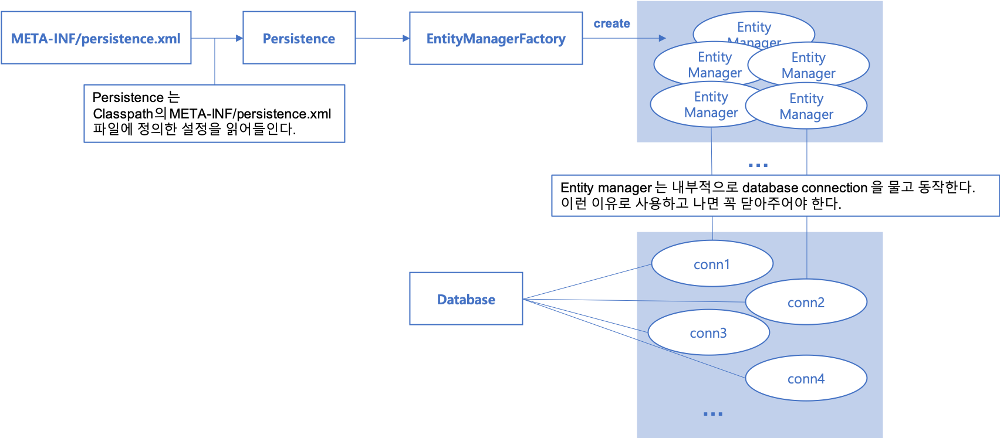


# 2. 영속성 컨텍스트

> 영속성 컨텍스트에 접근시, 보통 엔티티 매니저를 통해서 접근한다. 주로 "컨텍스트"라는 용어는 컴공을 전공하다보면 자주 만나는 단어이다. 컨텍스트라는 개념은 프로그램이 어떤 동작을 할때 지금 흐름상 어느 위치인지를 가리키는 용어로 쓰이기도 한다. (ex.컨텍스트 스위칭 : 서로 다른 여러 스레드간 경쟁이 있을때 라운드로빈 등으로 스레드 스케쥴링을 하기도 하는데, 스레드 #1 에서 스레드 #2로 전환하는 것을 컨텍스트 스위칭이라 한다. 근데... 나 이거 왜 정리하는 거지? ㅋㅋ).  
>
> **영속성 컨텍스트**는 논리적인 개념(물리적인 개념이 아니다)으로서, 엔티티를 보관하고 있는 메모리 풀 이라고 생각하면 될것 같다. (뇌피셜)


- 엔티티를 영구 저장하는 문맥
- 즉, 엔티티를 영구저장할 때 사용하는 문맥/흐름이라고 생각하면 될 듯 하다.
- 영속성 컨텍스트는 논리적인 개념이다. (물리적인 개념(ex. DB 등)이 아니다.)
- 눈으로 확인할 수 없는 영역
- 영속성 컨텍스트에 접근하는 것은 엔티티 매니저를 통해서 접근할 수 있다.
- (뇌피셜) 영속성 컨텍스트는 마치 메모리상에 마련해둔 하나의 메모리 풀과 같은 느낌이다.
- EntityManager.persist(entity)
- 영속성 컨텍스트에 접근시, 보통 엔티티 매니저를 통해서 접근한다.


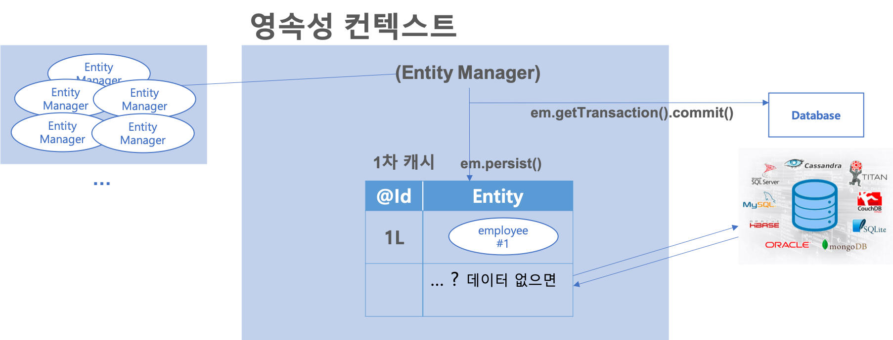


## 영속성 컨텍스트의 특징

영속성 컨텍스트는

- 엔티티를 식별자값(@ID로 테이블의 기본키와 매핑한 값)으로 구분
- 영속성 컨텍스트와 데이터베이스 저장연산
  - 영속성 컨텍스트에 엔티티를 저장했을 때, 영속성 컨텍스트 내의 엔티티를 DB에 반영하는 것을 flush라고 한다.
- 장점이 여러가지 있는데 아래에 나열해두었다.


영속성 컨텍스트로 엔티티를 관리할 때 아래와 같은 장점이 있다.

- 1차 캐시
- 동일성 보장
- 트랜잭션을 지원하는 쓰기 지연
- 변경감지
- 지연로딩


## EntityManager.persist(entity)

> - 영속성 컨텍스트 내에 entity를 영속화한다는 의미
> - 'entity를 영속성 컨텍스트에 저장한다' 는 의미 (DB에 저장하는 것이 아니라 영속성 컨텍스트에 저장한다는 의미)

  

## 영속성 컨텍스트를 사용하는 장점

> - 1차 캐시를 사용한다.
> - 그리 큰 이점은 아니긴 하다...
>   - 유저 요청에 대한 entityManager 객체 하나마다 1차 캐시가 별도로 존재한다.
> - 동일성 (identity) 보장
> - 트랜잭션을 지원하는 쓰기 지연 (transactional write-behind)
> - 변경 감지 (Dirty Checking)
> - 지연 로딩 (Lazy Loading)


# 3. 엔티티 생명주기 (LifeCycle)

## 비영속 (new/transient)

> - 엔티티 객체를 인스턴스로 새로 생성한 상태
> - 엔티티 객체를 엔티티 매니저 등을 이용해 관리가 되도록 하지 않은 상태

영속성 컨텍스트와 전혀 관계가 없는 새로운 상태이다.

```java
Employee emp = new Employee();
emp.setEmpNo(1L);
emp.setName("Dr.Jordan");
```


## 영속 (managed)

영속성 컨텍스트에 관리되는 상태

```java
Employee emp = new Employee();
emp.setEmpNo(1L);
emp.setName("Dr.Jordan");

EntityManager em = emf.createEntityManager();
em.getTransaction().begin();

em.persist(employee);
```


## 준영속 (managed)

엔티티 employee를 영속성 컨텍스트에서 분리, 준영속 상태

```java
employee.detach(employee);
```


## 삭제 (removed)

객체가 삭제된 상태

```java
employee.remove(employee);
```


# 4. 엔티티 조회

Transactional 로 묶인 하나의 비즈니스 로직이 굉장히 복잡해서 한번 조회했던 엔티티를 중복해서 다시 조회해야 하는 경우에 이점이 있을 수 있다. 

## 참고) 용어의 혼용

강의를 듣다보면 영속성 컨텍스트와 entityManager를 혼용해서 사용하고 있다. 이런 이유로 영속컨텍스트가 엔티티 매니저인가? 하는 혼동사항이 생겼었다. 

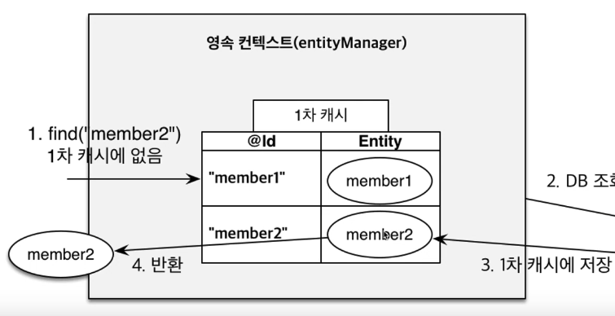


강좌 Q&A를 살펴본 결과, 엔티티 매니저와 영속성 컨텍스트는 현재 다루고 있는 예제에서는 모두 1:1 관계라고 이해하면 된다고 한다. 스프링 프레임워크와 같은 프레임워크에서는 여러개의 엔티티 매니저가 하나의 영속성 컨텍스트에 접근할 수 있다고 한다. 현재 예제에서는 스프링을 배제하고 직관적인 예를 위해 단순 예제를 사용했기 때문에 1:1 이라는 표현이 여기에서 다루는 예제를 기준으로는 맞는 표현이라고 한다.

> 참고자료 
>
> - [https://www.inflearn.com/questions/24145](https://www.inflearn.com/questions/24145)

## 엔티티 조회, 1차 캐시에서 데이터 조회

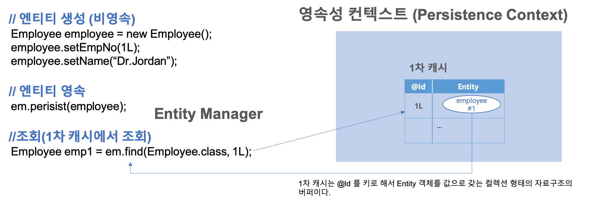

```java
Employee employee = new Employee();
employee.setEmpNo(1L);
employee.setName("Dr.Jordan");

// 여기까지는 엔티티 employee 를 영속화했다.
em.persiste(employee);

// JPA는 아래의 구문을 만나면 DB를 먼저 조회하는 것이 아니라,
// 1차 캐시를 먼저 조회한다.
Employee emp1 = em.find(Employee.class, 1L);
// 1차 캐시에 데이터가 없으면 DB의 데이터로 업데이트 해준다. 
// (아래에서 설명)
```


## 엔티티 조회시 1차 캐시에 데이터가 없을 때

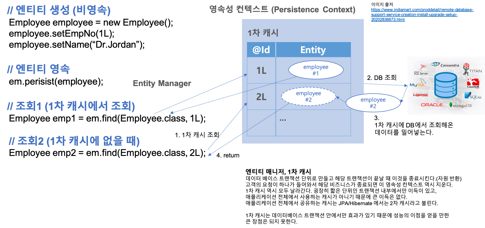

위의 예제에 이어 empNo가 2L 인 데이터를 조회하려 한다고 해보자. 

- 위에서 보듯이 empNo가 2L인 데이터는 현재 프로그램에 없다. 
- 그림을 보듯이 이전 프로그램에 업데이트한 1차 캐시에도 empNo가 2L인 데이터는 없다.
- 이렇게 엔티티 조회시 1차 캐시에 데이터가 없을 때 최종적으로 DB에서 데이터를 가져와 영속성 컨텍스트, 1차 캐시에 업데이트하게 된다.

```java
Employee employee = new Employee();
employee.setEmpNo(1L);
employee.setName("Dr.Jordan");

// 여기까지는 엔티티 employee 를 영속화했다.
em.persiste(employee);

// JPA는 아래의 구문을 만나면 DB를 먼저 조회하는 것이 아니라,
// 1차 캐시를 먼저 조회한다.
Employee emp1 = em.find(Employee.class, 1L);
// 1차 캐시에 데이터가 없으면 DB의 데이터로 업데이트 해준다. 

// empNo가 2L인 데이터는 1차 캐시에 없다.
// 1차 캐시를 조회해 데이터가 없으면 DB에서 데이터를 가져와 1차캐시에 Employee2를 저장하고, 프로그램에 반환해준다.
Employee emp2 = em.find(Employee.class, 2L);
```

엔티티 매니저는 데이터베이스 트랜잭션단위로 엔티티매니저가 생성되는데, 보통 데이터베이스의 트랜잭션이 끝나면 엔티티 매니저 역시 종료된다. EntityManager가 사용하는 캐시는 1차 캐시라고 하고, 1차캐시는 데이터베이스의 한 트랜잭션에서만 공유한다. 애플리케이션 전체에서 공유하는 캐시를 2차캐시라 한다. (사실 1차 캐시, 2차캐시 개념을 외울 필요는 없다. 맞남??)


### 엔티티 조회, 1차 캐시 - 예 (1)

Employee (1L) 을 영속화했을 때, 1차 캐시에 Employee(1L) 이 존재하는데, 영속화 이후에 em.find(Type, 1L)으로 Employee(1L) 값을 가져올 때 실제 SQL을 호출해서 데이터를 인출해오는지 확인해보자.

#### MainApp.java

```java
public class MainApp {
  public static void main(String [] args){
    EntityManagerFactory emf = Persistence.createEntityManagerFactory("jpa_basic");
    EntityManager em = emf.createEntityManager();
    
    EntityTransaction transaction = em.getTransaction();
    transaction.begin();
    
    try{
      Employee employee = new Employee();
      employee.setEmpNo(1L);
      employee.setSalary(2000d);
      employee.setBonus(employee.getSalary()*0.1);
      employee.setName("Jordan");
      
      // 영속화
      System.out.println("Before persist() ======= ");
      em.persist(employee);
      System.out.println("After persist() ======= ");
      
      // 조회 SQL이 실행되는지 확인
      Employee emp = em.find(Employee.class, 1L);
      System.out.println("emp.name === >>>> " + emp.getName());
      
      transaction.commit();
    }
    catch(Exception e){
      transaction.rollback();
    }
    finally{
      em.close();
    }
    
    emf.close();
  }
}
```


#### 출력결과

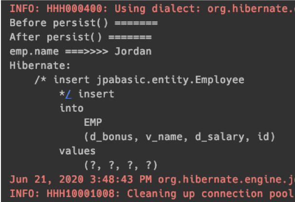


#### DATABASE 데이터

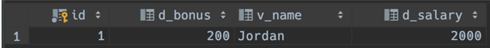


### 엔티티 조회, 1차 캐시 - 예 (2)

엔티티 조회, 1차 캐시 - 예 (1) 에서 INSERT 된 데이터를 그대로 둔 상태로 소스를 아래와 같이 고친 후에 Run 시켜보자.

Employee(1L) 을 두번 find 해오는 예제이다. 그리고 두번째 find 에서는 이미 가져왔던 데이터인  Employee(1L)이 이미 영속성 컨텍스트에 있기 때문에 실제  select SQL은 한번만 호출될 것이라고 기대해야 한다.

#### MainApp.java

```java
public class MainApp {
  public static void main(String [] args){
    EntityManagerFactory emf = Persistence.createEntityManagerFactory("jpa_basic");
    EntityManager em = emf.createEntityManager();
    
    EntityTransaction transaction = em.getTransaction();
    transaction.begin();
    
    try{
      Employee employee = new Employee();
      employee.setEmpNo(1L);
      employee.setSalary(2000d);
      employee.setBonus(employee.getSalary()*0.1);
      employee.setName("Jordan");
      
      // 영속화
      System.out.println("Before persist() ======= ");
      em.persist(employee);
      System.out.println("After persist() ======= ");
      
      // 조회 SQL이 실행되는지 확인
      Employee emp = em.find(Employee.class, 1L);
      System.out.println("emp.name === >>>> " + emp.getName());
      
      transaction.commit();
    }
    catch(Exception e){
      transaction.rollback();
    }
    finally{
      em.close();
    }
    
    emf.close();
  }
}
```

  

#### 출력결과

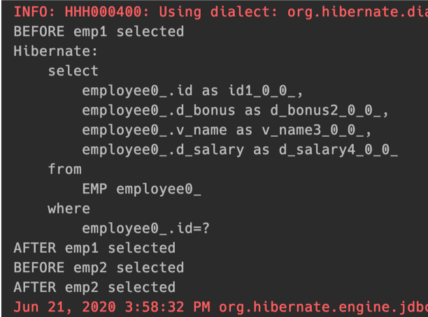


#### DATABASE 데이터


# 5. 영속 엔티티의 동일성 보장

> 영속성 컨텍스트의 데이터 A를 가져올 때 데이터A를 가져오는 함수 AA()를 
>
> - 몇번을 반복하든 
> - 다른 변수들에 저장을 하든
>
> 함수 AA가 리턴하는 데이터 A는 항상 동일 객체를 반환하는 멱등성을 지닌다.  
>
> 그 이유는 영속성 컨텍스트 내의 1차 캐시에 보관하는 인스턴스는 단순 값이 아닌 객체의 레퍼런스를 저장하고 있기 때문이다. 즉 영속성 컨텍스트에서 데이터 인출시 객체의 동일성을 보장한다.  
>
> "동일성을 보장한다." , 성동일을 보장한다는 이야기는 아니...다... 쥬륵...    
>
> 그리고 아래와 같은 표현이 강의/책에 있다.  
>
> "1차 캐시로 반복 가능한 읽기(REPEATABLE READ) 등급의 트랜잭션 격리 수준을 데이터베이스가 아닌 애플리케이션 차원에서 제공한다." 라고 설명해주심!!  
>
> 이말은... 즉, "DB로의 트랜잭션을 수행하지 않고도 1차적으로 우선적으로 애플리케이션 계층에서 1차 캐시를 이용한 반복 가능한 읽기가 가능하다" 는 의미로 의역이 가능할듯.


앞의 예제 엔티티 조회, 1차 캐시 - 예(1), 예(2) 에서 생성한 DB의 데이터를 그대로 둔 채로 아래의 예제를 실행해보자.

## 예제

### MainApp.java

```java
public class MainApp {
  public static void main(String [] args){
    EntityManagerFactory emf = Persistence.createEntityManagerFactory("jpa_basic");
    EntityManager em = emf.createEntityManager();
    
    EntityTransaction transaction = em.getTransaction();
    transaction.begin();
    
    try{
      System.out.println("BEFORE emp1 selected");
      Employee emp1 = em.find(Employee.class, 1L);
      System.out.println("AFTER emp1 selected");
      
      System.out.println("BEFORE emp2 selected");
      Employee emp2 = em.find(Employee.class, 1L);
      System.out.println("AFTER emp2 selected");
      
      System.out.println("emp1 == emp2 >>> " + (emp1 == emp2));
      transaction.commit();
    }
    catch(Exception e){
      transaction.rollback();
    }
    finally{
      em.close();
    }
    
    emf.close();
  }
}
```


### 출력결과

다른 변수에 저장한 같은 앤티티 객체가 같은 것임을 보장하고 있다.

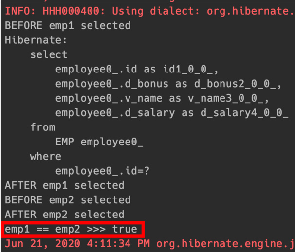


### DATABASE 데이터

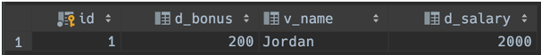


# 6. 엔티티 등록 - 트랜잭션을 지원하는 쓰기 지연

transction.commit()을 하기 전까지 

- em.persist(emp1)
- em.persist(emp2)
- ...
- em.persist(emp100000)

을 수행하게 되는 코드가 있다고 해보자.

만약 persist( Employee ) 를 수행할 때 Database에 SQL이 나간다면, Transaction을 자주 사용하게 되므로, 트래픽이 많은 서비스에서는 장애의 요인이 될수도 있다.  

다행히도 EntityManager.persist( ... ) 메서드는  

- 쓰기 지연 기능 

을 제공한다. 흔히 이야기하는  executeUpdate() 함수를 떠올리면 된다.  

즉, persist(...) 메서드를 수행한다고 해서 바로 Database에 Transaction이 실행되는 것이 아니다. 차곡 차곡 INSERT SQL을 쌓아두고 있다가 transaction.commit을 실행하는 순간 transaction이 실행된다.


```java
EntityManager em = emf.createEntityManager();
EntityTransaction transaction = em.getTransaction();
// 엔티티 매니저는 데이터 변경시 트랜잭션을 시작해야 한다.

transaction.begin(); // 트랜잭션 시작

em.persist(emp1);
em.persist(emp2);
// 아직 여기까지는 INSERT SQL을 데이터베이스에 보내지 않는다.
// SQL을 차곡차곡 쌓아두고 있다.

// 커밋하는 순간 데이터베이스에 INSERT SQL을 보낸다.
transaction.commit();
```


> 참고)  
>
> hibernate.jdbc.batch_size 를 원하는 값으로 지정하여, SQL이 지정한 수 만큼 찼을때 한꺼번에 연산을 한 후 비우고 다시 시작하도록 지정할 수도 있다. (hibernate에 해당)

## 그림으로 이해해보자

### persist(emp1)

단순 persist이다. 1차캐시를 업데이트 한 후 쓰기 지연 SQL 저장소에 INSERT SQL #1을 쌓아둘 뿐 실제 DB 트랜잭션은 수행하지 않는다.

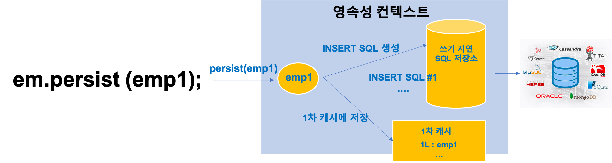

### persist(emp2)

단순 persist이다. 1차캐시를 업데이트 한 후 쓰기 지연 SQL 저장소에 INSERT SQL #2 을 쌓아둘 뿐 실제 DB 트랜잭션은 수행하지 않는다.

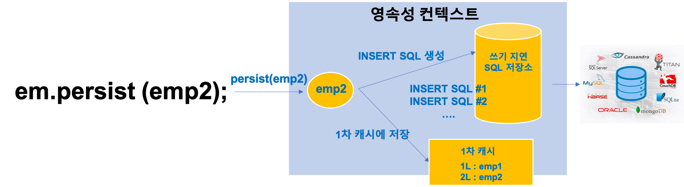


### transaction.commit();

transaction을 commit 한다. 쓰기 지연 SQL 저장소에 쌓여있던 SQL들을 실제 DB로 연산을 하도록 트랜잭션을 수행했다.

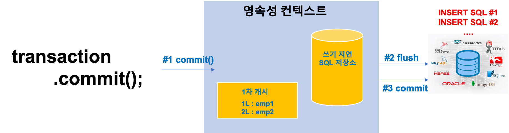


## 예제

### MainApp.java

```java
package jpabasic;

import java.util.List;
import javax.persistence.EntityManager;
import javax.persistence.EntityManagerFactory;
import javax.persistence.EntityTransaction;
import javax.persistence.Persistence;
import jpabasic.entity.Employee;

public class MainApp {
	public static void main(String [] args){
		EntityManagerFactory emf = Persistence.createEntityManagerFactory("jpa_basic");
		EntityManager em = emf.createEntityManager();

		EntityTransaction transaction = em.getTransaction();
		transaction.begin();

		try{
			Employee emp1 = new Employee(1L, "경찰관#1", 1000D, 200D);
			Employee emp2 = new Employee(2L, "경찰관#2", 1000D, 200D);

			System.out.println("======= em.persist(emp1, emp2) =======");
			em.persist(emp1);
			em.persist(emp2);

			System.out.println("======= transaction.commit() =======");
			transaction.commit();
		}
		catch (Exception e){
			transaction.rollback();
		}
		finally{
			em.close();
		}
		emf.close();
	}
}
```


### 출력결과

출력결과를 설명해보면 다음과 같다.

- em.persist() 밑에는 어떠한 SQL도 나가지 않았다.
- transaction.commit()을 한 이후에야 INSERT SQL이 나간 것을 확인 가능하다.

```text
...
INFO: HHH000400: Using dialect: org.hibernate.dialect.MariaDBDialect
======= em.persist(emp1, emp2) =======
======= transaction.commit() =======
Hibernate: 
    /* insert jpabasic.entity.Employee
        */ insert 
        into
            EMP
            (d_bonus, v_name, d_salary, id) 
        values
            (?, ?, ?, ?)
Hibernate: 
    /* insert jpabasic.entity.Employee
        */ insert 
        into
            EMP
            (d_bonus, v_name, d_salary, id) 
        values
            (?, ?, ?, ?)
Aug 19, 2020 10:46:20 PM org.hibernate.engine.jdbc.batch.internal.AbstractBatchImpl release
...
```


# 7. 엔티티 수정 - 변경감지

> 엔티티를 수정할 때 흔히 하게되는 착각에 대해 짚고 넘어간다. 그리고 변경감지가 어떤것인지 파악해보자.

## 예제

1번 데이터에는 "경찰관#1" 이 있는데 이 데이터를 "소방관#1"로 변경해보자.

### MainApp.java

```java
package jpabasic;

import java.util.List;
import javax.persistence.EntityManager;
import javax.persistence.EntityManagerFactory;
import javax.persistence.EntityTransaction;
import javax.persistence.Persistence;
import jpabasic.entity.Employee;

public class MainApp {
	public static void main(String [] args){
		EntityManagerFactory emf = Persistence.createEntityManagerFactory("jpa_basic");
		EntityManager em = emf.createEntityManager();

		EntityTransaction transaction = em.getTransaction();
		transaction.begin();

		try{
			System.out.println("======= em.find(Employee.class, 1L) =======");
			Employee emp1 = em.find(Employee.class, 1L);

			System.out.println("======= em.setName(\"소방관\") =======");
			emp1.setName("소방관#1");

			/**
			 * persist를 수행하지 않아도 된다.
			 * 	현재 emp1 은 Persistence Context 에 저장되어 있는 엔티티 인스턴스 그 자체이기 때문에
			 * 	setName을 하고나면 바로 Persistence Context내의 해당 데이터를 변경하고,
			 * 	변경감지가 일어난다.
			 */
//			em.persist(emp1);

			System.out.println("======= transaction.commit() =======");
			transaction.commit();
		}
		catch (Exception e){
			transaction.rollback();
		}
		finally{
			em.close();
		}
		emf.close();
	}
}
```

엔티티를 수정했을 때 흔히 하게되는 착각은 em.persist()를 수행해야 할것 같다는 생각이다. 하지만 이것은 착각이다. 사실 우리가 em.find로 가져오는 것은 메모리 상에 있는 emp1의 실제 객체이다. 따라서 emp1을 수정하는 것은 실제 영속성 컨텍스트 내의 데이터를 직접 수정한 것과 같다.  

처음배울 때 착각하기 쉬운 점은 

- update() 같은 메서드가 존재할 것이라고 혼동을 하게 되고
- 찾아보다보니 어? persist()가 같은 역할이네?

하는 생각에 persist() 를 직접 호출하게끔 한다.  

update 문의 경우는 Persistence Context가 뱉어준 데이터를 알맞게 수정한 후에 transaction을 커밋할 때 변경된 것이 반영된다. 메모리에는 언제 반영되냐고? 이미 반영했쟈나... em.setName()등과 같은식으로 변경했다. 다시한번 정리하지만 Persistence Context 내에 저장된 엔티티는 find로 찾아온 데이터와 실제로 같은 인스턴스이다.(복제된 객체가 아니다.) 

### 출력결과

```text
21:49:24.876 [main] DEBUG org.hibernate.engine.transaction.internal.TransactionImpl - begin
======= em.find(Employee.class, 1L) =======
21:49:24.883 [main] DEBUG org.hibernate.SQL - 
    select
        employee0_.id as id1_0_0_,
        employee0_.d_bonus as d_bonus2_0_0_,
        employee0_.v_name as v_name3_0_0_,
        employee0_.d_salary as d_salary4_0_0_ 
    from
        EMP employee0_ 
    where
        employee0_.id=?
Hibernate: 
    select
        employee0_.id as id1_0_0_,
        employee0_.d_bonus as d_bonus2_0_0_,
        employee0_.v_name as v_name3_0_0_,
        employee0_.d_salary as d_salary4_0_0_ 
    from
        EMP employee0_ 
    where
        employee0_.id=?
21:49:24.889 [main] DEBUG org.hibernate.loader.plan.exec.process.internal.ResultSetProcessorImpl - Starting ResultSet row #0
...
======= em.setName("소방관") =======
======= transaction.commit() =======
21:49:24.898 [main] DEBUG org.hibernate.engine.transaction.internal.TransactionImpl - committing
21:49:24.898 [main] DEBUG org.hibernate.event.internal.AbstractFlushingEventListener - Processing flush-time cascades
21:49:24.900 [main] DEBUG org.hibernate.event.internal.AbstractFlushingEventListener - Dirty checking collections
21:49:24.903 [main] DEBUG org.hibernate.event.internal.AbstractFlushingEventListener - Flushed: 0 insertions, 1 updates, 0 deletions to 1 objects
21:49:24.903 [main] DEBUG org.hibernate.event.internal.AbstractFlushingEventListener - Flushed: 0 (re)creations, 0 updates, 0 removals to 0 collections
21:49:24.903 [main] DEBUG org.hibernate.internal.util.EntityPrinter - Listing entities:
21:49:24.904 [main] DEBUG org.hibernate.internal.util.EntityPrinter - jpabasic.entity.Employee{bonus=200.0, name=소방관#1, id=1, salary=1000.0}
21:49:24.905 [main] DEBUG org.hibernate.SQL - 
    /* update
        jpabasic.entity.Employee */ update
            EMP 
        set
            d_bonus=?,
            v_name=?,
            d_salary=? 
        where
            id=?
Hibernate: 
    /* update
        jpabasic.entity.Employee */ update
            EMP 
        set
            d_bonus=?,
            v_name=?,
            d_salary=? 
        where
            id=?
21:49:24.911 [main] DEBUG org.hibernate.resource.jdbc.internal.LogicalConnectionManagedImpl - Initiating JDBC connection release from afterTransaction
21:49:24.912 [main] DEBUG org.hibernate.resource.jdbc.internal.LogicalConnectionManagedImpl - Initiating JDBC connection release from afterTransaction
21:49:24.913 [main] DEBUG org.hibernate.internal.SessionFactoryImpl - HHH000031: Closing
```


## 변경감지의 개념

영속성 컨텍스트에서 꺼내온 Entity 객체는 실제 영속성 컨텍스트 내의 객체라는 것을 알았다. 그럼 더티체킹은 어떻게 하는 것인지 궁금해질 수 있다.  

보통 em.find(Employee.class, 1L) 로 데이터를 가져오기 전에  

JPA는 데이터를 인출하기 직전의 상태를 스냅샷을 떠놓는다.  

Entity내의 값이 변경되었는지를 commit 시점에 파악하기 위해서이다.  

  

이러한 일련의 과정을 그림과 각 과정에 대한 설명으로 파악해보자.  

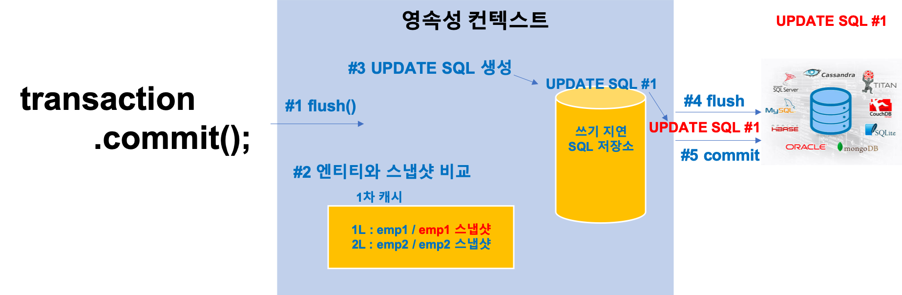

JPA가 Entity의 상태가 변경되었음을 감지하는 방식이 굉장히 궁금해질 수 있다. 

- 영속성 컨텍스트 내의 데이터를 수정하려면 우선 em.find로 데이터를 가져와야 한다. 
- 1L 에 있는 데이터를 em.find()를 통해 가져왔는데, 이것을 emp1이라는 변수에 저장해두었다고 하자.
- JPA는 em.find() 등과 같은 조회구문시 영속성 컨텍스트에서 데이터를 조회해 가져갈때, 미리 해당 객체의 스냅샷을 떠두어 엔티티 내에 보관하고 있다.
- 즉, 변경전의 상태를 스냅샷을 떠서 보관하고 있는 것이다.
- 그리고 update문이 발생했다고 해보자.
- update 문이 발생했을 때 JPA는 Entity 내에 스냅샷을 확인해 변경이 일어났는지를 순차적으로 조회한다.


# 8. 엔티티 삭제

## 예제

### MainApp.java

```java
package jpabasic;

import java.util.List;
import javax.persistence.EntityManager;
import javax.persistence.EntityManagerFactory;
import javax.persistence.EntityTransaction;
import javax.persistence.Persistence;
import jpabasic.entity.Employee;

public class MainApp {
	public static void main(String [] args){
		EntityManagerFactory emf = Persistence.createEntityManagerFactory("jpa_basic");
		EntityManager em = emf.createEntityManager();

		EntityTransaction transaction = em.getTransaction();
		transaction.begin();

		try{
			System.out.println("======= em.find(Employee.class, 1L) =======");
			Employee emp1 = em.find(Employee.class, 1L);

			System.out.println("======= em.remove(\"소방관\") =======");
			em.remove(emp1);

			System.out.println("======= transaction.commit() =======");
			transaction.commit();
		}
		catch (Exception e){
			transaction.rollback();
		}
		finally{
			em.close();
		}
		emf.close();
	}
}
```


### 출력결과

```text
======= em.find(Employee.class, 1L) =======
22:32:42.266 [main] DEBUG org.hibernate.SQL - 
    select
        employee0_.id as id1_0_0_,
        employee0_.d_bonus as d_bonus2_0_0_,
        employee0_.v_name as v_name3_0_0_,
        employee0_.d_salary as d_salary4_0_0_ 
    from
        EMP employee0_ 
    where
        employee0_.id=?
Hibernate: 
    select
        employee0_.id as id1_0_0_,
        employee0_.d_bonus as d_bonus2_0_0_,
        employee0_.v_name as v_name3_0_0_,
        employee0_.d_salary as d_salary4_0_0_ 
    from
        EMP employee0_ 
    where
        employee0_.id=?
22:32:42.273 [main] DEBUG org.hibernate.loader.plan.exec.process.internal.ResultSetProcessorImpl - Starting ResultSet row #0
...
22:32:42.281 [main] DEBUG org.hibernate.loader.entity.plan.AbstractLoadPlanBasedEntityLoader - Done entity load : jpabasic.entity.Employee#1
======= em.remove("소방관") =======
======= transaction.commit() =======
22:32:42.285 [main] DEBUG org.hibernate.engine.transaction.internal.TransactionImpl - committing
...
22:32:42.293 [main] DEBUG org.hibernate.SQL - 
    /* delete jpabasic.entity.Employee */ delete 
        from
            EMP 
        where
            id=?
Hibernate: 
    /* delete jpabasic.entity.Employee */ delete 
        from
            EMP 
        where
            id=?
22:32:42.298 [main] DEBUG org.hibernate.resource.jdbc.internal.LogicalConnectionManagedImpl - Initiating JDBC connection release from afterTransaction
```

