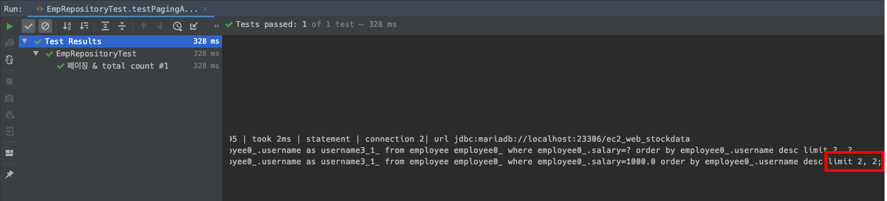
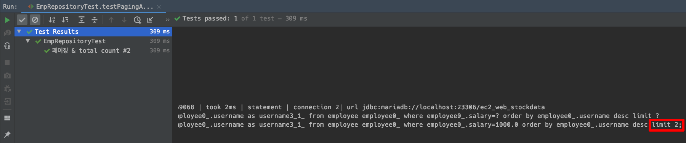
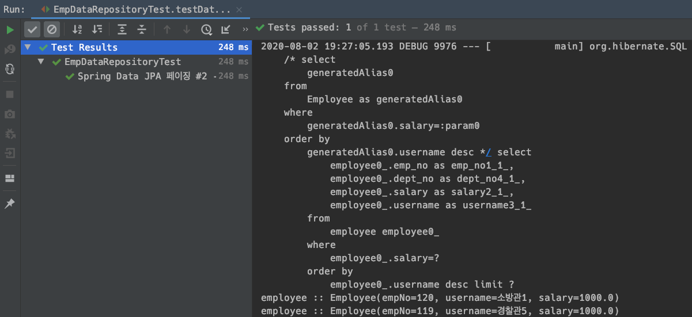
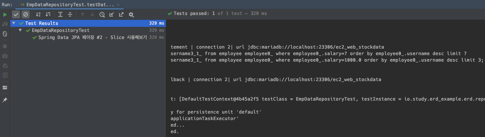

# 쿼리메서드 (1)

# 1. 메소드 이름으로 쿼리 생성

Spring Data JPA 를 사용하면, 메소드 이름을 분석헤서 JPQL 쿼리를 실행할 수 있다. Emp 테이블에서 이름과 부서번호로 사원을 조회하는 경우의 예제를 들어서 정리해보려고 한다.  

예제는 

- 순수JPA 사용 예제
- Spring Data JPA 를 사용 예제

의 예제를 들어서 차이점을 비교할 예정이다.  

## 순수 JPA 사용예제

### repository

```java
public List<Employee> findByUsernameAndDeptNo(String username, int deptno){
  return 
    em.createQuery("select e from Employee e where e.username = :username and e.deptno = :deptno")
    	.setParameter("username", username)
    	.setParameter("age", age)
    	.getResultList();
}
```


### test

```java
public void TestEmployeeJPA {
  // ...
  @Test
  public void findByUsernameAndDeptNo (){
    Employee e1 = new Employee("경찰관1", 112);
    Employee e2 = new Employee("소방관1", 119);
    empRepository.save(e1);
    empRepository.save(e2);
    
    List<Member> result = 
      empRepository.findByUsernameAndDeptNo("경찰관1", 112);
    assertThat(result.get(0).getUsername()).isEqualTo("경찰관1");
    assertThat(result.get(0).getDeptNo()).isEqualTo(112);
    assertThat(result.size()).isEqualTo(1);
  }
}
```


## 스프링 데이터 JPA

스프링 데이터 JPA는 메서드 이름에 명시한 필드 명과 And, Or 등을 분석해서 JPQL을 생성하고 실행한다. (내부적으로는 reflection을 사용하는 것으로 보인다.) IDE의 자동완성의 도움을 받아서 작성할 수 있다.  

  

스프링 데이터 JPA 사용시에는 인터페이스 JpaRepository\<엔티티클래스, @Id필드의 타입\>을 extends 해서 사용한다.  

### 예제

```java
public interface EmpDataRepository extends JpaRepository<Employee, Long> {
  List<Employee> findByUsernameAndDeptNo(String username, int age);
}
```

쿼리 메서드 이름을 분석해서 where 절에 조건절을 다는 필터링 방식에 대한 공식문서는 https://docs.spring.io/spring-data/jpa/docs/current/reference/html/#jpa.query-methods.query-creation 에 있으니 참고하자.  

  

### 주의

주의 해야 하는 점이 있다. 엔티티의 필드 명을 변경할 경우 리포지터리내에 해당 필드가 포함된 모든 메서드를 수정해야 한다. 수정하지 않으면 컴파일 타임에 미리 빨간 줄로 에러를 내므로, 일일이 찾아서 수정하는 것이 그리 불편한 점은 아니다. 런타임에 에러를 내지 않는다는 것만으로도 감사하다.


### 세부 쿼리

우리는 Spring Data JPA를 쓰고 있다. 하지만, SQL을 날린다는 사실에는 변함이 없다. 어떤 SQL을 날리는지 이해하고 사용해야 한다. 여기에 대한 공식문서들 및 기본적인 SQL 예약함수 들에 대한 Data JPA의 함수를 정리해보면 아래와 같다.  

- 조회
  - findXXXBy, readXXXBy, queryXXXBy, getXXXBy
  - 참고자료 - [https://docs.spring.io/spring-data/jpa/docs/current/reference/html/#repositories.query-methods.query-creation](https://docs.spring.io/spring-data/jpa/docs/current/reference/html/#repositories.query-methods.query-creation)
- COUNT
  - countXXXBy
  - 반환 타입 : long
- EXISTS
  - existsXXXBy
  - 반환 타입 : boolean
- 삭제
  - deleteXXXBy, removeXXXBy
  - 반환 타입 : long
- DISTINCT
  - findDistinct, findEmployeeDistinctBy
- LIMIT
  - findFirst3, findFirst, findTop, findTop3
  - https://docs.spring.io/spring-data/jpa/docs/current/reference/html/#repositories.limit-query-result

# 2. JPA NamedQuery

@NamedQuery 어노테이션으로 쿼리에 이름을 부여해서 사용하는 기능이다. entity에 NamedQuery를 선언하여 이름을 붙인 쿼리를 사용할 수 있다. 또는 @NamedQuery 를 선언하는 대신 xml 문서에도 이름을 부여한 쿼리를 선언할 수도 있다.  

현업에서는 실제로 사용할 예를 찾기가 힘들다고 한다. @NamedQuery는 컴파일 타임에 쿼리의 오류를 찾을 수 있다는 장점이 있다.

## 예제 

### Employee.java

```java
@Entity
@Getter @Setter
@NoArgsConstructor(access = AccessLevel.PROTECTED)
@ToString(of={"id", "username", "age"})
@NamedQuery(
  name = "Employee.findByUsername",
  query = "select e from Employee e where e.username = :username"
)
public class Employee{
  @Id @GeneratedValue
  @Column
  private Long empId;
  private String username;
  private Long deptNo;
  
  @ManyToOne(fetch = FetchType.LAZY)
  @JoinColumn(name = "deptNo")
  private Department dept;
  
  // ...
}
```

## 순수 JPA 에서 @NamedQuery 사용

### EmployeeRepository.java

```java
@Repository
public class EmployeeRepository{
  private final EntityManager em;
  
  public EmployeeRepository(EntityManager em){
    this.em = em;
  }
  
  // ...
  
  public List<Employee> findByUsername(String username){
    return 
      em.createQuery("Employee.findByUsername", Employee.class)
      	.setParameter("username", username)
      	.getResultList();
  }
}
```
위의 소스에서 Entity인 Employee 에 선언한  NamedQuery를 불러오는 부분은 아래와 같다.   
> ```java   
>   public List<Employee> findByUsername(String username){
>     return 
>       em.createQuery("Employee.findByUsername", Employee.class)
>       	.setParameter("username", username)
>       	.getResultList();
>   }
> ```
> Entity 에서 선언한 NamedQuery 를 불러올 때는 createQuery 메서드의 첫 번째 인자로 NamedQuery 명을 지정했다.

  

### 테스트 코드

```java
@SpringBootTest
@Transactional
public class EmployeeRepositoryTest{
  
  @Autowired
  EntityManager em;
  
  @Autowired
  EmployeeRepository repository;
  
  @BeforeEach
  public void before(){   
    Employee e1 = new Employee("경찰관1", 112);
    Employee e2 = new Employee("소방관1", 119);
    repository.save(e1);
    repository.save(e2);
  }
  
  // ...
  @Test
  void testNamedQuery(){
    List<Employee> result = repository.findByUsername("경찰관1");
    Member police1 = result.get(0);
    assertThat(police1.getUsername()).isEqualTo("경찰관1");
  }
  
}
```


## Data JPA 에서 @NamedQuery 사용

### EmployeeDataRepository.java

순수 JPA로 작성한 EmployeeRepository 에서 작성한 메서드와는 다르게 Data JPA 리포지터리인 EmployeeDataRepository를 사용할 경우는 구현이 단순해진다.  

> - 메서드 위에 @Query(name = "Employee.findByUsername") 를 명시한다.
> - @NamedQuery 에 파라미터가 있다면 해당 항목을 @Param("파라미터명") 으로 파라미터를 지정해준다.

을 지정해주는 것으로 간단히 해결 가능하다. 

```java
public interface EmployeeDataRepository extends JpaRepository<Employee, Long> {
  // ..
  @Query(name = "Employee.findByUsername")
  List<Emplooyee> findByUsername(@Param("username") String username);
  // ...
}
```

@Param을 꼭 지정해주어야 한다는 점에 유의하자.  

### 테스트 코드

```java
@SpringBootTest
@Transactional
public class EmployeeDataRepositoryTest{
  
  @Autowired
  EntityManager em;
  
  @Autowired
  EmployeeDataRepository repository;
  
  @BeforeEach
  public void before(){   
    Employee e1 = new Employee("경찰관1", 112);
    Employee e2 = new Employee("소방관1", 119);
    repository.save(e1);
    repository.save(e2);
  }
  
  // ...
  @Test
  void testDataJPANamedQuery(){
    List<Employee> result = repository.findByUsername("경찰관1");
    Member police1 = result.get(0);
    assertThat(police1.getUsername()).isEqualTo("경찰관1");
  }
  
}
```


# 3. @Query 어노테이션 - 리포지터리 메서드에 쿼리 정의

메서드 위에 @Query 를 선언해서 바로 jpql 문자열을 @Query 애노테이션의 인자값으로 넘겨주는 방식이다. 컴파일 타임에 쿼리의 오류를 잡아낼 수 있다는 장점이 있다.  

넘어오는 파라미터가 많아서 메서드를 일일이 

- 필드명1And필드명2And필드명3GreaterThan.... 

과 같이 입력하기 힘들어질 때가 있다.  

이런 경우에 @Query 어노테이션을 사용하면 훨씬 수월하다. 동적쿼리를 생성할 때 유용한 편이다. 가끔 쿼리가 더 복잡해지고, 조인과 성능상의 이슈로 SQL 실행계획에 맞게끔 최적화가를 해야 할 때가 있는데... 이럴 때는 querydsl, jooq 등의 라이브러리를 사용한다.  

## EmployeeDataRepository.java

```java
public interface EmployeeDataRepository extends JpaRepository<Employee, Long> {
  // ... 
  
  @Query("select e from Employee e where e.username = :username and e.deptno = :deptNo")
  List<Emplooyee> findEmployee(@Param("username") String username, @Param("deptNo") Long deptNo);

  // ...
}
```

  

## 테스트 코드

```java
@SpringBootTest
@Transactional
public class EmployeeDataRepositoryTest{
  
  @Autowired
  EntityManager em;
  
  @Autowired
  EmployeeDataRepository repository;
  
  @BeforeEach
  public void before(){   
    Employee e1 = new Employee("경찰관1", 112);
    Employee e2 = new Employee("소방관1", 119);
    repository.save(e1);
    repository.save(e2);
  }
  
  // ...
  @Test
  void testDataJPANamedQuery(){
    List<Employee> result = repository.findEmployee("경찰관1", 112);
    Member police1 = result.get(0);
    assertThat(police1.getUsername()).isEqualTo("경찰관1");
  }
  
}
```


# 4. @Query로 값/DTO 반환하기

## 단순 값 반환

### EmployeeDataRepository.java

```java
public interface EmployeeDataRepository extends JpaRepository<Employee, Long> {
  // ... 
  
  @Query("select e.username from Employee e")
  List<String> findUsernameList();

  // ...
}
```


### Test

```java
@SpringBootTest
@Transactional
public class EmployeeDataRepositoryTest{
  
  @Autowired
  EntityManager em;
  
  @Autowired
  EmployeeDataRepository repository;
  
  @BeforeEach
  public void before(){   
    Employee e1 = new Employee("경찰관1", 112);
    Employee e2 = new Employee("소방관1", 119);
    repository.save(e1);
    repository.save(e2);
  }
  
  // ...
  
  @Test
  void testFindUsernameList(){
    List<String> empNameList = findUsernameList();
    assertThat(empNameList.size()).isEqualTo(2);
  }
  
  // ...
}
```


## DTO 반환

### EmployeeDataRepository.java

```java
public interface EmployeeDataRepository extends JpaRepository<Employee, Long> {
  // ... 
  
  @Query("select new io.employee.repository.EmployeeDto(e.username, d.deptName ) from Employee e join e.dept d")
  List<EmployeeDto> findEmployeeAndDeptName();
  // ...
}
```

- 일반 SQL이라면 select 절에 명시할 e.username, d.deptName을 Dto의 생성자의 인자로 전달해주었다.
- 주의해서 봐야할 내용들은 아래와 같다.
  - Dto를 통해 조회시 new 연산자를 붙여주어야 한다.
  - Dto를 명시할 때 패키지의 전체 경로를 정확하게 입력해주어야 한다.
    - JPQL이 막강하긴 하지만, 이 부분은 조금 불편하긴 하다.
    - querydsl, jooq 등으로 보완가능하다.

### Test

```java
@SpringBootTest
@Transactional
public class EmployeeDataRepositoryTest{
  
  @Autowired
  EntityManager em;
  
  @Autowired
  EmployeeDataRepository repository;
  
  @Autowired
  DeptDataRepository deptRepository;
  
  @BeforeEach
  public void before(){   
    Department police = new Department("police");
    Department firefighter = new Department("firefighter");
    
    deptRepository.save(police);
    deptRepository.save(firefighter);
    
    Employee e1 = new Employee("경찰관1", 112);
    Employee e2 = new Employee("소방관1", 119);
    
    e1.setDepartment(police);
    e2.setDepartment(firefighter);
    
    repository.save(e1);
    repository.save(e2);
  }
  
  // ...
  
  @Test
  void testFindUsernameList(){
    List<EmployeeDto> empList = repository.findEmployeeAndDeptName();
    for (EmployeeDto e : empList){
      System.out.println("employee :: " + e);
    }
  }
  
  // ...
}
```


# 5. 파라미터 바인딩

바인딩 방식은 두가지가 있다.

- 위치 기반
- 이름 기반

그리고, 개별 파라미터 바인딩 외에도 List와 같은 컬렉션 또한 파라미터로 바인딩이 가능하다.

## 예제 코드

```java
public interface EmployRepository extends JpaRepository<Employee, Long> {
  @Query("select e from Employee e where e.empno = :empno")
  Employee findEmployee (@Param("empno") Long empno);
}
```


## 위치 기반

JDBC로 SQL작성할 때와 유사한 모양이다. 

```sql
select e from Employee e where e.empno = ?0
```

부서번호로 데이터를 가져오려고 하는데, 내가 넘긴 파라미터중 첫번째 파라미터에 deptno가 있다고 명시해주는 방식이다.


## 이름 기반

이름 기반으로 파라미터를 넘겨줄수 있다.

```sql
select e from Employee e where e.empno = :empno
```

  

## 컬렉션 기반 파라미터 바인딩

컬렉션 타입을 in 절에서 사용가능하다.

```java
public interface EmployRepository extends JpaRepository<Employee, Long> {
  @Query("select e from Employee e where e.username in :names")
  List<Employee> findByEmployeeIn(@Param("names") List<String> names);
}
```


# 6. 반환타입

## 단건 조회

단건조회를 할 경우 Entity 또는 Dto를 그대로 돌려받으면 된다. 단건조회의 경우 DB 조회 결과 DB에 해당 데이터가 없을 경우 null 을 리턴하게 된다.

```java
@SpringBootTest
@Transactional
public class EmployeeDataRepositoryTest{
  
  // ...
  
  @Test
  void testPolice(){
    Employee employee = repository.findEmployeeByUsername("경찰관1");
  }
  
  // ...
}
```

또는 Optional 로 감싸서 쿼리를 날릴 수도 있다. 물론, 메서드명을 다르게 해서 호출해야 한다.

```java
@SpringBootTest
@Transactional
public class EmployeeDataRepositoryTest{
  
  // ...
  
  @Test
  void testPolice(){
    Optional<Employee> employee = repository.findOptionalByUsername("경찰관1");
  }
  
  // ...
}
```


## List

List 의 경우는 null 을 걱정하지 않아도 된다. 특정 조건에 대한 DB의 조회결과가 없을 경우 null로 리턴하지 않고 비어있는 리스트를 반환하기 때문이다.

```java
@SpringBootTest
@Transactional
public class EmployeeDataRepositoryTest{
  
  // ...
  
  @Test
  void testFindUsernameList(){
    List<Employee> list = repository.findListByUsername("경찰관1");
  }
  
  // ...
}
```


## 참고자료

- 제공되는 다양한 형태의 반환 타입에 대한 설명이다.
- [https://docs.spring.io/spring-data/jpa/docs/current/reference/html/#repository-query-return-types](https://docs.spring.io/spring-data/jpa/docs/current/reference/html/#repository-query-return-types)
- Future, CompletableFuture, Collection, T(단건조회시...), Stream, Page\<T\> 등도 모두 지원한다.


# 7. 순수 JPA 페이징, 정렬

바로 예제부터 들어가보자!! 

## 예제

### EmpRepository.java

EmpRepository.java 에서는 

- findEmployeesSalaryByPaging(salary, offset, limit)
  - 정해진 연봉의 사원들을 뽑아낸다.
  - limit,offset으로 페이징을 한다.
- totalCount(salary) 
  - 페이징에서 흔히 쓰이는 total count 이다.

를 쿼리 메서드로 추가했다.

```java
@Repository
public class EmpRepository {

	private final EntityManager em;

	public EmpRepository(EntityManager em){
		this.em = em;
	}

	public List<Employee> findEmployeesSalaryByPaging(Double salary, int offset, int limit){
		List employees = em.createQuery("select e from Employee e where e.salary = :salary order by e.username desc")
			.setParameter("salary", salary)
			.setFirstResult(offset)		// 데이터를 어느 페이지에서부터 가져올지를 지정
			.setMaxResults(limit)		// 갯수를 몇개 가져올지를 지정
			.getResultList();

		return employees;
	}

	public long totalCount(Double salary){
		Long count = em
			.createQuery("select count(e) from Employee e where e.salary = :salary", Long.class)
			.setParameter("salary", salary)
			.getSingleResult();

		return count;
	}
}
```

  

#### 페이징 쿼리

```java
@Repository
public class EmpRepository {
	// ...
	public List<Employee> findEmployeesSalaryByPaging(Double salary, int offset, int limit){
		List employees = em.createQuery("select e from Employee e where e.salary = :salary order by e.username desc")
			.setParameter("salary", salary)
			.setFirstResult(offset)		// 데이터를 어느 페이지에서부터 가져올지를 지정
			.setMaxResults(limit)		// 갯수를 몇개 가져올지를 지정
			.getResultList();

		return employees;
	}
}
```

페이징 쿼리에서 핵심적인 부분은 아래의 세가지이다.

- setFirstResult(offset)
  - limit 에 지정한 수 만큼 전체 데이터를 페이지 단위로 나누고
  - 구분된 페이지 들 내에서 데이터를 몇 페이지(offset)에서부터 가져올 지를 결정한다.
- setMaxResults(limit)
  
  - 데이터를 몇개 단위로 나눌지를 결정한다.
- getResultList()
  - 페이징 처리된 데이터를 List 타입으로 리턴한다.

  

#### 카운트 쿼리

>  페이징 쿼리에서 카운트 쿼리를 중요하게 다루는 이유
>
> - 정리가 필요하다... 하... 시간이 부족할 따름...

```java
@Repository
public class EmpRepository {
  // ...
	public long totalCount(Double salary){
		Long count = em
			.createQuery("select count(e) from Employee e where e.salary = :salary", Long.class)
			.setParameter("salary", salary)
			.getSingleResult();

		return count;
	}
}
```

- createQuery("jpql 구문", Long.class)
  - count 와 같은 데이터의 경우 반환할 타입의 시그내처를 지정해주어야 한다.
- getSingleResult()
  - 여러개의 데이터를 묶음으로 가져오는 것이 아닌 Single 데이터를 인출할 때에는 getSingleResult() 메서드를 사용한다.


### EmpRepositoryTest.java

순수 JPA를 사용할 때의 전체 코드를 정리했다.

```java
@SpringBootTest
@Transactional
public class EmpRepositoryTest {

	@Autowired
	private EntityManager em;

	@Autowired
	private EmpRepository empRepository;

	@Autowired
	private EmpDataRepository empDataRepository;

	@Autowired
	private DeptDataRepository deptDataRepository;

	@BeforeEach
	void insertData(){
		Department police = new Department("POLICE");
		Department firefighter = new Department("FIREFIGHTER");

		deptDataRepository.save(police);
		deptDataRepository.save(firefighter);

		Employee empPolice1 = new Employee("경찰관1", 1000D, police);
		Employee empPolice2 = new Employee("경찰관2", 1000D, police);
		Employee empPolice3 = new Employee("경찰관3", 1000D, police);
		Employee empPolice4 = new Employee("경찰관4", 1000D, police);
		Employee empPolice5 = new Employee("경찰관5", 1000D, police);
		Employee empFireFighter = new Employee("소방관1", 1000D, firefighter);

		empDataRepository.save(empPolice1);
		empDataRepository.save(empPolice2);
		empDataRepository.save(empPolice3);
		empDataRepository.save(empPolice4);
		empDataRepository.save(empPolice5);

		empDataRepository.save(empFireFighter);

		em.flush();
		em.clear();
	}

	@Test
	@DisplayName("페이징 & total count #1")
	public void testPagingAndTotalCount1(){
		final Double paramSalary = 1000D;
		int offset = 2;
		int limit = 2;

		// 디버깅 콘솔에서 MySQL의 limit 구문으로 limit 2,2; 가 나오는 것을 확인 가능하다.
		List<Employee> result = empRepository
			.findEmployeesSalaryByPaging(paramSalary, offset, limit);

		long cnt = empRepository.totalCount(paramSalary);

		assertThat(result.size()).isEqualTo(2);
		assertThat(cnt).isEqualTo(6);
	}

	@Test
	@DisplayName("페이징 & total count #2")
	public void testPagingAndTotalCount2(){
		final Double paramSalary = 1000D;
		int offset = 0;
		int limit = 2;

		// 디버깅 콘솔에서 MySQL의 limit 구문으로 limit 2; 가 나오는 것을 확인 가능하다.
		// (offset 이 0 이기 때문)
		List<Employee> result = empRepository
			.findEmployeesSalaryByPaging(paramSalary, offset, limit);

		long cnt = empRepository.totalCount(paramSalary);

		assertThat(result.size()).isEqualTo(limit);
		assertThat(cnt).isEqualTo(6);
	}

	@Test
	@DisplayName("페이징 & total count #3")
	public void testPagingAndTotalCount3(){
		final Double paramSalary = 1000D;

		long count = empRepository.totalCount(paramSalary);
		assertThat(count).isEqualTo(6);
	}
}
```

#### 페이징 (1)

testPagingAndTotalCount1 메서드의 내용이다. limit 2, 2 를 만들어내도록 지정해주었다.

```java
@SpringBootTest
@Transactional
public class EmpRepositoryTest {
	// ...
	@Test
	@DisplayName("페이징 & total count #1")
	public void testPagingAndTotalCount1(){
		final Double paramSalary = 1000D;
		int offset = 2;
		int limit = 2;

		// 디버깅 콘솔에서 MySQL의 limit 구문으로 limit 2,2; 가 나오는 것을 확인 가능하다.
		List<Employee> result = empRepository
			.findEmployeesSalaryByPaging(paramSalary, offset, limit);

		long cnt = empRepository.totalCount(paramSalary);

		assertThat(result.size()).isEqualTo(2);
		assertThat(cnt).isEqualTo(6);
	}
	// ... 
}
```

이렇게 쿼리를 작성할 경우 limit 구문은 아래와 같이 출력된다. (offset : 2, limit : 2)




#### 페이징 (2)

```java
@SpringBootTest
@Transactional
public class EmpRepositoryTest {
	// ...
	@Test
	@DisplayName("페이징 & total count #2")
	public void testPagingAndTotalCount2(){
		final Double paramSalary = 1000D;
		int offset = 0;
		int limit = 2;

		// 디버깅 콘솔에서 MySQL의 limit 구문으로 limit 2; 가 나오는 것을 확인 가능하다.
		// (offset 이 0 이기 때문)
		List<Employee> result = empRepository
			.findEmployeesSalaryByPaging(paramSalary, offset, limit);

		long cnt = empRepository.totalCount(paramSalary);

		assertThat(result.size()).isEqualTo(limit);
		assertThat(cnt).isEqualTo(6);
	}
  // ...
}
```

이렇게 쿼리를 작성할 경우 limit 구문은 아래와 같이 출력된다. (offset : 0, limit : 2)



  

#### totalCount

토탈 카운트 쿼리에 대한 테스트 로직이다.

```java
@SpringBootTest
@Transactional
public class EmpRepositoryTest {
  // ...
	@Test
	@DisplayName("페이징 & total count #3")
	public void testPagingAndTotalCount3(){
		final Double paramSalary = 1000D;

		long count = empRepository.totalCount(paramSalary);
		assertThat(count).isEqualTo(6);
	}
  // ...
}
```


# 8. 스프링 데이터 JPA 페이징, 정렬

스프링 데이터 JPA 로 페이징을 구현하는 것은 개발 측면에서는 매우 편리하다. 하지만 주의해야 할 점이 있다.  

- count 쿼리
  - count 쿼리가 나가는지 안나가는지, 
  - 어떻게 하면 카운트 쿼리를 최대한 줄이는지
  - count 쿼리의 경우 대용량의 데이터에서 사용할 경우 문제가 발생할 수도 있기 때문이다.
- mysql, mariadb 의 limit, offset 개념 파악
  - 페이징 쿼리의 경우 오라클에 비해 심플하다. 하지만 오라클/Postgresql 처럼 뭔가 명확하게 구분해주는 면이 없으므로  실제 SQL의 케이스를 직접 테스트를 해봐야 한다.
  - 예를 들면 limit {}, {} 에서 첫번째 인자가 빠질때는 어떻게 되는지 등등 경우의 수에 대한 정리가 필요하다.


## 스프링 Data JPA 의 파라미터/페이징/반환타입

- org.springframework.data.domain.Sort
  - 정렬기능을 제공
- org.springframework.data.domain.Pageable
  - 페이징 기능(내부에 Sort 포함)
- org.springframework.data.domain.Page
  - 추가 count 쿼리 결과를 포함하는 페이징(totalCount)
- org.springframework.data.domain.Slice
  - 추가 count 없이 다음 페이지만 확인 가능하도록 할때 사용
- List
  - count 쿼리 없이 결과만 반환


## Slice

Slice는 0(page) 부터 3(size)개를 가져오려고 할 때 3(size) 보다 하나 더 추가된 4(slice)개를 들고온다.   

Slice 는 totalcount 를 날리지 않는다. total count 를 모른다. 가장 마지막에 데이터의 바로 다음 데이터가 가장 마지막 데이터인지만을 검사한다.  

+더보기 같은 기능 구현시에 사용하는 편이다. 현재 데이터에서 뒤에 데이터가 하나 더 있다면 +더보기 등을 통해 더 가져올 수 있는 버튼을 노출시키거나 할 수 있다. 


## List

페이징을 안쓰고, 맨 뒤에서 몇개만 들고 오는 등의 경우에 사용하는 편이다.


## 예제 1) 페이징 

### EmpDataRepository.java

```java
public interface EmpDataRepository extends JpaRepository<Employee, Long> {
  // ... 
	Page<Employee> findBySalary(Double salary, Pageable pageable);
}

```


### EmpDataRepositoryTest.java

```java
@SpringBootTest
@Transactional
public class EmpDataRepositoryTest {

	@Autowired
	private EntityManager em;

	@Autowired
	private EmpDataRepository empDataRepository;

	@Autowired
	private DeptDataRepository deptDataRepository;

	@BeforeEach
	void insertData(){
		Department police = new Department("POLICE");
		Department firefighter = new Department("FIREFIGHTER");

		deptDataRepository.save(police);
		deptDataRepository.save(firefighter);

		Employee empPolice1 = new Employee("경찰관1", 1000D, police);
		Employee empPolice2 = new Employee("경찰관2", 1000D, police);
		Employee empPolice3 = new Employee("경찰관3", 1000D, police);
		Employee empPolice4 = new Employee("경찰관4", 1000D, police);
		Employee empPolice5 = new Employee("경찰관5", 1000D, police);
		Employee empFireFighter = new Employee("소방관1", 1000D, firefighter);

		empDataRepository.save(empPolice1);
		empDataRepository.save(empPolice2);
		empDataRepository.save(empPolice3);
		empDataRepository.save(empPolice4);
		empDataRepository.save(empPolice5);

		empDataRepository.save(empFireFighter);

		em.flush();
		em.clear();
	}

  // ...

	@Test
	@DisplayName("Spring Data JPA 페이징 #1")
	void testDataJpaPaging1(){
		// 페이지 인덱스가 0 부터 시작한다.
		// 스프링 Data JPA는 페이지를 1부터 시작하는 것이 아니라 0부터 시작한다.
		PageRequest pageRequest =
			PageRequest.of(0, 2, Sort.by(Direction.DESC, "username"));// 0 페이지에서 2개 들고와~

		// PageRequest 의 최상위 부모 클래스는 Pageable 이므로 PageRequest 인스턴스를 전달해주어도 된다.
		// (PageRequest 는 Pageable 의 구현체이다.)
		Page<Employee> bySalary = empDataRepository.findBySalary(1000D, pageRequest);

		List<Employee> content = bySalary.getContent();
		long totalElements = bySalary.getTotalElements();

		content.stream().forEach(e->{
			System.out.println("employee :: " + e);
		});

		assertThat(content.size()).isEqualTo(2);
		assertThat(bySalary.getTotalElements()).isEqualTo(6);

		// page 번호를 가져올 때는 getNumber() 메서드를 사용한다.
		assertThat(bySalary.getNumber()).isEqualTo(0);

		// 전체 페이지 갯수는 ? 6/2 = 3
		assertThat(bySalary.getTotalPages()).isEqualTo(3);

		// 첫번째 페이지가 맞는지?
		assertThat(bySalary.isFirst()).isTrue();

		// 현재 페이지의 다음 페이지가 있는지??
		assertThat(bySalary.hasNext()).isTrue();
	}

}
```


- PageRequest pageRequest = PageRequest.of(0, 2, Sort.by(Direction.DESC, "username"));
  - 0 페이지에서 2개 들고와~
  - 스프링 Data JPA는 페이지를 1부터 시작하는 것이 아니라 0부터 시작한다.
- Page\<Employee\> bySalary = empDataRepository.findBySalary(1000D, pageRequest);
  - PageRequest 의 최상위 부모 클래스는 Pageable 이므로 PageRequest 인스턴스를 전달해주어도 된다.
  - PageRequest 는 Pageable 의 구현체이다.
- assertThat(bySalary.getNumber()).isEqualTo(0);
  - page 번호를 가져올 때는 getNumber() 메서드를 사용한다.
  - Page\<T\>.getNumber() 가져온 데이터의 페이지 번호를 알아낸다. 
- assertThat(bySalary.getTotalPages()).isEqualTo(3);
  - 전체 페이지 갯수는 ? 6/2 = 3
  - Page\<T\>.getTotalPages() : 전체 페이지의 갯수 를 반환
- assertThat(bySalary.isFirst()).isTrue();
  - 첫 번째 페이지가 맞는지?
  - Page\<T\>.isFirst() : 현재 페이지가 첫 번째 페이지가 맞는지를 반환 
- assertThat(bySalary.hasNext()).isTrue();
  - 현재 페이지의 다음 페이지가 있는지??
  - Page\<T\>.hasNext() : 현재 페이지의 다음 페이지가 있는지를 반환 


### 출력결과

아래에 첨부한 출력결과 스크린샷을 자세히 보면, 조회 쿼리 이후에 count 쿼리가 별도로 실행되는 것을 확인 가능하다.


## 예제 2) Slice 사용해보기

Slice는 0(page) 부터 3(size)개를 가져오려고 할 때 3(size) 보다 하나 더 추가된 4(slice)개를 들고온다.   

Slice 는 totalcount 를 날리지 않는다. total count 를 모른다. 가장 마지막에 데이터의 바로 다음 데이터가 가장 마지막 데이터인지만을 검사한다.  

+더보기 같은 기능 구현시에 사용하는 편이다. 현재 데이터에서 뒤에 데이터가 하나 더 있다면 +더보기 등을 통해 더 가져올 수 있는 버튼을 노출시키거나 할 수 있다.  

### EmpDataRepository.java

```java
public interface EmpDataRepository extends JpaRepository<Employee, Long> {
	// ...
	Slice<Employee> findSliceBySalary(Double salary, Pageable pageable);
}

```


### EmpDataRepositoryTest.java

```java
@SpringBootTest
@Transactional
public class EmpDataRepositoryTest {

	@Autowired
	private EntityManager em;

	@Autowired
	private EmpDataRepository empDataRepository;

	@Autowired
	private DeptDataRepository deptDataRepository;

	@BeforeEach
	void insertData(){
		Department police = new Department("POLICE");
		Department firefighter = new Department("FIREFIGHTER");

		deptDataRepository.save(police);
		deptDataRepository.save(firefighter);

		Employee empPolice1 = new Employee("경찰관1", 1000D, police);
		Employee empPolice2 = new Employee("경찰관2", 1000D, police);
		Employee empPolice3 = new Employee("경찰관3", 1000D, police);
		Employee empPolice4 = new Employee("경찰관4", 1000D, police);
		Employee empPolice5 = new Employee("경찰관5", 1000D, police);
		Employee empFireFighter = new Employee("소방관1", 1000D, firefighter);

		empDataRepository.save(empPolice1);
		empDataRepository.save(empPolice2);
		empDataRepository.save(empPolice3);
		empDataRepository.save(empPolice4);
		empDataRepository.save(empPolice5);

		empDataRepository.save(empFireFighter);

		em.flush();
		em.clear();
	}
  
	// ...

	@Test
	@DisplayName("Spring Data JPA 페이징 #2 - Slice 사용해보기")
	void testDataJpaPaging2(){
		// 페이지 인덱스가 0 부터 시작한다.
		// 스프링 Data JPA는 페이지를 1부터 시작하는 것이 아니라 0부터 시작한다.
		PageRequest pageRequest =
			PageRequest.of(0, 2, Sort.by(Direction.DESC, "username"));// 0 페이지에서 2개 들고와~

		// PageRequest 의 최상위 부모 클래스는 Pageable 이므로 PageRequest 인스턴스를 전달해주어도 된다.
		// (PageRequest 는 Pageable 의 구현체이다.)
		Slice<Employee> bySalary = empDataRepository.findSliceBySalary(1000D, pageRequest);

		List<Employee> content = bySalary.getContent();

//		Slice 사용시 totalCount 쿼리를 날리지 않기 때문에 count 에 관련된 메서드가 없다.
//		long totalElements = bySalary.getTotalElements();

		content.stream().forEach(e->{
			System.out.println("employee :: " + e);
		});

		assertThat(content.size()).isEqualTo(2);

//		Slice 사용시 totalCount 쿼리를 날리지 않기 때문에 count 에 관련된 메서드가 없다.
//		assertThat(bySalary.getTotalElements()).isEqualTo(6);

		// page 번호를 가져올때는 getNumber() 메서드를 사용한다.
		assertThat(bySalary.getNumber()).isEqualTo(0);

//		Slice 사용시 totalCount 쿼리를 날리지 않기 때문에 count 에 관련된 메서드가 없다.
		// 전체 페이지 갯수는 ? 6/2 = 3
//		assertThat(bySalary.getTotalPages()).isEqualTo(3);

		// 첫번째 페이지가 맞는지?
		assertThat(bySalary.isFirst()).isTrue();

		// 현재 페이지의 다음 페이지가 있는지??
		assertThat(bySalary.hasNext()).isTrue();
	}

}
```


### 출력결과

count 쿼리가 나가지 않은 것을 확인 가능하다. 



예제대로 라면 limit 3 이라는 쿼리가 나가야 한다. 로그상으로 SQL에 파라미터가 바인딩한 것을 확인하려면 p6spy라는 라이브러리를 사용하면 된다.([참고 URL - p6spy maven repository](https://mvnrepository.com/artifact/com.github.gavlyukovskiy/p6spy-spring-boot-starter)) 실제로 limit 3이 쿼리에 수행된것을 확인해보면 아래와 같다.

> 참고로 p6spy 라이브러리는 가급적 운영에서는 사용하지 않는 것을 추천한다. 개발환경 또는 공부시에만 쿼리를 확인하기 위한 용도로만 사용하는 것을 추천한다.  




## 예제3) limt 를 사용할 때

### EmpDataRepository.java

totalCount 등과 같은 쿼리에 관련된 기능들은 메서드의 반환타입에 의해 결정된다. 

```java
public interface EmpDataRepository extends JpaRepository<Employee, Long> {
  // ...
	List<Employee> findLimitBySalary(Double salary, Pageable pageable);
}
```


### EmpDataRepositoryTest.java

```java
@SpringBootTest
@Transactional
public class EmpDataRepositoryTest {

	@Autowired
	private EntityManager em;

	@Autowired
	private EmpDataRepository empDataRepository;

	@Autowired
	private DeptDataRepository deptDataRepository;

	@BeforeEach
	void insertData(){
		Department police = new Department("POLICE");
		Department firefighter = new Department("FIREFIGHTER");

		deptDataRepository.save(police);
		deptDataRepository.save(firefighter);

		Employee empPolice1 = new Employee("경찰관1", 1000D, police);
		Employee empPolice2 = new Employee("경찰관2", 1000D, police);
		Employee empPolice3 = new Employee("경찰관3", 1000D, police);
		Employee empPolice4 = new Employee("경찰관4", 1000D, police);
		Employee empPolice5 = new Employee("경찰관5", 1000D, police);
		Employee empFireFighter = new Employee("소방관1", 1000D, firefighter);

		empDataRepository.save(empPolice1);
		empDataRepository.save(empPolice2);
		empDataRepository.save(empPolice3);
		empDataRepository.save(empPolice4);
		empDataRepository.save(empPolice5);

		empDataRepository.save(empFireFighter);

		em.flush();
		em.clear();
	}

  // ...
  
	@Test
	@DisplayName("Spring Data JPA 페이징 #3 - Limit 만 걸어보자.")
	void testDataJpaPaging3(){

		// 페이지 인덱스가 0 부터 시작한다.
		// 스프링 Data JPA는 페이지를 1부터 시작하는 것이 아니라 0부터 시작한다.
		PageRequest pageRequest =
			PageRequest.of(0, 2, Sort.by(Direction.DESC, "username"));// 0 페이지에서 2개 들고와~

		List<Employee> bySalary = empDataRepository.findLimitBySalary(1000D, pageRequest);

		bySalary.stream().forEach(e->{
			System.out.println(e);
		});
	}

}
```


### 출력결과

LIMIT 을 걸었을 때 count 쿼리가 실행되지 않는 것을 확인 가능하다. 


LIMIT 2 가 실행된 것을 확인해보면 아래와 같다.


## 참고) Count 쿼리 분리

실제 운영/현업에서는 페이징 쿼리를 사용하기에 부담스러운 경우가 많다. DB에 있는 모든 데이터를 카운트 해야 한다는 것 자체가 부담이 된다. 조인이 적용된 쿼리에 대해 카운트 쿼리가 그대로 나가면 성능상에 무리가 생길 수도 있다. 이런 이유로 싱글 테이블 하나에 대해서만 카운트를 하도록 최적화하는 방식을 사용하기도 한다. 예를 들면 사원테이블과 부서테이블을 left outer join 할 경우 사원테이블만 카운트해도 된다는 점을 예로 들 수 있다.


참고) 

```java
@Query(value= "select m from Member m left join m.team t", countQuery = "select count(m) from Member m")
Page<Member> findByAge(int age, Pageable pageable);
```


위 쿼리를 countQuery 없이 아래와 같이 사용하면

```java
@Query(value= "select m from Member m left join m.team t")
Page<Member> findByAge(int age, Pageable pageable);
```

와 같이 표현된다.  

이 경우 count sql 호출시 불필요하게 join을 호출하게 되어 성능상에 이슈를 야기할 수도 있게 된다.  


### 예제) - count 분리 안할 경우

#### EmpDataRepository.java

```java
public interface EmpDataRepository extends JpaRepository<Employee, Long> {
  // ...
	@Query("select e from Employee e left join e.dept d")
	Page<Employee> findAllCountJoinBySalary(Double salary, Pageable pageable);
}
```


#### EmpDataRepositoryTest.java

```java
@SpringBootTest
@Transactional
public class EmpDataRepositoryTest {

	@Autowired
	private EntityManager em;

	@Autowired
	private EmpDataRepository empDataRepository;

	@Autowired
	private DeptDataRepository deptDataRepository;

	@BeforeEach
	void insertData(){
		Department police = new Department("POLICE");
		Department firefighter = new Department("FIREFIGHTER");

		deptDataRepository.save(police);
		deptDataRepository.save(firefighter);

		Employee empPolice1 = new Employee("경찰관1", 1000D, police);
		Employee empPolice2 = new Employee("경찰관2", 1000D, police);
		Employee empPolice3 = new Employee("경찰관3", 1000D, police);
		Employee empPolice4 = new Employee("경찰관4", 1000D, police);
		Employee empPolice5 = new Employee("경찰관5", 1000D, police);
		Employee empFireFighter = new Employee("소방관1", 1000D, firefighter);

		empDataRepository.save(empPolice1);
		empDataRepository.save(empPolice2);
		empDataRepository.save(empPolice3);
		empDataRepository.save(empPolice4);
		empDataRepository.save(empPolice5);

		empDataRepository.save(empFireFighter);

		em.flush();
		em.clear();
	}

  // ...
  
	@Test
	@DisplayName("Spring Data JPA 페이징 #4 - 조인이 걸려있을 때, 조인한 데이터 모두에 쿼리를 날릴경우는 ? ")
	void testDataJpaPaging4(){

		// 페이지 인덱스가 0 부터 시작한다.
		// 스프링 Data JPA는 페이지를 1부터 시작하는 것이 아니라 0부터 시작한다.
		PageRequest pageRequest =
			PageRequest.of(0, 2, Sort.by(Direction.DESC, "username"));// 0 페이지에서 2개 들고와~

		Page<Employee> bySalary = empDataRepository.findAllCountJoinBySalary(1000D, pageRequest);

		bySalary.stream().forEach(e->{
			System.out.println(e);
		});
	}
}
```


#### 출력결과

카운트 쿼리에서도 조인이 걸려있는 것을 확인가능하다. 


### 예제) -  count 분리할 경우

카운트 쿼리에는 조인이 걸리지 않은채로 수행되도록 카운트 쿼리를 별도로 작성했다.

#### EmpDataRepository.java

```java
public interface EmpDataRepository extends JpaRepository<Employee, Long> {
  // ...
	@Query(
		value = "select e from Employee e left join e.dept d",
		countQuery = "select count(e) from Employee e group by e.empNo")
	Page<Employee> findSpecificCountJoinBySalary(Double salary, Pageable pageable);
}
```


#### EmpDataRepositoryTest.java

```java
@SpringBootTest
@Transactional
public class EmpDataRepositoryTest {

	@Autowired
	private EntityManager em;

	@Autowired
	private EmpDataRepository empDataRepository;

	@Autowired
	private DeptDataRepository deptDataRepository;

	@BeforeEach
	void insertData(){
		Department police = new Department("POLICE");
		Department firefighter = new Department("FIREFIGHTER");

		deptDataRepository.save(police);
		deptDataRepository.save(firefighter);

		Employee empPolice1 = new Employee("경찰관1", 1000D, police);
		Employee empPolice2 = new Employee("경찰관2", 1000D, police);
		Employee empPolice3 = new Employee("경찰관3", 1000D, police);
		Employee empPolice4 = new Employee("경찰관4", 1000D, police);
		Employee empPolice5 = new Employee("경찰관5", 1000D, police);
		Employee empFireFighter = new Employee("소방관1", 1000D, firefighter);

		empDataRepository.save(empPolice1);
		empDataRepository.save(empPolice2);
		empDataRepository.save(empPolice3);
		empDataRepository.save(empPolice4);
		empDataRepository.save(empPolice5);

		empDataRepository.save(empFireFighter);

		em.flush();
		em.clear();
	}

  // ...

	@Test
	@DisplayName("Spring Data JPA 페이징 #5 - 조인이 걸려있을 때, 카운트 쿼리는 필요한 테이블에만 하도록 수정")
	void testDataJpaPaging5(){

		// 페이지 인덱스가 0 부터 시작한다.
		// 스프링 Data JPA는 페이지를 1부터 시작하는 것이 아니라 0부터 시작한다.
		PageRequest pageRequest =
			PageRequest.of(0, 2, Sort.by(Direction.DESC, "username"));// 0 페이지에서 2개 들고와~

		Page<Employee> bySalary = empDataRepository.findSpecificCountJoinBySalary(1000D, pageRequest);

		bySalary.stream().forEach(e->{
			System.out.println(e);
		});
	}
}
```


#### 출력결과

페이징 쿼리에 속한 카운트 쿼리가 우리가 직접 정의한 쿼리로 나가는 것을 확인 가능하다.


## 참고) TopN 쿼리

#### EmpDataRepository.java

```java
public interface EmpDataRepository extends JpaRepository<Employee, Long> {
  // ... 
	List<Employee> findTop3BySalary(Double salary);
}
```


#### EmpDataRepositoryTest.java

```java
@SpringBootTest
@Transactional
public class EmpDataRepositoryTest {

	@Autowired
	private EntityManager em;

	@Autowired
	private EmpDataRepository empDataRepository;

	@Autowired
	private DeptDataRepository deptDataRepository;

	@BeforeEach
	void insertData(){
		Department police = new Department("POLICE");
		Department firefighter = new Department("FIREFIGHTER");

		deptDataRepository.save(police);
		deptDataRepository.save(firefighter);

		Employee empPolice1 = new Employee("경찰관1", 1000D, police);
		Employee empPolice2 = new Employee("경찰관2", 1000D, police);
		Employee empPolice3 = new Employee("경찰관3", 1000D, police);
		Employee empPolice4 = new Employee("경찰관4", 1000D, police);
		Employee empPolice5 = new Employee("경찰관5", 1000D, police);
		Employee empFireFighter = new Employee("소방관1", 1000D, firefighter);

		empDataRepository.save(empPolice1);
		empDataRepository.save(empPolice2);
		empDataRepository.save(empPolice3);
		empDataRepository.save(empPolice4);
		empDataRepository.save(empPolice5);

		empDataRepository.save(empFireFighter);

		em.flush();
		em.clear();
	}

  // ... 

	@Test
	@DisplayName("Spring Data JPA 페이징 #6 - TopN 쿼리")
	void testTopNQuery(){
		List<Employee> top3 = empDataRepository.findTop3BySalary(1000D);

		top3.stream().forEach(e->{
			System.out.println("employee :: " + e);
		});
	}
}
```


## 참고) map 으로 Dto로 반환하기

### 예제)

#### EmpDataRepositoryTest.java

```java
@SpringBootTest
@Transactional
public class EmpDataRepositoryTest {

	@Autowired
	private EntityManager em;

	@Autowired
	private EmpDataRepository empDataRepository;

	@Autowired
	private DeptDataRepository deptDataRepository;

	@BeforeEach
	void insertData(){
		Department police = new Department("POLICE");
		Department firefighter = new Department("FIREFIGHTER");

		deptDataRepository.save(police);
		deptDataRepository.save(firefighter);

		Employee empPolice1 = new Employee("경찰관1", 1000D, police);
		Employee empPolice2 = new Employee("경찰관2", 1000D, police);
		Employee empPolice3 = new Employee("경찰관3", 1000D, police);
		Employee empPolice4 = new Employee("경찰관4", 1000D, police);
		Employee empPolice5 = new Employee("경찰관5", 1000D, police);
		Employee empFireFighter = new Employee("소방관1", 1000D, firefighter);

		empDataRepository.save(empPolice1);
		empDataRepository.save(empPolice2);
		empDataRepository.save(empPolice3);
		empDataRepository.save(empPolice4);
		empDataRepository.save(empPolice5);

		empDataRepository.save(empFireFighter);

		em.flush();
		em.clear();
	}
  
  // ... 

	@Test
	@DisplayName("Spring Data JPA 페이징 #7 - map으로 Dto 반환하기")
	void testReturnDtoByMapFn(){
		PageRequest pageRequest =
			PageRequest.of(0, 2, Sort.by(Direction.DESC, "username"));// 0 페이지에서 2개 들고와~

		Page<Employee> bySalary = empDataRepository.findSpecificCountJoinBySalary(1000D, pageRequest);

		Page<EmployeeDto> dto = bySalary.map(e -> {
			return new EmployeeDto(e.getUsername(), e.getSalary());
		});
	}
}
```


# 9. @EntityGraph

## FetchType.LAZY

Employee를 조회할 때 Department를 조회하지 않는다. 실제로 Department의 데이터를 사용하는 시점에 SQL을 날려서 데이터를 조회해온다. 이 것을 지연로딩이라고 한다. (emp.getDepartment.getName() 실행 전의 Employee 엔티티 내부의 Department 객체는 비어있는 객체이다.)   

> 이렇게 연관 객체를 한번더 SQL 을 호출해 데이터를 호출해오는 것을 N+1 문제라고 한다고 한다. 

  

이렇게 되면 각각의 employee 에 대한 department를 각각 여러번 호출하는 형태이다. 이렇게 될 경우... 항상 그런 것은 아니지만, 경우에 따라 DB 데이터 호출이 잦아 부하가 생길 수도 있기는 하다.  


Fetch Join 을 하면 위와 같은 쿼리에서 member를 불러올 때 team에 관련된 데이터 역시 모두 들고 온다. (한방 쿼리로 들고온다.)  


### 예제

- 1차 캐시에 실제로 아무것도 없을 때를 가정해서
- Employee 데이터를  findAll 해오도록 하고
- Employee 안에 Department에 대한 값이 있는지를 확인해보자

#### Employee.java

```java
//@Data
@Getter @Setter
@ToString(exclude = "dept")
@Entity
@NoArgsConstructor(access = AccessLevel.PROTECTED)
@Table(name = "EMPLOYEE")
public class Employee {

	@Id @GeneratedValue(strategy = GenerationType.AUTO)
	private Long empNo;

	@Column(name = "USERNAME")
	private String username;

	@Column(name = "SALARY")
	private Double salary;

	@ManyToOne(fetch = FetchType.LAZY)
	@JoinColumn(name = "DEPT_NO")
	private Department dept;

//	public Employee(){}

	public Employee (String username, Double salary, Department dept){
		this.username = username;
		this.salary = salary;
		this.dept = dept;
		dept.getEmployees().add(this);
	}

}
```

주의해서 볼 부분은 아래의 부분이다. @ManyToOne 의 조건으로 fetch 옵션에 FetcyType.LAZY를 주었다.

```java
	@ManyToOne(fetch = FetchType.LAZY)
	@JoinColumn(name = "DEPT_NO")
	private Department dept;
```


#### EmpDataRepositoryTest.java

```java
@SpringBootTest
@Transactional
public class EmpDataRepositoryTest {

	@Autowired
	private EntityManager em;

	@Autowired
	private EmpDataRepository empDataRepository;

	@Autowired
	private DeptDataRepository deptDataRepository;

	@BeforeEach
	void insertData(){
		Department police = new Department("POLICE");
		Department firefighter = new Department("FIREFIGHTER");

		deptDataRepository.save(police);
		deptDataRepository.save(firefighter);

		Employee empPolice = new Employee("경찰관1", 1000D, police);
		Employee empFireFighter = new Employee("소방관1", 1000D, firefighter);

		empDataRepository.save(empPolice);
		empDataRepository.save(empFireFighter);

		em.flush();
	}
  
  // ...
  
	@Test
	@DisplayName("EntityGraph 예제 #1")
	void testEntityGraph1(){

		// 테스트를 위해 1차 캐시의 내용을 모두 비워놓는 과정
		// 로직에서 해당 Entity의 데이터가 필요할 때에만 호출하는 지(지연로딩이 되는 지)를 확인해보기 위해 추가
		em.clear();

		List<Employee> all = empDataRepository.findAll();

		all.stream().forEach(e->{
			System.out.println("employee >>> " + e.getUsername());
			System.out.println("------- ------- ------- ------- -------");

      // (1)
			System.out.println("------- ------- ------- ------- -------");
			System.out.println("employee.team getName >>> " + e.getDept().getDeptName());
			System.out.println("------- ------- ------- ------- -------");
			System.out.println("employee.team 의 클래스 시그내처 >>> " + e.getDept().getClass());

//			ex)
//				class io.study.erd_example.emp.entity.Department$HibernateProxy$WiYnMgOA 와 같은 모양이 찍힌다.
//				마치 HibernateProxy라는 inner class 가 추가된 것 같은 모양이다.
		});
	}

}

```


테스트를 돌려보면 실제로 (1) 의 시점에 아래와 같은 SQL을 날려서 데이터를 호출해온다.

```sql
    select
        department0_.dept_no as dept_no1_0_0_,
        department0_.dept_name as dept_nam2_0_0_ 
    from
        department department0_ 
    where
        department0_.dept_no=?
```


### 출력결과


## FetchJoin

> 지연로딩이 걸려있는 엔티티에 대한 단건 쿼리에 대해, 경우에 따라 한방 쿼리로 들고와야 할 필요성이 있을 때 사용하는 편이다.  

  

위에서 접했던 문제는 아래와 같다.

- N 명의 Employee를 호출해오려고 한다.
- em.clear() 로 1차 캐시를 비워둔 상태이다.
- 그리고 각각의 Employee (i)에 대해 "사원명/부서명"을 붙인 문자열을 생성하는 로직을 추가한다고 해보자.
- emp.getName으로 사원명을 가지고 왔다.
  - 내부적으로는 emp 테이블을 findAll 한 상태이다.
- emp.getDepartment().getName() 을 호출했다.
  - 내부적으로는 department 테이블을 findAll 을 한 상태이다.


이렇게 되면 각각의 employee 에 대한 department를 각각 여러번 호출하는 형태이다. 이렇게 될 경우... 항상 그런 것은 아니지만, 경우에 따라 DB 데이터 호출이 잦아 부하가 생길 수도 있기는 하다.  

이런 경우에 대해 FetchJoin을 사용하게 된다. FetchJoin을 Data JPA에서 사용하게 될 경우의 간략한 모습은 아래와 같다.

```java
@Query("select m from Member m left join fetch m.team")
List<Member> findMemberFetchJoin();
```


### 예제 

#### EmpDataRepository.java

- findAllFetchJoin 이라는 쿼리 메서드를 추가해주었다.
- fetch 조인을 위해 실제 쿼리 내에서 fetch 키워드를 사용했다.
- 주의할 점으로, Department d 를 조인한 것이 아니라, e.dept 를 조인한 것임에 주의하자.

```java
public interface EmpDataRepository extends JpaRepository<Employee, Long> {

  // 아래 쿼리에서 fetch 키워드에 주목하자.
	@Query("select e from Employee e left join fetch e.dept")
	List<Employee> findAllFetchJoin();
}

```

#### EmpDataRepositoryTest.java

```java
@SpringBootTest
@Transactional
public class EmpDataRepositoryTest {

	@Autowired
	private EntityManager em;

	@Autowired
	private EmpDataRepository empDataRepository;

	@Autowired
	private DeptDataRepository deptDataRepository;

	@BeforeEach
	void insertData(){
		Department police = new Department("POLICE");
		Department firefighter = new Department("FIREFIGHTER");

		deptDataRepository.save(police);
		deptDataRepository.save(firefighter);

		Employee empPolice = new Employee("경찰관1", 1000D, police);
		Employee empFireFighter = new Employee("소방관1", 1000D, firefighter);

		empDataRepository.save(empPolice);
		empDataRepository.save(empFireFighter);

		em.flush();
	}
	
  // ...
  
	@Test
	@DisplayName("EntityGraph 예제 #2 - FetchJoin")
	void testEntityGraph2(){
		em.clear();

		List<Employee> all = empDataRepository.findAllFetchJoin();
		all.stream().forEach(e->{
			System.out.println("employee >>> " + e.getUsername());
			System.out.println("------- ------- ------- ------- -------");

			System.out.println("------- ------- ------- ------- -------");
			System.out.println("employee.team getName >>> " + e.getDept().getDeptName());
			System.out.println("------- ------- ------- ------- -------");
			System.out.println("employee.team 의 클래스 시그내처 >>> " + e.getDept().getClass());
		});
	}

}
```


### 출력결과

확인해보면 실제로 모든 데이터를 한번에 가져오고, for 문 내에서 각 Employee 객체의 Department 엔티티 조회시 추가로 Query를 수행하지 않는 것을 확인 가능하다.


## EntityGraph

JPA에서는 fetch를 사용한다. Spring DATA JPA에서도 역시  fetch join을 사용한다. 하지만, Spring Data JPA에서 특수하게 제공되는 편의성 기능인 @EntityGraph라는 것이 있다. fetch join을 사용하려 할 때 @Query를 통해 jpql 을 통해 네이티브 쿼리를 사용하는 데에 개발 생산성에 부담이 된다면, @EntityGraph를 사용한다.  

개인적으로는 비추이긴 하다... 

### 예제

#### EmpDataRepository.java

```java
public interface EmpDataRepository extends JpaRepository<Employee, Long> {

	@Query("select e from Employee e left join fetch e.dept")
	List<Employee> findAllFetchJoin();

  // EntityGraph를 사용한 예
	@EntityGraph(attributePaths = {"dept"})
	@Query("select e from Employee e")
	List<Employee> findAllEntityGraph();
}

```


#### EmpDataRepositoryTest.java

```java
@SpringBootTest
@Transactional
public class EmpDataRepositoryTest {

	@Autowired
	private EntityManager em;

	@Autowired
	private EmpDataRepository empDataRepository;

	@Autowired
	private DeptDataRepository deptDataRepository;

	@BeforeEach
	void insertData(){
		Department police = new Department("POLICE");
		Department firefighter = new Department("FIREFIGHTER");

		deptDataRepository.save(police);
		deptDataRepository.save(firefighter);

		Employee empPolice = new Employee("경찰관1", 1000D, police);
		Employee empFireFighter = new Employee("소방관1", 1000D, firefighter);

		empDataRepository.save(empPolice);
		empDataRepository.save(empFireFighter);

		em.flush();
	}

  // ...
  
	@Test
	@DisplayName("EntityGraph 예제 #3 - FetchJoin")
	void testEntityGraph3(){
		em.clear();

		List<Employee> all = empDataRepository.findAllEntityGraph();
		all.stream().forEach(e->{
			System.out.println("employee >>> " + e.getUsername());
			System.out.println("------- ------- ------- ------- -------");

			System.out.println("------- ------- ------- ------- -------");
			System.out.println("employee.team getName >>> " + e.getDept().getDeptName());
			System.out.println("------- ------- ------- ------- -------");
			System.out.println("employee.team 의 클래스 시그내처 >>> " + e.getDept().getClass());
		});
	}
}
```


### NamedEntityGraph

이 부분은 참고자료로 대체

- [기억보다는 기록을 - EntityGraph](https://jojoldu.tistory.com/165)
- https://blog.leocat.kr/notes/2019/05/26/spring-data-using-entitygraph-to-customize-fetch-graph
- NamedEntityGraph 관련 자료
  - [새로비 - Srping JPA EntityGraph](https://engkimbs.tistory.com/835)


# 10. JPA Hint & Lock

- JPA Hint
  - JPA 쿼리를 날릴때 JPA 구현체인 hibernate에게 알려주는 힌트 
  - 주의)
    - SQL 힌트가 아니다.
    - DBMS에 날려주는 힌트도 아니다.
  - ex) readOnly 용도의 JPA 쿼리
    - JPA 내부 구현상 데이터의 복제본이 존재하는데, 변경 감지를 해서 DBMS에 update하지 않고, 조회용도로만 사용할 때에 사용
- JPA Lock
  - SELECT FOR UPDATE 와 같은 쿼리를 해야 하는 경우에 사용
  - "select 할 때 다른 곳에서 건들지 마"와 같은 의미이다.
  - 실시간 트래픽이 많은 서비스에는 가급적 사용을 자제해야 한다.
  - 데이터 정합성/결제 데이터 정산 등의 작업 수행시에는 LOCK을 수행하는 것이 나쁜 것은 아니다. (필요에 따라 사용해야 함)
  - LOCK을 사용할 때 PASSIMISTIC LOCK이 아니라 OPTIMISTIC LOCK 이라는 실제 락이 아니라 버저닝의 원리로 풀어내는 방식도 있다.
  - SELECT FOR UPDATE 쿼리에 대한 참고자료
    - JPA 역시 쿼리를 사용하는 것이기 때문에 기존의 SQL들에 대한 일반적인 개념을 이해해야 제대로 쓸수 있는 것 같다.
    - [코끼리를 냉장고에 넣는 방법 - SELECT ~ FOR UPDATE란?](https://dololak.tistory.com/446) 
    - [SELECT ... FOR UPDATE 문 관련 Dead Lock 문제](https://soohyeon317.tistory.com/entry/SELECT-FOR-UPDATE-%EB%AC%B8-%EA%B4%80%EB%A0%A8-Dead-Lock-%EB%AC%B8%EC%A0%9C)


## JPA Hint

> JPA 쿼리를 날릴때 JPA 구현체인 hibernate에게 알려주는 힌트 
>
> - 주의)
>   - SQL 힌트가 아니다.
>   - DBMS에 날려주는 힌트도 아니다.

  

여기서는 JPA Hint 를 사용하여  hibernate.readonly 

======= 정리 필요 start

조회시 성능 최적활를 위해 메모리에 스냅샷을 만들지 않는다.

```java
@QueryHints(value = @QueryHint(name="org.hibernate.readOnly", value="true"))
Member findReadOnlyByUsername(String username);
```

트래픽이 너무 많아서... 조회용으로 쓰는거니 꼭 readOnly 써야지 하고 모두 readOnly를 사용할 수도 있다. 그런데 그렇다고 해도 최적화 자체가 안된다. 이 경우 대부분은 실제로 복잡한 로직의 쿼리 자체가 복잡하고, 쿼리가 일부 잘못되어 있어서 문제가 되는 경우이다.  

실제 진짜 중요하고 트래픽이 많은 몇개의 기능만 readOnly를 넣고 그러는 선별적인 선택이 중요하다고 한다.  

진짜 조회 성능이 딸리면 앞단에 캐시를 달아놓아야 한다.

======= 정리 필요 end

###  예제

쿼리 수행시 readonly 로만 데이터를 불러오는 상황을 가정한 예제를 들어보자. 

- 첫번째 예제는 readonly 힌트 없이 flush() 수행
- 두번째 예제는 readonly 힌트 를 사용해 flush() 수행

#### 예제1) readonly 힌트 없이 flush()

##### EmpDataRepositoryTest.java

```java
@SpringBootTest
@Transactional
public class EmpDataRepositoryTest {

	@Autowired
	private EntityManager em;

	@Autowired
	private EmpDataRepository empDataRepository;

	@Autowired
	private DeptDataRepository deptDataRepository;

	@BeforeEach
	void insertData(){
		Department police = new Department("POLICE");
		Department firefighter = new Department("FIREFIGHTER");

		deptDataRepository.save(police);
		deptDataRepository.save(firefighter);

		Employee empPolice = new Employee("경찰관1", 1000D, police);
		Employee empFireFighter = new Employee("소방관1", 1000D, firefighter);

		empDataRepository.save(empPolice);
		empDataRepository.save(empFireFighter);

		em.flush();
    em.clear();
	}

  // ...

	@Test
	@DisplayName("JPA Hint 예제 #1")
	void testQueryHint1(){
		List<Employee> all = empDataRepository.findAll();
		Employee employee = all.get(1);
		employee.setUsername("나는 그대의 소방관 ~ ");
		em.flush();
	}
}
```

#####  출력결과

update 문이 실행된 것을 확인 가능하다.


#### 예제2) readonly 힌트 사용하기

참고자료 : https://www.inflearn.com/questions/31497  

#####  EmpDataRepository.java

```java
public interface EmpDataRepository extends JpaRepository<Employee, Long> {

  // ...
  
	@QueryHints(value= @QueryHint(name="org.hibernate.readOnly", value="true"))
	Employee findReadOnlyByUsername(@Param("username") String username);

}
```

##### EmpDataRepositoryTest.java

```java
@SpringBootTest
@Transactional
public class EmpDataRepositoryTest {

	@Autowired
	private EntityManager em;

	@Autowired
	private EmpDataRepository empDataRepository;

	@Autowired
	private DeptDataRepository deptDataRepository;

	@BeforeEach
	void insertData(){
		Department police = new Department("POLICE");
		Department firefighter = new Department("FIREFIGHTER");

		deptDataRepository.save(police);
		deptDataRepository.save(firefighter);

		Employee empPolice = new Employee("경찰관1", 1000D, police);
		Employee empFireFighter = new Employee("소방관1", 1000D, firefighter);

		empDataRepository.save(empPolice);
		empDataRepository.save(empFireFighter);

		em.flush();
		em.clear();
	}
  
  // ...
  
	@Test
	@DisplayName("JPA Hint 예제 #2")
	void testQueryHint2(){
		Employee police1 = empDataRepository.findReadOnlyByUsername("경찰관1");
		police1.setUsername("나는 그대의 소방관 ~ ");
		em.flush();
	}

}
```


##### 출력결과

update문이 실행되지 않은것을 확인가능하다.


## Lock

select for update

select 할때 다른 곳에서 건들지 마

JPA 마지막장의 Transaction과 Lock 참조

실시간 트래픽이 많은 서비스에서는 되도록 락을 걸지 말아야 한다.


## 예제

### EmpDataRepository.java

```java
public interface EmpDataRepository extends JpaRepository<Employee, Long> {

  // ...

	@Lock(LockModeType.PESSIMISTIC_WRITE)
	List<Employee> findLockByUsername(@Param("username") String username);
}
```


### EmpDataRepositoryTest.java

```java
@SpringBootTest
@Transactional
public class EmpDataRepositoryTest {

	@Autowired
	private EntityManager em;

	@Autowired
	private EmpDataRepository empDataRepository;

	@Autowired
	private DeptDataRepository deptDataRepository;

	@BeforeEach
	void insertData(){
		Department police = new Department("POLICE");
		Department firefighter = new Department("FIREFIGHTER");

		deptDataRepository.save(police);
		deptDataRepository.save(firefighter);

		Employee empPolice = new Employee("경찰관1", 1000D, police);
		Employee empFireFighter = new Employee("소방관1", 1000D, firefighter);

		empDataRepository.save(empPolice);
		empDataRepository.save(empFireFighter);

		em.flush();
		em.clear();
	}

  // ...
  
	@Test
	@DisplayName("JPA Lock #1")
	void testLock1(){
		List<Employee> police1 = empDataRepository.findLockByUsername("경찰관1");
	}

}
```


### 출력결과

sql 을 확인해보면  select ... for update구문이 실행되었음을 확인 가능하다.


# 11. 벌크 연산

> 벌크 연산은 대량의  insert/update/delete 등의 연산이 있을 때 한번의 쿼리로 실행할 때 사용하는 연산을 의미한다. SQL로 치면 
>
> ```sql
> INSERT INTO 테이블명 (
>   컬럼1, 컬럼2, ..., 컬럼n
> )
> VALUES
> (1,		2,	3),
> (11,	22,	33),
> (111,	222,333);
> ```
>
> 과 같은 연산이다.
>
> jdbc에서는 실제 업무를 진행하면서 executeUpdate()를 경험한 사람들이 있을 거라고 생각한다. executeUpdate() 와 비슷한 연산을 수행하는 것이 벌크연산이다.

Bulk 연산이라는 것은 대량의 insert/update/delete 연산 등을 한번에 하는 것을 의미한다. 한건씩 수행하게 될 경우 SQL 실행시마다 트랜잭션을 얻어오고  SQL을 실행하고 커밋하는 것을 반복하게 된다. 만약 수정해야 하는 데이터가 100만건이라고 해보자. 이 경우 트랜잭션이 과도하게 생성되었다가 종료하는 작업이 반복되게 된다.  

조금 큰 회사에 재직 중이라면, 사내  DB를 이렇게 썼다가는 인프라팀의  DBA가 조치를 취할 수도 있을거다.  

바로 예제를 보면서 어떻게 하는지 알아보자. 예제는 모든 직원의 연봉을 20% 인상하는 예제이다.

 ## 예제) 순수 JPA

먼저 순수 JPA에서의 bulk 연산이다. 

### EmpRepository.java

```java
@Repository
public class EmpRepository {

	private final EntityManager em;

	public EmpRepository(EntityManager em){
		this.em = em;
	}

	public int bulkSalaryUpdate(Double ratio){
		int cnt = em.createQuery(
					"update Employee e set e.salary = e.salary + e.salary*:ratio"
					)
					.setParameter("ratio", ratio)
					.executeUpdate();

		return cnt;
	}
}
```

  

### EmpRepositoryTest.java

```java
@SpringBootTest
@Transactional
public class EmpRepositoryTest {

	@Autowired
	private EntityManager em;

	@Autowired
	private EmpRepository empRepository;

	@Autowired
	private EmpDataRepository empDataRepository;

	@Autowired
	private DeptDataRepository deptDataRepository;

	@BeforeEach
	void insertData(){
		Department police = new Department("POLICE");
		Department firefighter = new Department("FIREFIGHTER");

		deptDataRepository.save(police);
		deptDataRepository.save(firefighter);

		Employee empPolice1 = new Employee("경찰관1", 1000D, police);
		Employee empPolice2 = new Employee("경찰관2", 1000D, police);
		Employee empPolice3 = new Employee("경찰관3", 1000D, police);
		Employee empPolice4 = new Employee("경찰관4", 1000D, police);
		Employee empPolice5 = new Employee("경찰관5", 1000D, police);
		Employee empFireFighter = new Employee("소방관1", 1000D, firefighter);

		empDataRepository.save(empPolice1);
		empDataRepository.save(empPolice2);
		empDataRepository.save(empPolice3);
		empDataRepository.save(empPolice4);
		empDataRepository.save(empPolice5);

		empDataRepository.save(empFireFighter);

		em.flush();
		em.clear();
	}

	@Test
	@DisplayName("bulk update salary - 연봉을 20% 인상")
	public void testBulkSalaryUpdate(){
		int i = empRepository.bulkSalaryUpdate(0.2D);
		assertThat(i).isEqualTo(6);
	}
}
```


## 예제) Spring Data JPA 

Spring Data JPA 에서의 벌크 연산이다. 별도의 설명이 필요하다.

### EmpDataRepository.java

```java
public interface EmpDataRepository extends JpaRepository<Employee, Long> {
	@Modifying
	@Query("update Employee e set e.salary = e.salary + e.salary*:ratio")
	int bulkSalaryUpdate(@Param("ratio") Double ratio);
}
```

- @Modifying
  
  - Spring Data JPA 에서 bulk 연산을 수행할 때 executeUpdate()와 같은 역할을 하도록 해주는 것은 @Modifying 이다.
- @Param, @Query
  - 파라미터와 jpql 쿼리를 넘겨주었다.

  

### EmpDataRepositoryTest.java

주의할 점은 bulk 연산 직후에는 반드시 em.flush(), em.clear() 를 해주어야 벌크 연산을 통해 변경된 값이 조회연산시에도 정상적으로 반영된다. 

- em.flush()
  - 남아있는 변경되지 않은 내용을 DB에 반영
- em.clear()
  - 1차 캐시를 비운다.

또는 Spring Data JPA 에서는 @Modifying 안에 clearAutomatically 옵션에 해당하는 값을 true로 세팅해주면 bulk 연산 직후에 clear 과정이 자동으로 이루어진다.

> ```java
> public interface EmpDataRepository extends JpaRepository<Employee, Long> {
> 	@Modifying(clearAutomatically = true)
> 	@Query("update Employee e set e.salary = e.salary + e.salary*:ratio")
> 	int bulkSalaryUpdate(@Param("ratio") Double ratio);
> }
> 
> ```


```java
@SpringBootTest
@Transactional
public class EmpDataRepositoryTest {

	@Autowired
	private EntityManager em;

	@Autowired
	private EmpDataRepository empDataRepository;

	@Autowired
	private DeptDataRepository deptDataRepository;

	@BeforeEach
	void insertData(){
		Department police = new Department("POLICE");
		Department firefighter = new Department("FIREFIGHTER");

		deptDataRepository.save(police);
		deptDataRepository.save(firefighter);

		Employee empPolice1 = new Employee("경찰관1", 1000D, police);
		Employee empPolice2 = new Employee("경찰관2", 1000D, police);
		Employee empPolice3 = new Employee("경찰관3", 1000D, police);
		Employee empPolice4 = new Employee("경찰관4", 1000D, police);
		Employee empPolice5 = new Employee("경찰관5", 1000D, police);
		Employee empFireFighter = new Employee("소방관1", 1000D, firefighter);

		empDataRepository.save(empPolice1);
		empDataRepository.save(empPolice2);
		empDataRepository.save(empPolice3);
		empDataRepository.save(empPolice4);
		empDataRepository.save(empPolice5);

		empDataRepository.save(empFireFighter);

		em.flush();
		em.clear();
	}

	@Test
	@DisplayName("bulk update salary - 연봉을 20% 인상")
	void testBulkSalaryUpdate(){
		int i = empDataRepository.bulkSalaryUpdate(0.2D);
		assertThat(i).isEqualTo(6);
	}
}
```


## 주의점

Mybatis, JdbcTemplate 을 혼용해서 사용하는 경우가 있다. 이 경우 Mybatis, JdbcTemplate으로 bulk 연산을 수행한 것이 JPA 캐시에 반영이 안된다. 이런 이유로 Mybatis/JdbcTemplate으로 벌크연산을 수행한 후에는 JPA의 캐시를 비워주어야 한다.