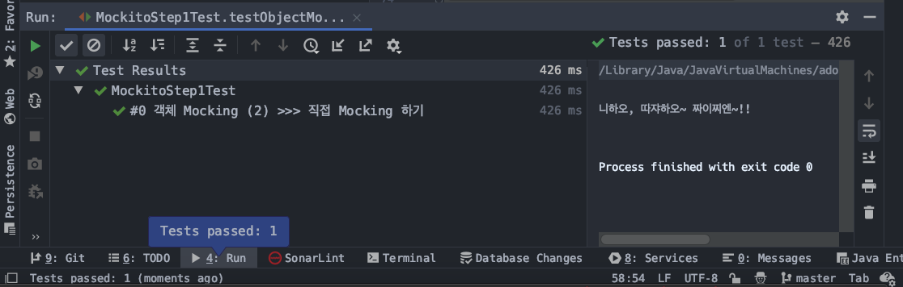
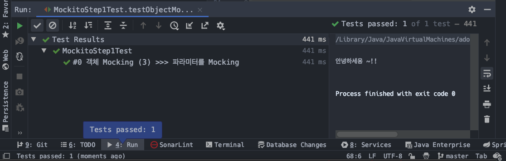

# Mockito 사용해보기 (1) - mocking, verify, stubbing

Stubbing, Mockito, when~then, verify, stubbing 을 예제 용도의 클래스로 연습해볼 예정이다. 테스트 용도로 사용할 예제 용도의 간단한 클래스 두 개를 만들었는데 아래와 같다.  

- Calculator.java
  - 테스트 할 메서드
    - add (int left, int right) : int
  - add 연산을 수행할 때 각 나라별 환영 메시지("안녕하세요~ 모시모시~ 따쟈하오 등등)를 출력하도록 할 예정이다.
  - 덧셈연산에서 환영메시지를 출력하는 것은 조금 억지이긴 하지만, 그래도 뭔가 딱 떨어지는 예제를 떠올리기가 쉽지 않았다.
  - 의존성 주입
    - 생성자를 통해 의존성을 주입하도록 지정했다.
    - 빈으로 등록하지 않았을 경우에는 직접 인스턴스를 생성해서 넘겨주면 된다.
- LocaleProcessor.java
  - 테스트 할 메서드
    - getServerCountryCode() : CountryCode
  - getServerCountryCode() 메서드는 CountryCode 라는 Enum 을 리턴한다.
  - CountryCode 는 enum 으로 직접 작성한 enum 이다.
  - 이 문서의 하단부에 CountryCode enum 코드를 첨부했다.


# 1. 테스트 용도의 예제 클래스 (Calculator, LocaleProcessor)

## 1) Calculator.java

- 생성자를 이용해 의존성 주입을 한다.
- 테스트에도 용이한 방식이다.
- add (int left, int right) : int

```java
public class Calculator {

   private final LocaleProcessor localeProcessor;

   public Calculator (LocaleProcessor localeProcessor){
      this.localeProcessor = localeProcessor;
   }

   public int add (int left, int right){
      CountryCode serverCountryCode = localeProcessor.getServerCountryCode();
      String greeting = serverCountryCode.getGreeting();
      System.out.println(greeting);


      return left + right;
   }

}
```


## 2) LocaleProcessor.java

```java
public class LocaleProcessor {

   public CountryCode getServerCountryCode(){
      Locale serverLocale = Locale.getDefault();
      return CountryCode.valueOf(serverLocale);
   }

}
```


# 2. mocking

Mockito.mock 으로 테스트를 수행할 클래스를 Mocking 하는 과정이다.  

Mocking을 한다는 것은 테스트를 위한 가짜 클래스를 생성하는 것이다.  

실제 객체가 아닌 Mock 객체를 굳이 생성하는 이유는 뭘까?  

실제 서버 코드나 애플리케이션 코드의 경우 로그만으로 데이터의 값을 검증하기 힘들다. 이런 이유로 특정 입력 값에 대해 원하는 값이 나오는지를 가정해 테스트해보고자 할 때 가짜객체를 이용한다. 실제 코드를 Mocking할 수도 있다. 이것은 Spy를 사용하면 된다.  


가짜 객체를 사용하는 경우는 애플리케이션 코드 전반적으로 펼쳐져 있는 여러가지 어려운 상황들 때문이다. 예를 들면 아래와 같은 경우이다.

- Exception 검증
  - Null Pointer Exception 과 같은 Exception 을 미리 테스트해보고자 할 때에도 유용할 수 있다.
- Validation 작업
  - 수없이 많이 퍼져있는 파라미터들의 정합성 Validation 작업(입력값 체크 등)
- if ~ else if ~ else
  - 굉장히 여러 곳에 산발적으로 퍼져있는 if ~ else if ~ else 의 경우 코드의 흐름을 파악하기 어렵게 하는 요소다.
  - 어떤 동작에 대한 기댓값을 예상하기 어렵다. (디버깅이 어려워진다.)

테스트를 수행하는 이유 자체는 사실, 누군가가 교과서처럼 정해놓지는 않은것으로 보인다.  

단지 필요에 의해 여러가지 라이브러리의 생태계들이 Java/Kotlin 등의 언어 생태계에서는 잘 갖춰진 것으로 보인다.  

마틴파울러와 같은 유명한 대가인 분들이 계시지만, 아직 그 분이 쓴 책을 읽어보지 못했다. 시간이 없다는 핑계이긴 하지만, 정말로 그렇다. 내년도 쯤이면 정리를 하게 되지 않을까 싶은 생각이다.  


## 1) Mocking 쌩기초

실제로 존재하는 클래스에 대한 Mocking을 해보자

- Mocking 쌩기초는 굉장히 간단한 Hello World 같은 예제로 준비했다.
- 처음 Mocking을 배울때 어떤걸 Mocking해야 하는 거야? 할 수 있는데, Mockito.mock(클래스명.class)를 통해 테스트를 위한 가짜 객체를 생성할 수 있다.
- 이렇게 가짜 객체를 만드는 과정을 Mocking 이라고 한다.
- static, private, final 등이 붙지 않은 대부분의 클래스를 Mocking을 할수 있다. 
- 이렇게 Mockito.mock(클래스명.class)를 통해 return 되는 값은 Mockito에서 리턴하는 가짜 객체이다.

```java
@ExtendWith(MockitoExtension.class)
class MockitoStep1Test {
    // …
    @Test
    @DisplayName("#0 Mocking 쌩기초")
    void testObjectMockingBasic(){
       List mockedList = Mockito.mock(List.class);

        // Mockito.when에 대해서는 뒤에서 정리 (stubbing이라는 개념)
        Mockito.when(mockedList.get(0))
          .thenReturn("sample1")
          .thenReturn("sample2");


        System.out.println(mockedList.get(0));
        Assertions.assertThat(mockedList.get(0)).isEqualTo("sample2");
    }
}
```


- List mockedList = Mockito.mock(List.class)
  - 가짜 객체를 만들어내는 과정이다.
  - mockedList라고 이름의 가짜 객체를 만들었는데, 이것이 우리가 테스트를 위해 감사하려 하는 객체이다.
- Mockito.when(mockedList.get(0)). ~ .thenReturn(…);
  - 뒤에서 정리할 예정인 스터빙(Stubbing)을 하는 과정이다.
  - thenReturn("sample1")
    - mockedList.get(0)을 첫번째로 호출시
    - 문자열 "sample1"을 리턴한다.
  - thenReturn("sample2")
    - mockedList.get(0)을 두번째로 호출시
    - 문자열 "sample2"를 리턴한다.
- System.out.println(mockedList.get(0))
  - mockedList.get(0)
    - 첫 번째로 mockedList.get(0)을 호출할 때는 "sample1"을 return 한다.
- Assertions.assertThat(mockedList.get(0)).isEqualTo("sample2");
  - Assertions.assertThat
    - assertj 라이브러리에서 제공하는 assertThat() 메서드이다.
    - assert 계열 라이브러리 중에서 대중적으로 많이 사용되는 라이브러리이다.junit jupiter 에서 제공하는 assert 계열 라이브러리를 사용하는 것 역시 권장되는 편이다.
    - 테스트 케이스 내에서 굉장히 자주 사용되는 메서드이기 때문에 static import를 해서 assertThat으로 줄여서 사용하는 편이다.
    - assertj 라이브러리
      - [https://assertj.github.io/doc/](https://joel-costigliola.github.io/assertj/)
      - [https://joel-costigliola.github.io/assertj/](https://joel-costigliola.github.io/assertj/)
  - mockedList.get(0)
    - 첫 번째로 mockedList.get(0)을 호출할 때는 "sample2"를 return 한다.


## 2) 객체 Mocking

가짜 객체를 만드는 방법은 위에서 살펴봤다. 그런데, 실제 존재하는 클래스 또는 @Service, @Repository를 목업(Mocking)하고 싶을 때가 많다. 

### 자주 보이는 테스트가 필요한 경우들

Spring 을 프레임워크로 채택해서 개발을 할 때 자주 궁금해지고, 디버깅을 통해 자주 확인하게 되는 요소들을 정리해보자.  

보통 아래의 경우들을 자주 확인하게 되는 편이다.  

- Controller 내에서 Service가 어떤 결과를 낼 때를 가정했을 때 
  - Response Code를 제대로 뱉어내는지
  - 템플릿 코드(html) 의 경로를 제대로 지정해줬는지
  - 결과 데이터를 json path 등을 이용해서 특정 결과값을 포함(contains)하는지
- Service 내에서 Repository 가 어떤 결과를 낼 때를 가정했을 때
  - 각종 validation 등의 로직이 기대한 결과를 리턴하는지
  - 수많은 if ~ else if ~ else 로직의 검증

> 그런데, 디버깅은 개발자 한 사람만 증상을 확인할 수 있다. 협업하는 다른 개발자들도 이런 경우에 대해 확인이 필요할 때 디버깅을 똑같이 하기에는 시간적으로 조금은 낭비가 될 수 있다. 컨트롤러나 서비스가 특정환경에서 이런 결과를 낸다는 것에 대해 정형화된 케이스가 필요한데 이런 이유로 테스트 코드를 작성하는 편이다. 그리고 Mocking과 Stubbing을 사용해 특정 입력값에 대해서 이러한 결과값이 나온다는 것을 보증하는 테스트 케이스를 작성하는 편이다.  
>
> 이렇게 하면 여러 명의 개발자들이 서로 같은 모니터를 보며 디버깅을 하지 않아도 되고, 개발자 각각이 원하는 시간에 원하는 장소에서 테스트 결과의 정합성을 1차적으로 우선 확인할 수 있다.   

  

요약해보면, 이렇게 테스트가 필요한 경우에 대해서

- Controller 내에서 사용되는 Service 객체들을 목업 (Mocking)
- Service 내에서 사용되는 Repository 객체들을 목업 (Mocking)

을 통해서 테스트 케이스를 작성할 수 있다.  

  

이렇게 테스트 코드들을 작성했을 때의 장점은

- 특정 조건 값에서의 기대되는 결과 값을 가정할 수 있다는 장점
- 특정 파라미터에서는 이런 결과를 낼 수 있다는 것을 정의할 수 있다는 장점

이 있다.  

DB의 데이터의 정합성을 테스트하는 경우 역시 존재할 수 있다. 이런 경우도 역시 테스트를 수행하는데, 예측가능한 규모의 데이터의 값들을 가정해서, 정합성을 테스트 할 수 있다. 이 경우 운영 DB를 직접 테스트 환경으로 사용할 수 없기 때문에 Docker와 spring-jdbc에서 제공하는 test 용도의 어노테이션들을 사용하는데 DB 계층 테스트는 추후 다른 문서에서 정리할 예정이다.


### 객체 Mocking (1) - 테스트 클래스의 멤버필드에 @Mock, @InjectMocks로 필드 인젝션

테스트 클래스 내에 멤버필드로 LocaleProcessor, Calculator 타입의 필드들을 선언했다.  Calculator 클래스 내의 멤버필드인 LocaleProcessor 타입의 객체를 Caculator 목 객체 안에 주입하는 간단한 예제이다.  

#### 테스트 코드

```java
@ExtendWith(MockitoExtension.class)
class MockitoStep1Test {

    @Mock
    private LocaleProcessor localeProcessor;

    @InjectMocks
    private Calculator calculator;

    // ...

    @Test
    @DisplayName("#0 객체 Mocking (1) >>> 테스트 클래스의 멤버필드에 @Mock, @InjectMocks로 필드 인젝션")
    void testObjectMocking1(){
        Mockito.when(localeProcessor.getServerCountryCode())
            .thenReturn(CountryCode.JAPAN);

        int result = calculator.add(1, 2);
        Assertions.assertThat(result).isEqualTo(1+2);
    }
}
```


- @Mcok
  - 개별 의존성 주입은 @Mock 어노테이션으로 주입가능하다.
  - 테스트 클래스 내의 LocalePRocessor 타입의 인스턴스는 @Mock 으로 선언했다.
- @InjectMocks
  - 하나의 객체 A 안에 다른 여러가지의 객체들을 주입해야 하는 경우 객체 A에 대해 @InjectMocks 어노테이션을 지정하면 객체 A안의 멤버필드에 타입이 맞는 개별 의존성들을 주입한다.
  - 테스트 클래스 내의 Calculator 타입의 인스턴스에 대한 의존성들을 @InjectMocks로 목업(Mocking)하면서, Calculator 타입의 인스턴스 calculator 역시 목업(Mocking)했다.

Calculator 클래스 내의 LocaleProcessor 타입의 인스턴스로 localeProcessor.getServerConuntryCode()를 호출했을때 localeProcessor.getServerCountryCode()의 반환값이 CountryCode.JAPAN 이 되도록 가정(Stubbing)했다.  


#### 출력결과


### 객체 Mocking (2) - 직접 Mocking 하기

#### 테스트 코드

```java
@ExtendWith(MockitoExtension.class)
class MockitoStep1Test {
	/**
	 * 이 경우 Calculator 클래스는 실제 객체이다.
	 * 생성자를 활용한 Mocking 코드가 잘 되어 있다면 코드로 직접 Mocking할 수 있다.
	 * */
	@Test
	@DisplayName("#0 객체 Mocking (2) >>> 직접 Mocking 하기")
	void testObjectMocking2(){
		LocaleProcessor mockedLoc = Mockito.mock(LocaleProcessor.class);
		Calculator cal = new Calculator(mockedLoc);

		Mockito.when(mockedLoc.getServerCountryCode())
			.thenReturn(CountryCode.CHINA);

		int result = cal.add(1, 2);
		Assertions.assertThat(result).isEqualTo(1+2);
	}

}
```


- 직접 함수 내에서 코드로 생성한 LocaleProcessor 타입의 Mockito 객체의 동작을 Caculator 클래스 내에서 감시하는 예제이다.
- Calculator cal = new Calculator(mockedLoc);
  - Calculator 클래스 내의 멤버변수 localeProcessor 를 Caculator의 생성자를 통해 의존성주입하고 있다.
  - 이렇게 생성자를 통해 의존성 주입을 하도록 코드를 작성하면, 테스트에 용이하다는 장점이 있다.
- stubbing
  - Mockito.when(mockedLoc.getServerCountryCode()).thenReturn(Country.CHINA);
  - 멤버 필드 localeProcessor 가 getServerCountryCode()를 호출하면 CountryCode.CHINA 를 리턴하도록 해주었다.
- 지금의 예제는 stubbing을 한 후, add()함수가 리턴하는 결과를 검증하는데에 아무 연관성이 없기는 하다. 의존성 주입을 확인하기 위한 단순한 예제이므로 깊게 생각하지 않고 만든 예제이다.
- Assertions.assertThat(result).isEqualTo(1+2);
  - 결과를 테스트하고 있다.


#### 출력결과




### 객체 Mocking (3) - 테스트 메서드의 파라미터로 Mock 객체를 만들어 전달

테스트를 위해 stubbing을 하기 위한 LocaleProcessor 타입의 Mock 객체를 테스트 메서드의 파라미터에 생성하여 넘겨주는 방식이다. 

#### 테스트 코드

```java
@ExtendWith(MockitoExtension.class)
class MockitoStep1Test {

   /**
    * 이 경우 Calculator 클래스는 실제 객체이다.
    * 생성자를 활용한 Mocking 코드가 잘 되어 있다면 임시 테스트용으로 간단히 빠르게 테스트를 수행해볼 수 있다.
    * */
   @Test
   @DisplayName("#0 객체 Mocking (3) >>> 파라미터를 Mocking")
   void testObjectMocking3(@Mock LocaleProcessor mockedLoc){
      Calculator calculator = new Calculator(mockedLoc);


      Mockito.when(mockedLoc.getServerCountryCode())
         .thenReturn(CountryCode.KOREA);


      int result = calculator.add(1, 2);
      Assertions.assertThat(result).isEqualTo(1+2);
   }

}
```


- void testObjectMocking3 (@Mock LocaleProcessor mockedLoc){...}
  - 테스트 메서드의 파라미터에 @Mock 어노테이션을 주입하여 LocalProcessor 인스턴스를 Mock 인스턴스로 전달해준다.
- Mockito.when(mockedLoc.getServerCountryCode()).thenReturn(CountryCode.KOREA);
  - mocking된 객체 mockedLoc 가 getServerCountryCode()를 호출할 때 리턴되는 값을 CountryCode.KOREA 로 지정해 가정해놓았다.
- Assertions.assertThat(result).isEqualTo(1+2);
  - stubbing 구문에서 mockedLoc의 getServerCountryCode()가 CountryCode.KOREA를 리턴하도록 가정했었다.
  - CountryCode.KOREA를 리턴할 때 1+2가 정확히 수행되었는지 체크한다.
  - 단순히 Mocking 만을 테스트하는 예제여서 조금 연관성이 떨어지고 쌩뚱맞긴한데 Stubbing 에대해 뒤에서 정리하면서 연관성 있는 예제로 발전시킬 예정이다ㅠㅜ


#### 출력결과




# 3. verify


# 4. stubbing


# CountryCode.java

Enum 으로 작성한 국가 코드 클래스이다. 

```java
package io.study.tdd.tddforall.util.timezone;

import java.util.Arrays;
import java.util.HashMap;
import java.util.Locale;
import java.util.Map;

public enum CountryCode {
	KOREA (Locale.KOREA.getCountry(), Locale.KOREA){
		@Override
		public String getGreeting() {
			return "안녕하세용 ~!!";
		}
	},
	JAPAN (Locale.JAPAN.getCountry(), Locale.JAPAN){
		@Override
		public String getGreeting() {
			return "모시모시 ~ 스미마센";
		}
	},
	CHINA (Locale.CHINA.getCountry(), Locale.CHINA){
		@Override
		public String getGreeting() {
			return "니하오, 따쟈하오~ 짜이찌엔~!!";
		}
	};

	private String codeNm;
	private Locale locale;

	private static Map<Locale, CountryCode> codeMap = new HashMap<>();

	static {
		Arrays.stream(CountryCode.values()).forEach(
			countryCode -> codeMap.put(countryCode.locale, countryCode)
		);
		// 참고) Java 8 이전의 방식으로 풀어서 써보면...
//		for (CountryCode c : CountryCode.values()){
//			codeMap.put(c.locale, c);
//		}
	}

	CountryCode(String codeNm, Locale locale ){
		this.codeNm = codeNm;
		this.locale = locale;
	}

	public static CountryCode valueOf(Locale locale){
		return codeMap.get(locale);
	}

	public abstract String getGreeting();

	public String getFullCodeNm(){
		return this.locale.toString();
	}

	public String getLanguageCode(){
		return this.locale.getLanguage();
	}

	public String getDisplayLanguage(){
		return this.locale.getDisplayLanguage();
	}

	public String getCodeNm() {
		return codeNm;
	}

	public Locale getLocale() {
		return locale;
	}
}
```


# 참고)

- assertj
  - [https://assertj.github.io/doc/](https://assertj.github.io/doc/)
  - [https://joel-costigliola.github.io/assertj/](https://joel-costigliola.github.io/assertj/)