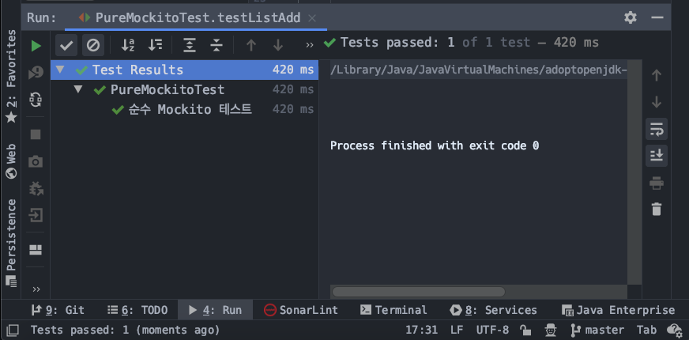
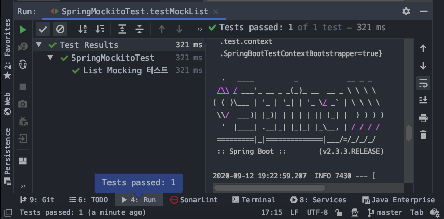
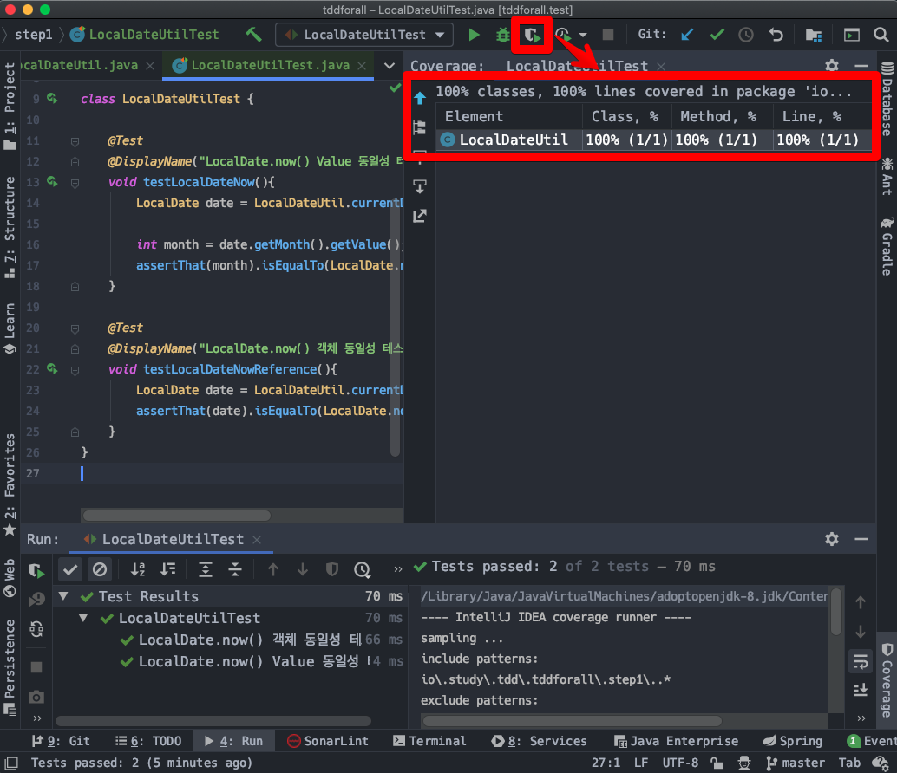
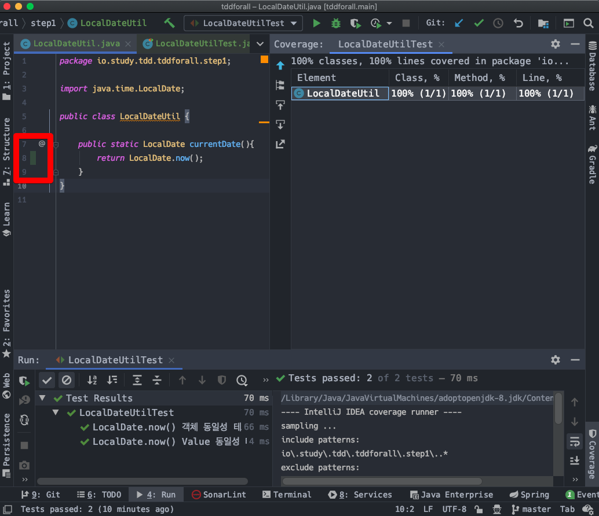

# SpringBoot 에서 Mockito,JUnit5 로 이것 저것 테스트해보기 (1) - 설정,helloworld,커버리지측정

# 1. 의존성/라이브러리 설정

- 1) Mockito 설정
- 2) 레거시 버전에서의 Mockito/JUnit5/Hamcrest 설정 (SpringBoot 2.1.x, Spring 4.x)

조금 오래된 Spring Boot 의 경우이거나, 조금 오래된 Spring 프레임워크의 경우에는 Mockito 라이브러리, assertj, hamcrest 등의 유용한 라이브러리가 Spring Framework 내에 내장되어 있지 않다. 하지만 Spring 프레임워크와 오픈소스들 중 잘 알려진 유용한 라이브러리들을 기본적으로 내장하고 있는 스프링부트 2.1.x 이후의 버전의 경우 지금까지 사용해본 경험으로는 Mockito 외의 모든 잘알려진 라이브러리가 자동으로 내장되어 제공되고 있다.  


## 1) Mockito 설정

build.gradle

```groovy
plugins {
    // ...
}

// ...

repositories {
    mavenCentral()
}

// ...

dependencies {

    // spring boot starter 팩들중에서 가장 필수적으로 필요한 라이브러리들
    implementation 'org.springframework.boot:spring-boot-starter-data-jpa'
    implementation 'org.springframework.boot:spring-boot-starter-web'
    // 웹,MVC 계층 테스트를 위해 필요하다.
    implementation 'org.springframework.boot:spring-boot-starter-thymeleaf'
    compileOnly 'org.projectlombok:lombok'
    // ...
    annotationProcessor 'org.projectlombok:lombok'

    // 아래 부분은 Spring Starter 가 만들어준 부분
    testImplementation('org.springframework.boot:spring-boot-starter-test') {
        exclude group: 'org.junit.vintage', module: 'junit-vintage-engine'
    }

    // mojito, mockito-junit-jupiter,
    // https://mvnrepository.com/artifact/org.mockito/mockito-core
    testCompile group: 'org.mockito', name: 'mockito-core', version: '3.5.10'
    // https://mvnrepository.com/artifact/org.mockito/mockito-junit-jupiter
    testCompile group: 'org.mockito', name: 'mockito-junit-jupiter', version: '3.5.10'

}


test {
    useJUnitPlatform()
}
```


## 2) 레거시 버전에서의 Mockito/JUnit5/Hamcrest 설정 (SpringBoot 2.1.x, Spring 4.x)

(maven 기반 설정으로 정리)

운영업무를 진행하다보면 그 당시에는 최신버전에 근접하면서 안정적인 라이브러리를 선택하게 된다. 또한 인프라와 SW의 트렌드가 변화함에 따라 라이브러리가 변화하기도 한다. 따라서 레거시 코드에서의 테스트 방식 및 환경설정방식들을 익혀두는 것이 좋다.


# 2. Mockito, Spring 구동하기

Test 코드 내에서 Spring을 구동할지, 순수 Java 만을 구동할지 등을 결정하는 어노테이션을 정리해보자.

- 1) 순수 객체 테스트) Spring 은 필요 없이 Mock,Junit 으로만 순수 Java 로직을 테스트하려는 경우
- 2) Mockito, MockMvc 등을 통해 Spring 애플리케이션의 Repository, MVC 계층을 테스트하려는 경우

## 1) 순수 객체 테스트) Spring 은 필요 없이 Mock,Junit 으로만 순수 Java 로직을 테스트하려는 경우

class 위에 @ExtendWith(MockitoExtension.class)를 선언해서 테스트 인스턴스 로드시 Mockito 라이브러리가 로딩되게끔해준다.

```java
@ExtendWith(MockitoExtension.class)
public class PureMockitoTest {


   @Test
   @DisplayName("순수 Mockito 테스트")
   void testListAdd(){
      List mockList = mock(List.class);


      mockList.add("one");
      mockList.add("two");


      verify(mockList).add("one");
      verify(mockList).add("two");
   }
}
```


출력결과




## 2) Mockito, MockMvc 등을 통해 Spring 애플리케이션의 Repository, MVC 계층을 테스트하려는 경우


### 2-1) @SpringBootTest

여기서는 완성된 Spring 앱을 다루지는 않는다. 테스트를 통해 Spring 앱을 구동시키는 것 까지만 할 예정이다. 간단한 설정방식만을 정리하는데에 Spring MVC/Repository를 예로 들기에는 너무 투머치이기 때문이다.

```java
@SpringBootTest
public class SpringMockitoTest {


   @Test
   @DisplayName("List Mocking 테스트")
   void testMockList(){
      List mockList = mock(List.class);


      mockList.add("ONE");
      mockList.add("TWO");


      verify(mockList).add("ONE");
      verify(mockList).add("TWO");
   }
}
```


출력결과




# 3. Intellij에서 테스트 커버리지 측정하기

테스트 커버리지를 로컬에서 확인할 수 있는 방법은 여러가지가 있다. 로컬에서 테스트 커버리지를 측정하는 방식은 다음과 같이 두가지가 있다.

- Intellij 를 통한 확인
- Jacoco 플러그인을 통해 html로 시각화

여기서는 그중 개발환경 내에서 테스트 커버리지를 측정하는 방식을 정리해보려 한다. 

먼저 테스트를 위한 예제를 만들어보자.

  

LocalDateUtil.java

```java
public class LocalDateUtil {


   public static LocalDate currentDate(){
      return LocalDate.now();
   }
}
```

  

LocalDateUtilTest.java

```java
class LocalDateUtilTest {


   @Test
   @DisplayName("LocalDate.now() Value 동일성 테스트 ")
   void testLocalDateNow(){
      LocalDate date = LocalDateUtil.currentDate();


      int month = date.getMonth().getValue();
      assertThat(month).isEqualTo(LocalDate.now().getMonth().getValue());
   }


   @Test
   @DisplayName("LocalDate.now() 객체 동일성 테스트")
   void testLocalDateNowReference(){
      LocalDate date = LocalDateUtil.currentDate();
      assertThat(date).isEqualTo(LocalDate.now());
   }
}
```

  

상단 메뉴 > Run 'LocalDateUtilTest' with Coverage  

\> 우측 메뉴 Coverage 결과 확인  



위의 캡처를 보면 우측에 Coverage 탭이 있는데, 리스트에 있는 LocalDateUtil 을 더블클릭 해보면 아래와 같이 테스트 커버리지 처리된 부분에 아래와 같이 표시된다.  



