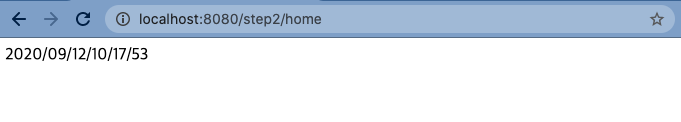
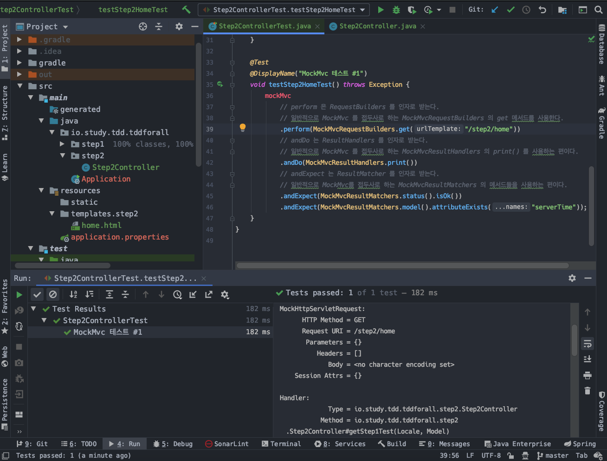

# SpringBoot에서 Mockito, JUnit5 로 이것 저것 테스트해보기 (2) - MockMvc(Mvc 계층 테스트) 


# 1. (예제) 간단한 html GetMapping

**참고자료**  

- JDM 블로그 (Spring MockMvc(spring-test))
  - https://jdm.kr/blog/165
- Testing Web Layer
  - https://spring.io/guides/gs/testing-web/
- docs.spring.io - MockMvc
  - https://docs.spring.io/spring-framework/docs/current/javadoc-api/org/springframework/test/web/servlet/MockMvc.html


## 1) build.gradle

```groovy
plugins {
    // ... 
}

// ...
configurations {
    compileOnly {
        extendsFrom annotationProcessor
    }
}


repositories {
    mavenCentral()
}


dependencies {
    implementation 'org.springframework.boot:spring-boot-starter-data-jpa'
    implementation 'org.springframework.boot:spring-boot-starter-web'
    // thymeleaf 테스트, MockMvc 테스트를 위해 필요하다.
    implementation 'org.springframework.boot:spring-boot-starter-thymeleaf'

    // ...
}


test {
    useJUnitPlatform()
}
```


## 2) Step1Controller.java

```java
@Slf4j
@Controller
public class Step2Controller {


   @GetMapping(value = "/step2/home")
   public String getStep1Test(Locale locale, Model model){
      log.debug("Step1Controller, GetMapping");


      LocalDateTime now = LocalDateTime.now();
      DateTimeFormatter formatter = DateTimeFormatter.ofPattern("yyyy/MM/dd/hh/mm/ss");
      String strNowDateTime = now.format(formatter);


      model.addAttribute("serverTime", strNowDateTime);


      return "step2/home";
   }
}
```


## 3) html 파일

src/main/resources/templates/step2/home.html  

> (template 디렉터리 아레에 step2 디렉터리를 생성한다. 그리고 home.html 을 src/main/resources/templates/step2 밑에 home.html 을 생성한다.)

```html
<html>
<head>
  <title>MockMvc 샘플 테스트 용도입니당~</title>
</head>
<body>
  <p th:text="${serverTime}"></p>
</body>
</html>
```


## 4) 출력결과



  

## 5) 테스트 코드 작성

원래 정석대로 진행하려면 테스트 코드 먼저 작성해야 한다. 하지만 이번 예제에서는 별다른 이유 없이 테스트코드보다 html 파일을 먼저 작성했다. (순서는 아무 의미없다. 단지 테스트 코드가 맨 아래에 있어야 문서가 깔끔해보여서 맨 밑으로 놓았다.)  

  

### Step2ControllerTest.java

```java
package io.study.tdd.tddforall.step2;


import org.junit.jupiter.api.BeforeEach;
import org.junit.jupiter.api.DisplayName;
import org.junit.jupiter.api.Test;
import org.springframework.beans.factory.annotation.Autowired;
import org.springframework.boot.test.context.SpringBootTest;
import org.springframework.test.web.servlet.MockMvc;
import org.springframework.test.web.servlet.request.MockMvcRequestBuilders;
import org.springframework.test.web.servlet.result.MockMvcResultHandlers;
import org.springframework.test.web.servlet.result.MockMvcResultMatchers;
import org.springframework.test.web.servlet.setup.MockMvcBuilders;


@SpringBootTest
class Step2ControllerTest {


   @Autowired
   private Step2Controller controller;


   private MockMvc mockMvc;


   @BeforeEach
   void setup(){
      mockMvc = MockMvcBuilders
         // MockMvc 인스턴스는 보통 MockMvcBuilders 클래스의 standaloneSetup (Controller) 메서드를 사용한다.
         // 인자값으로 사용되는 controller 는 Spring 컨테이너 내에 존재하는 Controller 인스턴스이다.
         .standaloneSetup(controller)   // standaloneSetup(...) 외에도 webAppContextSetup() 이 있다.
         // MockMvc 객체를 최종적으로 반환해주는 것은 build() 메서드이다.
         // 디자인 패턴 들 중 빌더 패턴을 참고하자.
         .build();
   }


   @Test
   @DisplayName("MockMvc 테스트 #1")
   void testStep2HomeTest() throws Exception {
      mockMvc
         // perform 은 RequestBuilders 를 인자로 받는다.
         // 일반적으로 MockMvc 를 접두사로 하는 MockMvcRequestBuilders 의 get 메서드를 사용한다.
         .perform(MockMvcRequestBuilders.get("/step2/home"))
         // andDo 는 ResultHandlers 를 인자로 받는다.
         // 일반적으로 MockMvc 를 접두사로 하는 MockMvcResultHandlers 의 print() 를 사용하는 편이다.
         .andDo(MockMvcResultHandlers.print())
         // andExpect 는 ResultMatcher 를 인자로 받는다.
         // 일반적으로 MockMvc를 접두사로 하는 MockMvcResultMatchers 의 메서드들을 사용하는 편이다.
         .andExpect(MockMvcResultMatchers.status().isOk())
         .andExpect(MockMvcResultMatchers.model().attributeExists("serverTime"));
   }
}
```


!TODO 부연설명 꼭 필요. (화, 수,목) 아침이라 급하게 넘어가긴 하지만 한번 정리할 때 정성들여 정리하고 두고두고 볼수 있게끔 하자.  

### MockMvcBuilders...build() 구문

```java
mockMvc = MockMvcBuilders
  // MockMvc 인스턴스는 보통 MockMvcBuilders 클래스의 standaloneSetup (Controller) 메서드를 사용한다.
  // 인자값으로 사용되는 controller 는 Spring 컨테이너 내에 존재하는 Controller 인스턴스이다.
  .standaloneSetup(controller)   // standaloneSetup(...) 외에도 webAppContextSetup() 이 있다.
  // MockMvc 객체를 최종적으로 반환해주는 것은 build() 메서드이다.
  // 디자인 패턴 들 중 빌더 패턴을 참고하자.
  .build();
```


### MockMvc.perform(...).andDo(...)...andExpect()

  

#### MockMvc.perform (RequestBuilder)

#### ResultActions.andDo (RequestHandler)

#### ResultActions.andExpect (ResultMatcher)


## 6) 테스트 출력결과



