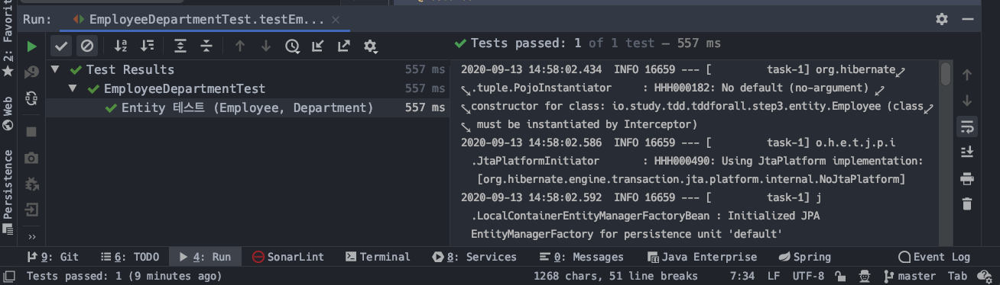
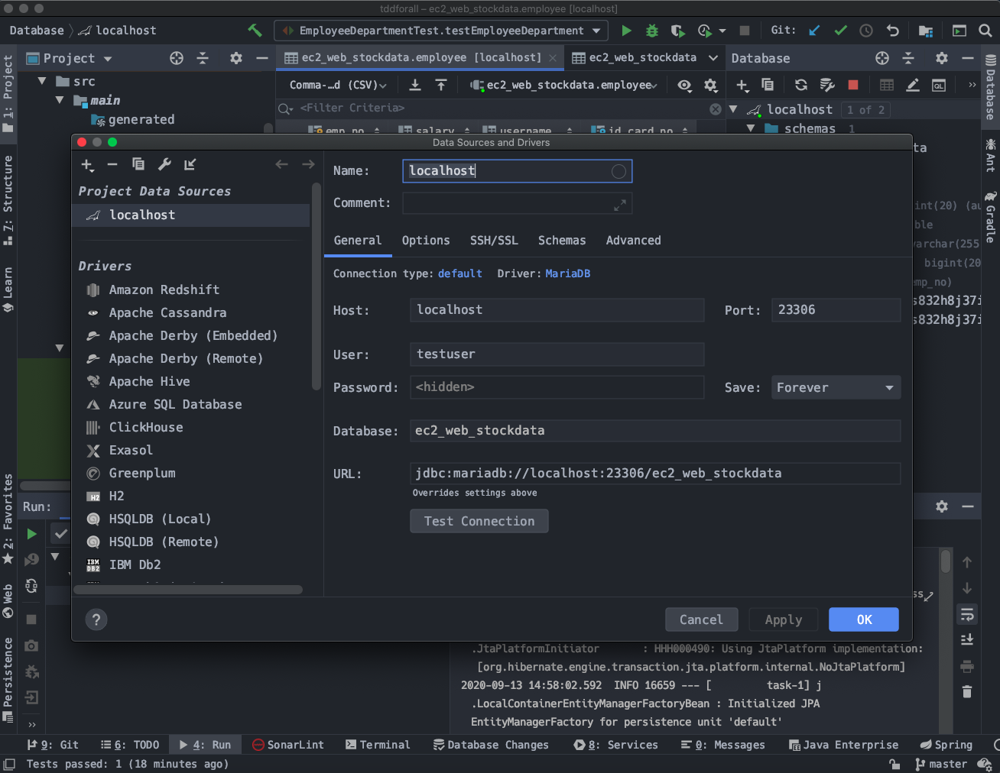
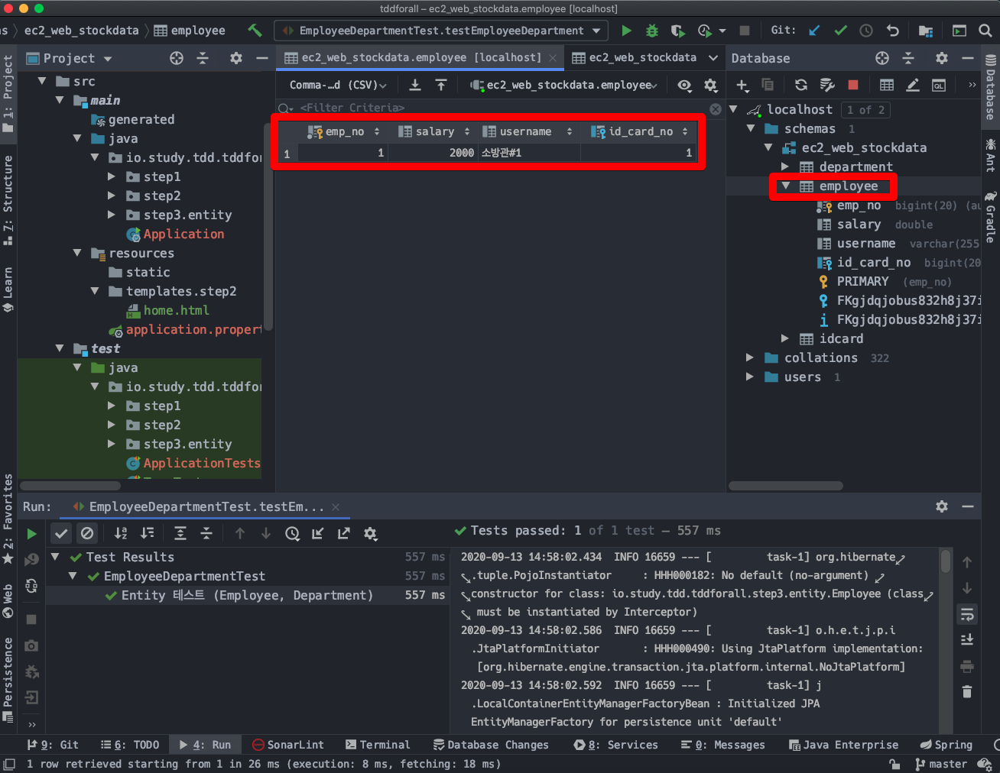

# SpringBoot에서 Mockito, JUnit5 로 이것 저것 테스트해보기 (3) - 엔티티 매핑 테스트

# 1. 예제) Employee, Department

## 1) Employee.java

```java
@Builder
@Getter @Setter
@Entity(name = "EMPLOYEE")
public class Employee {


   @Id @GeneratedValue
   @Column(name = "EMP_NO")
   private Long id;


   @Column(name = "EMP_NAME")
   private String username;


   @Column(name = "SALARY")
   private Double salary;


   @ManyToOne
   @JoinColumn(name = "DEPT_NO")
   private Department dept;
}
```


## 2) Department.java

```java
@Builder
@Getter @Setter
@Entity(name = "DEPARTMENT")
public class Department {


   @Id @GeneratedValue
   @Column(name = "DEPT_NO")
   private Long id;


   @Column(name = "DEPT_NAME")
   private String deptName;


   @OneToMany(mappedBy = "dept")
   private List<Employee> employees = new ArrayList<>();
}
```


## 3) 테스트 코드 

EmployeeDepartmentTest.java

```java
@Slf4j
@SpringBootTest
@Transactional
@Commit
class EmployeeDepartmentTest {


   @Resource
   private EntityManager em;


   @Test
   @DisplayName("Entity 테스트 (Employee, Department) ")
   void testEmployeeDepartment(){
      Department dept = Department.builder()
         .deptName("종로소방서")
         .employees(new ArrayList<>())
         .build();


      em.persist(dept);


      Employee employee = Employee.builder()
         .username("소방관#1")
         .salary(2000D)
         .dept(dept)
         .build();


      em.persist(employee);


      List<Employee> employees = em
         .createQuery("SELECT e FROM EMPLOYEE e")
         .getResultList();


      assertThat(employees.get(0).getUsername()).isEqualTo(employee.getUsername());
      assertThat(employees.get(0)).isEqualTo(employee);
   }
}
```


## 4) 출력결과




#  2. 테스트용도 Database 구동 (docker mariadb)

설명 적자. docker hub의 설명을 참고했고, 나머지는 shell script로... 했었다. 

## 1) docker-mysql-start.sh 

```bash
#!/bin/zsh


name_chartnomy_mysql='chartnomy-mariadb'
cnt_chartnomy_mysql=`docker container ls --filter name=chartnomy-mariadb | wc -l`
cnt_chartnomy_mysql=$(($cnt_chartnomy_mysql -1))


if [ $cnt_chartnomy_mysql -eq 0 ]
then
    echo "'$name_chartnomy_mysql' 컨테이너를 구동시킵니다.\n"


    # 디렉터리 존재 여부 체크 후 없으면 새로 생성
    DIRECTORY=~$USER/env/docker/chartnomy/volumes/chartnomy-mariadb
    test -f $DIRECTORY && echo "볼륨 디렉터리가 존재하지 않으므로 새로 생성합니다.\n"


    if [ $? -lt 1 ]; then
      mkdir -p ~$USER/env/docker/chartnomy/volumes/chartnomy-mariadb
    fi


    # mariadb 컨테이너 구동 & 볼륨 마운트
    docker container run --rm -d -p 23306:3306 --name chartnomy-mariadb \
                -v ~/env/docker/chartnomy/volumes/chartnomy-mariadb:/var/lib/mysql \
                -e MYSQL_ROOT_PASSWORD=1111 \
                -e MYSQL_DATABASE=ec2_web_stockdata \
                -e MYSQL_USER=testuser \
                -e MYSQL_PASSWORD=1111 \
                -d mariadb:latest \
                --character-set-server=utf8mb4 --collation-server=utf8mb4_unicode_ci


else
    echo "'$name_chartnomy_mysql' 컨테이너가 존재합니다. 기존 컨테이너를 중지하고 삭제합니다."
    # 컨테이너 중지 & 삭제
    docker container stop chartnomy-mariadb


    # 컨테이너 볼륨 삭제
    rm -rf ~/env/docker/chartnomy/volumes/chartnomy-mariadb/*
    echo "\n'$name_chartnomy_mysql' 컨테이너 삭제를 완료했습니다.\n"


    # 디렉터리 존재 여부 체크 후 없으면 새로 생성
    DIRECTORY=~$USER/env/docker/chartnomy/volumes/chartnomy-mariadb
    test -f $DIRECTORY && echo "볼륨 디렉터리가 존재하지 않으므로 새로 생성합니다.\n"


    if [ $? -lt 1 ]; then
      mkdir -p ~$USER/env/docker/chartnomy/volumes/chartnomy-mariadb
    fi


    # mariadb 컨테이너 구동 & 볼륨 마운트
    echo "'$name_chartnomy_mysql' 컨테이너를 구동시킵니다."
    docker container run --rm -d -p 23306:3306 --name chartnomy-mariadb \
                -v ~/env/docker/chartnomy/volumes/chartnomy-mariadb:/var/lib/mysql \
                -e MYSQL_ROOT_PASSWORD=1111 \
                -e MYSQL_DATABASE=ec2_web_stockdata \
                -e MYSQL_USER=testuser \
                -e MYSQL_PASSWORD=1111 \
                -d mariadb:latest \
                --character-set-server=utf8mb4 --collation-server=utf8mb4_unicode_ci
fi
```


## 2) docker-mysql-ls.sh

```bash
#!/bin/zsh
docker container ls --filter name=chartnomy-mariadb
```


## 3) docker-mysql-stop.sh

```bash
#!/bin/zsh


name_chartnomy_mysql='chartnomy-mariadb'


cnt_chartnomy_mysql=`docker container ls --filter name=chartnomy-mariadb | wc -l`
cnt_chartnomy_mysql=$(($cnt_chartnomy_mysql -1))


if [ $cnt_chartnomy_mysql -eq 0 ]
then
    echo "'$name_chartnomy_mysql' 컨테이너가 없습니다. 삭제를 진행하지 않습니다."


else
    echo "'$name_chartnomy_mysql' 컨테이너가 존재합니다. 기존 컨테이너를 중지하고 삭제합니다."
    docker container stop chartnomy-mariadb
    rm -rf ~/env/docker/chartnomy/volumes/chartnomy-mariadb/*
    echo "\n'$name_chartnomy_mysql' 컨테이너 삭제를 완료했습니다.\n"
fi
```

  

## 4) docker-mysql-repl.sh

```bash
#!/bin/zsh


name_chartnomy_mysql='chartnomy-mariadb'


cnt_chartnomy_mysql=`docker container ls --filter name=chartnomy-mariadb | wc -l`
cnt_chartnomy_mysql=$(($cnt_chartnomy_mysql -1))


if [ $cnt_chartnomy_mysql -eq 0 ]
then
    echo "'$name_chartnomy_mysql' 컨테이너가 없습니다. 컨테이너를 구동해주세요."


else
    echo "'$name_chartnomy_mysql' 컨테이너의 BASH 쉘 접속을 시작합니다."
    docker container exec -it chartnomy-mariadb sh
fi
```


## 5) Intellij 에서 Database 접속정보 설정




# 3. Database 에서 데이터 확인



  

