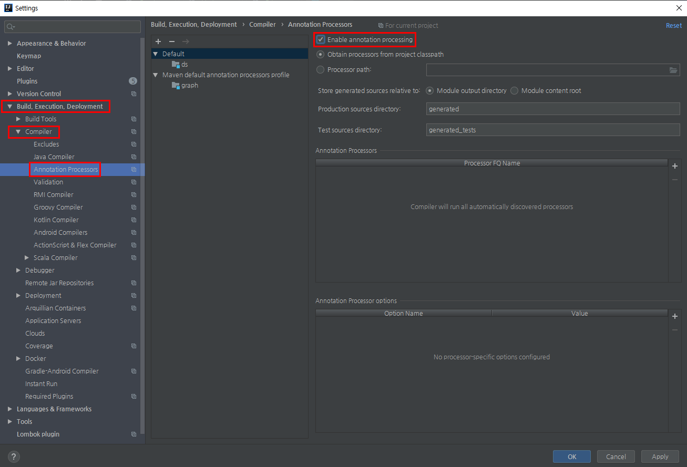
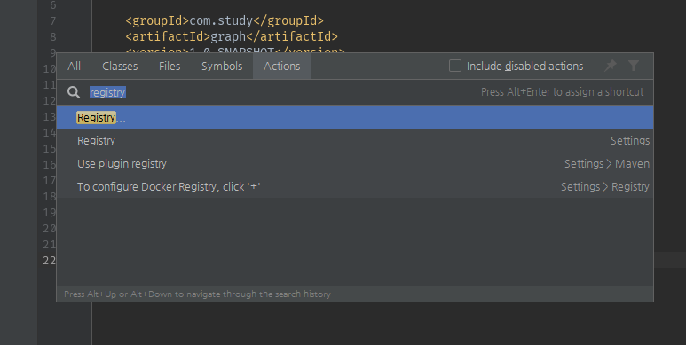
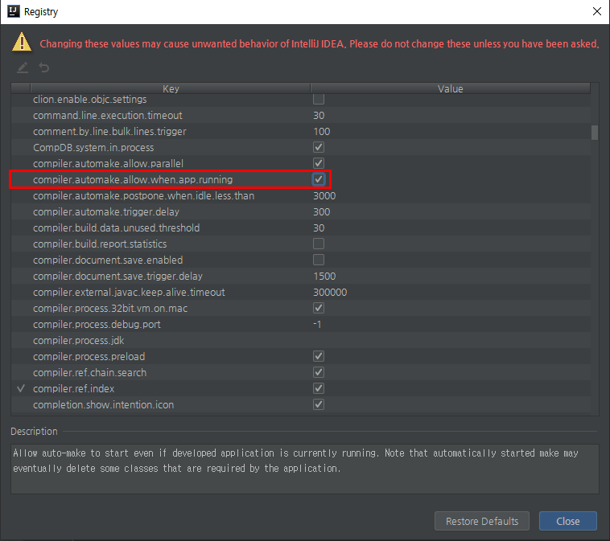

# lombok with intellij


## maven 의존성

```xml
<dependency>
    <groupId>org.projectlombok</groupId>
    <artifactId>lombok</artifactId>
    <version>1.18.8</version>
    <scope>provided</scope>
</dependency>
```


## gradle 의존성

```groovy
buildscript {
    ext{
        springBootVersion = '2.1.7.RELEASE'
    }
    repositories{
        mavenCentral()
        jcenter()
    }
    dependencies {
        classpath("org.springframework.boot:spring-boot-gradle-plugin:${springBootVersion}")
    }
}

apply plugin: 'java'
apply plugin: 'eclipse'
apply plugin: 'org.springframework.boot'
apply plugin: 'io.spring.dependency-management'

group 'com.stock.data'
version '1.0-SNAPSHOT'
sourceCompatibility = 1.8

repositories {
    mavenCentral()
    jcenter()
}

dependencies {
    compile('org.springframework.boot:spring-boot-starter-web')
    compile('org.projectlombok:lombok')
//    annotationProcessor('org.projectlombok:lombok')
//    compile('org.springframework.boot:spring-boot-starter-test')
    compile('org.springframework.boot:spring-boot-starter-data-jpa')
    compile('com.h2database:h2')
    testCompile('org.springframework.boot:spring-boot-starter-test')
}

```


## lombok 플러그인 설치

1. Project Setting (Cmd + ,) > Plugins > Market Place > Lombok 검색 > install
2. Project Setting (Cmd + ,) > Build Execution, Deployment > Compiler > Annotation Processors > Enable Annotation Processing을 체크한 후 Enable 시킨다.  
   


# 트러블 슈팅

## 1) gradle 에서 에러가 날때

아래와 같은 에러 문구를 접할 수 있다.  

>  Execution failed for task ':compileTestJava'.

  

### 에러 문구 전체 내용)

```text
/Users/kyle.sgjung/workspace/sgjung/stock-data/stock-api/src/test/java/com/stock/data/domain/posts/PostsRepositoryTest.java:33: error: cannot find symbol
			Posts.builder()
			     ^
  symbol:   method builder()
  location: class Posts
1 error
FAILURE: Build failed with an exception.
* What went wrong:
Execution failed for task ':compileTestJava'.
> Compilation failed; see the compiler error output for details.
* Try:
```


이 경우 build.gradle파일 내에 

> annotationProcessor('org.projectlombok:lombok')

를 추가해주면 된다.  


### build.gradle

```groovy
buildscript {
    ext{
        springBootVersion = '2.1.7.RELEASE'
    }
    repositories{
        mavenCentral()
        jcenter()
    }
    dependencies {
        classpath("org.springframework.boot:spring-boot-gradle-plugin:${springBootVersion}")
    }
}

apply plugin: 'java'
apply plugin: 'eclipse'
apply plugin: 'org.springframework.boot'
apply plugin: 'io.spring.dependency-management'

group 'com.stock.data'
version '1.0-SNAPSHOT'
sourceCompatibility = 1.8

repositories {
    mavenCentral()
    jcenter()
}

dependencies {
    compile('org.springframework.boot:spring-boot-starter-web')
    compile('org.projectlombok:lombok')
    annotationProcessor('org.projectlombok:lombok')
//    compile('org.springframework.boot:spring-boot-starter-test')
    compile('org.springframework.boot:spring-boot-starter-data-jpa')
    compile('com.h2database:h2')
    testCompile('org.springframework.boot:spring-boot-starter-test')
}

```


## 2) windows 에서 에러가 날때

위의 모든 내용들을 적용했는데도 안될때는 아래의 설정을 추가해주자.

1. Shift를 두번 누르거나, Cmd+Shift+A 를 누른다. 

2. registry 검색  
   

3. compiler.automake.allow.when.app.running 체크  

   


# 주요 어노테이션들

- @NoArgsConstructor
  - 기본 생성자 자동 추가
  - public Posts(){} 와 같은 효과
- @Getter
  - 클래스 내 모든 필드의 Getter 메서드를 자동 생성
- @Builder
  - 해당 클래스의 빌더 패턴 클래스를 생성
  - 생성자 상단에 선언 시 생성자에 포함된 필드만 빌더에 포함


