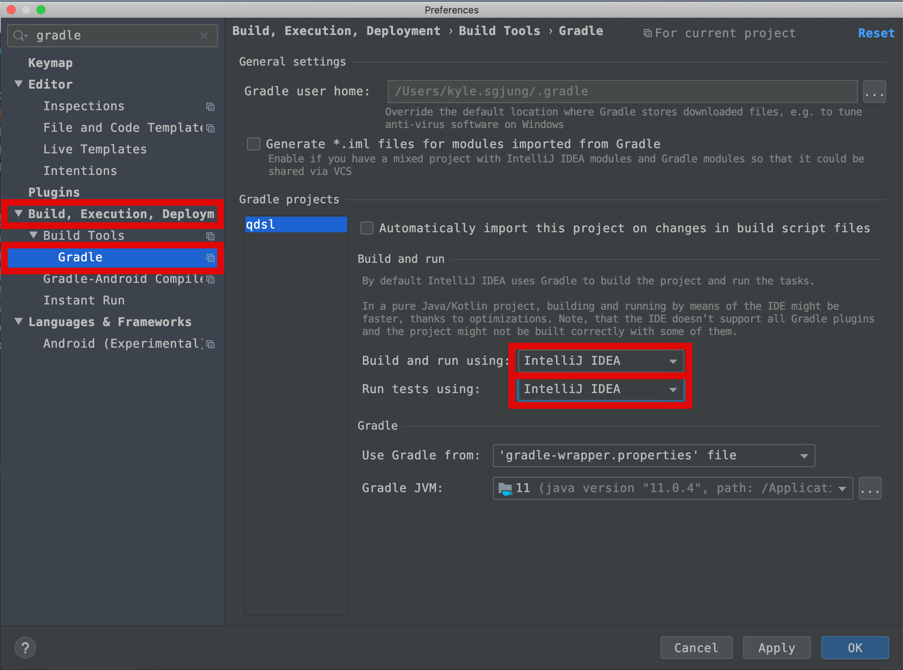
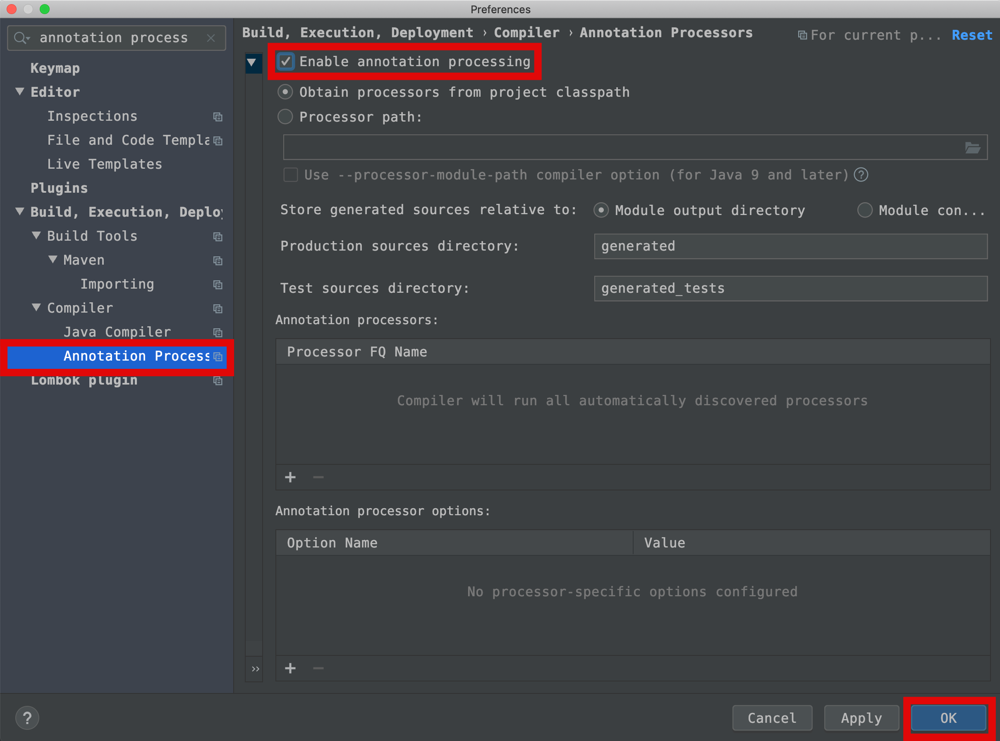

# 프로젝트 생성

## 1. 프로젝트 생성

[스프링 이니셜라이저](https://start.spring.io/) 를 활용해 프로젝트를 생성

gradle 기반 빌드시스템으로 지정한다. 그리고 spring boot 버전은 2.2.2 로 지정한다.

- web
- JPA
- h2 database
- lombok

를 시작할때의 의존성으로 지정한 후 Generate 클릭

## 2. 프로젝트 import

intellij 에서 import porject 클릭

방금 다운로드 받은 프로젝트명.zip 파일의 압축이 풀린 디렉터리인

- 프로젝트명/build.gradle

을 선택해 import 한다.

## 3. 테스트

기본으로 지정된 테스트 코드를 실행해본다. 제대로 동작하는지 확인해야하므로.  

테스트 속도가 느리기 때문에 아래와 같이 해준다.

- Cmd + , (Preference)

- Gradle 검색

- Build, execution, deployment>Build Tools>Gradle

  - Build and run using 에는 Gradle로 되어 있는 것을 IntelliJ IDEA로 (Gradle -> Intellij)
  - Run tests using 에는 Gradle로 되어 있는 것을 Intellij IDEA로 (Gradle -> Intellij)

  

테스트가 빨라진것을 확인 가능하다.

## 4. 롬복 설정

  

- intellij 롬복 플러그인을 설치하지 않았다면 설치 ㄱㄱ 싱
- Preference(Cmd + ,)  Annotation Processors 검색
- Build Execution,Deployment > Compiler > Annotation Processors 
  - Enable annotation processing

만약 이전 프로젝트에서 롬복을 세팅했엇다고 하더라도 새로운 프로젝트 임포트시 롬복 프로세서항목이 enable 되어있지 않을 수도 있으므로 초기설정시에는 항상 자진 납세해서 세팅하는게 **제일 속편하다.**  

