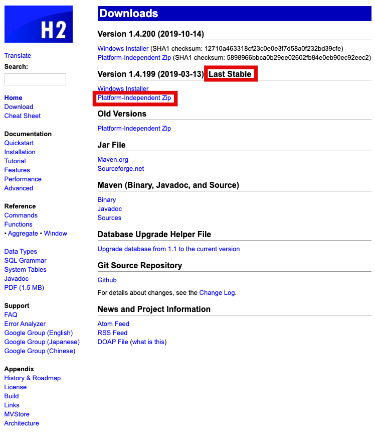
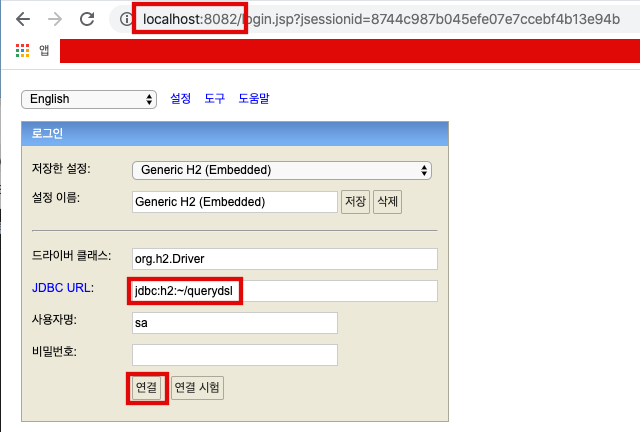
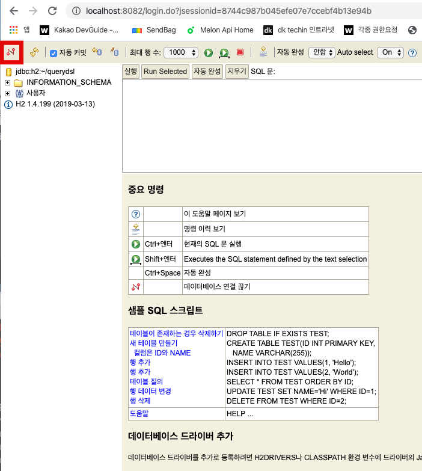
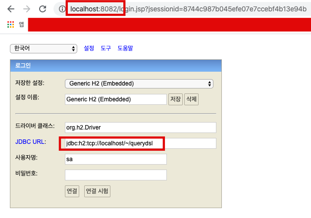
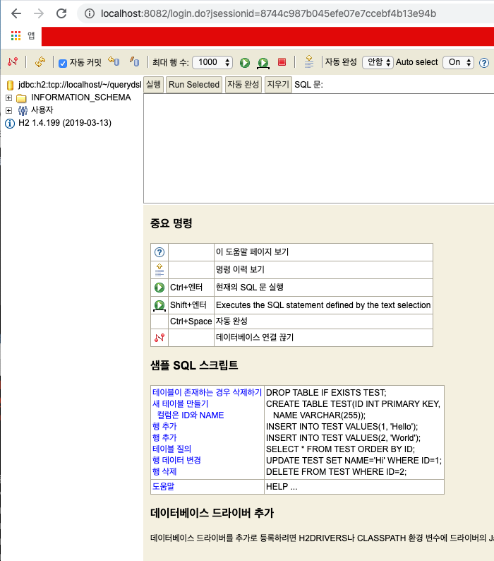

# H2 Database 설치


- [h2database.com](http://h2database.com)을 방문한다.

- Last Stable 버전,Platform-Independent Zip을 다운로드 한다. 
  

- 다운로드후 압축을 풀고 실행한다.

  ```bash
  $ cd ~/env
  $ unzip h2-2019-03-13.zip
  $ cd h2/bin
  $ sudo chmod 755 h2.sh
  $ vim ~/.zshrc
  $ alias h2console='source ~/env/h2/bin/h2.sh'
  $ source ~/.zshrc
  $ h2console
  ```

  

- 아래와 같이 해준다. (최초 한번)

  - 

  - 그러면 아래와 같이 홈디렉터리에 querydsl.mv.db 파일이 생긴것을 확인 가능하다.

    - ```bash
      $ ls -al ~
      ```

    - 

    - 이제 연결을 끊자.

      - 

    - 연결을 끊고 아래와 같은 JDBC URL로 다시 접속

      - jdbc:h2:tcp://localhost/~/querydsl
      - 

    - 접속 성공 모습

      - 

