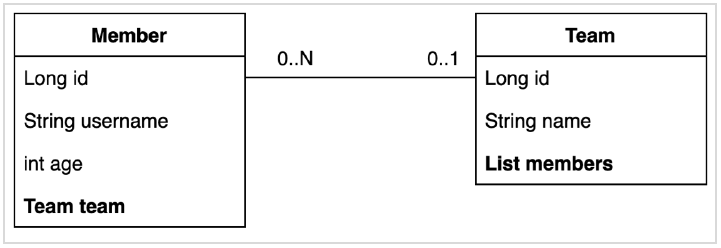
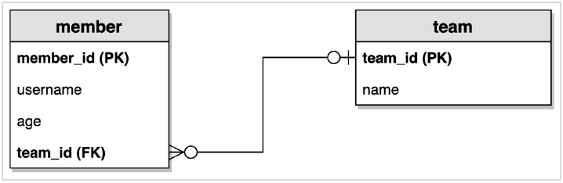

# 엔티티 예제 설정 및 동작확인

여기서는 엔티티 2개를 만들고 두개의 엔티티 사이에 매핑(외래키 참조)관계를 만든 후, 엔티티에 빠뜨린 부분은 없는지, 제대로 작성했는지 확인하기 위해 동작확인 코드를 작성한다.


# 참고할만한 자료들

## @Transactional

- 트랜잭션의 개념, 설정과 예제
  
  - [https://goddaehee.tistory.com/167](https://goddaehee.tistory.com/167)
- 트랜잭션에 대한 조금 더 구체적인 예제
  
  - [https://crosstheline.tistory.com/96](https://crosstheline.tistory.com/96)
- xml 기반 스프링 설정에 대한 예제
  - [https://cchoimin.tistory.com/entry/Transactional-%EC%84%B8%ED%8C%85-%EB%B0%8F-%EC%82%AC%EC%9A%A9%EB%B2%95](https://cchoimin.tistory.com/entry/Transactional-세팅-및-사용법)
    - RuntimeException에 대해서만 롤백처리가 가능한 점에 대해서 Exception에 대한 설명을 함
      - [http://www.nextree.co.kr/p3239/](http://www.nextree.co.kr/p3239/)
    - @Transactional의 속성들
      - [https://soulduse.tistory.com/40](https://soulduse.tistory.com/40)
- 

  

# 엔티티 설계

## 클래스 설계

Member클래스 내에 Team 타입의 변수 team을 두었다. 

Member 클래스 내의 team의 id가 Team 클래스의 id와 매핑될 수 있다.



Member 에는 Team team이 있는데, Member가 Team을 참조하려 할때  

- Member.team

Team 에는 List\<Member\> members 가 있고 Team에서 특정 Member를 참조하려 할때  

- Team.members라는 필드로 참조한다.  


## ERD




# 엔티티 클래스 구현

## Member->Team 매핑

**Member.java 중 일부**

```java
@Entity
@Getter
@NoArgsConstructor(access = AccessLevel.PROTECTED)
@ToString(of={"id", "username", "age"})
public class Member{
  
  @Id @GeneratedValue
  @Column(name = "member_id")
  private Long id;
  private String username;
  private int age;
  
  @ManyToOne(fetch = FetchType.LAZY)
  @JoinColumn(name = "team_id")
  private Team team;
  
  public Member(String username, int age, Team team){
    this.username = username;
    this.age = age;
    if(team != null){
      changeTeam(team);
    }
  }
  
  public void changeTeam(Team team){
    this.team = team;
    team.getMembers().add(this);
  }
}
```

- @ManyToOne(fetch = FetchType.LAZY)
  - Team에 멤버는 여러명이고, Team은 고유하다. 따라서 ManyToOne 매핑을 해주었다.
  - ManyToOne 매핑을 하고나면 One에 해당하는 Team 테이블에는 @OneToMany를 걸여주고 mappedBy = "team" 으로 해주면 된다.
  - FetchType.Lazy
    - ManyToOne 관계에서는 보통 FetchType을 LAZY로 두어야 한다.
- changeTeam()
  - 양방향 연관괸계를 한번에 처리할 수 있도록 하는 편의 메서드이다.
- 실무에서는 가급적이면 @Setter를 사용하지 말아야 한다.


## Member <- Team 매핑

Member.java 의 Team team 필드에 @ManyToOne을 걸어주었다. 매핑 대상인 Team은 OneToMany이면서 Member에게서 매핑을 당하고 있으므로 MappedBy를 걸어주어야 한다.  

Team.java 중 일부

```java
@Entity
@Getter
@NoArgsConstructor(access = AccessLevel.PROTECTED)
@ToString(of={"id", "username", "age"})
public class Team{
  
  @Id @GeneratedValue
  private Long id;
  private String name;
  
  @OneToMany(mappedBy = "team") 
  private List<Member> members = new ArrayList<>();
  
  public Team(String name) {
    this.name = name;
  }
}
```


- @OneToMany(mappedBy = "team")
  private List\<Member\> members = new ArrayList<>();
  - Member <- Team 으로 Team은 Member에게서 연관관계를 당하는 입장이다. (거울같은 관계라고 표현하는 분도 계신다.)
  - 연관관계의 주인이 아니기 때문에 외래키 값을 입력하지 않는다.


## Member 엔티티

```java
package com.study.qdsl.entity;

import javax.persistence.Column;
import javax.persistence.Entity;
import javax.persistence.FetchType;
import javax.persistence.GeneratedValue;
import javax.persistence.Id;
import javax.persistence.JoinColumn;
import javax.persistence.ManyToOne;
import lombok.AccessLevel;
import lombok.Getter;
import lombok.NoArgsConstructor;
import lombok.Setter;
import lombok.ToString;

/**
 * @NoArgsConstructor
 * 	jpa는 기본 생성자가 있어야 한다.
 * 	jpa 기본스펙에서는 기본 생성자를 protected 레벨까지는 허용해준다.
 *
 * @ToString
 * 	ToString 에서는 연관관계를 가지는 필드는 포함하지 않아야 한다.
 * 	Team 처럼 Mapping 되어 있는 것을 ToString에 넣어주면 Team에 갔다가 Member갔다가 하면서 무한루프에 빠지게 되므로
 * 	되도록 연관관계 매핑 필드에는 ToString을 사용하지 않도록 주의해야 한다.
 */
@Entity
@Getter @Setter
@NoArgsConstructor(access = AccessLevel.PROTECTED)
@ToString(of={"id", "username", "age"})
public class Member {

	@Id @GeneratedValue
	@Column(name = "member_id")
	private Long id;
	private String username;
	private int age;

	// Team <-> Member 연관관계의 주인
	@ManyToOne(fetch = FetchType.LAZY)
	@JoinColumn(name = "team_id")	// 외래키 컬럼 명
	private Team team;

	public Member(String username){
		this(username, 0);
	}

	public Member(String username, int age){
		this(username, age, null);
	}
	
	public Member(String username, int age, Team team){
		this.username = username;
		this.age = age;
		if(team != null){
			changeTeam(team);
		}
	}

	public void changeTeam(Team team) {
		this.team = team;
		team.getMembers().add(this);
	}
}

```


## Team 엔티티

```java
package com.study.qdsl.entity;

import java.util.ArrayList;
import java.util.List;
import javax.persistence.Entity;
import javax.persistence.GeneratedValue;
import javax.persistence.Id;
import javax.persistence.OneToMany;
import lombok.AccessLevel;
import lombok.Getter;
import lombok.NoArgsConstructor;
import lombok.Setter;
import lombok.ToString;

/**
 * @NoArgsConstructor
 * 	jpa는 기본 생성자가 있어야 한다.
 * 	jpa 기본스펙에서는 기본 생성자를 protected 레벨까지는 허용해준다.
 *
 * @ToString
 * 	ToString 에서는 연관관계를 가지는 필드는 포함하지 않아야 한다.
 * 	Team 처럼 Mapping 되어 있는 것을 ToString에 넣어주면 Team에 갔다가 Member갔다가 하면서 무한루프에 빠지게 되므로
 * 	되도록 연관관계 매핑 필드에는 ToString을 사용하지 않도록 주의해야 한다.
 */
@Entity
@Getter @Setter
@NoArgsConstructor(access = AccessLevel.PROTECTED)
@ToString(of={"id", "username", "age"})
public class Team {

	@Id @GeneratedValue
	private Long id;
	private String name;

	// Team <-> Member 의 연관관계를 당하는 입장 (거울...)
	// 연관관계의 주인이 아니기 때문에 외래키 값을 입력하지 않는다.
	@OneToMany(mappedBy = "team")
	private List<Member> members = new ArrayList<>();

	public Team(String name){
		this.name = name;
	}
}
```


# 테스트 코드

Cmd + Shift +T (또는 Ctrl + Shift + T)를 누르면 Test코드가 자동으로 생성된다.  

기본적으로 JPA 테스트 코드에서는 @Transactional, @Commit을 사용한다. (테스트 코드를 작성할 때에만)

- @Transactional 
  - Test에 적용하면 테스트 시작시에 트랜잭션을 시작하고, 테스트가 끝나면 트랜잭션을 자동으로 롤백해준다.
  - 테스트 코드에 사용하면 해당 테스트가 끝난 후 DB의 데이터를 롤백해서 깔끔하게 초기화해준다.
  - 다른 테스트에 영향을 주지 않으면서, 다음 테스트를 이어갈 수 있다는 장점이 있다.
- @Commit
  - 다른 테스트와 꼬이지 않기 위해 주석처리
  - DB에 Commit을 하게 되면 다른 테스트들과 꼬일 수 있다. 따라서 git에 커밋/푸시 시에는 주석처리를 한다.
  - H2 Database Console에서 값을 확인할 수 없는 불편함이 있으면 임시로 @Commit 에 주석처리 한것을 풀어서 사용한다.

  

- EntityManager 
  - @Autowired 또는 @PersistContext 어노테이션으로 스프링 컨테이너 내에 생성된 객체를 가져올 수 있다.


**MemberTest.java**

```java
package com.study.qdsl.entity;

import static org.junit.jupiter.api.Assertions.*;

import java.util.List;
import javax.persistence.EntityManager;
import javax.transaction.Transactional;
import org.junit.jupiter.api.Test;
import org.springframework.beans.factory.annotation.Autowired;
import org.springframework.boot.test.context.SpringBootTest;
import org.springframework.test.annotation.Commit;

/**
 * @Transactional
 *  : Test에 적용하면 테스트 시작시에 트랜잭션을 시작하기도 하지만, 추가로 테스트가 끝나고 트랜잭션을 자동으로 롤백해주는 기능을 수행한다.
 *  : @Transactional을 테스트 코드에 사용하면 해당 테스트가 끝나고, DB의 데이터를 롤백해서 깔끔하게 초기화 해준다.
 *  : 다른 테스트에 영향을 주지 않고, 다음 테스트를 계속 어이갈 수 있는 장점이 있다.
 *
 * @Commit
 *  : DB에 Commit을 하게되면 다른 테스트들과 꼬일수 있기 때문에 git에 커밋/푸시 시에는 주석처리
 *  : H2 Database Console에서는 당연히 안보이긴 하지만, 로그나, 콘솔에서만 확인하고, 다른 테스트와 꼬이지 않기 위해 주석처리
 */
@SpringBootTest
@Transactional
//@Commit
class MemberTest {

	@Autowired
	EntityManager em;

	@Test
	public void testEntity(){
		Team teamA = new Team("teamA");
		Team teamB = new Team("teamB");

		em.persist(teamA);
		em.persist(teamB);

		Member member1 = new Member("member1", 10, teamA);
		Member member2 = new Member("member2", 20, teamA);

		Member member3 = new Member("member3", 30, teamB);
		Member member4 = new Member("member4", 40, teamB);

		em.persist(member1);
		em.persist(member2);
		em.persist(member3);
		em.persist(member4);

		// 초기화
		em.flush(); // 영속성 컨텍스트에 있는 객체들을 직접 쿼리를 만들어 DB에 적용하는 단계
		em.clear(); // 영속성 컨텍스트(메모리)에 있는 캐시들을 지운다. 그 다음 쿼리를 수행시 깔끔한 상태로 진행될 수 있도록 해주는 작업

		// 영속성 컨텍스트의 데이터 확인
		List<Member> members = em.createQuery("select m from Member m", Member.class)
			.getResultList();

		for (Member member : members){
			System.out.println("member = " + member);
			System.out.println("-> member.team" + member.getTeam());
		}
	}
}
```


- em.flush()
  
  - 영속성 컨텍스트에 있는 객체들을 직접 SQL로 DB에 적용하는 단계
- em.clear()
  - 영속성 컨텍스트(메모리)에 있는 캐시들을 지운다.
  - 그 후의 쿼리를 수행시 깔끔한 상태로 진행될 수 있도록 해주는 작업

- EntityManager의 createQuery
  
  >
  >```java 
  >List<Member> members = em.createQuery("select m from Member m", Member.class)
  >  												.getResultList();
  >```
  >
  
  JPQL 문법이다. 데이터를 확인하고 있다. EntityManager 객체를 통해 쿼리를 수행한다.