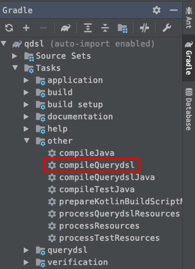
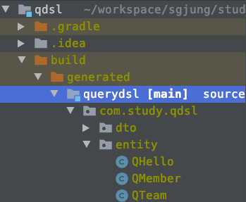

# QType의 개념 및 활용

# 샘플 데이터

예를 들어 아래의 데이터들이 들어있다고 하자.

```text
 member :: Member(id=4, username=John, age=23)
 member :: Member(id=5, username=Becky, age=22)
 member :: Member(id=6, username=Kyle, age=28)
 member :: Member(id=7, username=Stacey, age=24)
 member :: Member(id=8, username=Aladdin, age=35)
 member :: Member(id=9, username=Genie, age=41)
 member :: Member(id=10, username=Beethoven, age=251)
 member :: Member(id=11, username=Chopin, age=210)
 member :: Member(id=12, username=Genie, age=210)
 member :: Member(id=13, username=null, age=100)
```

우리는 이 데이터를 활용해 기본적인 Select 문을 QueryDsl 방식으로 작성할 것이다.  


# 엔티티 구현

## Member

```java
@Entity
@Getter @Setter
@NoArgsConstructor(access = AccessLevel.PROTECTED)
public class Member{
  @Id @GeneratedValue
  @Column(name="member_id")
  private Long id;
  private String username;
  private int age;
  
  @ManyToOne(fetch=FetchType.LAZY)
  @JoinColumn(name="team_id")
  private Team team;
  
  public Member(String name, int age, Team team){
    this.username = username;
    this.age = age;
    if(team != null){
      changeTeam(team);
    }
  }
}
```


## Team

```java
@Entity
@Getter @Setter
@NoArgsConstructor(access = AccessLevel.PROTECTED)
@ToString(of={"id", "username", "age"})
public class Team{
  
  @Id @GeneratedValue
  private Long id;
  private String name;
  
  @OneToMany(mappedBy="team") 
  private List<Member> members = new ArrayList<>();
  
  public Team(String name){
    this.name = name;
  }
}
```


# QType 생성

Member와 Team을 QueryDsl에서 인식할 수 있는 타입인 QMember, QTeam으로 먼저 변환하자.  

Gradle > Task> other > compileQueryDsl을 통해 가능하다. compileQueryDsl을 더블클릭하자.



QTYPE은 클래스의 이름 앞에 Q가 붙어서 generated 디렉터리에 생성된다.  

generated 디렉터리에 저장되는 이유는 우리가 build.gradle 스크립트를 그렇게 작성했기 때문이다.  

@Entity가 붙은 모든 클래스에 대해 QMember, QTeam처럼 Q가 앞에 붙은 쿼리를 위한 클래스타입이 새로 generated 디렉터리에 생성된다.




# QType 동작 확인

QType이 실제로 동작하는지 확인하기 위해 JUnit 테스트 코드를 작성해보자. 어려운 구문은 아니다. 모든 멤버와 팀들을 셀렉트 하는 예제이다.  

@BeforeEach에서는 샘플데이터들을 모두 insert 하고 있다.  

## BasicQTypesTest.java

```java
package com.study.qdsl.remind.ch03;

import static com.study.qdsl.entity.QMember.*;

import com.querydsl.jpa.impl.JPAQueryFactory;
import com.study.qdsl.entity.Member;
import com.study.qdsl.entity.QMember;
import com.study.qdsl.entity.Team;
import java.util.List;
import javax.persistence.EntityManager;
import javax.transaction.Transactional;
import org.junit.jupiter.api.BeforeEach;
import org.junit.jupiter.api.Test;
import org.springframework.beans.factory.annotation.Autowired;
import org.springframework.boot.test.context.SpringBootTest;

@SpringBootTest
@Transactional
public class BasicQTypesTest {

	@Autowired
	EntityManager entityManager;

	JPAQueryFactory queryFactory;

	@BeforeEach
	public void before(){
		queryFactory = new JPAQueryFactory(entityManager);

		Team marketingTeam = new Team("Marketing");
		Team analysisTeam = new Team("Analysis");
		Team musicianTeam = new Team("Musician");

		entityManager.persist(marketingTeam);
		entityManager.persist(analysisTeam);
		entityManager.persist(musicianTeam);

		Member john = new Member("John", 23, marketingTeam);
		Member susan = new Member("Becky", 22, marketingTeam);

		Member kyle = new Member("Kyle", 28, analysisTeam);
		Member stacey = new Member("Stacey", 24, analysisTeam);

		Member aladin = new Member("Aladdin", 35, analysisTeam);
		Member genie = new Member("Genie", 41, analysisTeam);

		Member beethoven = new Member("Beethoven", 251, musicianTeam);
		Member chopin = new Member("Chopin", 210, musicianTeam);
		Member genie2 = new Member("Genie", 210, musicianTeam);
		Member nullName = new Member(null, 100, musicianTeam);

		entityManager.persist(john);
		entityManager.persist(susan);
		entityManager.persist(kyle);
		entityManager.persist(stacey);
		entityManager.persist(aladin);
		entityManager.persist(genie);

		entityManager.persist(beethoven);
		entityManager.persist(chopin);
		entityManager.persist(genie2);
		entityManager.persist(nullName);

	}

	@Test
	public void selectAll(){
		List<Member> members = queryFactory.select(member)
			.from(member)
			.fetch();

		for(Member m : members){
			System.out.println( " member :: " + m);
		}
	}
}
```


## Select 구문

Select 구문을 작성하기 까지 

- 우리가 어떤 객체를 가져와야 하는지
- Select 구문은 어떤식으로 작성하는지

살펴보자  

> ```java
> // ...
> queryFactory = new JPAQueryFactory(entityManager);
> // ...
> List<Member> members = queryFactory.select(member)
>   .from(member)
>   .fetch();
> ```


### QueryDsl 을 사용하기 위한 JPAQueryFactory 인스턴스 생성

> queryFactory = new JPAQueryFactory(entityManager);

QueryDsl 기반의 쿼리를 실행하기 위해서는 JPAQueryFactory 타입의 객체가 필요하다. JPAQueryFactory 객체는 현재 존재하는 entityManager를 기반으로 동작한다. ( **JPA의 엔티티를 관리해주는 entityManager를 주입받아서** 동작한다)


### Select 쿼리

QMember 클래스를 on demand static import 하자. (opt + Enter)

> ```java
> List<Member> members = queryFactory.select(member) // QMember.member
>   .from(member)	// QMember.member
>   .fetch();
> ```


- QMember.member 테이블에서 (from)
- QMEmber.member 테이블의 모든 멤버를 출력하라 (select)
- SQL을 Prepared Statement로 생성한 후에 실행한다. (fetch())


# QType 의 개념

QueryDSL을 이용해 DB에 접근하는 코드를 작성시, @Entity 가 붙은 대상들에 대해 compileQueryDsl 태스크를 통해 컴파일 된 QType을 생성한 후 조회해야 한다. QueryDsl은 조회성 쿼리 작성시 사용하는 JPQL을 포장해서 조금 더 쉽게 만들어놓은 라이브러리이다. 이렇게 재 포장하여 사용하게끔 만들다 보니, 새로운 타입인 QType이라는게 생긴 듯 하다. 보통 이 QType을 select절, from절 또는 Join 절에 지정하여, 객체 단위로 select, from한다.  

  

QType이라는게 뭘까? 하고 클래스를 직접 살펴보려 했었다. 하지만, 첫술에 어찌 배부르랴. 처음에 너무 많이 배경지식을 알려고 하는 것은 학습목표에도 맞지 않고, 필요에 의해 알아나가고, 철저히 예제기반으로 익혀가며 주변지식을 익히는게 나을 듯 히다.  

  

JPQL 작성시 보통 from절과 select 절에 @Entity가 붙은 Member, Team 과 같은 영속성 객체들을 지정해줬었다. QueryDsl 역시 JPAQueryFactory 를 통해 Query를 실행할 때 보통 QMember, QTeam과 같은 QueryDsl을 위한 타입을 select, from 절에 지정하여 사용한다.  


