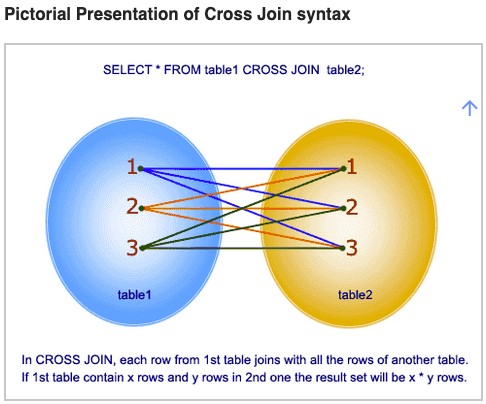

# 3. 다양한 조인구문

QueryDsl은 SQL을 쓰기 싫어서 쓰는 것이 아니다.  

SQL 조회구문 들에서 중복되는 SQL 비교로직이나, 제품의 특정한 비교조건 등을 객체지향적으로 공통화, 모듈화할 경우 시너지가 크기 때문에 사용하는 것이다.  

강의를 들으면서 느낀 점은, 조회 구문을 작성할 때  

- SQL을 직접 작성하여 조회하는게 가장 빠르고 쉬운 방법 중에 하나라는 생각이 들었다.
- QueryDsl을 잘 모르고 덤비다가는 큰 낭패를 볼수도 있다는 것
- 초기 개발 단계에서 요구사항이 명확하지 않을 때의 조회구문 작성은 굳이 QueryDsl보다는 JdbcTemplate 또는 Mybatis를 사용하는 것이 나쁘지 않은 선택일 수도 있다는 것
- 고도화 시(어느 정도의 요구사항들이 fix 되었을 때)에 QueryDsl이라는 칼을 빼들고 시작하면 정말 코딩이 행복할 수도 있겠다 하는 생각도 들었다.
- 하지만, QueryDsl을 잘 아는 개발 멤버들과 함께 개발을 한다면 처음부터 QueryDsl을 사용하는 것도 나쁘지 않다는 생각이다.

# 목차

- leftJoin
- innerJoin
- 셀프조인
- 크로스 조인
  - 참고할 만한 자료
    - [수까락의 프로그래밍 이야기](http://egloos.zum.com/sweeper/v/3002332)
    - [w3resource.com](https://www.w3resource.com/sql/joins/cross-join.php)

- 세타 조인 (??)


# left 조인


# inner 조인


# 셀프 조인


# 크로스 조인

> 크로스 조인은 하나의 테이블과 다른 하나의 테이블의 모든 요소들을 nxm 으로 모두 한번씩 가능한 모든 경우의 수에 대해 연결짓는 것이다. 즉 테이블 A의 각각의 모든 행과 테이블 B의 각각의 모든 행을 모두 조인하는 것이다.

강의에서 세타 조인(theta join)이라는 것을 언급한다. 근데 실제 생성 쿼리를 보니 크로스조인 인 것 같더라. 아무튼, 자주 쓰이지 않는 조인이고, 성능상에 무리가 갈 수도 있는 조인이라서 설명을 안하려다가 혹시나 하는 마음에 설명하고 넘어가신다면서 예제를 주셨다. 강의에서 들었던 QueryDsl 예제 코드는 아래와 같다.  

> 참고)  
> 크로스 조인을 강의 중간에 혼동해서 실수로 세타조인으로 말씀하신 것인지는 나도 잘 모르겠다 (강의에서는 세타조인이라고 언급하심). 그리고 세타 조인이 크로스 조인과 같은 말인지도 나는 잘 모른다. 글이 아닌 말로 설명할 때는 무의식적으로 실수하실 때도 있을것 같기도 하다. 일단 여기서는 이것을 크로스 조인이라고 하고 정리할 예정이다.  

**예) 멤버의 이름이 팀이름과 같은 경우의 데이터를 뽑아내는 예제**  

(실제로 팀 이름과 멤버의 이름이 같은 경우의 데이터를 뽑아내는 경우는 드물다. 예를 들려다 보니 억지로 예제를 맞춘 것이라고 하심)  

```java
List<Member> weirdData = queryFactory.select(member)
  .from(member, team)
  .where(member.username.eq(team.name))
  .fetch();
```

실제 SQL이 생성된 모습을 보면 아래와 같다.  

```sql
select 
	member0_.member_id as member_i1_1_, 
	member0_.age as age2_1_, 
	member0_.team_id as team_id4_1_, 
	member0_.username as username3_1_ 
from member member0_ 
cross join team team1_ 
where member0_.username=team1_.name
```

team과 member를 cross join 하고 있다. 그리고 join의 조건은 usernae과 team의 name이다.  

## QueryDsl 에서의 크로스조인

**예) 멤버의 이름이 팀이름과 같은 경우의 데이터를 뽑아내는 예제**  

```java
List<Member> weirdData = queryFactory.select(member)
  .from(member, team)
  .where(member.username.eq(team.name))
  .fetch();
```

주의해서 봐야 할 부분으로

> from(member.team, team)  

과 같은 형식으로 조인한 것이 아니라  

>  from(member, team)  

과 같은 형식으로 조인 했다.    

즉, member.team(멤버가 속한 팀)과 team(팀)을 조인한 것이 아니라, member와 team을 아무 기준 없이 n x n 곱 연산을 한 형태이다. 실제 DB에서 SQL이 어떻게 동작하는지는 아래의 **SQL에서의 크로스 조인**을 보자.  


## SQL에서의 크로스 조인

크로스 조인은 하나의 테이블과 다른 하나의 테이블의 모든 요소들을 nxm 으로 모두 한번씩 가능한 모든 경우의 수에 대해 연결짓는 것이다. 즉 테이블 A의 각각의 모든 행과 테이블 B의 각각의 모든 행을 모두 조인하는 것이다.  

크로스조인을 수행시 DBMS에서의 실제 수행 동작은 아래의 그림과 같이 한다고 한다.  



>  이미지 출처 : [w3resource.com/joins/cross-join](https://www.w3resource.com/sql/joins/cross-join.php)


실제로 사용하는 케이스도 많지는 않고, 성능상에도 좋지 않은 결과를 야기한다고들 한다.


## 참고자료(Cross Join)

참고한 내용은 아래와 같다.  

- [수까락의 프로그래밍 이야기](http://egloos.zum.com/sweeper/v/3002332)
- [w3resource.com](https://www.w3resource.com/sql/joins/cross-join.php)


