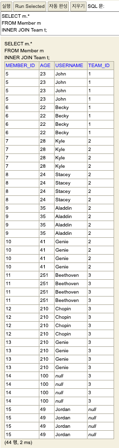
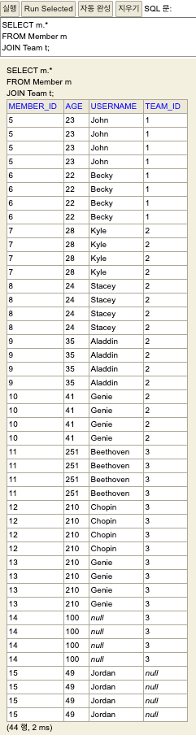
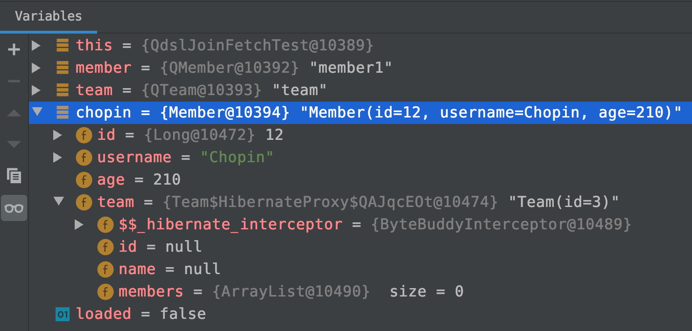
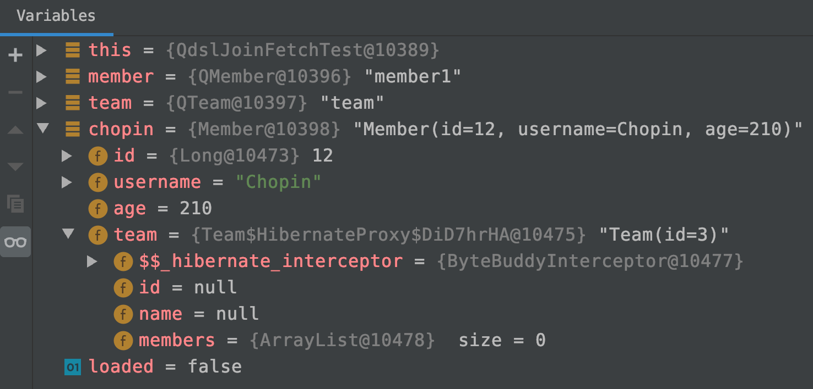

# 3. 다양한 조인구문

QueryDsl은 SQL을 쓰기 싫어서 쓰는 것이 아니다.  

SQL 조회구문 들에서 

- 중복되는 SQL 비교로직이나, 
- 제품의 특정한 비교조건 등을 객체지향적으로 공통화, 모듈화할 경우 

시너지가 크기 때문에 사용하는 것으로 생각된다. 물론 Mybatis에서 xml 파일에 비교구문을 sql id 등으로 공통화해놓을 수 있다. 하지만 이 경우 xml 파일을 수정하면 다시 개발환경의 로컬 톰캣을 다시 구동해야 한다. QueryDsl에서의 비교조건 구문 작성은 어느 정도 까지는 컴파일 단계(IDE 내에서 빨간줄)에서 오류를 찾아내기 쉽다. 또한 데이터의 타입이 실제로 Mybatis 내부에서 어떻게 변하는지 알기 어려운 면도 있는데 QueryDsl 을 사용하면 이 부분에 대해 상당부분 해소되는 편이다.  


강의를 들으면서 느낀 점은, 조회 구문을 작성할 때  

- SQL을 직접 작성하여 조회하는 게 가장 빠르고 쉬운 방법 중에 하나라는 생각이 들었다.
- QueryDsl을 잘 모르고 덤비다가는 큰 낭패를 볼수도 있다는 것
- 초기 개발 단계에서 요구사항이 명확하지 않을 때의 조회구문 작성은 굳이 QueryDsl보다는 JdbcTemplate 또는 Mybatis를 사용하는 것이 나쁘지 않은 선택일 수도 있다는 것
- 고도화 시(어느 정도의 요구사항들이 fix 되었을 때)에 QueryDsl이라는 칼을 빼들고 시작하면 정말 코딩이 행복할 수도 있겠다 하는 생각도 들었다.
- 하지만, QueryDsl을 잘 아는 개발 멤버들과 함께 개발을 한다면 처음부터 QueryDsl을 사용하는 것도 나쁘지 않다는 생각이다.

# 목차

- join() - 기본 조인
- leftJoin()
- innerJoin()
- on() 절
- fetch()
- 셀프조인
- 크로스 조인
- 프로젝션 기본
- 예제코드

# join - 기본 조인

조인시 innerJoin, leftJoin, rightJoin 등을 지정하지 않고 join() 메서드 하나만 호출하는 경우를 기본 조인이라고 하고 이 경우 inner join SQL이 생성되는데, 이에 대해서 QueryDsl코드, SQL을 정리해보자.

## QueryDsl 

**예제) Member 테이블 내에서 팀 이름이 'Musician'인 팀원들의 팀이름, 팀 id, 멤버 id, 멤버가 속한 팀 id, 멤버 이름을 출력**  

```java
QMember member = QMember.member;
QTeam team = QTeam.team;

List<Member> musicianMembers = queryFactory.selectFrom(member)
  .join(member.team, team)
  .where(member.team.name.eq("Musician"))
  .fetch();
```

## SQL

QueryDsl의 on 절에 아무 조건을 주지 않으면 보통 QueryDsl 내부적으로 이것을 inner join으로 인식해 뭐리를 아래와 같이 바꿔준다.  

```sql
select member1
from Member member1
  inner join member1.team as team
where member1.team.name = 'Musician'
```


# leftJoin()

바로 예제를 보자. 예제 데이터 생성 코드는 문서 제일 아래에 두었다. leftJoin()으로 QueryDsl 코드와 SQL코드를 보자.  

## QueryDsl

예제) 

```java
final QMember member = QMember.member;
final QTeam team = QTeam.team;

List<Member> jordanTeam = queryFactory.selectFrom(member)
  .leftJoin(member.team, team)
  .where(member.username.eq("Jordan"))
  .fetch();
```


## SQL

```sql
select 
	member0_.member_id 	as member_i1_1_, 
	member0_.age 				as age2_1_, 
	member0_.team_id 		as team_id4_1_, 
	member0_.username 	as username3_1_ 
from member member0_ 
left outer join team team1_ 
	on member0_.team_id=team1_.id 
where member0_.username=?
```


  

# innerJoin()


# on() 

on 절을 지원하기 시작한 것은 JPA 2.1 부터 지원하기 시작했다.  

- 조인 대상을 필터링 해야 할 때 (조인 하기 전에 조인할 테이블을 미리 필터링해서 가져오는 경우)  
- 연관관계 없는 엔티티 간에 외부조인을 할 경우  

에 대해서 on절을 사용가능하다.  


on 절을 활용한 조인 대상 필터링을 사용할 때  

- innerJoin 인데, 기본 키 매핑관계를 기반으로 조인을 할 경우 
  - queryDsl 코드에서는 굳이 on() 을 사용하지 않아도 된다.where() 로도 해결된다.
  - SQL을 직접 작성할 경우는 반드시 ON절을 명시해야 한다.  
- innerJoin 인데, 기본 키 매핑관계가 아닌 다른 연관관계로 조인할 경우 (ex. 팀이름 등등...)
  - queryDsl 코드에서 on()절을 통해 조인할 대상을 명시적으로 지정한다.
  - SQL을 직접 작성할 경우 반드시 ON절을 명시한다. 
- left outer join, right outer join 등의 경우에는 기본키 외의 다른 키를 매핑할 경우에 반드시 on 절이 반드시 필요하다.


## join(), innerJoin()

예) on 절에 아무 조건도 놓지 않았을 경우에 대한 테스트 코드

```java
@Test
public void innerJoinTest(){
  //		on 절에 아무조건도 놓지 않았을 경우에 SQL이 어떻게 표현되는지 확인해보기
  QMember member = QMember.member;
  QTeam team = QTeam.team;

  List<Member> fetch = queryFactory.selectFrom(member)
    .innerJoin(member.team, team)
    .fetch();
}
```

결과) 실제 쿼리는 QueryDsl 에서 아래와 같이 on 절을 직접 넣어준다. 엔티티의 기본키를 넣고 맞춰준다.

```sql
select 
	member0_.member_id as member_i1_1_, 
	member0_.age as age2_1_, 
	member0_.team_id as team_id4_1_, 
	member0_.username as username3_1_ 
from member member0_ 
inner join team team1_ 
	on member0_.team_id=team1_.id;
```


혼동이 될 수 있는 사항에 대해 짚고 넘어가야 할 것 같다.

queryDsl 자바코드와 SQL의 코드가 완전히 일치하는 것이 아니고, QueryDsl에서 옵셔널 하게 키를 매핑해서 Query를 맞춰주는 부분이 있다. 프로그래머가 어떠한 조인을 작성했을 때 해당 조인의 조인 조건이 없을 경우 디폴트로 기본 엔티티 매핑을 활용해 조인을 한다. 예를 들어 위의 on()을 사용하지 않은 inner join구문을 SQL에서 비슷하게 입력해보면 결과가 아래와 같이 cross join과 같은 결과가 나타난다. (SQL 사용시 on 절을 무조건 생략할 수있는 것이라고 착각하기 쉽기 때문에 메모를 남긴다. java 코드에서 on()이 생략될 경우 queryDsl에서 on절을 맞춰주는것.)



INNER JOIN이 아닌 기본 조인의 경우에도 SQL상에서 ON절을 명시하지 않으면 결과는 같다.



## leftJoin(), rightJoin()

SQL의 LEFT (OUTER) JOIN, RIGHT (OUTER) JOIN 은 ON 절을 사용한다. QueryDsl에서 left outer join, right outer join 등의 경우에는 기본키 외의 다른 키를 매핑할 경우에 반드시 on()이 반드시 필요하다.

- leftJoin()
  
  - LEFT (OUTER) JOIN
- rightJoin()
  - RIGHT (OUTER) JOIN

  

ex) left (outer) join

```java
	@Test
	public void leftJoin(){
		QMember member = QMember.member;
		QTeam team = QTeam.team;

		List<Member> analysisMembers = queryFactory.selectFrom(member)
			.leftJoin(member.team, team)
			.where(member.team.name.eq("Analysis"))
			.fetch();

		assertThat(analysisMembers)
			.extracting("username")
			.containsExactly("Kyle","Stacey","Aladdin","Genie");
	}
```

  

예) 변환된 SQL 

```sql
select
	member0_.member_id as member_i1_1_,
	member0_.age as age2_1_,
	member0_.team_id as team_id4_1_,
	member0_.username as username3_1_
from
	member member0_
	left outer join team team1_
		on member0_.team_id=team1_.id
where
	team1_.name='Analysis'
```


# fetchJoin()

**요약** 

> - fetchJoin()은 SQL 조인을 활용해 매핑되어 있는 연관된 엔티티들을 모두 SQL 한번에 조회해 데이터를 가져오는 기능이다. 주로 성능 최적화에 사용하는 방식이다. 
> - 엔티티의 연관관계를 지을 때 FetchType을 Lazy로 지정했다면, 매핑 연관관계의 엔티티를 한번에 불러오지 않기 때문에 fetchJoin()을 사용하게 되는 경우가 있다.
> - fetchJoin()을 테스트할 때는 영속성 컨텍스트의 값을 제때 제때 지워주지 않으면 결과를 제대로 보기 어렵다. 따라서 테스트 시에 영속성 컨텍스트의 값을 지우고(flush(), clear()) 시작해야 한다.

  

흔히 우리가 영속성 객체를 말할때 영속성 객체는 DB에 물리적으로 존재하는 것이 아니라 JPA가 자료구조등을 통해 객체 지향적으로 ERD에 맞도록 들고 있는 메모리 상에서 비교하는 데이터의 자료구조이다. JPA 는 여러 시행착오를 거치면서 이 자료구조들을 메모리의 변수 또는 값들로 저장하고 있으려 할때 한번에 통으로 불러오기보다는 최적화된 여러가지 방법을 생각해낸 듯 하다.  

이 글의 하단부에 정리한 예제 데이터 생성코드에서는 Member엔티티에 Team엔티티를 매핑했다. 이렇게 매핑을 설정할때 FetchType을 Lazy로 주었다. 즉, 지연된 로딩을 적용하겠다는 의미이다.  

예를 들어 Member 테이블의 모든 데이터를 들고와! 하는 SQL과 같은 역할의 QueryDsl 구문을 작성했다고 해보자(아래에서 예제로 정리함). 그런데, Member 엔티티에는 Team의 인스턴스를 가지고 있다. Member 엔티티만 들고와! 하고 SQL을 날렸으므로 당연히 Team 인스턴스는 아직 로딩되지 않은 상태이다.  

여기서는 연관관계를 지닌 두개의 엔티티를 통해 가능한 여러가지의 경우의 수를 생각해 여러가지의 테스트 코드를 작성해서, 엔티티 A를 불러올 때 연관관계인 다른 엔티티 B를 불러올 경우 어떤 경우에 쿼리를 따로 보내고 하는지를 살펴볼 예정이다. 즉, 쿼리가 두방나가는가 아니면 한방 나가는가 하는 것을 테스트케이스로 기록을 남겨둘 예정이다.


```
차차 정리해 나가자 (지울지 말지 결정) 흑흑흑...
그런데, 이 Team 인스턴스도 QueryDsl 메서드 호출시 같이 들고 올 수 있는 방법이  있다. fetchJoin()이라는 메서드를 사용하는 것이다.  

Fetch()는 SQL에서 제공하는 기능은 아니다. JPA의 태생이 SQL의 연관관계들을 엔티티 형태로 서로 매핑한 상태에서 변화를 감지해 커밋하는 등의 연산등을 수행하다 보니 지연된 로딩등을 적용하고 이런 것들이 있다. **자세한 내용들은 따로 정리해둘 에정...이다.ㅠㅠ**  **활용편 2탄에서 다룬다고 하는데, 거기서 한번더 정리할 예정이다.**
```


## 연관관계 엔티티의 지연로딩 테스트 - 제목 수정하자

연관관계 설정이 FetchType.Lazy로 설정되어 있는 경우 fetchJoin()이 아닌 일반 구문을 사용하면 연관관계가 제대로 불러와지지 않는다. 아래는 이렇게 되는 것을 직접 눈으로 확인해보기 위한 예제이다.


Member 엔티티에는 Team team 이라는 멤버필드가 있다. 이 team 객체는 아래와 같다.

- Team 클래스의 id 필드를 외래키로 하고
- 외래키의 이름은 team_id이며
- 멤버엔티티는 @ManyToOne 관계로 Team 엔티티에 매핑되어 있으며
  - "서로 다른 각각의 멤버는 팀 하나에 귀속될 수 있다"
- 팀 엔티티는 @OneToMany 관계로 Member엔티티에 메핑되어 있는
- 상호 연관관계이다.


**예제) 테스트 코드 - 팀 엔티티 로딩되는지 확인**  

요렇게 매핑 되어 있는 상태에서 Member엔티티의 모든 값을 조회해서 들고와보자. 그리고 Member 엔티티 내에 Team 클래스는 제대로 불러져 왔는지 확인해보자.

```java
@SpringBootTest
@Transactional
public class QdslJoinFetchTest{

	@Autowired
	EntityManager em;

  // J2EE 환경에서는 @PersistenceUnit을 통해 EntityManagerFactory 인스턴스를 얻을 수 있다.
	@PersistenceUnit
	EntityManagerFactory emf;

	JPAQueryFactory queryFactory;
  
  // .... 

	/**
	 * Member 엔티티의 @JoinColumn 으로 지정해준 Team 필드는 @ManyToOne 이 걸려 있는데
	 * @ManyToOne의 fetch 의 타입이 FetchType.LAZY 로 지정되어 있다.
	 *
	 * FetchType 이 lazy 이기 때문에 DB에서 조회시 Member만 조회되고 Team은 조회되지 않는다.
	 */
	@Test
	public void nonFetchJoin(){
		em.flush();
		em.clear();

		QMember member = QMember.member;
		QTeam team = QTeam.team;

		Member chopin = queryFactory.selectFrom(member)
			.where(member.username.eq("Chopin"))
			.fetchOne();

		boolean loaded = emf.getPersistenceUnitUtil().isLoaded(chopin.getTeam());

		System.out.println(" ======= Chopin's Team? ======= ");
		System.out.println(" >>> loaded ? " + loaded);
//		System.out.println(" >>> " + chopin.getTeam());	// chopin.getTeam() 을 하면 SQL을 한번더 호출한다!!

		assertThat(loaded).as("페치(Team을 가져왔는지)되었는지 체크 - isLoaded ?? >>> ").isFalse();
	}
  
  // ... 
  
}
```

출력결과  

```
 ======= Chopin's Team? ======= 
 >>> loaded ? false
 >>> chopin ? Member(id=12, username=Chopin, age=210)
```

  

Member(id = 12, username=Chopin, age=210)과 같이 나오고 team 의 결과는 출력결과는 데이터에서 안보인다. toString을 Member 엔티티의 멤버필드 중 team에 적용하지 않았기 때문이다. toString을 @ManyToOne 등의 매핑에 넣을 경우 무한루프에 빠질 수 있기 때문에 toString 대상에서 제외했다.  

쿼리가 끝난후 멤버 데이터의 연관관계인 팀 데이터가 함께 들어왔는지 확인하기 위해 아래와 같이 디버그 모드로 해당값을 확인해보자. 결론부터 이야기하는 것이 나을 듯 하다. 데이터는 들어와있지 않다. team 필드 안의 값들은 모두 null 등으로 채워져있다.  



위에서 보듯이 멤버 "chopin"의 team 필드 안의 

- id
- name

는 null 이며  

- members :ArrayList\<Member\> 

는 비어있는 리스트이다. (Team 엔티티를 확인해보자. new 연산자를 통해 선언과 동시에 비어있는 리스트를 미리 할당했다.)

주의해서 볼 점은 team 객체의 바로 옆에 Team(id=3) 으로 표시되어있는 점이다. Team의 각 멤버 필드들에 데이터가 주입되지는 않았지만, Member인 chopin 인스턴스가 이미 Team의 id를 잡고 있는 것으로 보인다.  

> 참고)  
> ```java
> ...
> @PersistenceUnit
> 	EntityManagerFactory emf;
> ...
> ```
>
> - @PersistenceUnit
>   - J2EE 환경에서는 @PersistenceUnit을 통해 EntityManagerFactory를 얻을 수 있다.
>   - @PersistenceContext를 통해 EntityManager를 주입받아 사용할 수 있기 때문에 잘 사용하지는 않는 편이라고 한다.
> - EntityManagerFactory
>   - EntityManager 인스턴스를 관리하는 역할을 한다.
>   - EntityManagerFactory 인스턴스가 생성될 때 커넥션 풀도 생성된다.
> - 참고자료)
>   - [영속성관리]([https://kihoonkim.github.io/2017/01/27/JPA(Java%20ORM)/2.%20JPA-%EC%98%81%EC%86%8D%EC%84%B1%20%EA%B4%80%EB%A6%AC/](https://kihoonkim.github.io/2017/01/27/JPA(Java ORM)/2. JPA-영속성 관리/)


## 실험 1) 연관관계의 인스턴스를 사용할 때의 동작

> System.out.println(" >>> " + chopin.getTeam()); 

의 주석을 풀어본 후 돌려보자. 이 시점에서 SQL을 호출해 Team 데이터를 가져온다.  

해당 시점의 Member 인스턴스인 "chopin"의 데이터를 디버그 모드로 확인해보면 아래와 같다.  



역시 하위 필드들은 주입되어 있지 않다. Member 인스턴스인 "chopin"이 Team(id=3) 과 같은 형식으로 가지고 있을 뿐이다. 하지만 이 시점의 console output을 보면

> System.out.println(">>> " + chopin.getTeam());

을 하는 시점에 

> ```sql
> 2020-03-30 08:37:43.415 DEBUG 26682 --- [    Test worker] org.hibernate.SQL                        : 
>     select
>         team0_.id as id1_2_0_,
>         team0_.name as name2_2_0_ 
>     from
>         team team0_ 
>     where
>         team0_.id=?
> ...
> ...
> select team0_.id as id1_2_0_, team0_.name as name2_2_0_ from team team0_ where team0_.id=3;
>  >>> Team(id=3)
> ```

와 같은 SQL이 호출된다.

> chopin.getTeam();

과 같은 전체 객체를 요구하는 시점에 아래의 SQL을 호출한다.  

> ```sql
> select 
> 	team0_.id as id1_2_0_, 
> 	team0_.name as name2_2_0_ 
> from team team0_ 
> where team0_.id=3;
> ```

team의 id가 3인 Team 데이터만을 들고 오고 있다.

즉, Entity에 직접 영속화를 하지 않는 이상은 Team엔티티 내부의 hibernate proxy 객체가 미리 데이터를 가져온 후 따로 저장은 하지 않는 듯 해보인다. 


## fetchJoin()을 사용해보기

위에서는 단순히 한 테이블의 조회시 외래키가 섞인 필드의 데이터가 주입이 되어 있는지를 확인해봤는데, 여기서는 Join()시의 데이터를 확인해보려 한다.  

- 단순히 Join() 구문을 사용했을때
- fetchJoin()을 가미해 사용했을때

의 결과를 비교해가며 테스트 코드를 작성해보자.  


### 단순히 Join() 만을 사용할 경우

```java
	@Test
	public void useNormalJoin(){
		em.flush();
		em.clear();

		QMember member = QMember.member;
		QTeam team = QTeam.team;

		Member genie = queryFactory.selectFrom(member)
			.join(member.team, team)
			.where(
				member.username.eq("Genie")
					.and(member.age.eq(41)))
			.fetchOne();

		boolean loaded = emf.getPersistenceUnitUtil().isLoaded(genie.getTeam());

		System.out.println(" ======= Chopin's Team? ======= ");
		System.out.println(" >>> loaded ? " + loaded);
		System.out.println(" >>> genie ? " + genie);
		System.out.println(" >>> " + genie.getTeam());	// chopin.getTeam() 을 하면 SQL을 한번더 호출한다!!

		assertThat(loaded).as("페치(Team을 가져왔는지)되었는지 체크 - isLoaded ?? >>> ").isFalse();
	}
```

일단 EntityManagerFactory의 PersistenceUnitUtil()을 이용해 해당 영속성이 로드되었는지를 확인해보면 false를 리턴한다.  

출력결과

```
======= Chopin's Team? ======= 
 >>> loaded ? false
 >>> genie ? Member(id=10, username=Genie, age=41)
2020-03-30 08:59:28.454 DEBUG 26758 --- [    Test worker] org.hibernate.SQL                        : 
    select
        team0_.id as id1_2_0_,
        team0_.name as name2_2_0_ 
    from
        team team0_ 
    where
        team0_.id=?
...
...
select team0_.id as id1_2_0_, team0_.name as name2_2_0_ from team team0_ where team0_.id=2;
 >>> Team(id=2)
```


### fetchJoin()을 가미해 사용할 경우

**예) fetchJoin을 가미해 사용했을때**

```java
	@Test
	public void useFetchJoin(){
		em.flush();
		em.clear();

		QMember member = QMember.member;
		QTeam team = QTeam.team;

		Member genie = queryFactory.selectFrom(member)
			.join(member.team, team).fetchJoin()	// 이 부분이 변경되었다.
			.where(
				member.username.eq("Genie")
				.and(member.age.eq(41))
			)
			.fetchOne();

		boolean loaded = emf.getPersistenceUnitUtil().isLoaded(genie.getTeam());

		assertThat(loaded).as("페치(Team을 가져왔는지)되었는지 체크 - isLoaded ?? >>> ").isTrue();
	}
```

  

```
select
            member0_.member_id as member_i1_1_0_,
            team1_.id as id1_2_1_,
            member0_.age as age2_1_0_,
            member0_.team_id as team_id4_1_0_,
            member0_.username as username3_1_0_,
            team1_.name as name2_2_1_ 
        from
            member member0_ 
        inner join
            team team1_ 
                on member0_.team_id=team1_.id 
        where
            member0_.username=? 
            and member0_.age=?
2020-03-30 09:05:35.865  INFO 26767 --- [    Test worker] p6spy                                    : #1585526735865 | took 0ms | statement | connection 3| url jdbc:h2:tcp://localhost/~/querydsl
/* select member1
from Member member1
  inner join fetch member1.team as team
where member1.username = ?1 and member1.age = ?2 */ select member0_.member_id as member_i1_1_0_, team1_.id as id1_2_1_, member0_.age as age2_1_0_, member0_.team_id as team_id4_1_0_, member0_.username as username3_1_0_, team1_.name as name2_2_1_ from member member0_ inner join team team1_ on member0_.team_id=team1_.id where member0_.username=? and member0_.age=?
/* select member1
from Member member1
```


# 셀프 조인


# 크로스 조인

> 크로스 조인은 하나의 테이블과 다른 하나의 테이블의 모든 요소들을 nxm 으로 모두 한번씩 가능한 모든 경우의 수에 대해 연결짓는 것이다. 즉 테이블 A의 각각의 모든 행과 테이블 B의 각각의 모든 행을 모두 조인하는 것이다.

JPA 를 배우면서 흔히 오해하는 요소중의 하나가 '연관관계가 없으면 조인을 못하나?'하는 질문이 들어오는 것이라고 한다. 연관관계가 없어도 조인이 된다. 즉, 크로스 조인을 사용할 수 있다.  

강의에서 세타 조인(theta join)이라는 것을 언급한다. 근데 실제 생성 쿼리를 보니 크로스조인 인 것 같더라. 아무튼, 자주 쓰이지 않는 조인이고, 성능상에 무리가 갈 수도 있는 조인이라서 설명을 안하려다가 혹시나 하는 마음에 설명하고 넘어가신다면서 예제를 주셨다.   

> 참고)  
> 크로스 조인을 강의 중간에 혼동해서 실수로 세타조인으로 말씀하신 것인지는 나도 잘 모르겠다 (강의에서는 세타조인이라고 언급하심). 그리고 세타 조인이 크로스 조인과 같은 말인지도 나는 잘 모른다. 글이 아닌 말로 설명할 때는 무의식적으로 실수하실 때도 있을것 같기도 하다. 일단 여기서는 이것을 크로스 조인이라고 하고 정리할 예정이다.  

강의에서 들었던 QueryDsl 예제 코드는 아래와 같다.  

**예) 멤버의 이름이 팀이름과 같은 경우의 데이터를 뽑아내는 예제**  

(실제로 팀 이름과 멤버의 이름이 같은 경우의 데이터를 뽑아내는 경우는 드물다. 예를 들려다 보니 억지로 예제를 맞춘 것이라고 하심)  

```java
List<Member> weirdData = queryFactory.select(member)
  .from(member, team)
  .where(member.username.eq(team.name))
  .fetch();
```

실제 SQL이 생성된 모습을 보면 아래와 같다.  

```sql
select 
	member0_.member_id as member_i1_1_, 
	member0_.age as age2_1_, 
	member0_.team_id as team_id4_1_, 
	member0_.username as username3_1_ 
from member member0_ 
cross join team team1_ 
where member0_.username=team1_.name
```

team과 member를 cross join 하고 있다. 그리고 join의 조건은 usernae과 team의 name이다.  

## QueryDsl

참고) 초기 QueryDsl에서는 크로스 조인시 on절을 사용할 수 없었다. hibernate가 최신 버전으로 업데이트가 되면서 이제는 on 절을 사용가능하다고 한다.  

**예) 멤버의 이름이 팀이름과 같은 경우의 데이터를 뽑아내는 예제**  

```java
List<Member> weirdData = queryFactory.select(member)
  .from(member, team)
  .where(member.username.eq(team.name))
  .fetch();
```

주의해서 봐야 할 부분으로

> from(member.team, team)  

과 같은 형식으로 조인한 것이 아니라  

>  from(member, team)  

과 같은 형식으로 조인 했다.    

즉, member.team(멤버가 속한 팀)과 team(팀)을 조인한 것이 아니라, member와 team을 아무 기준 없이 n x n 곱 연산을 한 형태이다. 실제 DB에서 SQL이 어떻게 동작하는지는 아래의 **SQL에서의 크로스 조인**을 보자.  


## SQL

크로스 조인은 하나의 테이블과 다른 하나의 테이블의 모든 요소들을 nxm 으로 모두 한번씩 가능한 모든 경우의 수에 대해 연결짓는 것이다. 즉 테이블 A의 각각의 모든 행과 테이블 B의 각각의 모든 행을 모두 조인하는 것이다.  

크로스조인을 수행시 DBMS에서의 실제 수행 동작은 아래의 그림과 같이 한다고 한다.  


>  이미지 출처 : [w3resource.com/joins/cross-join](https://www.w3resource.com/sql/joins/cross-join.php)


실제로 사용하는 케이스도 많지는 않고, 성능상에도 좋지 않은 결과를 야기한다고들 한다.


## 참고자료(Cross Join)

참고한 내용은 아래와 같다.  

- [수까락의 프로그래밍 이야기](http://egloos.zum.com/sweeper/v/3002332)
- [w3resource.com](https://www.w3resource.com/sql/joins/cross-join.php)


# 예제 데이터 코드

## 데이터 insert 코드

```java
@SpringBootTest
@Transactional
public class QdslJoinBasicTest {
  @Autowired
	EntityManager em;

	JPAQueryFactory queryFactory;

	@BeforeEach
	public void before(){
		queryFactory = new JPAQueryFactory(em);

		Team marketingTeam = new Team("Marketing");
		Team analysisTeam = new Team("Analysis");
		Team musicianTeam = new Team("Musician");
		Team nullTeam = new Team("NullTeam");

		em.persist(marketingTeam);
		em.persist(analysisTeam);
		em.persist(musicianTeam);
		em.persist(nullTeam);

		Member john = new Member("John", 23, marketingTeam);
		Member susan = new Member("Becky", 22, marketingTeam);

		Member kyle = new Member("Kyle", 28, analysisTeam);
		Member stacey = new Member("Stacey", 24, analysisTeam);

		Member aladin = new Member("Aladdin", 35, analysisTeam);
		Member genie = new Member("Genie", 41, analysisTeam);

		Member beethoven = new Member("Beethoven", 251, musicianTeam);
		Member chopin = new Member("Chopin", 210, musicianTeam);
		Member genie2 = new Member("Genie", 210, musicianTeam);
		Member nullName = new Member(null, 100, musicianTeam);

		Member ceo = new Member("Jordan", 49, null);

		em.persist(john);
		em.persist(susan);
		em.persist(kyle);
		em.persist(stacey);
		em.persist(aladin);
		em.persist(genie);

		em.persist(beethoven);
		em.persist(chopin);
		em.persist(genie2);
		em.persist(nullName);
		em.persist(ceo);
	}
  
  // ... 
}
```


## 엔티티 코드

### Member.java

```java
package com.study.qdsl.entity;

import javax.persistence.Column;
import javax.persistence.Entity;
import javax.persistence.FetchType;
import javax.persistence.GeneratedValue;
import javax.persistence.Id;
import javax.persistence.JoinColumn;
import javax.persistence.ManyToOne;
import lombok.AccessLevel;
import lombok.Getter;
import lombok.NoArgsConstructor;
import lombok.Setter;
import lombok.ToString;

/**
 * @NoArgsConstructor
 * 	jpa는 기본 생성자가 있어야 한다.
 * 	jpa 기본스펙에서는 기본 생성자를 protected 레벨까지는 허용해준다.
 *
 * @ToString
 * 	ToString 에서는 연관관계를 가지는 필드는 포함하지 않아야 한다.
 * 	Team 처럼 Mapping 되어 있는 것을 ToString에 넣어주면 Team에 갔다가 Member갔다가 하면서 무한루프에 빠지게 되므로
 * 	되도록 연관관계 매핑 필드에는 ToString을 사용하지 않도록 주의해야 한다.
 */
@Entity
@Getter @Setter
@NoArgsConstructor(access = AccessLevel.PROTECTED)
@ToString(of={"id", "username", "age"})
public class Member {

	@Id @GeneratedValue
	@Column(name = "member_id")
	private Long id;
	private String username;
	private int age;

	// Team <-> Member 연관관계의 주인
	@ManyToOne(fetch = FetchType.LAZY)
	@JoinColumn(name = "team_id")	// 외래키 컬럼 명
	private Team team;

	public Member(String username){
		this(username, 0);
	}

	public Member(String username, int age){
		this(username, age, null);
	}
	
	public Member(String username, int age, Team team){
		this.username = username;
		this.age = age;
		if(team != null){
			changeTeam(team);
		}
	}

	public void changeTeam(Team team) {
		this.team = team;
		team.getMembers().add(this);
	}
}
```


### Team.java

```java
package com.study.qdsl.entity;

import java.util.ArrayList;
import java.util.List;
import javax.persistence.Entity;
import javax.persistence.GeneratedValue;
import javax.persistence.Id;
import javax.persistence.OneToMany;
import lombok.AccessLevel;
import lombok.Getter;
import lombok.NoArgsConstructor;
import lombok.Setter;
import lombok.ToString;

/**
 * @NoArgsConstructor
 * 	jpa는 기본 생성자가 있어야 한다.
 * 	jpa 기본스펙에서는 기본 생성자를 protected 레벨까지는 허용해준다.
 *
 * @ToString
 * 	ToString 에서는 연관관계를 가지는 필드는 포함하지 않아야 한다.
 * 	Team 처럼 Mapping 되어 있는 것을 ToString에 넣어주면 Team에 갔다가 Member갔다가 하면서 무한루프에 빠지게 되므로
 * 	되도록 연관관계 매핑 필드에는 ToString을 사용하지 않도록 주의해야 한다.
 */
@Entity
@Getter @Setter
@NoArgsConstructor(access = AccessLevel.PROTECTED)
@ToString(of={"id", "username", "age"})
public class Team {

	@Id @GeneratedValue
	private Long id;
	private String name;

	// Team <-> Member 의 연관관계를 당하는 입장 (거울...)
	// 연관관계의 주인이 아니기 때문에 외래키 값을 입력하지 않는다.
	@OneToMany(mappedBy = "team")
	private List<Member> members = new ArrayList<>();

	public Team(String name){
		this.name = name;
	}
}

```


