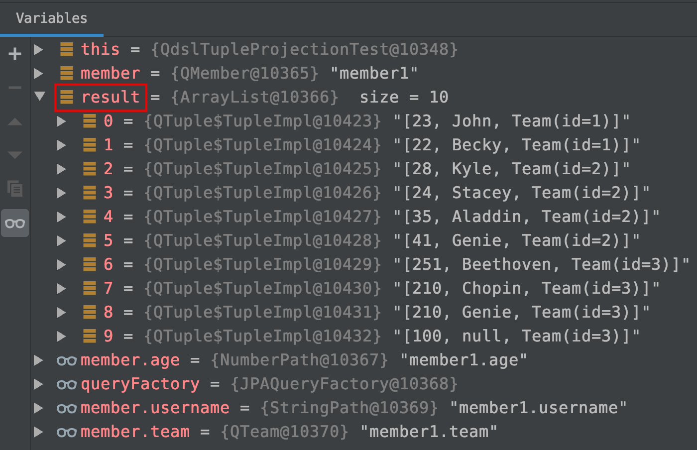
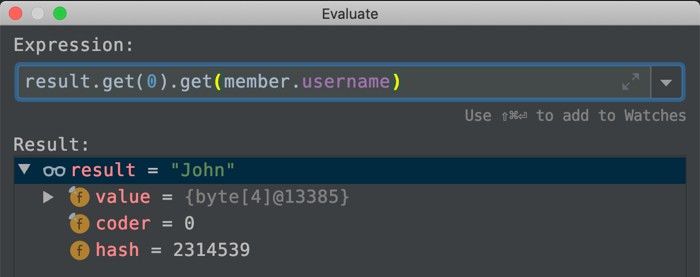
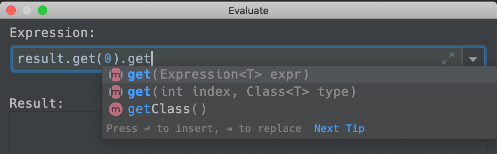

# 프로젝션 기본

프로젝션이라는 용어의 의미는 결과값을 어떻게 받을지를 의미한다. 예를 들어보자.

```java
QMember member = QMember.member;
List<String> result = queryFactory
      .select(member.username)
      .from(member)
      .fetch();
```

이 경우는 가져오는 필드가 username 하나이기 때문에 List\<String\>으로 지정해줬다.  

그런데, 결과값으로 두 개 이상의 컬럼을 받아야 한다. 이 경우는 어떻게 해야 할까? 우리는 흔히 Mybatis에서 Dto 또는 VO(Value Object)를 사용해서 결과값을 받았었다. 여기서도 이러한 방식이 적용되는데, 방법만 조금 다를 뿐이다.

  

# 프로젝션에서의 자료형

프로젝션을 할때 사용되는 자료형은 세 가지이다.

- String, Long, .... 등의 기본 래퍼(Wrapper) 클래스
- 튜플 
  - QueryDsl 의 특화 자료형이다. 
  - 마치 Map<String, Object> 와 유사한 형태를 띄는데, 그렇게 쓰임새가 많은 것은 아니다.
  - 튜플은 자주 쓰이지 않는다... 정말로 그렇다.
  - 리파지토리 계층에서 임시로 사용할 수 있더라도 컨트롤러, 서비스 계층에서 까지 Tuple을 사용하는 것은 좋은 설계가 아니다.
  - QueryDsl 특화 자료형을 컨트롤러, 서비스 계층에 의존적으로 사용하면 좋지 않기 때문.
- DTO
  - 데이터의 반환형을 직접 정의해 반환하는 방식이다.
  - 프리젠테이션 계층에 반환할 객체의 정의이다.
  - Entity와 같은 형태로 직접 반환하기 보다는 프리젠테이션에 맞추어 반환하는 편이다.


# 프로젝션 1) 기본 Wrapper 자료형 

username 하나만 인출해올 때이다. 필드가 하나일 때이다.

```java
QMember member = QMember.member;
List<String> result = queryFactory
      .select(member.username)
      .from(member)
      .fetch();
```


# 프로젝션 2) 튜플

튜플은 정말 왠만하면 쓰지 않는다. 하지만, 나중에 사용할 일이 있을 수도 있으니 여기서 정리하고 넘어가자~.

```java
import com.querydsl.core.Tuple;
// ...
// ...
QMember member = QMember.member;
List<Tuple> result = queryFactory
  		.select(member)
  		.from(member)
  		.fetch();
```


이렇게 가져온 튜플의 모양은 아래와 같다.




이렇게 생긴 데이터를 튜플이라고 하는데, 위의 그림에서 result라는 List\<Tuple\> 의 첫번째 요소의 "John"이라는 값을 가져와보자.



result.get(0)은 List\<Tuple\> 의 첫번째 요소이다. 즉, Tuple 타입의 객체이다. 이 Tuple에서 "John"이라는 값을 얻어내기 위해  

> result.get(0).get(member.username)

으로 데이터를 가져왔다. 즉 Tuple.get(member.username)으로 데이터를 가져왔다. Tuple.get(...) 내의 파라미터로 QType.멤버 이름 을 넘겨주어 값을 가져올 수 있다.  


Tuple.get(...) 내에 들어가는 파라미터가 궁금해진다면 아래의 캡쳐를 보자. 



Tuple.get(i).get(Expression\<T\> expr) 로 Tuple내의 데이터를 가져오고 있다. get 내부에는 Expression\<T\>이 들어간다는 것에 주의하자. 

## 참고) QType의 각 멤버 필드들은 정말 Expression\<T\> 인가??

- QMember.username은

  -  querydsl의 StringPath 클래스이며

- querydsl의 StringPath 클래스는

  - StringExpression을 확장(상속)한 클래스이다.

- 그리고 상속관계를 꼬리물기로 계속 따라가다 보면 ... 

  - StringPath -> ... -> SimpleExpression\<T\> -> DslExpression\<T\> -> Expression\<T\> 

    을 만나게 된다.

- QType 클래스의 다른 타입의 필드들도 비슷한 방식으로 Expression\<T\> 를 상속받은 클래스 타입이다.


# 프로젝션 3) DTO 프로젝션 (기본)

주의할 점은 DTO에 기본생성자를 선언해주어야 한다는 점이다. 이 점을 제외하면 다른 방식에 비해 간편하다.  

기본생성자를 직접 코드로 놓아도 되고, @NoArgsConstructor 와 같은 lombok 어노테이션을 명시하면 되니 그리 불편한 것만도 아니다.  (querydsl 입장에서는 메모리에 해당 DTO의 인스턴스를 만들어놓고 필드들을 주입해야 하는데 기본 생성자가 없으면 메모리 공간을 만들 수 없으므로 나는 에러라고 한다.)  

- 프로퍼티 접근

  - ex)

    - Projections.bean(MemberDto.class, member.username, member.age)

      을 select(...) 내에 명시해준다.

- 필드 직접 접근

  - ex)

    - Projections.fields(MemberDto.class, member.username, member.age)

      을 select(...) 내에 명시해준다.

- 생성자 사용

  - ex)

    - Projections.constructor(MemberDto.class, member.username, member.age)

      을 select(...) 내에 명시해준다.

    - 주의할 점은 DTO의 생성자에 명시된 인자의 타입과 일치해야 한다.

- as 를 지정할 수도 있다.


## 프로젝션 3-1, DTO) Projections.bean 

- **querydsl의 Projections.bean(...)을 사용하는 방식이다.**

- 자바 빈 규약 (Getter/Setter)를 활용한 방식이다.  
- 반드시 DTO내에 기본 생성자(또는 롬복의 @NoArgsConstructor) 가 선언되어 있어야 동작한다.

ex)

```java
	@Test
	public void dtoProjectionBySetter(){
		QMember member = QMember.member;

		List<MemberDto> dtoList = queryFactory
			.select(
				Projections.bean(
					MemberDto.class,
					member.username,
					member.age
				)
			)
			.from(member)
			.fetch();

		for(MemberDto d : dtoList){
			System.out.println("data :: " + d);
		}
	}
```


## 프로젝션 3-2, DTO) Projections.fields

- **querydsl의 Projections.fields(...) 메서드를 사용하는 방식이다.**
- DTO의 필드에 직접 접근하는 방식이다. 
- DTO 멤버 필드의 private 멤버필드도 리플렉션을 쓰면 가져올 수 있다.   
  즉, 내부적으로 리플렉션이 적용되어 있다.
- 반드시 DTO 클래스 내에 기본생성자(또는 @NoArgsConstructor)가 있어야 동작한다.

```java
	@Test
	public void dtoProjectionByField(){
		QMember member = QMember.member;

		List<MemberDto> dtoList = queryFactory
			.select(
				Projections.fields(
					MemberDto.class,
					member.username,
					member.age
				)
			)
			.from(member)
			.fetch();

		for(MemberDto d : dtoList){
			System.out.println("data :: " + d);
		}
	}
```


## 프로젝션 3-3, DTO) Projections.constructor

- **Projections.constructor(...) 메서드를 사용하는 방식이다.**
- 반드시 DTO클래스 내에 기본 생성자(또는 @NoArgsConstructor)가 있어야 동작한다.

```java
	@Test
	public void dtoProjectionByConstructor(){
		QMember member = QMember.member;

		List<MemberDto> dtoList = queryFactory
			.select(
				Projections.constructor(
					MemberDto.class,
					member.username,
					member.age
				)
			)
			.from(member)
			.fetch();

		for(MemberDto d : dtoList){
			System.out.println("data :: " + d);
		}
	}
```


## 프로젝션 3-4) 컬럼명에 AS를 주어야 하는 경우

- Dto 바인딩시 필드명을 다르게 해서 화면에 전달해주고 싶은 경우가 있다.
- 필드명이 다른 Dto로 쿼리 결과를 가져올 때 JPA에서 쿼리 내에 지정한 Dto 에 이름이 맞는 필드가 없을 경우  
  null 로 값을 주입하여 반환해준다.

MemberDto와 필드명이 다른 UserDto의 예를 들어보자.  

(UserDto는 username 필드 대신 name 필드가 있다.)

**예1) DTO 클래스 내에 이름이 같은 필드명이 없어서 null 값이 주입되는 예**

```java
	@Test
	public void dtoProjectionAliasBasic(){
		QMember member = QMember.member;

		List<UserDto> dtoList = queryFactory
			.select(
				Projections.fields(
					UserDto.class,
					member.username,
					member.age
				)
			)
			.from(member)
			.fetch();

		/** 결과를 확인해보면 에러는 나지 않는데, name 필드에 null 값이 들어간다. */
		System.out.println("===== Non Alias Result =====");
		for(UserDto d : dtoList){
			System.out.println("data :: " + d);
		}
  }
```

  

**예2) DTO 클래스 내에 이름이 같은 필드명이 없는 경우 As를 주어 프로젝션 하는 예**

```java
	@Test
	public void dtoProjectionAliasBasic(){
		QMember member = QMember.member;

    /** ex) member.username.as("name") */
		List<UserDto> aliasResult = queryFactory.select(
			Projections.fields(
				UserDto.class,
				member.username.as("name"),		// ExpressionUtils.as(member.username, "as") 와 같은 표현이다.
				member.age
			)
		).from(member).fetch();

		/** 결과를 확인해보면 제대로 값이 들어와 있다.. */
		System.out.println("===== Alias Result =====");
		for(UserDto d : dtoList){
			System.out.println("data :: " + d);
		}
  }
```

  

- Member 클래스의 username 필드의 값들이 UserDto 클래스의 "name" 필드로 매핑되도록 alias를 주었다.


# 참고) JPQL에서의 DTO 프로젝션

패키지의 전체 경로를 명시하여 new 생성자() 로 지정한다. 


# 프로젝션 4) 서브쿼리 프로젝션

서브쿼리 사용시 

> ExpressionUtils.as( JPAExpressions.select(...).from(...), "별칭" ) 

을 사용한다.

```java
	@Test
	public void dtoProjectionAliasSubquery(){
		QMember member = QMember.member;
		QMember subMember = new QMember("subMember");

		List<UserDto> aliasResult = queryFactory.select(
			Projections.fields(
				UserDto.class,
				member.username.as("name"),

				ExpressionUtils.as(
					JPAExpressions.select(
						subMember.age.max()
					)
					.from(subMember),
					"age"
				)
			)
		).from(member).fetch();

		System.out.println("===== Alias Result =====");
		for(UserDto d : aliasResult){
			System.out.println("data :: " + d);
		}
	}
```

  

서브쿼리를 사용하기 위해서는 별도의 QType 인스턴스를 하나 더 생성해야 한다. 

```java
QMember subMember = new QMember("subMember");
// ...
// ...
queryFactory.select(
  Projections.fields(
    UserDto.class, member.username.as("name"),
    ExpressionUtils.as(		// 이 안에서 subQuery용 QType 인스턴스를 사용
    		JPAExpressions
      					.select( subMember.age.max() )
    						.from( subMember ),
    		"age"
  	)
  )
).from(member).fetch();
```


원리적으로 이해해보면... 이미 쿼리를 돌리고 있는 QType 인스턴스 A가 있는데 A 안에서 또 쿼리 수행을 할 수는 없으므로 별도로 결과를 뽑아올 수 있는 QType 인스턴스 B를 새로 생성해 표현식으로 넘겨주는 방식이다.   

