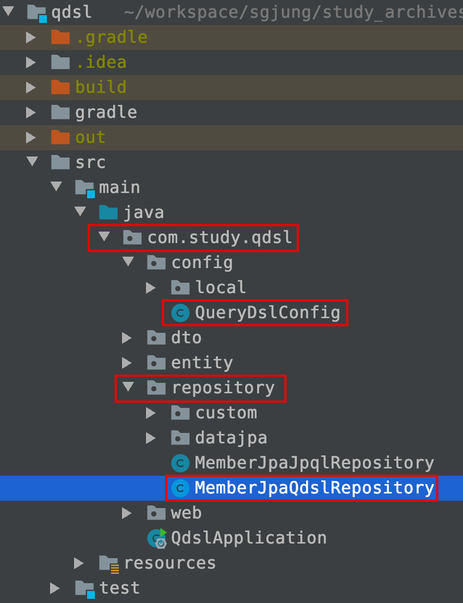

# 단순 JPA With QueryDsl

많은 사람들이 jpa를 떠올릴 때 보통 Spring Data JPA를 떠올리고, 단순히 JPA써봤어?라고 물어볼때 이 질문에는 Spring Data JPA 를 써봤냐는 의미가 내포되어있다. 아쉽게도 여기서는 일단 Spring Data JPA가 아닌 단순 JPA를 활용하여 QueryDsl의 활용을 정리한다. ch06에서 본격적으로 Spring Data JPA와 연동을 한다. 단순 JPA도 써보면 재밌다~.    

여기서는 본격적으로 src/test 밑에서 샘플 쿼리를 날려보는 것 말고 src/main에 직접 Repository를 생성하여 멤버 조회 코드들을 만들어본다~...


# 들어가기전에...

- 의존성 주입
  - 최근 의존성 주입시 보통 @Autowired, @Inject 대신 생성자를 통한 주입을 권장하고 있다. 자세한 내용은 추후 정리할 예정이지만 일단 아래의 자료 참고
  - [스프링에서 의존성 주입하는 여러가지 방법들]([https://github.com/soongujung/study_archives/blob/master/java/spring/DI/Spring%EC%97%90%EC%84%9C_%EC%9D%98%EC%A1%B4%EC%84%B1%EC%A3%BC%EC%9E%85%EC%9D%84_%ED%95%98%EB%8A%94_%EB%8B%A4%EC%96%91%ED%95%9C%20%EB%B0%A9%EB%B2%95.md](https://github.com/soongujung/study_archives/blob/master/java/spring/DI/Spring에서_의존성주입을_하는_다양한 방법.md))


# Repository 생성

/src/main/java 디렉터리 아래에 있는 스프링 부트 프로젝트 생성시 입력한 기본으로 사용할 패키지 내에 repository 라는 이름의 패키지를 생성하자. 그리고 그 밑에 XXXXRepository.java 파일을 생성하자. 

**프로젝트 구조**



  

**예) MemberJpaQdslRepository.java**

```java
@Repository
public class MemberJpaQdslRepository{
  // ...
}
```


이제 EntityManager와 JPAQueryFactory의 의존성 주입 or 인스턴스 생성 코드를 살펴보자.


# 의존성 주입

Repository 코딩시 

- EntityManager
- JPAQueryFactory

를 의존성 주입해야 한다.  

의존성 주입을 하는 여러가지 방법이 있는데 여기서는 2가지를 정리한다. 한가지 방식은 테스트 코드 작성시 조금 불편하고, 다른 한가지 방식은 JPAQueryFactory 객체가 여기저기 생성된다는 단점이 있다. 둘중 한가지를 적절히 선택해 사용하자.    

1. **생성자 주입 (EntityManager, JPAQueryFactory)**
   - JPAQueryFactory를 Bean으로 등록 후
   - 생성자 주입을 한다.
   - 생성자 주입을 하면 코드가 굉장히 간단해진다. 코딩이 편리해지기도 한다. 롬복의 @RequiredArgsConstructor를 이용하면 코드가 굉장히 깔끔해지기도 한다.
   - 하지만, 만들기 편리한건 응용시 조금 불편하다. 이게 진리인 듯 하다. 테스트 코드 작성시 조금 불편해진다.
   - JPAQueryFactory를 Bean으로 등록하여 애플리케이션 전역에 하나뿐인 객체를 만들어 주입받는데, 하나뿐인 객체로 산발적인 리퀘스트를 처리할때 동시성 문제는 없나요? 하는 질문이 많다고 한다.
     - 이 경우 JPAQueryFactory 객체는 전역적으로 하나이지만, JPAQueryFactory 내부에서 쿼리를 수행하는 프록시 인스턴스는 여러개라고 한다. 
     - 쉽게 이야기하면 JPAQueryFactory에서 처리하는 것이 아니라 JPAQueryFactory 내부에 트랜잭션 풀로 만들어놓은 숨겨진 인스턴스 들로 트랜잭션을 수행한다는 의미.  
2. **생성자 주입(EntityManager) + 동적생성(JPAQueryFactory)**
   - EnitityManager는 생성자로 의존성을 주입받는다.
   - JPAQueryFactory는 생성자 내에서 동적 생성하면서 EntityManager 객체를 바인딩해준다.

## 1) 생성자 주입 (EntityManager, JPAQueryFactory)

src/main/java 디렉터리 내의 com.study.qdsl 패키지 내에 config 패키지를 생성하고, 설정 코드를 등록한다. 여기서 설정 코드 자바 클래스 파일의 이름은 QueryDslConfig.java라는 이름으로 했다.

### JPAQueryFactory 빈 등록

빈으로 등록한다는 것은 스프링 컨테이너 안에 JPAQueryFactory 타입의 인스턴스는 오직 하나라는 이야기이다. 위에서 이야기했듯이 JPAQueryFactory 객체가 직접 트랜잭션을 수행하는 것이 아니라, 내부에 프록시 객체가 트랜잭션 풀을 관리하면서 트랜잭션을 수행한다.  

이렇게 전역으로 등록하는 것 말고 필요한 곳마다 객체를 생성하면 더 효율적인지는 나도 잘 모른다(작은 풀들이 여러개 있는게 오버헤드가 더 적지 않을까?하는 일말의 추측때문에...). 일단은 이게(통으로 하나 생성하는 방식이) 제일 깔끔한 방법이라는 생각이 든다.  

**예) QueryDslConfig.java**

```java
package com.study.qdsl.config;

import com.querydsl.jpa.impl.JPAQueryFactory;
import javax.persistence.EntityManager;
import org.springframework.context.annotation.Bean;
import org.springframework.context.annotation.Configuration;

@Configuration
public class QueryDslConfig {

	@Bean
	public JPAQueryFactory jpaQueryFactory(EntityManager em){
		return new JPAQueryFactory(em);
	}
}
```


### 의존성 주입 (생성자 이용한 의존성 주입)

생성자에 파라미터가 많아진다면 생성자를 지우고 @RequiredArgsConstructor를 클래스 위에 선언하자. 아래 코드에 주석으로 표시해놓았다.  

다시 한번 언급하지만, 생성자를 통한 의존성 주입시 

- 의존성을 주입할 타입들을 final 멤버필드로 선언해주고 
- 생성자를 만들고
- 생성자 내에 해당 타입들을 매개변수로 나열해야 한다.

위 두 가지가 귀찮으면

- 의존성을 주입할 타입들을 final 멤버필드로 선언해주고
- @RequiredArgsConstructor를 클래스 헤더에 추가해준다.

롬복 의존성이 지나치게 의존적인 것을 좋아하지 않는 사람들도 있기 때문에 나의 경우는 첫 번째 방식을 선호.... 한다.  

```java
package com.study.qdsl.repository;

// ...

import com.querydsl.core.BooleanBuilder;
import com.querydsl.core.types.Predicate;
import com.querydsl.core.types.dsl.BooleanExpression;
import com.querydsl.jpa.impl.JPAQueryFactory;
import com.study.qdsl.dto.MemberTeamDto;
import com.study.qdsl.dto.QMemberTeamDto;
import com.study.qdsl.dto.condition.MemberSearchCondition;
import com.study.qdsl.entity.Member;
import com.study.qdsl.entity.QMember;
import com.study.qdsl.entity.QTeam;
import java.util.List;
import java.util.Optional;
import javax.persistence.EntityManager;
import lombok.RequiredArgsConstructor;
import org.springframework.stereotype.Repository;
import org.springframework.util.StringUtils;

@Repository
//@RequiredArgsConstructor
public class MemberJpaQdslRepository {

	private final EntityManager em;
	private final JPAQueryFactory queryFactory;

	public MemberJpaQdslRepository(EntityManager em, JPAQueryFactory queryFactory) {
		this.em = em;
		this.queryFactory = queryFactory;
	}
// ...
}

```

  

## 2) 생성자 주입 + 동적생성

내일 정리... ㄷㄷㄷ


# Repository 코드작성

코드~


