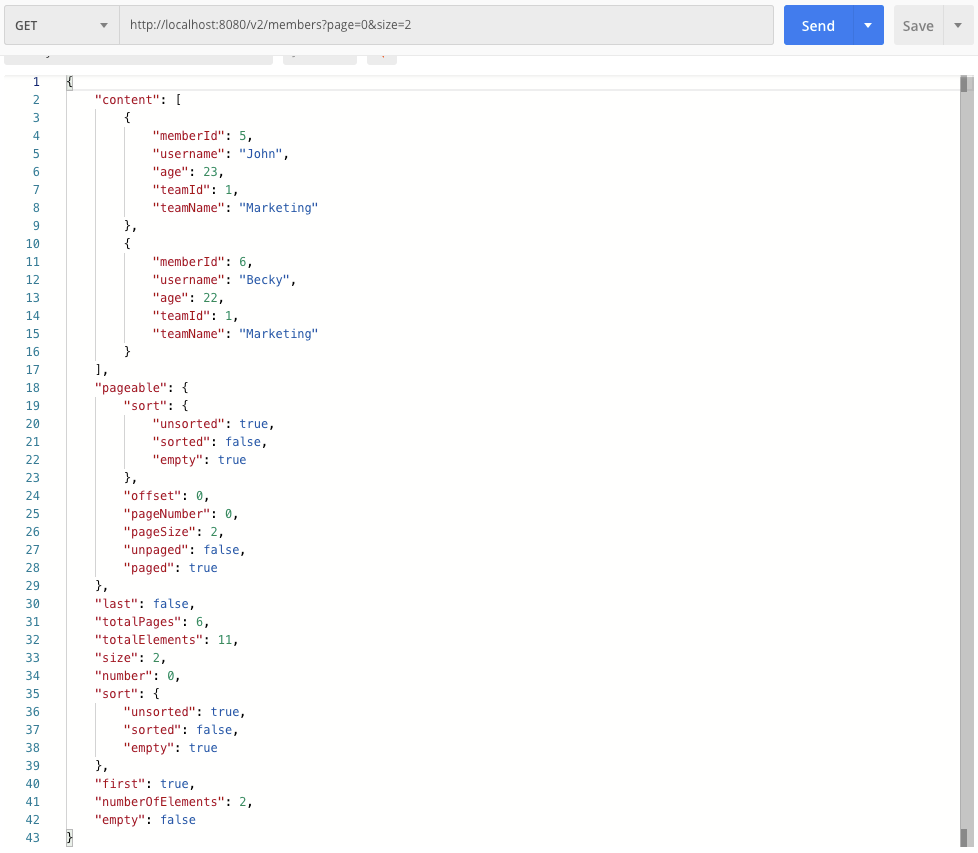
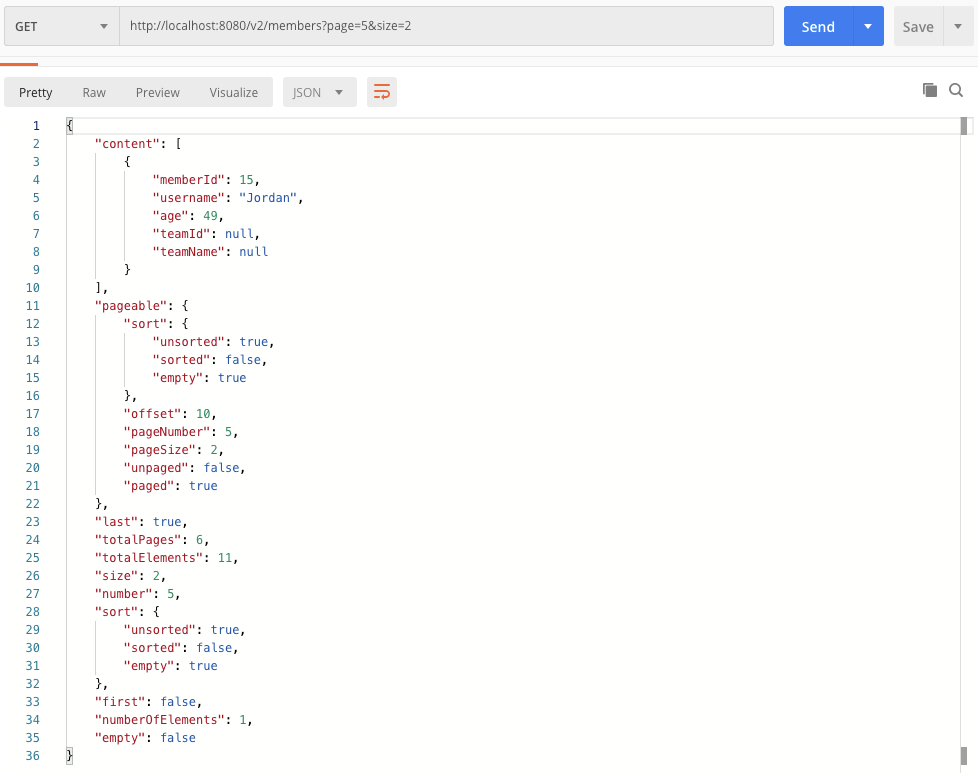

# Pageable 을 활용해 조회 컨트롤러 구현하기

컨트롤러에서 웹 요청에서 페이징 관련 파라미터를 스프링 데이터의 Pageable로 받는 예제를 살펴보자.  
예제 용도로 INSERT 하는 데이터는 이 문서의 하단부에 명시해두었다.  


# 참고자료

- [인프런 - 실전! Querydsl](https://www.inflearn.com/course/Querydsl-%EC%8B%A4%EC%A0%84/dashboard)


# 예제 github Repository

- [github.com/soongujung/study_archives/java/queryDsl/example/qdsl](https://github.com/soongujung/study_archives/tree/master/java/queryDsl/example/qdsl)


# GET 요청 URL

예제로 사용할  GET 요청 URL의 형식은 아래와 같다.

> http://localhost:8080/v2/members?page=0&size=2  

  

# Controller

> 자세한 소스는 [github.com/soongujung/study_archives/java/queryDsl/example](https://github.com/soongujung/study_archives/blob/master/java/queryDsl/example/qdsl/src/main/java/com/study/qdsl/web/member/MemberController.java) 를 참고

  

**MemberController.java**

```java
package com.study.qdsl.web.member;

// ...
@RestController
@RequiredArgsConstructor
public class MemberController {
	private final MemberJpaQdslRepository repository;
	private final MemberDataJpaRepository dataRepository;
  
	// ...
	
  @GetMapping("/v2/members")
	public Page<MemberTeamDto> getAllMember2(MemberSearchCondition condition, Pageable pageable){
		return dataRepository.searchPageSimple(condition, pageable);
	}
  
	// ...
  
}

```


- http://localhost:8080/v2/members?page=0&size=2 URL로 GET요청을 보내면, 
- 컨트롤러 내의 리퀘스트 처리 메서드("/v2/members" URL 처리 메서드)내에 Pageable 타입의 파라미터를 선언했을 경우 HTTP요청에서 page, size를 분류해 Pageable 객체에 page, size 값이 바인딩된다.    


직접 http://localhost:8080/v2/members?page=0&size=2 을 포스트맨으로 요청으로 보내보고, 디버깅한 내용을 직접 스크린샷으로 확인해보면 아래와 같이, get 요청으로 전달한 `page` , `size` 파라미터를 Pageable 에 바인딩 하고 있다.  


  

## JSON 응답결과 (1)

리턴 결과를 확인해보자 (포스트맨 캡처화면이다.)  

요청 URL : http://localhost:8080/v2/members?page=0&size=2  

page 가 0이라는 것은 가장 첫번째 페이지를 가져온다는 의미이고,  

size 가 2라는 것은 2개씩의 묶음단위로 페이지 번호를 구분하겠다는 의미이다. 




## JSON 응답결과 (2)

요청 URL : http://localhost:8080/v2/members?page=1&size=2  

page가 1이라는 것은 첫 번째 페이지를 가져온다는 것이고

size 가 2라는 것은 2개씩의 묶음단위로 페이지 번호를 구분하겠다는 의미이다. 


  

## JSON 응답결과 (3)

요청 URL : http://localhost:8080/v2/members?page=5&size=2  

page가 5이라는 것은 여섯 번째 페이지를 가져온다는 것이고

size 가 2라는 것은 2개씩의 묶음단위로 페이지 번호를 구분하겠다는 의미이다. 




# SQL

## JSON 응답결과 (1) 에 대한 SQL 호출

```sql

```


## JSON 응답결과 (2) 에 대한 SQL 호출

SQL1)  count를 먼저 수행하게 된다.

```sql
select 
	count(member0_.member_id) as col_0_0_ 
from member member0_ 
left outer join team team1_ 
	on member0_.team_id=team1_.id;
```

  

SQL2) Select 쿼리

```sql
select
	member0_.member_id as col_0_0_,
	member0_.username as col_1_0_,
	member0_.age as col_2_0_,
	member0_.team_id as col_3_0_,
	team1_.name as col_4_0_ 
from	member member0_ 
left outer join team team1_ 
	on member0_.team_id=team1_.id limit 2 offset 1
```


## JSON 응답결과 (3) 에 대한 SQL 호출

실제로 SQL이 SELECT SQL 한번만 호출되었다.

```sql
select
		member0_.member_id as col_0_0_,
    member0_.username as col_1_0_,
    member0_.age as col_2_0_,
    member0_.team_id as col_3_0_,
    team1_.name as col_4_0_ 
from member member0_ 
left outer join team team1_ 
	on member0_.team_id=team1_.id limit 2 offset 5
```

카운트 SQL을 수행하는 대신, 구해온 데이터의 List\<Member\> 의 List.size() + 2*5 와 같은 방식으로 카운트를 구하고 있다.


# 참고) 예제 데이터

예제 데이터는 아래와 같다. 총 11개의 로우를 insert하고 있다.

```java
		@Transactional
		public void init(){
			Team marketingTeam = new Team("Marketing");
			Team analysisTeam = new Team("Analysis");
			Team musicianTeam = new Team("Musician");
			Team nullTeam = new Team("NullTeam");

			entityManager.persist(marketingTeam);
			entityManager.persist(analysisTeam);
			entityManager.persist(musicianTeam);
			entityManager.persist(nullTeam);

			Member john = new Member("John", 23, marketingTeam);
			Member susan = new Member("Becky", 22, marketingTeam);

			Member kyle = new Member("Kyle", 28, analysisTeam);
			Member stacey = new Member("Stacey", 24, analysisTeam);

			Member aladin = new Member("Aladdin", 35, analysisTeam);
			Member genie = new Member("Genie", 41, analysisTeam);

			Member beethoven = new Member("Beethoven", 251, musicianTeam);
			Member chopin = new Member("Chopin", 210, musicianTeam);
			Member genie2 = new Member("Genie", 210, musicianTeam);
			Member nullName = new Member(null, 100, musicianTeam);

			Member ceo = new Member("Jordan", 49, null);

			entityManager.persist(john);
			entityManager.persist(susan);
			entityManager.persist(kyle);
			entityManager.persist(stacey);
			entityManager.persist(aladin);
			entityManager.persist(genie);

			entityManager.persist(beethoven);
			entityManager.persist(chopin);
			entityManager.persist(genie2);
			entityManager.persist(nullName);
			entityManager.persist(ceo);
		}
```

