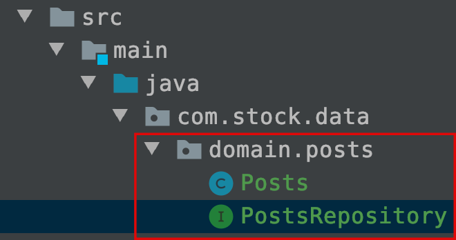

# spring data jpa - 설정, 간단 예제


- build.gradle
- domain 구현
  - domain 패키지 생성
  - posts 패키지 생성
  - Posts 클래스 생성


## build.gradle

```groovy
dependencies {
    compile('org.springframework.boot:spring-boot-starter-web')
    compile('org.projectlombok:lombok')
    compile('org.springframework.boot:spring-boot-starter-data-jpa')
    compile('com.h2database:h2')
    testCompile('org.springframework.boot:spring-boot-starter-test')
}
```

  

- spring-boot-starter-data-jpa

  - 스프링 부트에서 제공하는 Spring Data JPA 추상화 라이브러리  
  - 스프링 부트 버전에 맞춰 자동으로 JPA 관련 라이브러리들의 버전을 관리해준다  

- h2

  - 인메모리 관계형 데이터베이스
  - 별도의 설치없이 의존성만으로 관리 가능하다.
  - 인메모리 환경이므로 애플리케이션을 재시작할 때마다 초기화 된다는 점을 이용해 테스트 용도로 많이 사용된다.
  - JPA 테스트, 로컬환경에서의 구동에 사용할 예정


## application.properties


```properties
spring.jpa.show_sql=true
spring.jpa.properties.hibernate.dialect=org.hibernate.dialect.MySQL5InnoDBDialect
```


## DataSource 설정

별다른 설정 없이 @SpringBootTest를 사용할 경우 H2 데이터베이스를 자동으로 실행해준다.


## Mybatis 등의 레거시와 JPA 비교

domain 패키지는 도메인을 담는 패키지이다. 기존의 MyBatis 등의 쿼리 매퍼를 사용했다면 dao 패키지를 떠올릴 수 있지만 dao패키지와는 조금 결이 다르다고 생각하면 된다. xml에 쿼리를 담고 클래스는 오로지 쿼리의 결과만을 담던일들이 **이제는 모두 도메인 클래스라고 불리는 곳에서 해결된다.**  

프로젝트 구조도 기존의 구조와는 조금 다르게 단순하게 변하여 파악하기 편해진다.  




## domain Entity, Repository 생성 절차

### domain 패키지 생성

com.stock.data 패키지 아래에 domain 패키지를 생성한다.  

### posts 패키지

com.stock.data.domain 패키지에 posts 패키지를 생성.  

### Posts 클래스 생성

com.stock.data.domain.posts 패키지에 Posts 클래스를 생성  

### PostsRepository interface 생성

com.stock.data.domain.posts 패키지 내에 PostsRepository 인터페이스를 생성한다.

PostsRepository는 JpaRepository\<Posts, Long\> 인터페이스를 상속한다. 

Long의 의미는 뒤에서 정리한다.  


## domain Entity 구현

Posts 클래스는 실제 DB의 테이블과 매칭될 클래스이다. 보통 Entity 클래스라고 부르기도 한다. JPA를 사용하면 DB 데이터에 작업할 경우 실제 쿼리를 날리기보다는 이 Entity 클래스의 수정을 통해 작업을 하게 된다.  

**ex) Posts.java** 

```java
package com.stock.data.domain.posts;

import javax.persistence.Column;
import javax.persistence.Entity;
import javax.persistence.GeneratedValue;
import javax.persistence.GenerationType;
import javax.persistence.Id;
import lombok.Builder;
import lombok.Getter;
import lombok.NoArgsConstructor;

@Getter
@NoArgsConstructor
@Entity
public class Posts {

	@Id
	@GeneratedValue(strategy = GenerationType.IDENTITY)
	private Long id;

	@Column(length = 500, nullable = false)
	private String title;

	@Column(columnDefinition = "TEXT", nullable = false)
	private String content;

	private String author;

	@Builder
	public Posts(String title, String content, String author){
		this.title = title;
		this.content = content;
		this.author = author;
	}
}
```


@Entity는 JPA의 어노테이션이고, @Getter, @NoArgsConstructor는 롬복의 어노테이션이다. 롬복의 경우 코틀린을 사용하게 되는등 새로운 언어로의 전환을 하게 될 경우 롬복은 필요가 없게된다. 이런 이유로 

- @Entity를 클래스 가까이에 두고
- 롬복 어노테이션을 그 위에 두었다.

이렇게 하면 추후 코틀린 등을 사용하게 되어 롬복이 필요 없게 되거나, 롬복을 더이상 사용하지 않는 다른 상황이 생겼을때 쉽게 삭제할 수 있다.  


- @Entity
  - JPA에서 제공하는 어노테이션
  - 테이블과 링크되는 클래스임을 나타냄
  - 클래스의 카멜케이스 : 테이블의 언더스코어 규칙 으로 매핑한다.  
    ex) SalesManager.java -> sales_manager_table  
- @Id
  
  - 해당 테이블의 PK 필드를 나타낸다.
- @GeneratedValue
  - PK의 생성 규칙을 나타낸다.
  - GenerationType.IDENTITY 옵션을 추가해야 auto_increment 속성이 주어진다.  
    (스프링 2.0 버전 기준이다. 2.0 과 1.5버전의 차이는 [기억보다는 기록을](https://jojoldu.tistory.com/295)  에 정리되어 있다.)
- @Column
  - 테이블의 컬럼을 나타냄
  - @Entity 내에서는 굳이 @Column을 선언하지 않더라도 해당 클래스의 필드들은 모두 컬럼이 된다.
  - @Column 애노테이션을 명시적으로 사용하는 경우는  
    기본값 외에 추가로 변경이 필요한 옵션이 있을 때에 사용한다.  
  - 예를 들면,
    - 문자열의 경우 VARCHAR(255)가 기본값이다. 이 사이즈를 500으로 늘리고 싶을 경우(ex. title), 타입을 TEXT로 변경하고 싶을 경우 (ex. content) 등의 경우에 사용된다.

  

Posts 클래스에는 한가지 특이한 점이 있다. Setter 메소드가 없다.  

자바 빈 규약의 경우 getter/setter를 무작정 생성해 로직을 구현하는 경우가 많았다. 이렇게 되면 해당 클래스의 인스턴스 값들이 언제 어디서 변해야 하는지 코드를 봤을때 의미상으로 파악하기 모호해지게 된다. 물리적인의미 외에 논리적인 의미를 부여한다면 더 편리하고 명확해질 것이다.  

  

이런 이유로 Entity 클래스에서는 절대 Setter 메서드를 만들지 않는다. 대신 해당 필드의 값 변경이 필요할 경우 명확히 그 목적과 의도를 나타내는 메서드를 추가해주는 편이다. 예를 들면 아래의 예와 같다.  

**잘못된 사용 예)**

```java
// Order.java
public class Order{
  public void setStatus(boolean status){
    this.status = status;
  }
}

// in the Some other class...
public void 주문서비스의_취소이벤트(){
  order.setStatus(false);
}
```


올바른 사용 예)
```java
public class Order{
  public void cancelOrder(){
    this.status = false;
  }
}

public void 주문서비스의_취소이벤트(){
  order.cancelOrder();
}
```

  

Setter가 없는 상황인데, 어떻게 값을 채워 DB에 insert할까?  

- 기본적인 구조  
  생성자를 통해 최종 값을 채운 후 DB에 insert 하는 것이다.  
- 값 변경이 필요할 경우  
  해당 이벤트에 맞는 public 메서드를 호출해 변경하는 것을 전제로 한다.  
- 이 책에서는...  
  생성자 대신 @Builder를 통해 제공되는 빌더 클래스를 사용한다. 생성자, 빌더 모두 인스턴스 생성시 생성 시점에 값을 채워주는 역할은 같다. 하지만 생성자의 경우 채워야 하는 필드가 무엇인지 의미를 명확히 전달하지 못한다.  


빌더를 사용하는 경우와 생성자를 사용하는 경우의 예를 들어보자.  

생성자를 사용하는 경우  

```java
public Example(String a, String b){
  this.a = a;
  this.b = b;
}
```

  

빌더를 사용하는 경우  

```java
Example.builder()
  .a(a)
  .b(b)
  .build();
```


앞으로의 모든 예제는 모두 이렇게 빌더 패턴을 적극적으로 사용한다 :)  


> 참고)  
>
> Entity의 PK는 Long 타입의 auto_increment를 권장하고 있다.(Mysql 기준으로 이렇게 할 경우 bigint 타입이 된다).  
>
> - 유니크 키(ex: 주민등록 번호)
> - 복합키(여러키 조합)
>
> 를 PK로 잡을 경우 난감한 상황이 종종 발생한다.  
>
> 1. FK를 맺을 때 다른 테이블에서 복합키 전부를 갖고 있거나, 중간 테이블을 하나 더 둬야 하는 상황이 발생한다.  
> 2. 인덱스에 좋은 영향을 끼치지 못한다.  
> 3. 유니크한 조건이 변경될 경우 PK전체를 수정해야 하는 일이 발생한다.  
>
> 주민등록번호, 복합키 등은 유니크키로 별도 추가하는 것을 권장하고 있다.


## domain Repository 구현

보통 ibatis, Mybatis 등에서 DAO 라고 불리는 DB Layer 를 사용한다.  

JPA에서는 Repository라고 부른다. Repository는 보통 인터페이스로 생성한다.

- 인터페이스를 생성한다.
- 이 인터페이스를 JpaRepository\<Entity 클래스명, PK의 타입\> 을 extends 한다.

이렇게 하고 나면 기본적인 CRUD 메서드가 자동으로 생성된다.

- @Repository 애노테이션을 추가할 필요는 없다.  
  (Entity 클래스와 기본 Entity Repository는 함께 위치해야 한다)
- Entity와 Entity Repository는 밀접한 관계를 가지고 있으며 Entity 클래스는 기본 Repository 없이는 제대로 역할을 하지 못한다.
- 프로젝트의 규모가 커질때 도메인 별로 프로젝트를 분리해야 하는 경우가 생기는데  
  이때 Entity 클래스와 기본 Repository는 함께 움직여야 하므로 도메인 패키지에서 함께 관리한다.


```java
package com.stock.data.domain.posts;

import org.springframework.data.jpa.repository.JpaRepository;

public interface PostsRepository extends JpaRepository<Posts, Long> {
}
```


## 테스트 코드 작성


test 디렉터리내에 domain.posts 디렉터리를 생성한다.

```java
package com.stock.data.domain.posts;

import static org.assertj.core.api.Assertions.assertThat;

import java.util.List;
import org.junit.After;
import org.junit.Test;
import org.junit.runner.RunWith;
import org.springframework.beans.factory.annotation.Autowired;
import org.springframework.boot.test.context.SpringBootTest;
import org.springframework.test.context.junit4.SpringRunner;

@RunWith(SpringRunner.class)
@SpringBootTest
public class PostsRepositoryTest {

	@Autowired
	PostsRepository postsRepository;

	@After
	public void cleanup(){
		postsRepository.deleteAll();
	}

	@Test
	public void 게시글_저장후_불러오기(){
		String title = "테스트 제목 1";
		String content = "테스트 본문";
		String author = "helloSydney@gmail.com";

		// 롬복이 작동할 때는 아래 코드로...
//		postsRepository.save(
//			Posts.builder()
//				.content(content)
//				.title(title)
//				.author(author)
//				.build()
//		);

		// 롬복이 IDE에서 정상동작하지 않는다면...
		postsRepository.save(
			new Posts(title, content, author)
		);

		List<Posts> postsList = postsRepository.findAll();

		Posts posts = postsList.get(0);
//		assertThat(posts.getTitle()).isEqualTo(title);
//		assertThat(posts.getContent()).isEqualTo(content);
	}
}

```


# JPA 설정 분리하기


com.stock.data.config 패키지에 

- datasource 패키지 생성
- datasource 패키지 아래에 jpa 패키지 생성
- datasource.jpa 패키지 아래에
  JpaConfig.java 생성

  

**JpaConfig.java**

```java
package com.stock.data.config.datasource.jpa;

import org.springframework.context.annotation.Configuration;
import org.springframework.data.jpa.repository.config.EnableJpaAuditing;

@Configuration
@EnableJpaAuditing
public class JpaConfig {
}
```


