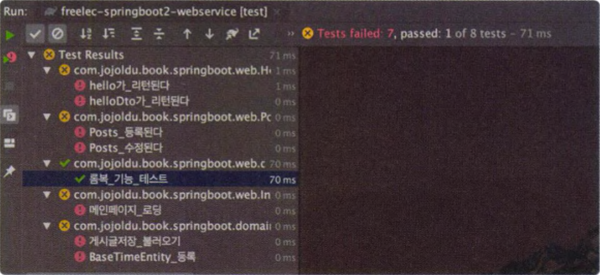

# OAuth+시큐리티 테스트 코드 적용하기

별다른 설정 없이 OAuth, 시큐리티 코드를 테스트 하려 하면 기존 테스트에서 문제가 된다. 

- 즉, 시큐리티 + OAuth를 테스트 코드에서 테스트하려면 별도의 설정이 필요하다.




OAuth, 시큐리티 적용 전에느 바로 API를 호출할 수 있었다. 그 이유는

- 모든 URI, 요청이 허용되어 있었기 때문이다.

- 시큐리티 코드에서는 인증된 사용자만 API를 호출할 수 있었기 때문이다.


기존의 API 테스트 코드들이 모두 인증에 대한 권한을 받지 못하므로 테스트 코드마다 인증한 사용자가 호출한 것처럼 작동하도록 수정해야 한다.  

문제의 원인은 아래의 3가지 요인 때문이다.

> 1. CustomOAuth2UserService 를 못찾는다.
> 2. 302 Status Code (@SpringBootTest)
> 3. @WebMvcTest에서 CustomOAuth2UserService를 못찾는 문제.
> 4. Jpa설정을 따로 분리하지 않았을 경우 - 분리해줘야 한다.


이 문제들에 대한 각각의 해결책 들을 요약해보면,

1. CustomOAuth2UserService 를 못찾는다.

   - 결론) 
   
     - src/test/resources/application.properties를 만들고, src/test/resources/application.properties에 test용 설정(client-secret등)을 추가해주어야 한다.
   
     - 되도록이면 가짜값을 만들자  
   
       (git 호스팅 서비스에 secret 키 노출 등의 문제)
   
   - 원인) 
   
     - CustomOAuth2UserService를 생성하는 시점에 application.propertis 내부에 소셜로그인 관련 설정 값들이 없기 때문이다.
     - 즉, test 스코프 내에서 application-oauth.properties를 불러오지 못하기 때문
   
2. 302 Status Code (리다이렉션 응답) : @SpringBootTest
	
	 - 결론)  
	
	   임의로 인증된 사용자를 추가해 API만 테스트해볼 수 있게 한다.  (@SpringBootTest를 선언한 곳에서 MockMvc (ex. @WithMockUser)를 사용)
	
	   -  spring-security-test 를 build.gradle에 추가  
	      (스프링 시큐리티에서 공식적으로 방법을 지원하는 방법)
	   -  인증이 필요한 클래스, 메서드에서 MockMvc 인스턴스를 생성하고
	      @WithMockUser 를 통해 가짜 유저를 만들어낸다.
	
	 - 원인) 
	
	   -  인증되지 않은 사용자의 요청은 이동(redirect)시키기 때문
	
3. @WebMvcTest에서 CustomOAuth2UserService를 못찾는다.
   
   - 결론)
   
     -  스캔 대상에서 SecurityConfig를 제거한다.  
        - SecurityConfig 클래스를 스캔하지 못하도록 한다.
     -  혹시, Jpa 설정을 분리하지 않았다면, @EnableJpaAuditing 설정 클래스를 따로 만든다.  
        - 메인 클래스에 @EnableJpaAuditing이 있다면 분리한다.  
   - 원인)
     - 테스트 스코프(src/test)에서 @WebMvcTest를 읽을때
       - @Repository, @Service, @Component 를 스캔할 수 없다.
     - 스캔 하는 요소들은 아래와 같다.
       - WebSecurityConfigurerAdapter, WebMvcConfigurer, @ControllerAdvice, @Controller
   
4. Jpa설정을 따로 분리하지 않았을 경우 

    - 분리해줘야 한다.
      - @EnableJpaAuditing은 @WebMvcTest에서 인식하지 못한다.


# 1. CustomOAuth2UserService를 못 찾는 문제

- 결론) 
  - src/test/resources 아래에 application.properties를 만들고, oauth test용 설정(client-secret 등)을 추가해주어야 한다.
  - 되도록이면 가짜 설정값을 사용하자.  
    (git 호스팅 서비스에 secret 키 노출 등의 문제)
- 원인) CustomOAuth2UserService를 생성하는 시점에 application.properties 내부에 소셜로그인 관련 설정값들이 없기 때문이다.


## application.properties의 적용범위

src/main 와 src/test 각각 서로 다른 분리된 독자적인 환경을 가진다.

- src/main
- src/test

다만, application.properties가 테스트 시에도 적용(src/test)되는 이유는 src/test에 application.properties 가 없으면 src/main 에서 사용하고 있는 main의 설정을 그대로 가져오기 때문이다. 

- 즉, 디폴트로 가져올 수 있는 설정은 application.properties 라는 이야기  
  (아쉽게도, application-xxx.properties 는 test 스코프에서 가져올 수 없다.)


# 2. 302 Status Code - @SpringBootTest

-  결론)  
   임의로 인증된 사용자를 추가해 API만 테스트해볼 수 있게 한다.  (@SpringBootTest를 선언한 곳에서 MockMvc (ex. @WithMockUser)를 사용)
   -  spring-security-test 를 build.gradle에 추가  
      (스프링 시큐리티에서 공식적으로 방법을 지원하는 방법)
   -  인증이 필요한 클래스, 메서드에서 MockMvc 인스턴스를 생성하고
      @WithMockUser 를 통해 가짜 유저를 만들어낸다.
-  원인)  
   인증되지 않은 사용자의 요청은 이동(redirect)시키기 때문


## spring-security-test 의존성 추가

**의존성**

```groovy
testCompile("org.springframework.security:spring-security-test")
```

  

**build.gradle 전체 내용**  

```groovy
buildscript {
    ext{
        springBootVersion = '2.1.7.RELEASE'
    }
    repositories{
        mavenCentral()
        jcenter()
    }
    dependencies {
        classpath("org.springframework.boot:spring-boot-gradle-plugin:${springBootVersion}")
    }
}

apply plugin: 'java'
apply plugin: 'eclipse'
apply plugin: 'org.springframework.boot'
apply plugin: 'io.spring.dependency-management'

group 'com.stock.data'
version '1.0-SNAPSHOT'
sourceCompatibility = 1.8

repositories {
    mavenCentral()
    jcenter()
}

dependencies {
    compile('org.springframework.boot:spring-boot-starter-web')
    compile('org.projectlombok:lombok')
    annotationProcessor('org.projectlombok:lombok')
//    compile('org.springframework.boot:spring-boot-starter-test')
    compile('org.springframework.boot:spring-boot-starter-data-jpa')
    compile('org.springframework.boot:spring-boot-starter-oauth2-client')
    compile('org.springframework.boot:spring-boot-starter-thymeleaf')
    compile('com.h2database:h2')
//    spring-session-jdbc (세션 저장소를 jdbc로 지정)
    compile('org.springframework.session:spring-session-jdbc')
    testCompile('org.springframework.boot:spring-boot-starter-test')
    testCompile("org.springframework.security:spring-security-test")
}
```


## security test 코드에서 인증된 가짜 유저 사용하기(With MockMvc)

security 설정, 로직을 추가한 것으로 인해 인증이 실패하게 되므로 가짜 유저인 "test"를  MockMvc를 이용해 전달하는 과정이다. 그리 어렵지 않다.

- MockMvc 타입의 인스턴스를 테스트 시작전에 생성하고,
- 이 인스턴스로 접근하도록 하는 방식이다. 


### PostsApiControllerTest.java

MockMvcBuilder는 자기 자신이 어떤 WebApplication의 Context 즉, 어떤 WebApplicationContext를 바라보고 테스트 하는지 알아야 한다. 이런 이유로 @Autowired를 통해 WebApplicationContext 타입의 인스턴스를 주입받는다.  


```java
import static org.assertj.core.api.Assertions.assertThat;
import static org.springframework.security.test.web.servlet.setup.SecurityMockMvcConfigurers.springSecurity;
import static org.springframework.test.web.servlet.request.MockMvcRequestBuilders.post;
import static org.springframework.test.web.servlet.request.MockMvcRequestBuilders.put;
import static org.springframework.test.web.servlet.result.MockMvcResultMatchers.status;
// ...

import org.junit.After;
import org.junit.Before;
// ...
import org.springframework.security.test.context.support.WithMockUser;
import org.springframework.test.web.servlet.setup.MockMvcBuilders;
import org.springframework.web.context.WebApplicationContext;

@RunWith(SpringRunner.class)
@SpringBootTest(webEnvironment = WebEnvironment.RANDOM_PORT)
public class PostsApiControllerTest {
  // ...
  
  @Autowired
	private WebApplicationContext context;

	private MockMvc mvc;
  
  @Before
	public void setup(){
		mvc = MockMvcBuilders
				.webAppContextSetup(context)
				.apply(springSecurity())
				.build();
	}

  // ... 
	@Test
	@WithMockUser(roles = "USER")
	public void Posts_등록된다() throws Exception{
		String title = "타이틀 ... ";
		String content = "content";

		PostsSaveRequestDto requestDto =
			PostsSaveRequestDto.builder()
				.title(title)
				.content(content)
				.author("어떤 작가님")
				.build();

		String url = "http://localhost:"
						+ port
						+ "/api/v1/posts";

		String strRequestDto = new ObjectMapper().writeValueAsString(requestDto);

		// when
		mvc.perform(
				post(url)
					.contentType(MediaType.APPLICATION_JSON_UTF8)
					.content(strRequestDto)
			)
			.andExpect(status().isOk());

		// then
		List<Posts> all = postsRepository.findAll();
		assertThat(all.get(0).getTitle()).isEqualTo(title);
		assertThat(all.get(0).getContent()).isEqualTo(content);
	}
  
  // ... 
	@Test
	@WithMockUser(roles = "USER")
	public void Posts_수정된다() throws Exception{
		Posts savedPosts = postsRepository.save(
			Posts.builder()
				.title("제목 1 ")
				.content("내용 1")
				.author("author")
				.build()
		);

		Long updateId = savedPosts.getId();
		String expectedTitle = "title2";
		String expectedContent = "content2";

		PostsUpdateRequestDto requestDto =
			PostsUpdateRequestDto.builder()
				.title(expectedTitle)
				.content(expectedContent)
				.build();

		String url = "http://localhost:" + port + "/api/v1/posts/" + updateId;

		String strRequestDto = new ObjectMapper().writeValueAsString(requestDto);

		mvc.perform(
				put(url)
					.contentType(MediaType.APPLICATION_JSON_UTF8)
					.content(strRequestDto)
			)
			.andExpect(status().isOk());

		List<Posts> all = postsRepository.findAll();

		assertThat(all.get(0).getTitle())
			.isEqualTo(expectedTitle);
		assertThat(all.get(0).getContent())
			.isEqualTo(expectedContent);
	}
}
```


# 3. @WebMvcTest에서 CustomOAuth2UserService를 못찾는 문제

HelloControllerTest에서는 @SpringBootTest가 아닌 @WebMvcTest를 사용했다.

CustomOAuth2UserService는 @Service로 등록했다. @SecurityConfig가 로드될 때 @WebMvcTest가 @Service를 스캔하지 못하기 때문이다.

 - 결론)

   - 스캔 대상에서 SecurityConfig를 제거한다.  
     - SecurityConfig 클래스를 스캔하지 못하도록 한다.  
       - @Service를 @WebMvcTest에서는 스캔하지 못하므로 CustomOAuth2UserService를 로드하지 못한다.
       - 따라서 SecurityConfig에서 userService()를 통해 UserService인스턴스 등록시 CustomOAuth2UserService를 스캔하지 못하므로 에러를 낸다.
   - 가짜 인증된 유저를 주입해준다.
- 원인)
  - 테스트 스코프(src/test)에서 @WebMvcTest를 읽을때
    - @Repository, @Service, @Component 를 스캔할 수 없다.
  - 스캔 하는 요소들은 아래와 같다.
    - WebSecurityConfigurerAdapter, WebMvcConfigurer, @ControllerAdvice, @Controller
  - HelloController에도 역시 인증된 유저로 접근해야 한다. 


## @WebMvcTest 추가

```java
@RunWith(SpringRunner.class)
@WebMvcTest(
	controllers = HelloController.class,
	excludeFilters = {
		@ComponentScan.Filter(
			type = FilterType.ASSIGNABLE_TYPE,
			classes = SecurityConfig.class
		)
	}
)
public class HelloControllerTest { 
  //... 
}
```


## 가짜 인증된 유저 추가 (@WithMockUser)

```java
	// ... 
  @WithMockUser(roles = "USER")
	@Test
	public void hello() throws Exception{
		String hello = "hello";
		mvc.perform(get("/hello"))
			.andExpect(status().isOk())
			.andExpect(content().string(hello));
	}
	// ...
```


## HelloWorldControllerTest.java

**HelloWorldControllerTest.java**

```java
@RunWith(SpringRunner.class)
@WebMvcTest(
	controllers = HelloController.class,
	excludeFilters = {
		@ComponentScan.Filter(
			type = FilterType.ASSIGNABLE_TYPE,
			classes = SecurityConfig.class
		)
	}
)
public class HelloControllerTest {

	@Autowired
	private MockMvc mvc;

	@WithMockUser(roles = "USER")
	@Test
	public void hello() throws Exception{
		String hello = "hello";
		mvc.perform(get("/hello"))
			.andExpect(status().isOk())
			.andExpect(content().string(hello));
	}
}
```


# 4. JPA 설정 분리

혹시, Jpa 설정을 분리하지 않았다면, @EnableJpaAuditing 설정 클래스를 따로 만든다.  @EnableJpaAuditing은 @WebMvcTest에서 인식하지 못하기 때문이다.

- 메인 클래스에 @EnableJpaAuditing이 있다면 분리한다.  


**JpaConfig.java** 

```java
package com.stock.data.config.datasource.jpa;

import org.springframework.context.annotation.Configuration;
import org.springframework.data.jpa.repository.config.EnableJpaAuditing;

@Configuration
@EnableJpaAuditing
public class JpaConfig {

}

```


