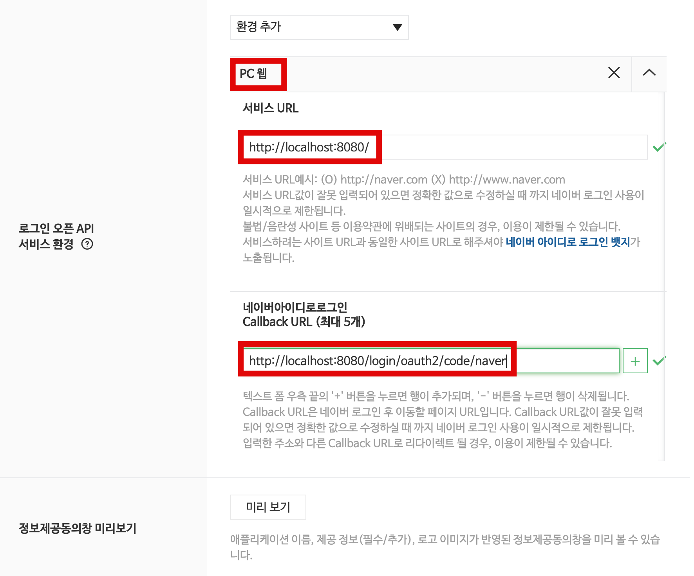
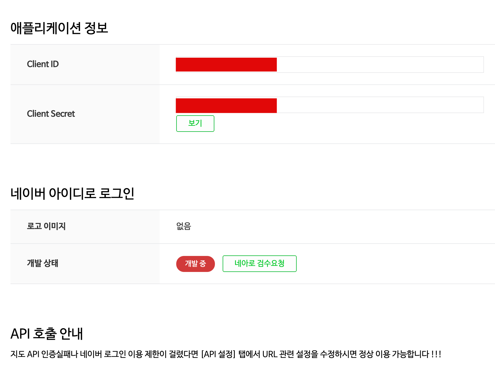

# 네이버 OAuth 등록 절차

## 네이버 API 등록

1. 네이버 오픈 API ([URL](https://developers.naver.com/apps/#/register?api=nvlogin) )로 이동
2. 네이버 오픈 API에 애플리케이션 정보 생성
   - 애플리케이션 이름, 사용할 정보들 선택  
       
   - 애플리케이션 운영 URL, Callback URL 등록  
       
   - 모두 입력 후 [저장]버튼을 클릭한다.  

## 네이버 OAuth 서비스의 주요 정보들

네이버 애플리케이션 등록시 나타나는 주소는 아래와 같다.

