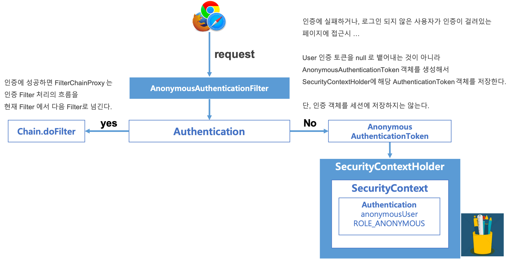
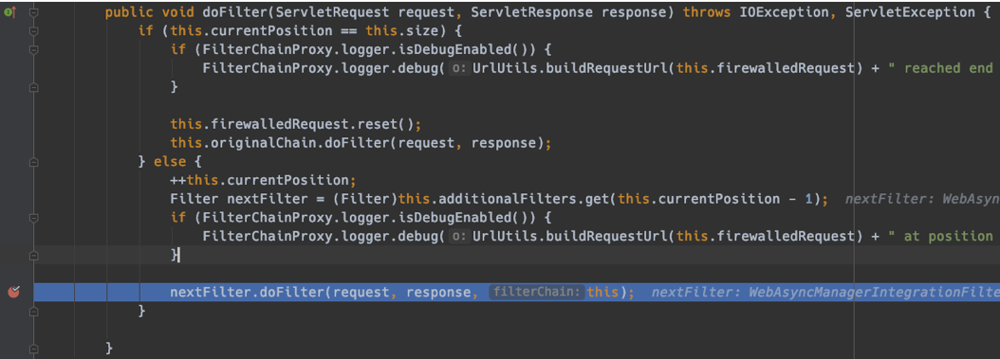
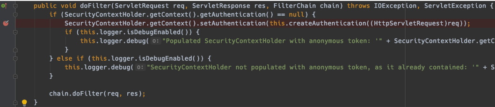
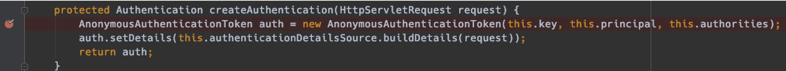
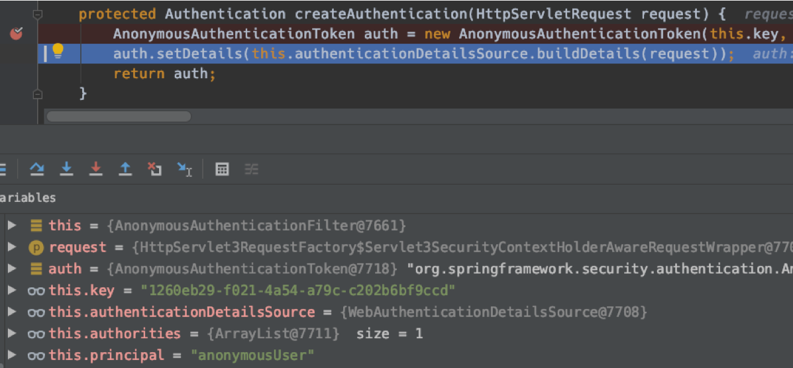
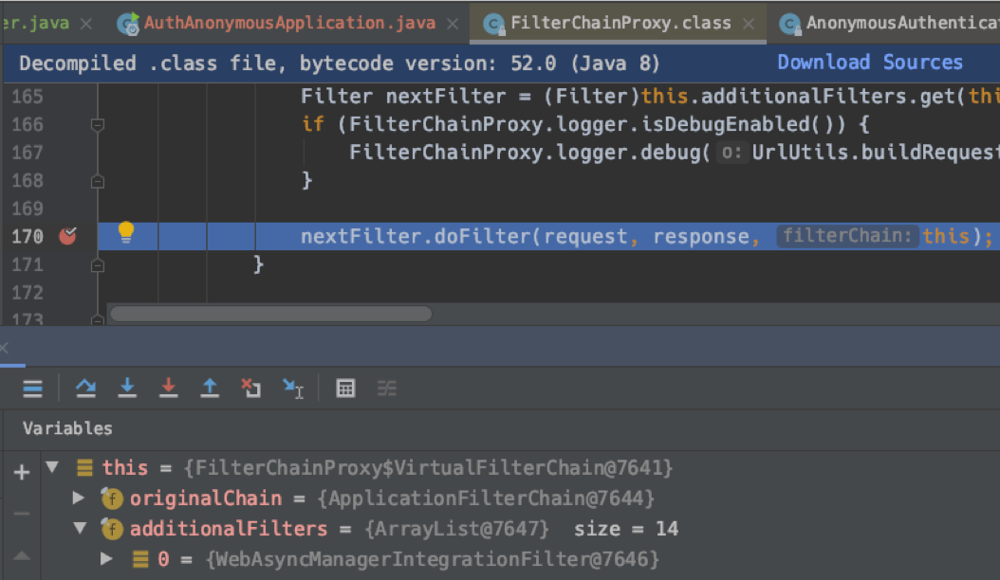
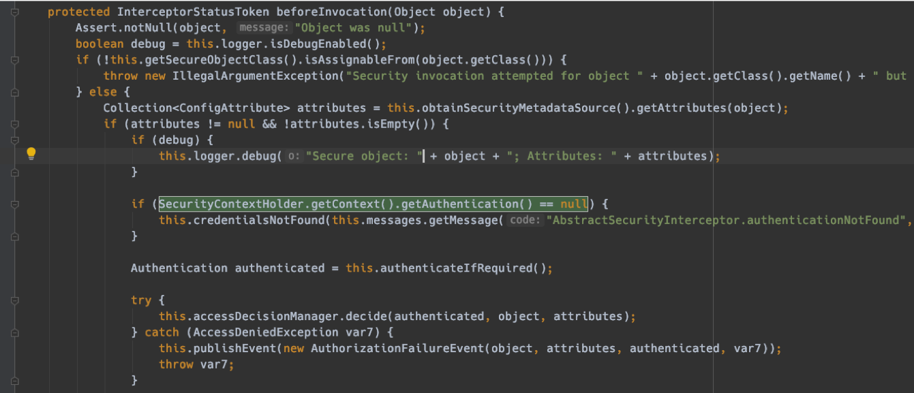

# AnonymousAuthenticationFilter

익명 인증 필터, 즉 AnonymousAuthentication Filter에 대해 요약해보면 아래와 같다.

- 인증을 받지 않은 사용자는 Anonymous로 인식해서 처리
- 익명사용자와 인증된 사용자를 구별해 처리하는 용도
- 인증 객체를 세션에 저장하지 않는다.

# 1. Overview


# 2. AnonymousFilter와 AuthenticationToken 발급




# 3. 예제로 확인해보기

- 샘플 디버깅을 위한 Spring Boot 프로젝트 생성
- Spring Initializr로 생성(귀찮다)
- Web, JPA, thymeleaf, Spring Security 를 의존성으로 추가
- 시큐리티 설정 추가
- 인증을 위한 샘플 인메모리 인증 계정 ID/PW 생성 (application.properties)


## MySecurityConfig.java

디버깅용 테스트를 위한 설정파일이다.

Anonymous 사용자(익명사용자)를 테스트 하므로 별다른 설정 없이 아래의 내용을 기술해준다. 

- authorizeRequests()
- anyRequest().authenticated()
  - 모든 request에 대해 인증을 수행
- formLogin() 처리


요약하자면

- 모든 request 에 대해 인증을 수행
- Form 인증 처리

를 수행하는 설정 파일이다.

```java
@Configuration
@EnableWebSecurity
public class MySecurityConfig extends WebSecurityConfigurerAdapter {

	@Override
	protected void configure(HttpSecurity http) throws Exception {
		http
			.authorizeRequests()
			.anyRequest().authenticated();

		http
			.formLogin();
	}
}
```


## application.properties

```properties
spring.security.user.name=user
spring.security.user.password=1111
```


## Breakpoints

### 1) FilterChainProxy, AnonymousAuthenticationFilter

#### FilterChainProxy::doFilter

FilterChainPorxy 클래스 내의 inner class 인 VirtualFilterChain 클래스 내의 doFilter (req, resp) 메서드 내에서 breakpoint 를 설정했다.  

- additionalFilter 멤버필드는 스프링 시큐리티 내에서 기본으로 사용하는 약 14개의 Filter 들의 인스턴스를 바인딩하고 있다.
- 이 14개 정도의 Filter 들로 인스턴스들을 거쳐가며 검사하게 된다.

구체적으로는... 약 14개 정도의 Filter들 중 AnonymousAuthenticationFilter를 거치는 순간을 잡기 위해 breakpoint를 지정했다.



nextFilter.doFilter(...) 을 반복하다보면 계속해서 여러가지의 Filter 처리를 반복하게 된다.  

자, 이제 AnonymousAuthenticationFilter의 동작을 살펴보자.

#### AnonymousAuthenticationFilter::doFilter

doFilter 메서드의 내부를 살펴보자



Authentication 객체가 null 일 때의 처리를 확인하기 위해 breakpoint 를 추가했다.

```java
SecurityContextHoler
  .getContext()
  .setAuthentication(
  	this.createAuthentication(
      (HttpServletRequest) req
    )
	);
```

AnonymousAuthenticationFilter 의 doFilter() 에서는 

- Authentication이 있는지를 검사하고
- authentication 이 null 이면 
- createAuthentication 메서드를 호출한다.  

  

자 이제, AnonymousAuthenticationFilter 클래스의 createAuthentication 메서드를 살펴보자.

### 2) AnonymousAuthenticationFilter::createAuthentication(req)



createAuthentication(req) 메서드에서는 AnonymousAuthenticationToken 타입의 인스턴스를 등록하고 이것의 details를 세팅한 후 리턴한다.

다음은 setDetails 에 값을 지정하기 직전에 생성된 AnonymousAuthenticationToken의 인스턴스 내의 필드들의 상태를 디버깅 모드로 캡처한 모습이다.




### 3) FilterChainProxy - nextFitler.doFilter

AnonymousAuthenticationFilter 의 처리에 대한 동작들을 정상적으로 마무리 하고나면 nextFilter.doFilter 를 통해 그 다음 처리를 수행한다.




### 4) AnonymousAuthenticationFilter 에서의 처리 이후

조금은 상관없는 이야기이지만, AnonymousAuthenticationFilter 로 처리를 수행하고 난 이후에는 

- FilterSecurityInterceptor
- AbstractSecurityInterceptor

클래스 내에서 별도의 처리를 수행한다.



바로 앞에서 익명사용자에 대한 필터처리까지 모두 했지만, 최종적으로 한번 더 Interceptor 에서 Authentication 객체가 존재하는지 검사한다.

