# RememberMe 인증 이해하기

네이버에 로그인한다고 해보자. 그리고 지금 로그인하는 브라우저에서 현재 접속하려는 계정을 로그인할때마다 입력하지 않고, 항상 로그인된 상태로 유지시키고 싶을 때가 있다. 이때 사용되는 기능이 Remember Me 이다.  

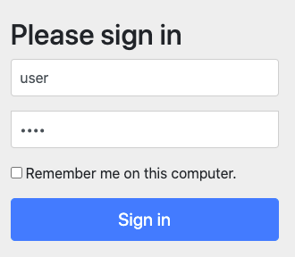

- 사용자가 Http 요청 시에는 Remember Me 쿠키를 Http 요청에 담아서 전달한다.
- 서버측
  - 스프링 시큐리티의 Remember Me 기능은 토큰 기반 인증방식을 사용한다.
  - Http 요청이 왔을 때 Remember Me 쿠키정보를 확용한다
  - Remember-Me 쿠키의 유효성 체크 및 토큰 검증이 정상적으로 이루어지면 로그인이 완료된다.


- 인증 성공시
  - Remember-Me 쿠키 설정
- 인증 실패시
  - 쿠키가 존재하면 쿠키 무효화
- 로그아웃시
  - 쿠키가 존재하면 쿠키 무효화

# 1. REMEMBER ME 쿠키와 시큐리티 동작 확인해보기

## 1) 서버측 코드

Security 설정 코드로 remember-me 인증 관련 설정을 추가해주자. UserDetailsService는 직접 구현하지 않고, Spring Boot 에서 기본으로 제공해주는 UserDetailsService를 의존성주입받아 사용했다. 별도로 UserDetailsService를 구현하지 않으면 기본으로 제공되는 UserDetailsService는 InMemoryUserDetailsService이다.

### MySecurityConfig.java

```java
@Configuration
@EnableWebSecurity
public MySecurityConfig extends WebSecurityConfigurerAdapter{
  private final UserDetailsService userDetailsService;
  
  public MySecurityConfig (UserDetailsService userDetailsService){
    this.userDetailsService = userDetailsService;
  }
  
  // ...
  @Override
  protected void configure(HttpSecurity http) throws Exception{
    http.authorizeRequests()
      .anyRequest().authenticated();
    
    http.formLogin();
    
    // ...
    
    http.rememberMe()
			.rememberMeParameter("remember-me")			// 기본 파라미터 명은 "remember-me"
			.tokenValiditySeconds(3600)					// 로그인 유지시간을 1시간으로 설정 (Default 세팅은 14일)
			.alwaysRemember(false)						// rememberMe 기능이 활성화되지 않아도 항상 실행할까요? false
			.userDetailsService(userDetailsService);	// userDetailService 만들어놓은게 있으면 결합해준다.
  }
}
```

  

  

## 2) 브라우저에서 remember me 동작 확인

### 참고) 브라우저 쿠키 확인 Extension

크롬 브라우저의 웹 스토어에 Chrome Extension 으로 등록되어 있는 앱 중에 쿠키를 관리할 수 있는 확장프로그램이 있다. Chrome Webstore에서 Edit This Cookie를 검색하여 설치하자.  

또는 아래의 링크를 방문해 크롬 확장 프로그램을 설치하자.  

[Edit This Cookie - Chrome web store](https://chrome.google.com/webstore/detail/editthiscookie/fngmhnnpilhplaeedifhccceomclgfbg/related?hl=ko)

### 2-1) 접속

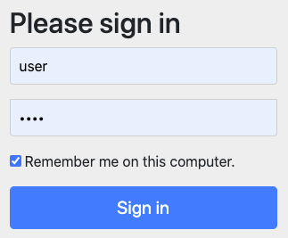

### 2-2) 쿠키 확인 (REMEMBER ME, JSESSIONID)

JSESSIONID 외에도 remember-me 라는 이름의 쿠키가 생성되어 있음을 확인 가능하다.

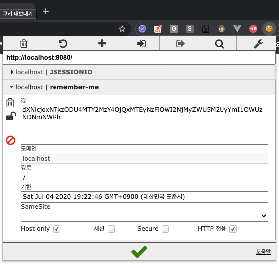

이 remember-me 쿠키에 기록된 문자열에는 우리가 인증시 사용했던 user id, password, 쿠키 만료일등이 담겨있다.

### 3) JSESSIONID 를 지우고 새로고침 해보기

JSESSIONID를 EditThisCookie 확장 프로그램에서 지우자.

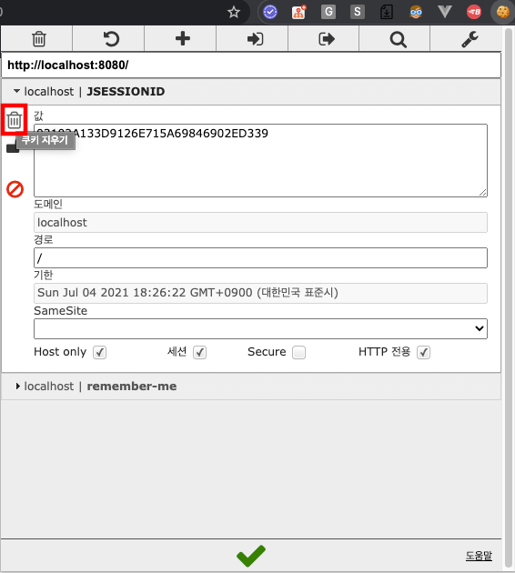

JSESSIONID를 제거한 후에 페이지를 새로고침을 해도 로그인 세션이 풀리지 않는 것을 확인 가능하다.

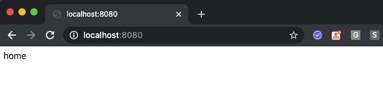

JSESSION ID 를 제거했음에도 세션이 풀리지 않는 것은 스프링 설정 코드에 remember me 관련 설정을 추가해놓았기 때문이다. 즉, 스프링 시큐리티 처리 로직에서 remember me 설정을 추가해놓았기 때문에 JSESSION ID가 없을 때에는 remember me를 바라보게 된다.  

참고로... JSESSION ID 쿠키를 삭제한 후에 페이지를 새로고침하면 JSESSION ID 가 다시 새로 생성되는 것을 확인 가능하다.  

### 5) JSESSIONID, REMEMBER-ME 쿠키 삭제 후의 동작 확인

JSESSIONID, REMEMBER ME 쿠키 모두를 삭제한다.

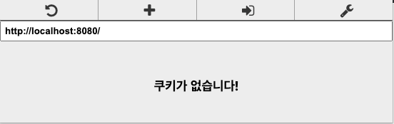

새로고침을 해보자

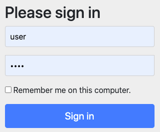

새로고침을 하고나면, JSESSIONID, REMEMBER_ME 쿠키가 없기 때문에 login 페이지로 리다이렉트 되는 것을 확인 가능하다. 

# 2. RememberMe 인증필터 -  RememberMeAuthenticationFilter

보통 Authentication 객체는 SecurityContext(약칭 S.C) 안에 존재한다.  

따라서 사용자가 로그인을 통해 인증을 받게 되면 인증 객체인 Authentication 객체가 SecurityContext 내에 존재하게 된다.  

그런데 SecurityContext 안에 Authentication 객체가 null 이거나 존재하지 않는 경우가 있다.  

  

사용자의 세션이 만료되었거나, 세션이 끊어져서 더 이상 세션 안에서 SecurityContext를 찾지 못하고 SecurityContext가 존재하지 않기 때문에 SecurityContext안에 Authentication 객체도 존재하지 않을 경우에 RememberMeAuthenticationFilter가 동작한다.  

(인증을 받은 사용자가 Session Timeout으로 인한 세션이 만료되었거나 사용하고 있는 브라우저가 종료되어 Session 이 끊긴 경우에 RememberMeAuthenticationFilter가 동작하게 된다.)  

  

또는 사용자가 다른 브라우저에서 remember me 를 체크해서 로그인 할 경우에도 RememberMeAuthenticationFilter가 동작하게 된다.  


Authentication 객체가 null 이 아니면 RememberMeAuthenticationFilter는 동작하지 않는다. (이미 인증을 받았고, 이미 인증객체가 존재하기 때문에 다시 인증을 받을 필요가 없는것)


## Remember Me 인증 Filter 동작 흐름

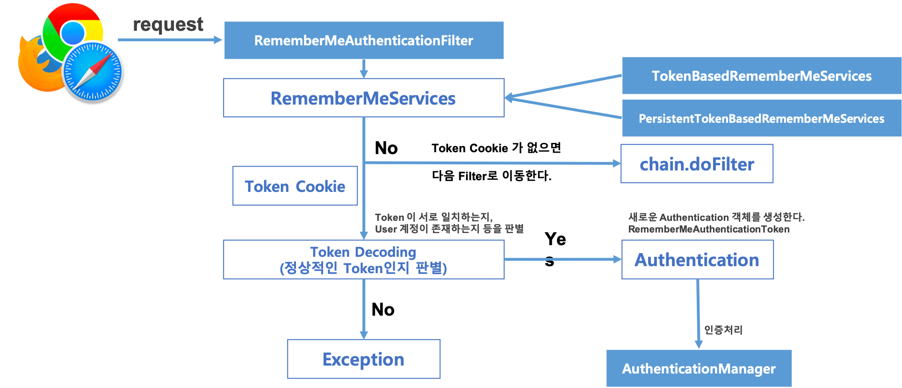


## Spring Security 내부 흐름

### 1) AbstractAuthenticationProcessingFilter

successfulAuthentication(req, resp, filterChain, authResult)

함수 형태 

- successfulAuthentication(HttpServletRequest, HttpServletResponse, FilterChain, Authentication)

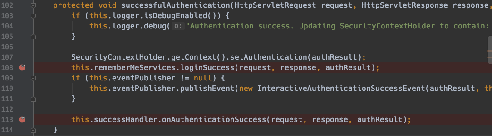


### 2) AbstractRememberMeServices

loginSuccess(req, resp, authentication)

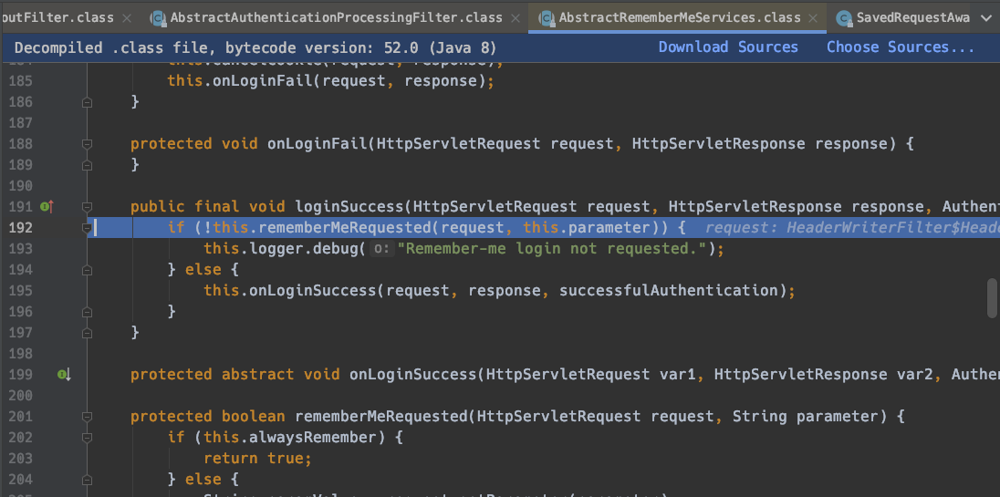

this.onLoginSuccess 에 걸리게 된다.

### 3) TokenBasedRememberMeService

onLoginSuccess(req, resp, authentication)

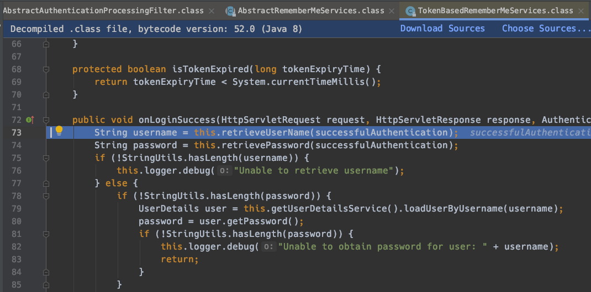

  

UserDetailsService를 통해 User를 조회하고 최종적으로는 setCookie()를 호출한다.  

이 setCookie()는 TokenBasedRememberMeSerivce 클래스에는 없다.  

따라서 AbstractRememberMeServices내의 setCookie()를 호출하게 된다.

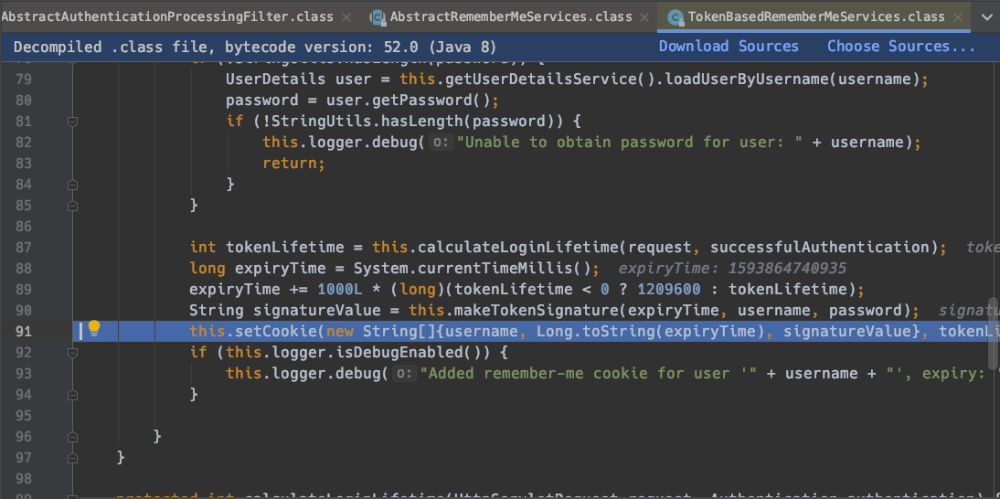


### 4) AbstractRememberMeServices::setCookie

setCookie 내에서는 최종적으로 Response에 Cookie를 심어준다. 

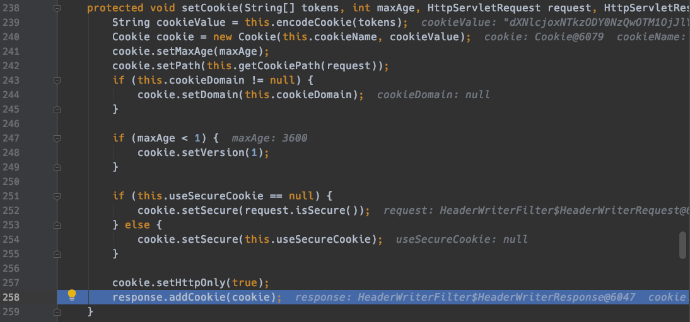


## 5) JSESSIONID 쿠키를 삭제한 후에 확인해보기

JSESSIONID 쿠키를 삭제한 후에 페이지를 새로고침 해보자

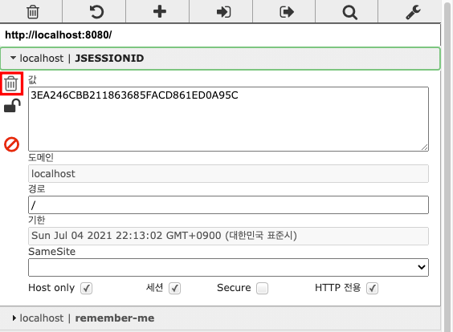


### RememberMeAuthenticationFilter::doFilter(req, res, chain)

JSESSIONID를 지우고 새로고침하여 페이지에 접속할때 RememberMeAuthenticationFilter 의 doFilter를 살펴본 결과는 아래와 같다.

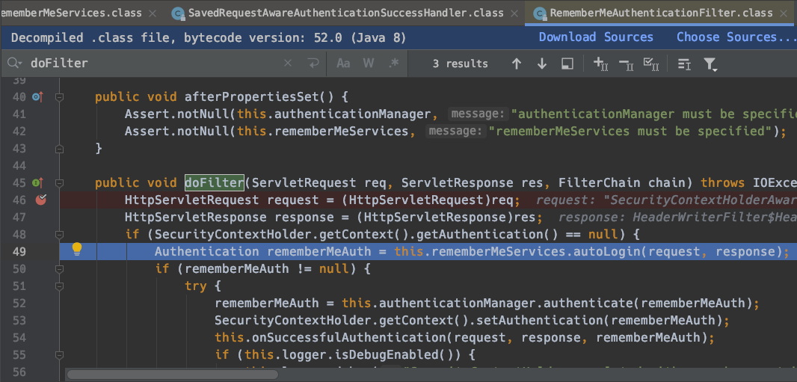

SecurityContextHolder.getContext().getAuthentication() 을 한 결과가 null 이다. 즉 SecurityContext내에 Authentication이 없다는 의미이다.  

### AbstractRememberMeServices::authLogin(req,res)

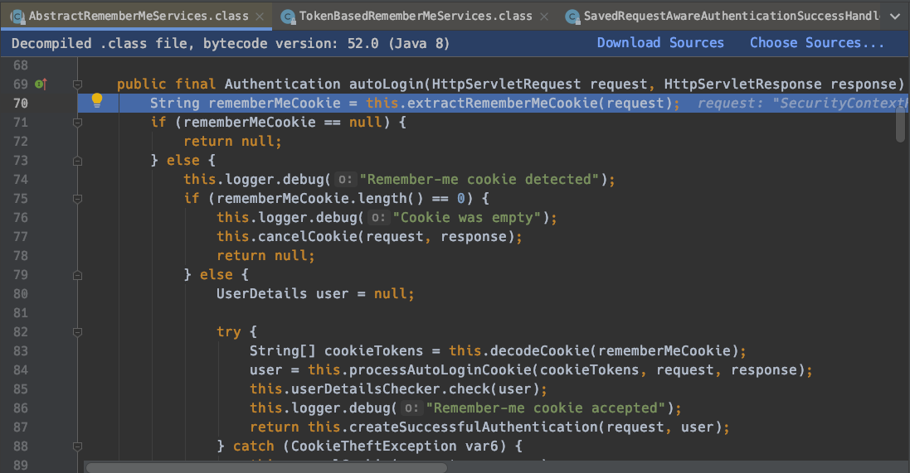

- String rememberMeCookie = this.extractRememberMeCookie(request);
  - rememberMeCookie가 있는지를 request 객체에서 추출해서 실제 rememberMeCookie가 있는지 없는지 여부를 판단한다.  
  - rememberMeCookie가 있다면 else 구문에 걸리게 되는데 현재 rememberMeCookie는 존재한다. 아래 그림을 보자.

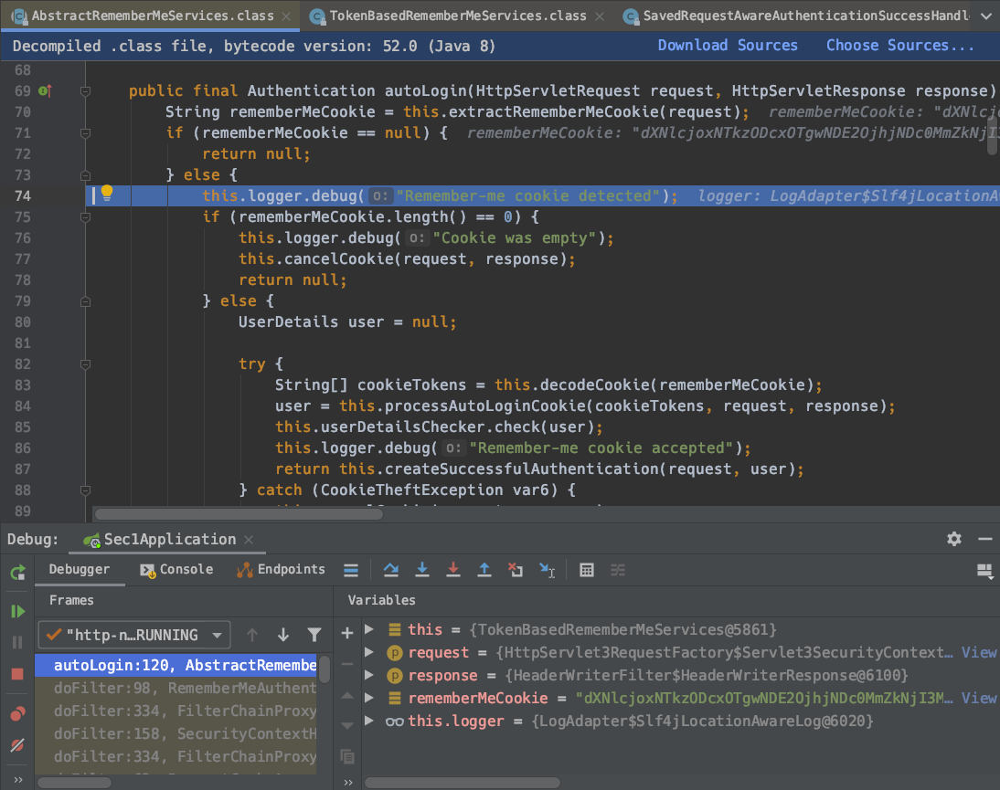


### AbstractRememberMeServices::createSuccessfulAuthentication(req, userDetails)

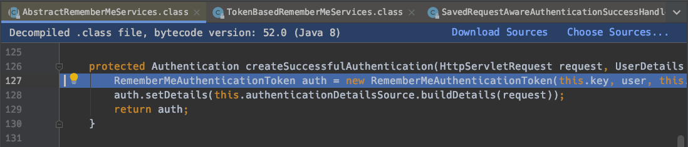

RememberMeAuthenticationToken 을 만들어서 Authentication 타입으로 리턴한다. 세부 값을 알 수있도록 아래에 디버깅화면의 캡처를 놓았다.

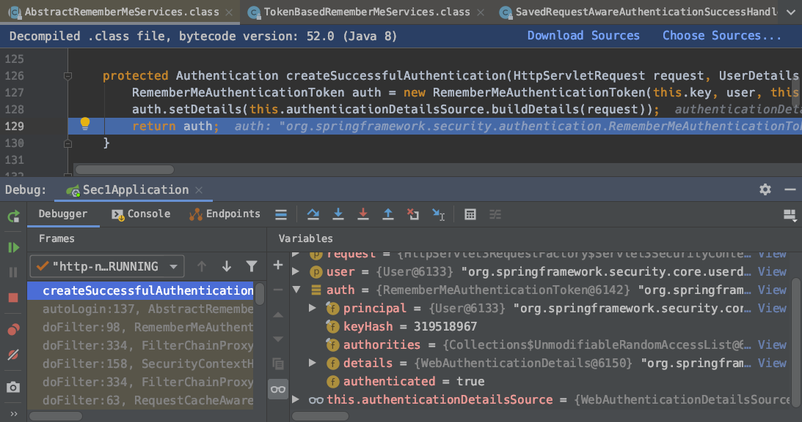


이렇게 반환받은 Authentication 객체는 RememberMeAuthenticationFilter의 doFilter로 다시 돌아와 살펴보면...   

autoLogin(req, resp)로 얻어낸 rememberAuth를 AuthenticationManager.authenticate(Authentication)에 인자로 전달해주고 있다.

- 즉, RememberMe로 만들어낸 Authentication 객체를   
- AuthenticationManager의 authenticate(Authentication) 에 전달해주고 있다

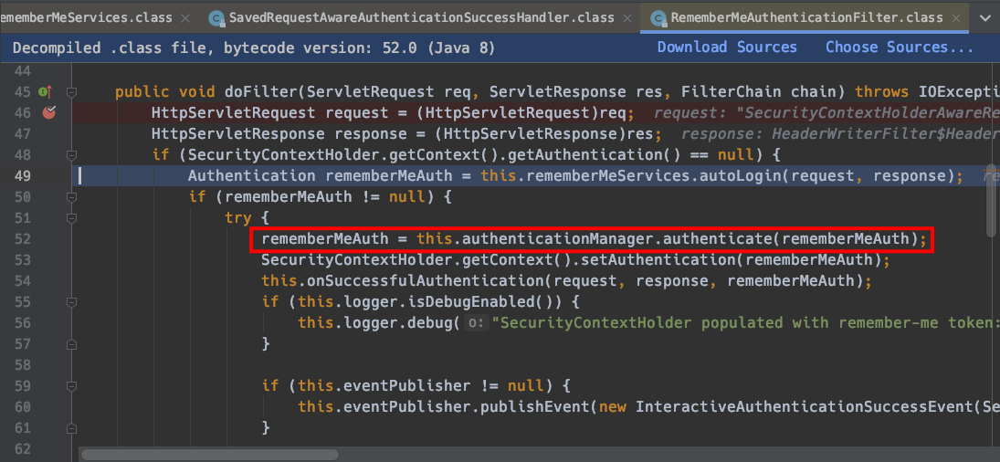


